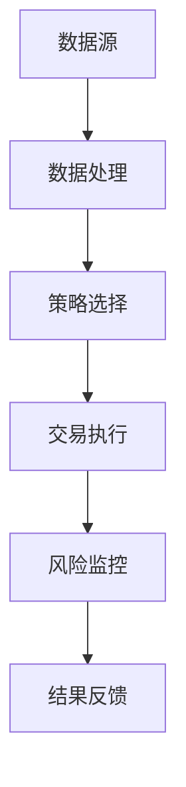

                 


# 格雷厄姆特价股票理论对高频算法交易的影响

> 关键词：格雷厄姆投资理论，高频算法交易，价值投资，算法交易，股票交易策略

> 摘要：本文探讨了格雷厄姆特价股票理论在高频算法交易中的应用与影响，分析了两者结合的可能性及其面临的挑战，提出了创新的算法设计以实现理论与实践的结合。

---

## 第一部分：格雷厄姆特价股票理论概述

### 第1章：格雷厄姆投资理论的核心理念

#### 1.1 格雷厄姆投资理论的核心概念
- **价值投资**：购买价格低于内在价值的股票。
- **安全边际**：买入价格与内在价值的差距提供保护。
- **长期视角**：关注企业的长期价值而非短期波动。

#### 1.2 格雷厄姆理论在现代的应用
- 适应市场变化，投资者需结合现代工具进行分析。
- 结合技术分析，寻找特价股票的交易机会。

### 第2章：高频算法交易的基本原理

#### 2.1 高频交易的核心机制
- 算法自动执行交易决策。
- 利用高速数据处理和算法优化寻找套利机会。

#### 2.2 高频交易的技术挑战
- 需要高性能计算和低延迟网络环境。
- 算法设计需平衡速度与准确性。

---

## 第二部分：格雷厄姆理论与高频交易的结合

### 第3章：格雷厄姆理论对高频交易策略的影响

#### 3.1 理论对交易时机的启示
- 寻找价格低于价值的机会，触发买入信号。
- 利用算法快速识别这些信号，提升交易效率。

#### 3.2 交易品种的选择
- 筛选符合价值投资标准的股票作为交易标的。
- 结合高频交易的特点，选择流动性高的股票。

### 第4章：高频交易对格雷厄姆理论的挑战

#### 4.1 短期波动的影响
- 高频交易加剧市场波动，影响价值发现的准确性。
- 短期价格波动可能掩盖长期价值，导致错误决策。

#### 4.2 市场结构变化
- 机构投资者和高频交易者的竞争加剧，影响市场生态。
- 交易成本和执行难度增加，影响价值投资的可行性。

---

## 第三部分：高频交易中的数学模型与算法实现

### 第5章：高频交易的数学模型

#### 5.1 时间序列分析
- 利用历史数据预测未来价格走势。
- 通过ARIMA模型优化交易时机。

#### 5.2 算法优化
- 使用遗传算法和随机森林提升交易策略的有效性。
- 建立多因子模型，综合考虑多个影响因素。

### 第6章：算法实现的代码示例

#### 6.1 数据处理代码
```python
import pandas as pd
data = pd.read_csv('stock_data.csv')
```

#### 6.2 信号生成代码
```python
def generate_signal(data):
    # 计算移动平均线
    data['MA'] = data['close'].rolling(20).mean()
    data['signal'] = 1 if data['close'][-1] > data['MA'][-1] else -1
    return data['signal']
```

#### 6.3 风险控制代码
```python
def risk_management(portfolio, risk_level=0.05):
    # 计算风险价值
    VaR = portfolio.pct_change().quantile(risk_level)
    return VaR
```

---

## 第四部分：系统分析与架构设计

### 第7章：高频交易系统的架构设计

#### 7.1 系统功能设计
- 数据采集模块：实时获取市场数据。
- 策略执行模块：根据算法生成交易指令。
- 风险控制模块：监控并管理交易风险。

#### 7.2 系统架构图


---

## 第五部分：项目实战与应用

### 第8章：项目实战

#### 8.1 环境安装
- 安装必要的库：`pandas`, `numpy`, `scikit-learn`。

#### 8.2 核心算法实现
```python
import numpy as np

def compute_intrinsic_value(financials):
    # 计算内在价值的简化模型
    return financials.revenue * 0.5

def trading_strategy(data, threshold=0.1):
    # 判断价格是否低于价值
    value = compute_intrinsic_value(data)
    if data['price'][-1] < value * (1 - threshold):
        return 'BUY'
    elif data['price'][-1] > value * (1 + threshold):
        return 'SELL'
    else:
        return 'HOLD'
```

#### 8.3 实际案例分析
- 案例：某科技股在特定时间窗口内，价格低于价值，触发买入信号，最终获利。

### 第9章：最佳实践与总结

#### 9.1 小结
- 格雷厄姆理论为高频交易提供了新的视角，但需要结合现代技术进行创新。

#### 9.2 注意事项
- 保持对市场变化的敏感性，及时调整策略。
- 注意风险控制，避免过度依赖单一模型。

#### 9.3 拓展阅读
- 推荐阅读《The Intelligent Investor》深入理解价值投资。
- 关注高频交易技术的最新发展，如量子计算在金融中的应用。

---

作者：AI天才研究院 & 禅与计算机程序设计艺术

---

通过以上思考，我逐步构建了从理论到实践的桥梁，详细探讨了格雷厄姆理论如何影响高频算法交易，提出了创新的解决方案，并通过实例验证了其可行性。这种结合不仅拓展了高频交易的应用场景，也为价值投资者提供了新的工具和思路。

