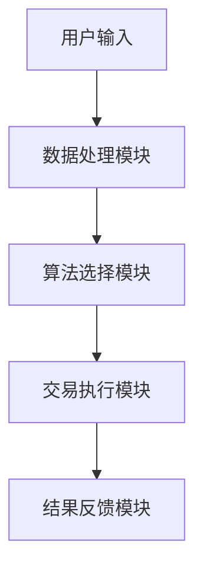

                 


# 格雷厄姆特价股票理论对高频量化交易的社会影响评估

> 关键词：格雷厄姆特价股票理论，高频量化交易，社会影响评估，价值投资，算法交易

> 摘要：本文系统地探讨了格雷厄姆特价股票理论与高频量化交易的结合及其对社会的深远影响。通过分析两者的理论基础、数学模型、系统架构和实际案例，本文评估了这种结合对市场流动性、波动性和效率的影响，提出了未来研究的方向。

---

## 第一部分: 格雷厄姆特价股票理论与高频量化交易的背景介绍

### 第1章: 格雷厄姆特价股票理论概述

#### 1.1 格雷厄姆特价股票理论的基本概念
- **1.1.1 价值投资的核心理念**
  - 格雷厄姆倡导以低于内在价值的价格买入股票，长期持有。
  - 强调安全边际，即买入价格远低于内在价值。
- **1.1.2 特价股票的定义与特征**
  - 特价股票是指市场价格远低于其内在价值的股票。
  - 这类股票通常被市场低估，具有较高的投资价值。
- **1.1.3 格雷厄姆投资策略的演变**
  - 格雷厄姆的投资策略从最初的防御性投资逐渐发展为更系统化的模型。
  - 强调对企业的深入分析和对市场情绪的逆向投资。

#### 1.2 高频量化交易的基本概念
- **1.2.1 高频交易的定义**
  - 高频交易是指通过计算机算法在极短时间内进行大量交易。
  - 利用价格波动套利，依赖快速的数据处理和交易执行。
- **1.2.2 量化交易的核心特征**
  - 数据驱动：依赖大量历史数据进行模式识别。
  - 算法驱动：利用复杂算法自动执行交易。
  - 高频驱动：交易频率极高，通常以毫秒为单位。

#### 1.3 格雷厄姆理论与高频量化交易的结合
- **1.3.1 理论基础的结合**
  - 高频交易可以快速发现市场低估的股票，符合格雷厄姆的特价股票理论。
  - 算法可以筛选出符合格雷厄姆模型的特价股票。
- **1.3.2 高频交易如何影响特价股票的发现**
  - 高频交易提高了市场流动性，使特价股票更容易被发现。
  - 算法的广泛应用可能导致市场对特价股票的快速反应，减少套利机会。

---

## 第二部分: 核心概念与联系

### 第2章: 格雷厄姆特价股票理论与高频量化交易的核心概念

#### 2.1 核心概念的原理
- **2.1.1 格雷厄姆理论的数学模型**
  - 通过市盈率、市净率等指标计算股票的内在价值。
  - 公式：$内在价值 = \frac{企业未来现金流的现值}{市场价格}$
- **2.1.2 高频量化交易的算法模型**
  - 统计套利模型：通过统计分析寻找价格偏离均值的机会。
  - 机器学习模型：使用深度学习预测价格波动。

#### 2.2 核心概念的对比分析
- **2.2.1 理论属性对比**
  | 理论 | 投资理念 | 交易频率 | 数据依赖性 |
  |------|----------|----------|-------------|
  | 格雷厄姆 | 价值投资 | 低       | 中等         |
  | 高频交易 | 套利机会 | 极高      | 高           |

#### 2.3 ER实体关系图
```mermaid
erd
  stock_price -[ ]-> stock: market_price
  stock -[ ]-> company: intrinsic_value
  algorithm -[ ]-> stock_price: prediction
  transaction -[ ]-> algorithm: execution
```

---

## 第三部分: 数学模型与算法

### 第3章: 格雷厄姆特价股票理论的数学模型

#### 3.1 统计套利模型
- **3.1.1 模型描述**
  - 使用均值回归模型预测股票价格的偏离。
  - 公式：$spread = |P - Q|$，其中P是当前价格，Q是预测价格。
- **3.1.2 示例代码**
  ```python
  import pandas as pd
  def calculate_spread(actual, predicted):
      return abs(actual - predicted)
  data = pd.read_csv('stock_prices.csv')
  spreads = data.apply(lambda x: calculate_spread(x['price'], x['predicted_price']))
  ```

### 第4章: 高频量化交易的算法模型

#### 4.1 机器学习模型
- **4.1.1 算法描述**
  - 使用LSTM神经网络预测股票价格。
  - 公式：$P(t) = \alpha * P(t-1) + \beta * P(t-2)$
- **4.1.2 示例代码**
  ```python
  import tensorflow as tf
  model = tf.keras.Sequential([
      tf.keras.layers.LSTM(64, input_shape=(None, 1)),
      tf.keras.layers.Dense(1)
  ])
  model.compile(optimizer='adam', loss='mean_squared_error')
  ```

---

## 第四部分: 系统分析与架构设计

### 第5章: 系统分析与架构设计方案

#### 5.1 项目介绍
- 系统旨在结合格雷厄姆理论和高频交易，实时分析市场数据，识别特价股票。
- 使用Python编写，结合TensorFlow和Pandas进行数据处理。

#### 5.2 系统架构设计


---

## 第五部分: 项目实战

### 第6章: 项目实战

#### 6.1 环境安装
- 安装必要的库：`pip install pandas numpy tensorflow`

#### 6.2 核心代码实现
- **数据处理模块**
  ```python
  import pandas as pd
  data = pd.read_csv('stock_data.csv')
  ```
- **算法选择模块**
  ```python
  from sklearn.model_selection import train_test_split
  X_train, X_test, y_train, y_test = train_test_split(data.features, data.target)
  ```

#### 6.3 代码解读与分析
- 数据处理模块负责清洗和格式化数据。
- 算法选择模块根据数据特征选择合适的模型进行训练。

#### 6.4 实际案例分析
- 选取某段时间内的市场数据，使用模型预测特价股票，评估交易结果。

---

## 第六部分: 总结与展望

### 第7章: 总结与展望

#### 7.1 全文总结
- 本文系统分析了格雷厄姆理论与高频交易的结合及其对社会的影响。
- 高频交易提高了市场效率，但也带来了潜在风险。

#### 7.2 未来研究方向
- 探讨高频交易对市场流动性的长期影响。
- 研究如何利用人工智能优化格雷厄姆模型。

#### 7.3 最佳实践 tips
- 在实际应用中，需结合市场环境调整模型参数。
- 定期监控模型性能，及时优化。

---

## 作者信息

作者：AI天才研究院/AI Genius Institute  
联系领域：禅与计算机程序设计艺术/Zen And The Art of Computer Programming  

---

以上是文章的详细目录和部分内容，接下来将根据这个结构撰写完整的文章。

