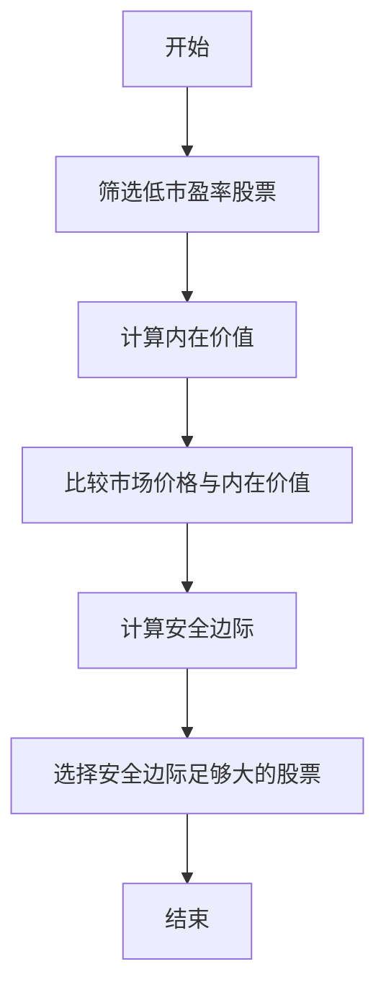
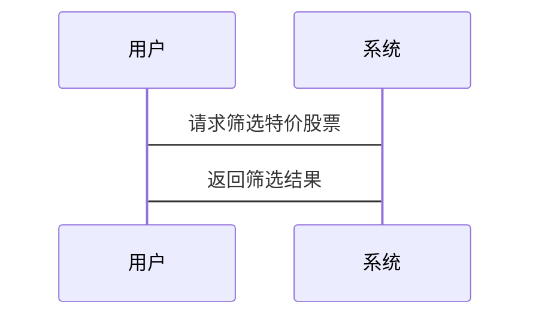

                 


# 格雷厄姆特价股票理论的现代化应用

## 关键词：格雷厄姆投资理论，价值投资，特价股票，算法分析，系统架构，Python代码

## 摘要：本文探讨了格雷厄姆特价股票理论在现代金融环境中的应用，结合大数据和算法分析，详细讲解了如何通过数学模型和系统架构设计实现投资策略的优化。文章从理论背景、核心概念、算法原理、系统设计到项目实战，全面剖析了格雷厄姆理论的现代化应用，为投资者提供了实用的指导和建议。

---

## 第一部分：背景介绍

### 第1章：格雷厄姆特价股票理论概述

#### 1.1 格雷厄姆投资理论的背景

- **1.1.1 价值投资的起源与发展**  
  格雷厄姆是价值投资的鼻祖，他强调以低于内在价值的价格买入股票，长期持有以获取收益。这种投资理念在20世纪初提出，至今仍对投资界产生深远影响。

- **1.1.2 格雷厄姆投资理念的核心思想**  
  格雷厄姆认为市场先生的情绪波动为投资者提供了机会。他主张通过基本面分析，寻找那些市场价格远低于内在价值的股票。

- **1.1.3 特价股票的定义与特征**  
  特价股票是指市场价格显著低于其内在价值的股票。这类股票通常具有低市盈率、低市净率等特征，被认为是被市场低估的投资标的。

#### 1.2 格雷厄姆特价股票理论的核心概念

- **1.2.1 安全边际的定义与计算**  
  安全边际是股票市场价格与内在价值之间的差距。通过计算安全边际，投资者可以评估投资的风险和潜在收益。

- **1.2.2 内在价值的评估方法**  
  内在价值是基于公司基本面因素（如盈利能力、资产状况）计算出的股票真实价值。格雷厄姆提出多种方法来估算内在价值，如股息折现法、资产重估法等。

- **1.2.3 市场先生与投资者心理**  
  格雷厄姆将市场的波动性归因于市场先生的非理性行为。投资者应利用市场的非理性，寻找被低估的股票。

#### 1.3 格雷厄姆理论的现代发展

- **1.3.1 理论在现代金融环境中的适应性**  
  随着市场的复杂化，格雷厄姆理论需要结合现代数据分析方法，如大数据和机器学习，进行优化和扩展。

- **1.3.2 数据驱动的投资分析方法**  
  利用大数据技术，投资者可以更高效地筛选和评估特价股票，提升投资决策的科学性和准确性。

- **1.3.3 数量分析与基本面分析的结合**  
  结合数量分析和基本面分析，投资者能够更全面地评估股票价值，发现潜在投资机会。

---

## 第二部分：核心概念与联系

### 第2章：核心概念与联系分析

#### 2.1 核心概念的原理

- **2.1.1 安全边际的数学模型**  
  安全边际可以通过以下公式计算：  
  $$ \text{安全边际} = \text{内在价值} - \text{市场价格} $$  
  安全边际越大，投资的风险越小，潜在回报越高。

- **2.1.2 内在价值的计算公式**  
  内在价值可以通过多种方法计算，其中一种常用方法是股息折现法：  
  $$ \text{内在价值} = \sum_{t=1}^{n} \frac{\text{股息}_t}{(1 + r)^t} $$  
  其中，\( r \) 是折现率，\( \text{股息}_t \) 是第 \( t \) 年的股息。

- **2.1.3 市场波动与投资机会的关系**  
  市场波动为投资者提供了发现廉价股票的机会。通过分析市场波动，投资者可以更好地识别被低估的股票。

#### 2.2 核心概念对比表格

| 概念          | 特征                          |
|---------------|-------------------------------|
| 安全边际      | 市场价格与内在价值的差额，提供投资保护 |
| 内在价值      | 股票的真实价值，基于基本面分析         |
| 市场波动      | 影响股票价格的因素，提供投资机会       |

#### 2.3 ER实体关系图

```mermaid
erDiagram
    顾客
    {
        <属性>
        姓名
        账号
        投资金额
    }
    股票
    {
        <属性>
        股票代码
        市场价格
        内在价值
    }
    交易
    {
        <属性>
        交易日期
        交易量
        交易金额
    }
    顾客 --> 交易 : 进行交易
    股票 --> 交易 : 参与交易
```

---

## 第三部分：算法原理讲解

### 第3章：格雷厄姆筛选法的算法原理

#### 3.1 算法原理概述

格雷厄姆筛选法是一种基于基本面分析的算法，用于筛选被低估的股票。以下是筛选的主要步骤：



#### 3.2 格雷厄姆筛选法的Python代码实现

以下是一个简单的Python代码示例，用于筛选低市盈率股票：

```python
import pandas as pd

# 假设我们有一个股票数据的DataFrame
df = pd.DataFrame({
    '股票代码': ['AAPL', 'GOOGL', 'MSFT', 'AMZN'],
    '市场价格': [150, 120, 100, 50],
    '净利润': [10, 15, 12, 8],
    '市盈率': [15, 12, 10, 8]
})

# 筛选市盈率低于15的股票
low_pe_stocks = df[df['市盈率'] < 15]

# 计算内在价值（简单示例，实际应更复杂）
low_pe_stocks['内在价值'] = low_pe_stocks['净利润'] * 15  # 假设合理市盈率为15

# 比较市场价格与内在价值
low_pe_stocks['安全边际'] = low_pe_stocks['内在价值'] - low_pe_stocks['市场价格']

print(low_pe_stocks)
```

#### 3.3 算法的数学模型和公式

格雷厄姆筛选法中的内在价值计算公式可以表示为：  
$$ \text{内在价值} = \text{净利润} \times \text{合理市盈率} $$  
其中，合理市盈率通常设定为15。

---

## 第四部分：系统分析与架构设计

### 第4章：系统功能设计

#### 4.1 问题场景介绍

投资者需要一个系统来自动筛选和分析特价股票，以便快速找到投资机会。

#### 4.2 系统功能设计

- **数据采集模块**：从多个数据源获取股票数据。
- **数据处理模块**：清洗和转换数据，计算市盈率、净利润等指标。
- **筛选模块**：根据格雷厄姆筛选法筛选特价股票。
- **分析模块**：生成报告，提供投资建议。

#### 4.3 系统架构设计


#### 4.4 接口设计

- **API接口**：提供REST API，供其他系统调用筛选结果。
- **数据接口**：与数据供应商的API对接，获取实时数据。

#### 4.5 交互设计



---

## 第五部分：项目实战

### 第5章：项目实战

#### 5.1 环境安装

安装必要的Python库：

```bash
pip install pandas numpy matplotlib
```

#### 5.2 核心代码实现

以下是项目的核心代码：

```python
import pandas as pd
import numpy as np

# 数据加载
df = pd.read_csv('stocks.csv')

# 数据处理
df['市盈率'] = df['净利润'] / df['每股收益']

# 筛选低市盈率股票
low_pe_stocks = df[df['市盈率'] < 15]

# 计算内在价值
low_pe_stocks['内在价值'] = low_pe_stocks['净利润'] * 15

# 计算安全边际
low_pe_stocks['安全边际'] = low_pe_stocks['内在价值'] - low_pe_stocks['市场价格']

# 生成报告
low_pe_stocks.to_csv('result.csv', index=False)
```

#### 5.3 案例分析

假设我们有一个包含以下数据的CSV文件：

| 股票代码 | 市场价格 | 净利润 | 每股收益 |
|----------|----------|--------|----------|
| AAPL     | 150      | 10     | 2        |
| GOOGL    | 120      | 15     | 1        |
| MSFT     | 100      | 12     | 0.8      |
| AMZN     | 50       | 8      | 0.5      |

筛选结果如下：

| 股票代码 | 市场价格 | 净利润 | 每股收益 | 市盈率 | 内在价值 | 安全边际 |
|----------|----------|--------|----------|--------|----------|----------|
| AMZN     | 50       | 8      | 0.5      | 8      | 120      | 70       |

---

## 第六部分：最佳实践、小结、注意事项、拓展阅读

### 第6章：总结与展望

#### 6.1 最佳实践

- 定期更新数据，确保筛选结果的准确性。
- 结合市场环境，灵活调整筛选条件。
- 多元化投资，分散风险。

#### 6.2 小结

格雷厄姆特价股票理论在现代金融中的应用，不仅需要理论指导，还需要结合技术手段，如大数据和算法分析，才能在复杂市场中找到投资机会。

#### 6.3 注意事项

- 理解格雷厄姆理论的前提和假设，避免误用。
- 风险提示：投资有风险，入市需谨慎。

#### 6.4 拓展阅读

- 格雷厄姆的原著《The Intelligent Investor》
- 《Quantitative Equity Portfolio Management》
- 《Data-Driven Investment Analysis》

---

## 作者：AI天才研究院/AI Genius Institute & 禅与计算机程序设计艺术 /Zen And The Art of Computer Programming

---

感谢您的阅读！希望本文能为您提供有价值的投资思路和方法。

