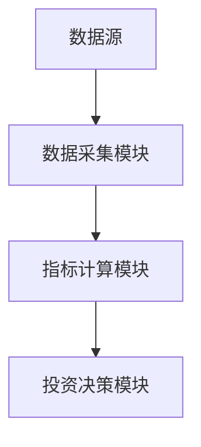

                 


# 格雷厄姆特价股票策略与被动投资的比较

> 关键词：格雷厄姆投资策略，被动投资，价值投资，指数基金，投资组合优化

> 摘要：本文将详细探讨格雷厄姆特价股票策略与被动投资之间的异同点，分析两者在投资理念、策略实施和风险控制方面的差异，并通过数学模型和实际案例，比较两种策略在不同市场环境下的表现。文章还将结合系统架构设计和项目实战，为投资者提供全面的视角和实用的建议。

---

## 第一部分: 格雷厄姆特价股票策略与被动投资的背景

### 第1章: 格雷厄姆特价股票策略与被动投资的背景

#### 1.1 投资的基本概念与分类

##### 1.1.1 投资的定义与核心要素

投资是指将资金投入到某一资产或项目中，以期在未来获得收益或资本增值的行为。投资的核心要素包括：

- **资金**：用于投资的资金规模和来源。
- **资产类别**：股票、债券、房地产等。
- **时间跨度**：短期、中期或长期投资。
- **风险与收益**：投资的潜在收益与风险成正比。

##### 1.1.2 主动投资与被动投资的定义

- **主动投资**：投资者通过分析市场趋势、公司基本面等信息，主动选择投资标的并进行交易，以期获得超额收益。
- **被动投资**：投资者通过投资指数基金或其他分散化工具，长期持有，不主动调整投资组合。

##### 1.1.3 格雷厄姆投资理念的起源与发展

本杰明·格雷厄姆是价值投资的鼻祖，他的投资理念强调安全边际、低市盈率和分散化投资。格雷厄姆的方法主要适用于主动投资，而被动投资则兴起于20世纪末，随着指数基金的普及而逐渐成为主流。

---

#### 1.2 格雷厄姆特价股票策略的核心思想

##### 1.2.1 价值投资的基本原则

- **买入廉价的资产**：寻找市场价格低于内在价值的股票。
- **安全边际**：买入价格低于内在价值一定比例的股票，以降低投资风险。
- **分散投资**：通过投资多只股票降低特定风险。

##### 1.2.2 格雷厄姆的安全边际概念

安全边际是格雷厄姆策略的核心，公式为：
$$ \text{安全边际} = \text{内在价值} - \text{市场价格} $$

##### 1.2.3 投资组合的分散化策略

格雷厄姆建议投资者通过投资多个廉价股票来分散风险，避免过度依赖单一资产。

---

#### 1.3 被动投资的兴起与发展趋势

##### 1.3.1 被动投资的定义与特点

被动投资通过投资指数基金等工具，跟踪市场表现，不主动择时或选股。

##### 1.3.2 被动投资的代表形式：指数基金

指数基金通过跟踪特定指数（如标普500）来实现收益，具有成本低、风险分散的特点。

##### 1.3.3 被动投资在现代金融中的地位

被动投资因其低成本和分散化特点，逐渐成为机构和个人投资者的首选策略。

---

## 第二部分: 格雷厄姆特价股票策略与被动投资的核心概念对比

### 第2章: 格雷厄姆特价股票策略与被动投资的核心概念对比

#### 2.1 格雷厄姆特价股票策略的核心要素

##### 2.1.1 低市盈率与低市净率的定义

- **市盈率**：股价与每股收益的比率，公式为：
$$ \text{市盈率} = \frac{\text{股价}}{\text{每股收益}} $$
- **市净率**：股价与每股净资产的比率，公式为：
$$ \text{市净率} = \frac{\text{股价}}{\text{每股净资产}} $$

##### 2.1.2 股价与内在价值的计算方法

格雷厄姆通过分析公司基本面，计算其内在价值，公式为：
$$ \text{内在价值} = \sum \text{未来现金流的现值} $$

##### 2.1.3 安全边际的数学模型

$$ \text{安全边际} = \text{内在价值} - \text{市场价格} $$

#### 2.2 被动投资的核心要素

##### 2.2.1 指数基金的构造原理

指数基金通过复制特定指数的成分股，实现与市场同步波动，公式为：
$$ \text{基金收益} = \text{指数收益} $$

##### 2.2.2 被动投资的成本优势

被动投资的成本主要由管理费和交易费用组成，公式为：
$$ \text{总成本} = \text{管理费} + \text{交易费用} $$

##### 2.2.3 被动投资的风险分散机制

通过投资多个资产，降低特定风险，公式为：
$$ \text{分散化收益} = \text{资产间相关性} \times \text{资产数量} $$

#### 2.3 格雷厄姆策略与被动投资的对比分析

##### 2.3.1 核心目标的对比

- **格雷厄姆策略**：追求超额收益。
- **被动投资**：追求市场平均收益。

##### 2.3.2 投资策略的对比

- **格雷厄姆策略**：主动选股，注重安全边际。
- **被动投资**：被动跟踪市场指数，不主动选股。

##### 2.3.3 风险控制的对比

- **格雷厄姆策略**：通过分散化和安全边际降低风险。
- **被动投资**：通过广泛分散化降低风险。

---

### 第3章: 格雷厄姆策略与被动投资的数学模型与公式

#### 3.1 格雷厄姆策略的核心公式

##### 3.1.1 安全边际的计算公式

$$ \text{安全边际} = \text{内在价值} - \text{市场价格} $$

##### 3.1.2 低市盈率的计算公式

$$ \text{市盈率} = \frac{\text{股价}}{\text{每股收益}} $$

##### 3.1.3 低市净率的计算公式

$$ \text{市净率} = \frac{\text{股价}}{\text{每股净资产}} $$

#### 3.2 被动投资的核心公式

##### 3.2.1 指数基金的预期收益计算

$$ \text{预期收益} = \text{市场平均收益} $$

##### 3.2.2 被动投资的成本计算

$$ \text{总成本} = \text{管理费} + \text{交易费用} $$

#### 3.3 格雷厄姆策略与被动投资的对比公式

##### 3.3.1 投资收益的对比公式

$$ \text{主动收益} = \text{主动投资收益} - \text{被动投资收益} $$

##### 3.3.2 风险的对比公式

$$ \text{风险} = \text{波动率} \times \text{投资期限} $$

---

### 第4章: 格雷厄姆策略与被动投资的系统架构设计

#### 4.1 投资策略的系统架构

##### 4.1.1 系统功能模块

###### 数据采集模块

- 采集股票的实时数据，包括市盈率、市净率等。

###### 指标计算模块

- 计算股票的内在价值和安全边际。

###### 投资决策模块

- 根据设定的条件，自动决策是否买入或卖出股票。

##### 4.1.2 系统架构图



---

## 第三部分: 项目实战与案例分析

### 第5章: 格雷厄姆策略与被动投资的项目实战

#### 5.1 环境安装与配置

- **Python环境**：安装Python和相关库（如pandas、numpy）。
- **数据源**：获取股票数据（如Yahoo Finance API）。

#### 5.2 系统核心实现源代码

##### 5.2.1 格雷厄姆策略的核心实现

```python
def calculate_intrinsic_value(company_data):
    # 计算未来现金流的现值
    return sum(company_data['future_cash_flows'] / (1 + company_data['discount_rate'])**i for i in range(len(company_data['future_cash_flows'])))
```

##### 5.2.2 被动投资的实现

```python
def passive_investment(index_data):
    # 计算指数基金的预期收益
    return index_data['return'] * index_data['weight']
```

#### 5.3 实际案例分析

##### 5.3.1 格雷厄姆策略案例

以某公司为例，计算其内在价值和安全边际：

$$ \text{内在价值} = \sum \text{未来现金流的现值} $$

$$ \text{安全边际} = \text{内在价值} - \text{市场价格} $$

##### 5.3.2 被动投资案例

以标普500指数为例，计算指数基金的预期收益和成本：

$$ \text{预期收益} = \text{市场平均收益} $$

$$ \text{总成本} = \text{管理费} + \text{交易费用} $$

#### 5.4 项目小结

通过实际案例分析，可以发现格雷厄姆策略在特定市场环境下可能带来超额收益，而被动投资则具有稳定性和低成本的优势。

---

## 第四部分: 总结与展望

### 第6章: 总结与展望

#### 6.1 核心观点总结

- 格雷厄姆策略适合长期主动投资者，被动投资适合追求市场平均收益的投资者。
- 两种策略在风险控制和收益目标上有明显差异。

#### 6.2 未来研究方向

- 结合人工智能技术优化投资策略。
- 研究混合投资策略（主动+被动）的可行性。

---

## 作者信息

作者：AI天才研究院/AI Genius Institute & 禅与计算机程序设计艺术 /Zen And The Art of Computer Programming

---

以上是文章的详细目录大纲和部分核心内容，后续将根据这一框架撰写完整的文章。

