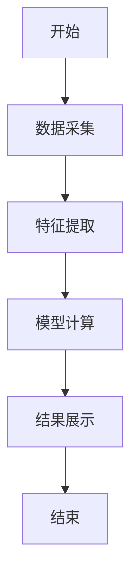
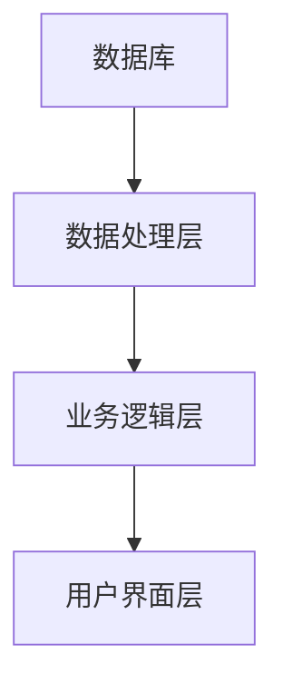

                 


# 格雷厄姆特价股票策略在不同产业集群中的效果比较

## 关键词：格雷厄姆投资策略，产业集群，股票分析，价值投资，数学模型

## 摘要：本文深入探讨了格雷厄姆的价值投资策略在不同产业集群中的应用效果。通过分析产业集群的特征，构建数学模型，设计系统架构，并结合实际案例，评估特价股票策略在不同产业集群中的表现，为投资者提供实践指导。

---

# 第一部分: 格雷厄姆投资策略与产业集群概述

## 第1章: 格雷厄姆投资策略的核心理念

### 1.1 格雷厄姆投资策略的起源与背景

#### 1.1.1 价值投资的起源
价值投资起源于20世纪初，本杰明·格雷厄姆是该领域的先驱。他主张以低于内在价值的价格购买股票，长期持有，以获取超额收益。格雷厄姆的方法注重安全边际，即买入价格与内在价值的差距。

#### 1.1.2 格雷厄姆的投资哲学
格雷厄姆强调安全边际和 margin of safety，认为市场先生的非理性行为为投资者提供了套利机会。他主张分散投资，避免过度集中在单一股票或行业，以降低风险。

#### 1.1.3 特价股票的定义与特征
特价股票指的是市场价格远低于内在价值的股票。这类股票通常具有低估特征，可能来自财务困境、市场忽视或行业周期性低迷。格雷厄姆策略的核心在于识别这些被低估的股票。

### 1.2 产业集群的基本概念与特征

#### 1.2.1 产业集群的定义
产业集群是指一组企业、供应商、服务提供商和相关机构在地理上集中，共享资源和专业知识，形成协同效应的经济区域。产业集群通常集中在特定行业，如科技、制造或金融。

#### 1.2.2 产业集群的分类
产业集群可以分为不同类型，如制造业产业集群、科技产业集群和服务业产业集群。每个产业集群具有独特的特征和竞争优势。

#### 1.2.3 不同产业集群的特点对比
以下是不同产业集群的特点对比：

| 产业集群类型 | 特点 |
|--------------|------|
| 制造业产业集群 | 高生产效率，成本优势 |
| 科技产业集群 | 创新能力强，依赖研发 |
| 服务业产业集群 | 依赖地理位置，客户集中 |

### 1.3 产业集群对投资策略的影响

#### 1.3.1 产业集群对股票价值的影响
产业集群内的企业通常具有协同效应，能够降低生产成本，提高效率，从而提升股票价值。然而，过度集中也可能带来行业周期性风险。

#### 1.3.2 产业集群对投资风险的控制
产业集群内的企业可能共享资源和知识，降低经营风险。然而，如果整个产业集群受经济波动影响，风险可能集中。

#### 1.3.3 产业集群对投资机会的挖掘
产业集群内的企业可能具有独特的竞争优势，如技术领先或成本优势，为投资者提供潜在投资机会。

## 第2章: 格雷厄姆策略在产业集群中的应用背景

### 2.1 问题背景
当前市场中，投资者面临选择不同产业集群中的股票。格雷厄姆策略在不同产业集群中的应用效果如何？如何优化策略以适应不同产业集群的特征？

### 2.2 格雷厄姆策略在产业集群中的问题
格雷厄姆策略适用于所有市场，但在不同产业集群中可能效果各异。例如，科技产业集群可能更依赖创新，而制造业产业集群可能更依赖成本控制。

### 2.3 解决方法
结合产业集群特征，优化格雷厄姆策略，构建针对不同产业集群的分析框架，评估特价股票的潜在收益和风险。

### 2.4 边界与外延
产业集群的边界通常由地理范围和行业类型决定。外延包括产业集群内外企业的比较分析。

### 2.5 核心要素组成
格雷厄姆策略的核心要素包括内在价值、市场价格和安全边际。产业集群的分析要素包括行业集中度、区域经济强度和生命周期阶段。

---

# 第二部分: 格雷厄姆策略的核心概念与联系

## 第3章: 核心概念的原理与联系

### 3.1 格雷厄姆策略的内在价值计算
内在价值是格雷厄姆策略的核心，公式为：
$$ V = \frac{E}{(1 + r)^n} $$
其中，$V$为内在价值，$E$为未来现金流，$r$为折现率，$n$为时间跨度。

### 3.2 产业集群的特征分析
产业集群的特征包括行业集中度、区域经济强度和生命周期阶段。这些特征影响企业价值和股票价格。

### 3.3 核心概念的联系
格雷厄姆策略与产业集群分析的联系在于，产业集群的特征影响股票的内在价值和市场价格。例如，科技产业集群中的企业可能具有更高的增长潜力，但可能面临更高的估值风险。

---

# 第三部分: 格雷厄姆策略的数学模型与算法

## 第4章: 格雷厄姆策略的数学模型

### 4.1 内在价值计算
使用格雷厄姆的数学模型计算内在价值，比较市场价格与内在价值，判断是否存在低估机会。

### 4.2 稳定性分析
稳定性系数$S$为：
$$ S = \frac{V}{P} $$
$S$越大，说明股票越被低估，投资机会越大。

## 第5章: 产业集群分析的算法原理

### 5.1 产业集群特征提取
通过分析行业集中度、区域经济强度和生命周期阶段，提取产业集群特征。

### 5.2 基于产业集群的股票筛选算法
结合产业集群特征和格雷厄姆策略，筛选具有低估潜力的股票。

---

# 第四部分: 系统分析与架构设计

## 第6章: 系统功能设计

### 6.1 系统功能模块
- 数据采集模块：收集产业集群和股票数据。
- 模型计算模块：计算内在价值和稳定性系数。
- 结果展示模块：显示筛选结果和投资建议。

### 6.2 功能流程图


## 第7章: 系统架构设计

### 7.1 系统架构图


---

# 第五部分: 项目实战与案例分析

## 第8章: 项目实战

### 8.1 环境安装
安装必要的数据处理和分析工具，如Python、Pandas、NumPy。

### 8.2 核心代码实现
```python
import pandas as pd
import numpy as np

def calculate_intrinsic_value(enterprise_value, discount_rate, years):
    return enterprise_value / (1 + discount_rate) ** years

def calculate_stability_factor(intrinsic_value, market_price):
    return intrinsic_value / market_price
```

### 8.3 案例分析
分析某科技产业集群中的企业，计算内在价值和稳定性系数，筛选出具有低估潜力的股票。

## 第9章: 案例分析

### 9.1 案例背景
选择一个科技产业集群，分析其中的几家企业。

### 9.2 数据分析
计算每家企业的内在价值和稳定性系数，比较市场价格与内在价值。

### 9.3 结果展示
展示筛选结果，判断哪些企业具有低估潜力，建议投资。

---

# 第六部分: 总结与展望

## 第10章: 总结

### 10.1 核心结论
格雷厄姆策略在不同产业集群中的应用效果因产业集群特征而异，需要结合行业特点进行优化。

### 10.2 实践意义
本文的研究为投资者提供了在不同产业集群中应用格雷厄姆策略的指导，帮助识别低估股票，提高投资收益。

## 第11章: 展望

### 11.1 未来研究方向
进一步研究不同产业集群的特征对格雷厄姆策略的影响，优化策略模型。

### 11.2 技术发展
随着大数据和人工智能的发展，未来可以进一步提高股票分析的准确性和效率。

---

# 作者：AI天才研究院 & 禅与计算机程序设计艺术

通过本文的分析，我们深入探讨了格雷厄姆特价股票策略在不同产业集群中的应用效果。结合数学模型和系统架构设计，为投资者提供了科学的分析方法和决策支持。希望本文能为投资者在复杂市场环境中优化投资策略提供有价值的参考。

