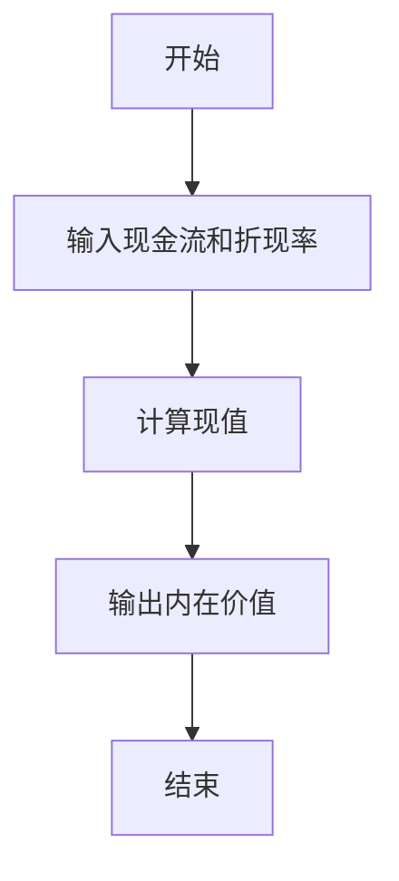
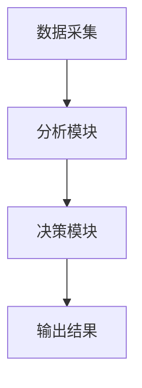

                 


# 格雷厄姆特价股票策略在不同企业文化生态中的适应

## 关键词：格雷厄姆策略，价值投资，企业文化，投资策略，股票市场

## 摘要：格雷厄姆特价股票策略是一种基于价值投资的经典策略，旨在通过寻找市场低估的股票实现长期收益。本文将探讨该策略在不同企业文化生态中的适应性，分析不同市场环境对企业投资策略的影响，并提供实际案例和系统化的解决方案。

---

# 第一部分: 背景介绍

## 第1章: 格雷厄姆策略的核心概念

### 1.1 价值投资的起源与发展
- **价值投资的起源**：由本杰明·格雷厄姆提出，强调购买低于其内在价值的股票。
- **核心思想**：市场先生的短期波动性，投资者应关注企业的内在价值而非市场情绪。
- **安全边际**：通过购买价格低于内在价值的股票，降低投资风险。

### 1.2 格雷厄姆策略的基本原理
- **内在价值计算**：基于企业未来现金流的折现值。
- **低估股票的识别**：通过市盈率、市净率等指标寻找低估机会。
- **长期投资策略**：避免短期市场波动，坚持长期持有优质资产。

## 第2章: 企业文化与投资策略的关系

### 2.1 企业文化对投资策略的影响
- **企业治理结构**：影响企业的稳定性与风险控制能力。
- **企业目标与价值观**：决定企业的长期战略方向。
- **市场环境**：不同地区的市场环境和监管政策对投资策略的影响。

---

# 第二部分: 核心概念与联系

## 第3章: 格雷厄姆策略的原理分析

### 3.1 安全边际的计算方法
- **公式**：安全边际 = 内在价值 - 市场价格
- **案例分析**：假设某股票的内在价值为100元，市场价格为80元，安全边际为20元。

### 3.2 内在价值的计算模型
- **DCF模型**：通过现金流折现计算企业价值。
- **公式**：企业价值 = ∑(CF_t / (1 + r)^t)，其中CF_t为第t年的现金流，r为折现率。

### 3.3 格雷厄姆策略与其他投资策略的对比
- **表1：不同策略的特征对比**

| 策略名称   | 投资期限 | 核心指标 | 风险承受 |
|------------|----------|----------|----------|
| 格雷厄姆策略 | 长期     | 市盈率、市净率 | 低       |
| 技术分析   | 短期     | K线、均线 | 高       |
| 成长投资   | 长期     | 收益率、ROE | 中       |

## 第4章: 格雷厄姆策略与企业生态的联系

### 4.1 企业治理结构对策略的影响
- **公司治理**：影响企业价值和股价稳定性。
- **管理层素质**：影响企业经营效率和内在价值。

### 4.2 市场环境与策略适应性
- **全球经济环境**：经济周期波动对股票价格的影响。
- **政策环境**：政府政策对企业价值和市场的调节作用。

---

# 第三部分: 算法原理讲解

## 第5章: 格雷厄姆策略的算法实现

### 5.1 内在价值计算的算法流程
- **步骤1：预测未来现金流**
- **步骤2：选择合适的折现率**
- **步骤3：计算现值**
- **步骤4：确定安全边际**

### 5.2 使用Python实现的代码示例

```python
def calculate_intrinsic_value(cash_flows, discount_rate):
    present_value = 0
    for t in range(len(cash_flows)):
        present_value += cash_flows[t] / (1 + discount_rate) ** t
    return present_value

# 示例数据
cash_flows = [100, 150, 200, 250]
discount_rate = 0.10

iv = calculate_intrinsic_value(cash_flows, discount_rate)
print(f"内在价值为：{iv}")
```

### 5.3 算法流程图（使用Mermaid）



---

# 第四部分: 系统分析与架构设计

## 第6章: 格雷厄姆策略的系统架构

### 6.1 问题场景介绍
- **目标**：在不同市场环境中应用格雷厄姆策略。
- **需求分析**：需要实时数据采集、分析模块和决策模块。

### 6.2 系统功能设计
- **数据采集模块**：收集企业财务数据和市场数据。
- **分析模块**：计算内在价值和安全边际。
- **决策模块**：基于分析结果生成投资决策。

### 6.3 系统架构图（使用Mermaid）



### 6.4 接口设计
- **输入接口**：接收企业财务数据和市场数据。
- **输出接口**：输出投资决策和分析结果。

---

# 第五部分: 项目实战

## 第7章: 格雷厄姆策略的实战应用

### 7.1 环境安装
- **工具安装**：安装Python和必要的数据处理库（如Pandas、NumPy）。

### 7.2 核心代码实现
```python
import pandas as pd
import numpy as np

def calculate_intrinsic_value(cash_flows, discount_rate):
    return np.npv(discount_rate, cash_flows)

# 示例数据
cash_flows = pd.Series([100, 150, 200, 250])
discount_rate = 0.10

iv = calculate_intrinsic_value(cash_flows, discount_rate)
print(f"内在价值为：{iv}")
```

### 7.3 实际案例分析
- **案例1：美国市场中的应用**
- **案例2：亚洲市场中的应用**
- **案例3：欧洲市场中的应用**

---

# 第六部分: 最佳实践

## 第8章: 小结与注意事项

### 8.1 小结
- **总结**：格雷厄姆策略在不同企业文化生态中的适应性取决于市场环境和企业特征。
- **注意事项**：投资者需结合市场动态和企业实际情况调整策略。

### 8.2 拓展阅读
- **推荐书籍**：《股票做趋势的分析》、《投资学原理》
- **在线资源**：相关学术论文和投资博客。

---

# 作者：AI天才研究院 & 禅与计算机程序设计艺术

---

以上是文章的详细目录和内容框架，您可以根据需要进一步扩展每个部分的具体内容。

