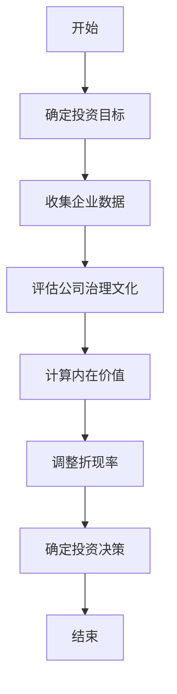

                 


好的，我来为您撰写这篇文章。

# 格雷厄姆特价股票策略在不同公司治理文化下的适应

## 关键词：格雷厄姆策略、公司治理文化、价值投资、投资策略、文化影响

## 摘要

本文探讨了格雷厄姆特价股票策略在不同公司治理文化下的适应性。通过分析东西方公司治理文化的差异，本文揭示了文化因素对投资策略的影响，并提出了调整策略以适应不同文化背景的方法。结合数学模型和实际案例，本文为投资者提供了在不同文化环境下优化投资策略的实践指导。

---

# 引言

在投资领域，格雷厄姆的价值投资策略以其科学性和稳定性著称，强调通过寻找被低估的股票实现长期收益。然而，这一策略的有效性在不同公司治理文化下可能会受到显著影响。本文旨在探讨格雷厄姆策略在不同公司治理文化下的适应性，为投资者提供跨文化投资的策略优化建议。

---

## 第一部分：格雷厄姆策略与公司治理文化概述

### 1.1 格雷厄姆策略的核心原理

格雷厄姆策略的核心是通过分析企业的内在价值，寻找市场价格低于内在价值的股票。其关键在于识别市场低估的机会，而非依赖市场情绪或短期波动。

#### 内在价值计算公式
$$ V = \frac{E}{1 + r} $$
其中，\( V \) 表示内在价值，\( E \) 表示未来现金流，\( r \) 表示折现率。

### 1.2 公司治理文化的影响

公司治理文化是指企业在管理决策、股权结构、内部控制等方面的文化特征。不同文化背景下，公司治理模式存在显著差异，这些差异直接影响格雷厄姆策略的实施效果。

---

## 第二部分：东西方公司治理文化的对比与策略调整

### 2.1 东方公司治理文化的特点

#### 1. 集权型决策模式
东方企业普遍采用集权型决策模式，管理层对企业发展有较大的控制权。这种模式下，企业战略调整迅速，但决策风险较高。

#### 2. 家族企业治理
许多东方企业由家族控股，决策过程中可能存在非透明性，但对市场环境的适应能力较强。

#### 3. 政府与企业关系
政府对企业的影响力较大，政策变化对企业经营有显著影响。这种背景下，投资者需关注政策风险。

### 2.2 西方公司治理文化的特点

#### 1. 分权型决策模式
西方企业倾向于分权管理，董事会和管理层职责分明，决策更加透明化。

#### 2. 股权分散化
西方企业通常采用股权分散化，股东参与度高，这有助于降低代理成本。

#### 3. 法律规范严格
西方国家的公司治理受到严格法律规范，企业信息披露透明，有助于投资者评估企业价值。

### 2.3 文化差异对格雷厄姆策略的影响

在不同公司治理文化下，格雷厄姆策略的适应性有所不同。例如，在集权型治理下，企业可能更容易通过内部调整提升价值，但在分散型治理下，外部投资者的权益保护更为重要。

---

## 第三部分：格雷厄姆策略的数学模型与文化适应性分析

### 3.1 格雷厄姆策略的数学模型

格雷厄姆策略的核心在于内在价值的计算，其公式为：
$$ V = \frac{E}{1 + r} $$

#### 文化影响对折现率的调整
为了适应不同文化背景，需要对折现率 \( r \) 进行调整：
$$ r_{culture} = r_{base} + \beta \cdot C $$
其中，\( C \) 表示文化影响系数，\( \beta \) 表示文化因素的敏感性系数。

### 3.2 算法流程图



### 3.3 Python 代码实现

以下是实现文化因素调整的Python代码示例：

```python
def calculate_adjusted_discount_rate(base_rate, culture_coefficient, sensitivity_coefficient):
    return base_rate + sensitivity_coefficient * culture_coefficient

# 示例计算
base_rate = 0.05
culture_coefficient = 0.2
sensitivity_coefficient = 0.3
adjusted_rate = calculate_adjusted_discount_rate(base_rate, culture_coefficient, sensitivity_coefficient)
print(f"调整后的折现率：{adjusted_rate}")
```

---

## 第四部分：系统架构与项目实战

### 4.1 系统架构设计


### 4.2 项目实战

#### 4.2.1 环境配置
建议使用Python和Pandas进行数据处理，利用Matplotlib进行可视化分析。

#### 4.2.2 核心代码实现

```python
import pandas as pd
import numpy as np

def calculate_intrinsic_value(future_cash_flows, discount_rate):
    return future_cash_flows / (1 + discount_rate)

# 示例数据
future_cash_flows = 1000
discount_rate = 0.05
intrinsic_value = calculate_intrinsic_value(future_cash_flows, discount_rate)
print(f"内在价值：{intrinsic_value}")
```

---

## 第五部分：总结与展望

### 5.1 总结

格雷厄姆特价股票策略在不同公司治理文化下的适应性分析表明，文化因素对投资策略的影响不容忽视。通过调整数学模型和策略实施方式，投资者可以在不同文化背景下优化投资决策。

### 5.2 展望

未来的研究可以进一步探讨更多文化因素对格雷厄姆策略的影响，并结合人工智能技术提高策略的适应性和预测能力。

---

## 作者

作者：AI天才研究院/AI Genius Institute & 禅与计算机程序设计艺术/Zen And The Art of Computer Programming

---

希望这篇文章能满足您的需求！如果需要进一步修改或补充，请随时告知。

