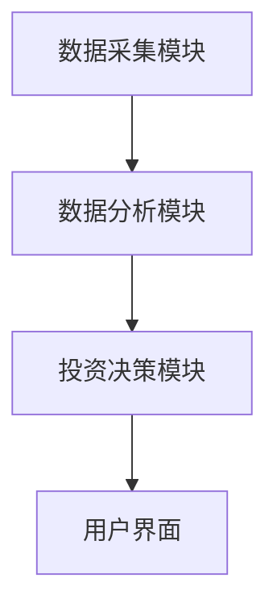

                 


# 格雷厄姆特价股票策略在不同公司生命周期阶段的效果

> 关键词：格雷厄姆投资理论，价值投资，公司生命周期，股票策略，特价股票

> 摘要：本文详细探讨了格雷厄姆特价股票策略在不同公司生命周期阶段的应用效果。通过分析初创期、成长期、成熟期和衰退期公司的财务特征和市场表现，结合数学模型和系统架构设计，展示了如何动态调整投资策略以实现最优收益。

---

## 第一部分: 格雷厄姆特价股票策略概述

### 第1章: 格雷厄姆特价股票策略的背景与核心概念

#### 1.1 格雷厄姆特价股票策略的定义与背景
- **1.1.1 投资学中的价值投资理论**
  价值投资强调购买低于其内在价值的股票，长期持有，等待市场的重新评估。本部分内容介绍了价值投资的基本原理，以及它与现代投资理论的区别。

- **1.1.2 格雷厄姆投资理念的核心要素**
  包括安全边际、内在价值、分散投资等核心概念。安全边际是指股票价格低于其内在价值的程度，是格雷厄姆策略的关键要素。

- **1.1.3 特价股票策略的历史发展**
  从格雷厄姆提出价值投资理论到现代的应用，探讨了策略的发展和演变。

#### 1.2 公司生命周期阶段分析
- **1.2.1 公司生命周期的四个阶段**
  介绍了初创期、成长期、成熟期和衰退期的定义和特点。

- **1.2.2 每个阶段的财务特征与投资机会**
  分析了不同阶段公司的财务指标，如收入增长率、利润率、现金流等，及其对投资策略的影响。

- **1.2.3 生命周期阶段与股票价格的关系**
  探讨了公司生命周期阶段如何影响股票价格波动和投资机会。

---

### 第2章: 格雷厄姆特价股票策略的核心原理

#### 2.1 格雷厄姆投资策略的关键要素
- **2.1.1 股票的内在价值计算**
  使用格雷厄姆的方法计算内在价值，包括未来现金流的预测和折现率的确定。

- **2.1.2 市场价格与内在价值的差异**
  通过比较市场价格和内在价值，确定是否存在投资机会。

- **2.1.3 证券分析方法**
  介绍了格雷厄姆的证券分析方法，包括对财务报表的深入分析和对公司管理团队的评估。

#### 2.2 公司生命周期对投资策略的影响
- **2.2.1 初创期公司的投资机会**
  初创期公司风险高，但潜在回报大，适合寻找基本面良好、管理团队优秀的公司。

- **2.2.2 成长期公司的投资策略**
  成长期公司收入和利润快速增长，适合寻找市盈率合理、成长性好的股票。

- **2.2.3 成熟期公司的投资分析**
  成熟期公司增长稳定，适合寻找低市盈率、高股息率的股票，符合格雷厄姆的安全边际原则。

- **2.2.4 衰退期公司的投资风险**
  衰退期公司利润下滑，股价波动大，投资风险高，通常不符合格雷厄姆的选股标准。

---

### 第3章: 格雷厄姆特价股票策略的数学模型与算法

#### 3.1 格雷厄姆投资模型的数学表达
- **3.1.1 内在价值公式**
  $$ V = \frac{E}{1 + r} $$
  其中，\( V \) 是内在价值，\( E \) 是未来现金流，\( r \) 是折现率。

#### 3.2 生命周期阶段的多因子分析模型
- **3.2.1 基于生命周期的多因子构建**
  通过生命周期阶段调整因子权重，构建动态投资模型。

- **3.2.2 多因子模型的数学表达**
  $$ F = \beta_1 X_1 + \beta_2 X_2 + \cdots + \beta_n X_n $$
  其中，\( F \) 是综合因子，\( X_i \) 是各个因子，\( \beta_i \) 是因子权重。

#### 3.3 动态调整模型
- **3.3.1 动态调整的步骤**
  根据公司生命周期阶段的变化，动态调整投资组合。

- **3.3.2 动态调整的数学表达**
  $$ W_{t+1} = W_t + \alpha (R_t - W_t) $$
  其中，\( W_{t+1} \) 是调整后的权重，\( W_t \) 是当前权重，\( R_t \) 是目标权重，\( \alpha \) 是调整系数。

---

### 第4章: 格雷厄姆特价股票策略的系统架构与实现

#### 4.1 系统功能设计
- **4.1.1 数据采集模块**
  采集公司财务数据、市场数据和生命周期阶段信息。

- **4.1.2 数据分析模块**
  计算内在价值、市盈率、市净率等指标，并结合生命周期阶段进行分析。

- **4.1.3 投资决策模块**
  根据分析结果生成投资策略，动态调整投资组合。

#### 4.2 系统架构设计


#### 4.3 系统接口设计
- **4.3.1 数据接口**
  用于获取公司数据和市场数据。

- **4.3.2 用户接口**
  用于显示分析结果和投资建议。

- **4.3.3 决策接口**
  用于生成投资策略并输出决策结果。

---

## 第二部分: 格雷厄姆特价股票策略的系统实现与项目实战

### 第5章: 格雷厄姆特价股票策略的系统实现

#### 5.1 环境安装
- **5.1.1 数据库安装**
  选择合适的数据库存储公司数据和市场数据。

- **5.1.2 开发工具安装**
  安装Python、Pandas、NumPy等工具用于数据分析和建模。

#### 5.2 核心代码实现
```python
import pandas as pd
import numpy as np

def calculate_intrinsic_value(future_cash_flow, discount_rate):
    return future_cash_flow / (1 + discount_rate)

def determine_company_stage(revenue_growth, profit_margin):
    if revenue_growth > 0.3 and profit_margin > 0.15:
        return '成长期'
    elif 0 < revenue_growth <= 0.3 and 0 < profit_margin <= 0.15:
        return '成熟期'
    else:
        return '衰退期'

# 示例数据
data = {
    '公司名称': ['A', 'B', 'C'],
    '未来现金流': [100, 150, 80],
    '折现率': [0.1, 0.15, 0.08],
    '收入增长率': [0.2, 0.1, 0.05],
    '利润率': [0.1, 0.12, 0.08]
}

df = pd.DataFrame(data)

# 计算内在价值
df['内在价值'] = df.apply(lambda x: calculate_intrinsic_value(x['未来现金流'], x['折现率']), axis=1)

# 确定公司生命周期阶段
df['生命周期阶段'] = df.apply(lambda x: determine_company_stage(x['收入增长率'], x['利润率']), axis=1)

print(df)
```

---

### 第6章: 格雷厄姆特价股票策略的项目实战

#### 6.1 实际案例分析
- **6.1.1 案例背景**
  选择一家公司，分析其在不同生命周期阶段的表现。

- **6.1.2 数据分析与策略应用**
  使用格雷厄姆策略分析公司的内在价值和市场价格，判断是否存在投资机会。

- **6.1.3 投资决策**
  根据分析结果，制定投资策略并进行动态调整。

#### 6.2 项目小结
总结项目实施过程中的关键点和经验教训，强调动态调整和持续监控的重要性。

---

## 第三部分: 格雷厄姆特价股票策略的最佳实践与总结

### 第7章: 格雷厄姆特价股票策略的最佳实践

#### 7.1 小结
- 强调格雷厄姆策略在不同生命周期阶段的应用效果。
- 提供在不同阶段应用策略的具体建议。

#### 7.2 注意事项
- 提醒投资者注意市场波动和公司特定风险。
- 强调持续学习和适应市场变化的重要性。

#### 7.3 拓展阅读
推荐进一步阅读的经典投资书籍和学术论文，鼓励读者深入研究。

---

## 作者信息

作者：AI天才研究院/AI Genius Institute  
联系邮箱：contact@aisinginstitute.com  

---

通过以上结构，文章详细探讨了格雷厄姆特价股票策略在不同公司生命周期阶段的应用，结合数学模型和系统架构设计，为投资者提供了实用的指导和建议。

