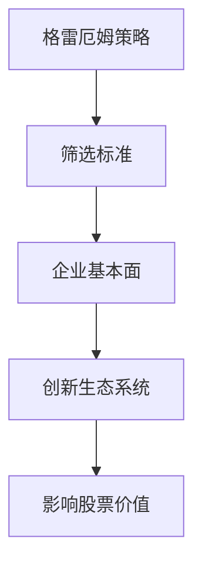
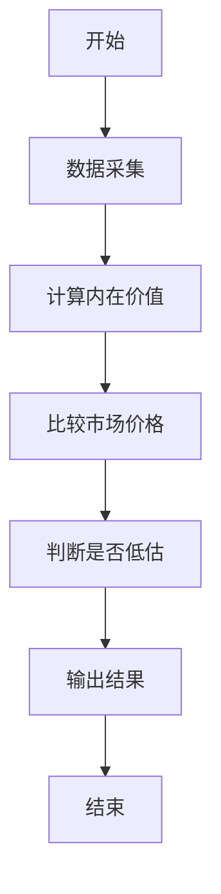
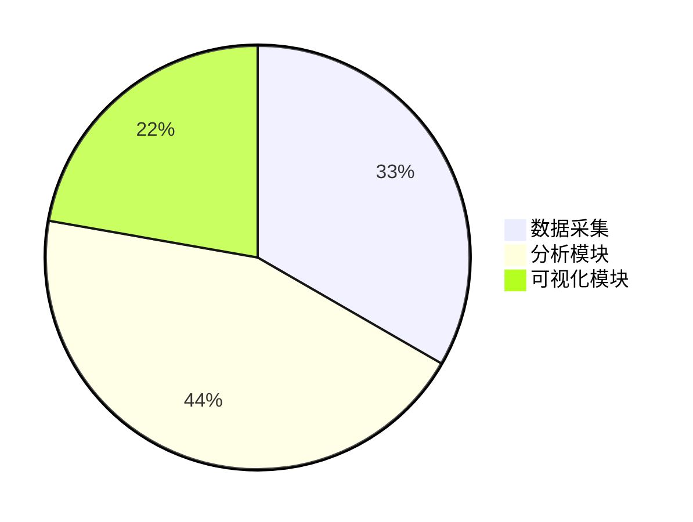

                 


```markdown
# 格雷厄姆特价股票策略在不同创新生态系统的效果

## 关键词
格雷厄姆，特价股票，创新生态系统，股票策略，价值投资

## 摘要
本文深入分析了格雷厄姆特价股票策略在不同创新生态系统中的应用效果。从策略的理论基础到创新生态系统的影响，结合数学模型和系统架构设计，探讨了策略在实际投资中的适应性和优化方向。通过案例分析和代码实现，展示了如何在创新环境下有效应用格雷厄姆策略。

---

# 第一部分: 格雷厄姆特价股票策略的背景与核心概念

## 第1章: 格雷厄姆特价股票策略的起源与理论基础

### 1.1 格雷厄姆投资理论的起源与发展
格雷厄姆是价值投资之父，他的策略基于企业的内在价值，而非市场情绪。核心理念是寻找市场价格低于内在价值的股票，长期持有以实现收益。

### 1.2 格雷厄姆特价股票策略的定义与特点
特价股票策略注重基本面分析，通过市盈率、市净率等指标筛选低估股票。策略的优点包括低风险和高安全边际，但缺点是需要长期等待市场回归价值。

### 1.3 格雷厄姆策略的核心思想
格雷厄姆强调安全边际，即买入价格远低于内在价值，以应对市场波动和不确定性。

## 第2章: 创新生态系统与股票策略的结合

### 2.1 创新生态系统的基本概念
创新生态系统包括企业、技术、市场等要素，其动态变化影响企业的价值和股票价格。

### 2.2 格雷厄姆策略在创新生态系统中的应用
创新生态系统下，企业估值需考虑技术创新和市场扩展，格雷厄姆策略需结合新兴行业特点进行调整。

---

# 第二部分: 格雷厄姆特价股票策略的核心概念与联系

## 第3章: 格雷厄姆策略的核心原理

### 3.1 格雷厄姆策略的数学模型
内在价值公式：
$$ V = \frac{E}{(1 + r)^n} $$
其中，\( V \) 是内在价值，\( E \) 是未来现金流，\( r \) 是折现率，\( n \) 是时间跨度。

### 3.2 格雷厄姆策略与创新生态系统的关系
创新生态系统影响企业估值，需调整传统模型，引入技术创新和市场扩展因素。

## 第4章: 格雷厄姆策略与创新生态系统的关系图解

### 4.1 格雷厄姆策略的核心概念 ER 图
```mermaid
erDiagram
    格雷厄姆策略 <--- 关键指标 : 筛选标准
    关键指标 <--- 企业基本面 : 数据来源
    企业基本面 <--- 创新生态系统 : 环境影响
```

### 4.2 创新生态系统中的策略流程图


---

# 第三部分: 格雷厄姆特价股票策略的算法实现与系统架构

## 第5章: 格雷厄姆策略的算法实现

### 5.1 格雷厄姆选股模型
实现步骤包括数据采集、计算内在价值、比较市场价格，判断是否低估。

### 5.2 算法流程图


## 第6章: 系统架构设计

### 6.1 项目介绍
系统用于分析格雷厄姆策略在不同创新生态系统中的效果，提供数据采集、分析和可视化功能。

### 6.2 系统功能设计
- 数据采集模块：获取企业基本面数据。
- 分析模块：计算内在价值和比较价格。
- 可视化模块：展示结果。

### 6.3 系统架构图


---

# 第四部分: 项目实战与案例分析

## 第7章: 环境安装与代码实现

### 7.1 环境安装
安装Python和相关库，如pandas和numpy。

### 7.2 核心代码实现
```python
import pandas as pd

def calculate_intrinsic_value(e, r, n):
    return e / (1 + r) ** n

data = pd.read_csv('stock_data.csv')
data['内在价值'] = data.apply(lambda x: calculate_intrinsic_value(x['未来现金流'], x['折现率'], x['时间跨度']), axis=1)
```

## 第8章: 案例分析与解读

### 8.1 案例分析
分析一家科技公司的数据，计算其内在价值，判断是否低估。

### 8.2 案例解读
通过案例展示格雷厄姆策略在创新生态系统中的应用效果，强调模型调整的重要性。

---

# 第五部分: 总结与展望

## 第9章: 格雷厄姆策略的总结与优化

### 9.1 格雷厄姆策略的优势与不足
总结其优点，如低风险，分析其在创新环境下的不足。

### 9.2 对未来策略的展望
建议结合大数据和人工智能优化策略，提升在创新生态系统中的适用性。

## 第10章: 项目小结与注意事项

### 10.1 项目小结
总结项目成果，强调创新环境中策略调整的重要性。

### 10.2 投资者注意事项
提醒投资者关注创新环境变化，合理调整策略。

---

# 参考文献
1. 格雷厄姆《 Intelligent Investor》
2. 现代金融理论相关文献
3. 创新生态系统研究文献

---

# 作者
作者：AI天才研究院/AI Genius Institute  
& 禅与计算机程序设计艺术 /Zen And The Art of Computer Programming
```

