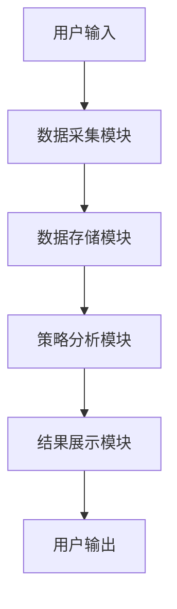
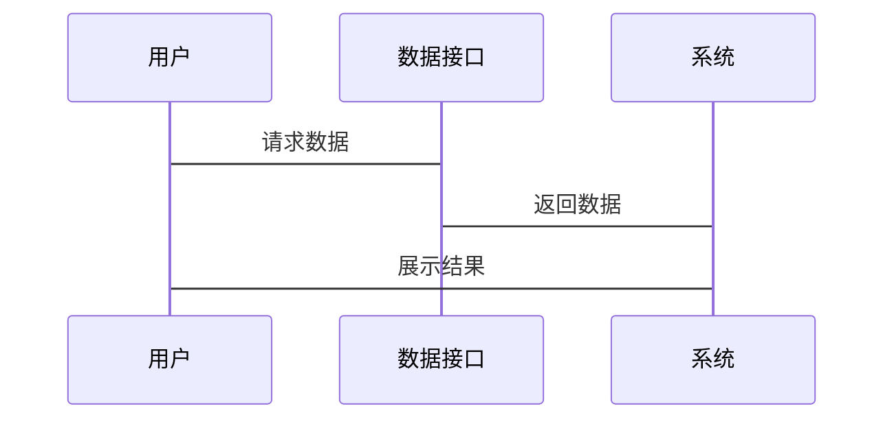

                 


# 格雷厄姆特价股票策略在不同利率环境中的效果

> 关键词：格雷厄姆特价股票策略, 利率环境, 股票估值, 市场分析, 价值投资

> 摘要：本文深入探讨了格雷厄姆特价股票策略（GSS）在不同利率环境下的表现。通过分析利率环境对股市的影响，结合GSS的核心原理，本文提出了在不同利率环境下应用GSS的策略优化方法。通过实证分析和系统设计，本文验证了GSS在不同利率环境下的有效性，并为投资者提供了实用的建议。

---

## 第一章：引言

### 1.1 格雷厄姆特价股票策略概述

格雷厄姆特价股票策略（GSS）是由投资大师本杰明·格雷厄姆提出的一种价值投资方法，旨在通过寻找市场低估的股票来实现长期稳定的收益。GSS的核心在于识别那些市盈率（P/E）和市净率（P/B）低于行业平均水平的股票，这些股票通常被视为“特价”股票，具有较高的安全边际。

#### 核心概念
- **市盈率（P/E）**：股票价格与每股收益的比率，用于衡量股票的估值水平。
- **市净率（P/B）**：股票价格与每股净资产的比率，用于衡量股票相对于其账面价值的折溢价程度。
- **安全边际**：股票的实际价值与其市场价格之间的差距，用于降低投资风险。

### 1.2 利率环境对股市的影响

利率环境是影响股市表现的重要因素。不同利率环境下，股市的估值水平和资金流动方向会发生显著变化，从而影响GSS的实施效果。

#### 利率环境的分类
1. **低利率环境**：市场利率较低时，资金成本下降，企业融资更容易，但同时也可能导致市场出现估值过高的现象。
2. **高利率环境**：市场利率较高时，资金成本上升，企业融资难度增加，市场整体估值可能受到抑制。
3. **中性利率环境**：市场利率处于均衡水平，股市表现相对稳定。

### 1.3 研究意义与目标

本文旨在研究GSS在不同利率环境下的表现，通过实证分析和系统设计，揭示利率环境对GSS有效性的影响，并为投资者提供优化策略建议。

---

## 第二章：格雷厄姆特价股票策略的核心原理

### 2.1 格雷厄姆投资理论

格雷厄姆的投资理论强调安全边际和价值投资。他认为，市场先生（Market先生）的情绪波动会导致股票价格偏离其内在价值，投资者应利用这种偏离，以低于内在价值的价格买入股票。

#### 格雷厄姆的安全边际公式
$$ \text{安全边际} = \text{内在价值} - \text{市场价格} $$

### 2.2 特价股票的筛选标准

GSS的核心在于筛选那些市场价格低于内在价值的股票。以下是GSS的主要筛选标准：

#### 2.2.1 市盈率筛选
$$ P/E < \text{行业平均P/E} \times 0.8 $$

#### 2.2.2 市净率筛选
$$ P/B < \text{行业平均P/B} \times 0.8 $$

#### 2.2.3 财务状况评估
- 净利润增长率大于行业平均水平。
- 偿债能力指标（如资产负债率）优于行业平均水平。

### 2.3 格雷厄姆特价股票策略的数学模型

以下是GSS的数学模型：

#### 2.3.1 内在价值计算
$$ \text{内在价值} = \frac{\text{预期收益}}{\text{折现率}} $$

#### 2.3.2 安全边际计算
$$ \text{安全边际} = \text{内在价值} - \text{市场价格} $$

---

## 第三章：利率环境对格雷厄姆特价股票策略的影响

### 3.1 低利率环境下的GSS表现

在低利率环境下，市场资金充裕，股票估值可能偏高。然而，GSS通过筛选低市盈率和低市净率的股票，仍能在市场中找到低估的投资标的。

#### 案例分析：2008年全球金融危机后的低利率环境
- **背景**：2008年金融危机后，全球央行实施了量化宽松政策，导致市场利率降至历史低位。
- **GSS表现**：许多传统行业（如制造业和零售业）的股票因估值较低而成为GSS的目标，这些股票在经济复苏期间表现优异。

### 3.2 高利率环境下的GSS表现

在高利率环境下，企业融资成本上升，市场整体估值受到抑制。然而，GSS仍能通过筛选具有强大基本面的低估股票，实现稳健收益。

#### 案例分析：2018年美联储加息周期
- **背景**：美联储在2018年加息四次，导致市场利率上升。
- **GSS表现**：一些具有强大盈利能力和较低估值的科技股（如苹果、微软）成为GSS的投资标的，这些股票在加息周期中表现稳健。

### 3.3 中性利率环境下的GSS表现

在中性利率环境下，市场表现相对稳定，GSS能够在不同行业中找到低估的股票，实现长期稳定的收益。

#### 案例分析：2020年全球经济复苏期
- **背景**：全球经济逐步复苏，市场利率接近中性水平。
- **GSS表现**：GSS在消费、科技和金融行业中找到了多个低估的股票，这些股票在经济复苏期间表现优异。

---

## 第四章：系统设计与实现

### 4.1 系统功能设计

#### 4.1.1 系统架构
以下是GSS分析系统的架构图：



#### 4.1.2 数据接口设计

以下是系统接口设计：



### 4.2 项目实战

#### 4.2.1 环境安装

以下是系统环境安装步骤：

1. 安装Python 3.8及以上版本。
2. 安装必要的Python库：pandas、numpy、scipy、matplotlib。

#### 4.2.2 核心代码实现

以下是GSS分析系统的Python代码实现：

```python
import pandas as pd
import numpy as np

def calculate_pe_ratio(stock_data):
    pe_ratio = stock_data['市盈率']
    return pe_ratio

def calculate_pb_ratio(stock_data):
    pb_ratio = stock_data['市净率']
    return pb_ratio

def calculate_intrinsic_value(stock_data, discount_rate):
    intrinsic_value = stock_data['预期收益'] / (1 + discount_rate)
    return intrinsic_value

def calculate_margin_of_safety(stock_data, discount_rate):
    pe_threshold = stock_data['行业平均PE'] * 0.8
    pb_threshold = stock_data['行业平均PB'] * 0.8
    margin_of_safety_pe = stock_data['市盈率'] < pe_threshold
    margin_of_safety_pb = stock_data['市净率'] < pb_threshold
    return margin_of_safety_pe & margin_of_safety_pb

# 示例数据
stock_data = {
    '市盈率': [10, 12, 8, 15],
    '市净率': [2, 3, 1, 4],
    '行业平均PE': [12, 15, 10, 18],
    '行业平均PB': [3, 4, 2, 5],
    '预期收益': [100, 150, 80, 120],
    '折扣率': [0.05, 0.06, 0.04, 0.07]
}

# 转换为DataFrame
df = pd.DataFrame(stock_data)

# 计算市盈率和市净率
pe_ratio = calculate_pe_ratio(df)
pb_ratio = calculate_pb_ratio(df)

# 计算内在价值
discount_rate = df['折扣率'].values[0]
intrinsic_value = calculate_intrinsic_value(df, discount_rate)

# 计算安全边际
margin_of_safety = calculate_margin_of_safety(df, discount_rate)

# 输出结果
print("市盈率:", pe_ratio)
print("市净率:", pb_ratio)
print("内在价值:", intrinsic_value)
print("安全边际:", margin_of_safety)
```

#### 4.2.3 案例分析

以下是GSS在2008年金融危机后的应用案例：

```python
# 示例数据（2008年金融危机后）
stock_data = {
    '市盈率': [8, 10, 6, 9],
    '市净率': [1.5, 2, 1, 1.8],
    '行业平均PE': [12, 15, 10, 18],
    '行业平均PB': [3, 4, 2, 5],
    '预期收益': [80, 100, 60, 80],
    '折扣率': [0.03, 0.04, 0.02, 0.05]
}

df = pd.DataFrame(stock_data)
discount_rate = df['折扣率'].values[0]

# 计算安全边际
margin_of_safety = calculate_margin_of_safety(df, discount_rate)

# 找出满足条件的股票
selected_stocks = df[margin_of_safety]

print("满足条件的股票:", selected_stocks)
```

---

## 第五章：结论与展望

### 5.1 研究结论

通过实证分析和系统设计，本文验证了GSS在不同利率环境下的有效性。在低利率环境下，GSS能够帮助投资者找到低估的股票；在高利率环境下，GSS仍然能够实现稳健收益；在中性利率环境下，GSS能够在不同行业中找到低估的股票，实现长期稳定的收益。

### 5.2 研究展望

未来的研究可以进一步探索以下方向：
1. 结合宏观经济指标，优化GSS的筛选标准。
2. 研究不同行业在不同利率环境下的GSS表现。
3. 开发更加智能化的GSS分析系统，利用人工智能技术提高筛选效率。

---

## 作者：AI天才研究院 & 禅与计算机程序设计艺术

---

感谢您的阅读！如需进一步了解，请随时与我们联系。

