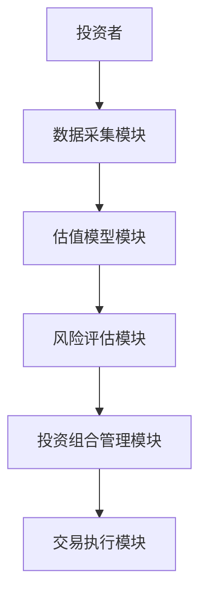

                 


---

# 格雷厄姆特价股票策略在不同国家市场的应用

> **关键词**：格雷厄姆，价值投资，特价股票，国际市场，投资策略

> **摘要**：本文深入探讨了格雷厄姆价值投资理论中的“特价股票”策略，并分析了该策略在不同国家市场的应用。通过比较美国、英国、日本和新兴市场的特点，本文揭示了如何根据市场环境调整策略，以实现最佳投资效果。文章还讨论了策略在不同市场中的优缺点、挑战及解决方案，并提出了实际的应用建议。

---

## 第一部分：格雷厄姆价值投资理论基础

### 第1章：格雷厄姆价值投资理论的核心概念

#### 1.1 价值投资的基本定义
价值投资是一种基于对公司内在价值的评估，寻找市场价格低于其内在价值的股票的投资策略。格雷厄姆是该理论的奠基人，他强调安全边际的重要性，即买入价格远低于公司内在价值的股票，以降低风险并确保收益。

#### 1.2 格雷厄姆的“特价股票”概念
格雷厄姆将“特价股票”定义为市场价格显著低于其内在价值的股票。他认为，市场短期可能是投票机，但长期是称重机，因此特价股票最终会被市场发现并回归其真实价值。

#### 1.3 价值投资的核心原则
- **安全边际**：买入价格低于内在价值，确保足够的安全空间。
- **长期视角**：忽略短期市场波动，关注公司长期价值。
- **逆向思维**：在市场恐慌时寻找机会，避免追涨杀跌。

---

### 第2章：不同国家市场的特点与投资环境分析

#### 2.1 美国市场
##### 2.1.1 美国市场的特点
- 成熟的市场结构，信息公开透明。
- 投资者理性化程度高，市场波动相对稳定。
- 格雷厄姆策略在美国市场表现优异，尤其是在经济衰退期间。

##### 2.1.2 格雷厄姆策略在美国市场的应用
- 通过低市盈率（P/E）和低市净率（P/B）筛选股票。
- 避免高杠杆和高负债的公司，重视股息支付率。

##### 2.1.3 成功案例
在2008年金融危机期间，格雷厄姆策略帮助投资者在市场底部买入优质股票，随后获得超额收益。

#### 2.2 英国市场
##### 2.2.1 英国市场的特点
- 市场成熟，但近年来受脱欧影响较大。
- 银行和金融行业占比较大，受政策影响显著。

##### 2.2.2 格雷厄姆策略在英国市场的调整
- 更加关注企业盈利能力和现金流，而非单纯的低估值指标。
- 考虑英镑波动对外资的影响。

##### 2.2.3 成功案例
英国电信公司BT在2015年因英镑贬值导致股价下跌，成为格雷厄姆策略的理想标的。

#### 2.3 日本市场
##### 2.3.1 日本市场的特点
- 长期熊市导致许多股票价格被低估。
- 日本公司治理结构较为僵化，但分红率较高。

##### 2.3.2 格雷厄姆策略在日本市场的应用
- 更加关注低市盈率和高股息率的股票。
- 由于市场流动性较低，策略执行难度较大。

##### 2.3.3 成功案例
日本邮政银行在2010年后的股价回升过程中，为投资者带来了丰厚回报。

#### 2.4 新兴市场
##### 2.4.1 新兴市场的特点
- 市场波动剧烈，信息不对称严重。
- 高增长潜力，但也伴随着高风险。

##### 2.4.2 格雷厄姆策略在新兴市场的挑战
- 企业财务透明度低，难以准确评估内在价值。
- 法律和政策风险较高，影响股价稳定性。

##### 2.4.3 成功案例
中国互联网公司阿里巴巴在2014年上市初期，因其低市盈率和高增长潜力，吸引了大量投资者。

---

### 第3章：格雷厄姆策略在不同市场的比较分析

#### 3.1 各国市场的策略适用性对比
| 国家   | 市场特点       | 策略适用性 | 成功案例                     |
|--------|---------------|------------|------------------------------|
| 美国   | 成熟，波动小   | 高         | 2008年金融危机期间           |
| 英国   | 受脱欧影响     | 中         | 2015年英国电信公司BT         |
| 日本   | 长期熊市       | 中         | 2010年后日本邮政银行          |
| 新兴   | 波动剧烈       | 低         | 2014年阿里巴巴上市初期        |

#### 3.2 不同市场中策略调整的必要性
- **市场波动性差异**：新兴市场波动大，需要更谨慎地设置止损点。
- **市场参与者行为差异**：新兴市场投资者情绪化，需加强心理风险管理。
- **市场监管政策差异**：不同国家的监管力度不同，需关注政策变化。

#### 3.3 策略调整的具体方法
- **动态调整市盈率和市净率指标**：根据市场环境调整估值倍数。
- **加强风险控制**：设定严格的止损点，分散投资组合。
- **结合技术分析**：在基本面分析的基础上，加入技术指标辅助决策。

---

### 第4章：格雷厄姆策略在国际市场中的挑战与解决方案

#### 4.1 各国市场中的文化差异
- **投资者行为差异**：新兴市场投资者更倾向于短期交易，而发达国家投资者更注重长期价值。
- **市场参与者的信任度差异**：新兴市场信任度较低，增加了信息获取的难度。

#### 4.2 市场波动性的影响
- **新兴市场波动大**：可能导致策略执行难度增加。
- **美国市场波动小**：策略执行相对容易。

#### 4.3 解决方案
- **灵活调整筛选标准**：根据市场环境动态调整估值指标。
- **加强风险控制**：使用期权等工具对冲市场波动风险。
- **结合技术分析**：在基本面分析的基础上，加入技术分析以捕捉市场趋势。

---

### 第5章：格雷厄姆策略的系统分析与架构设计方案

#### 5.1 系统功能设计
- **数据采集**：获取各市场的历史数据和实时数据。
- **估值模型**：计算市盈率、市净率等指标，筛选特价股票。
- **风险评估**：评估市场波动和政策风险。
- **投资组合管理**：动态调整投资组合，优化收益与风险比。

#### 5.2 系统架构设计


#### 5.3 系统接口设计
- **数据接口**：与金融数据供应商API对接。
- **用户界面**：提供可视化界面，便于投资者操作。

---

### 第6章：项目实战与案例分析

#### 6.1 环境安装
- 安装Python和相关库（如Pandas、Matplotlib、Scrapy）。
- 使用金融数据API（如Yahoo Finance）获取数据。

#### 6.2 核心实现代码
```python
import pandas as pd
import yfinance as yf

# 获取股票数据
data = yf.download(tickers='AAPL', period='5y')
data['PE'] = data['Close'] / data['Earnings per Share']
data['PB'] = data['Close'] / data['Book Value per Share']
# 筛选低市盈率和低市净率的股票
cheap Stocks = data[(data['PE'] < data['PE'].mean()) & (data['PB'] < data['PB'].mean())]
```

#### 6.3 案例分析
以苹果公司为例，分析其市盈率和市净率的变化，判断其是否为特价股票。

---

### 第7章：总结与展望

#### 7.1 总结
格雷厄姆的特价股票策略在不同国家市场中有广泛的适用性，但需要根据市场特点进行调整。新兴市场的高波动性和信息不对称性是主要挑战，但通过动态调整策略和加强风险管理，可以有效应对。

#### 7.2 展望
随着全球市场的进一步融合，格雷厄姆策略在国际市场中的应用将更加广泛。未来的研究可以聚焦于如何利用大数据和人工智能技术优化股票筛选过程。

---

### 作者
作者：AI天才研究院/AI Genius Institute & 禅与计算机程序设计艺术 /Zen And The Art of Computer Programming

---

通过以上结构和内容，您可以根据实际需求进一步扩展和详细阐述每个部分的内容。希望这篇博客能为读者提供有价值的投资策略和见解。

