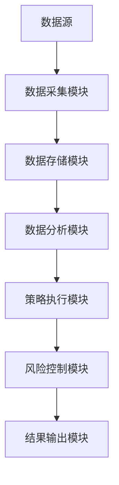
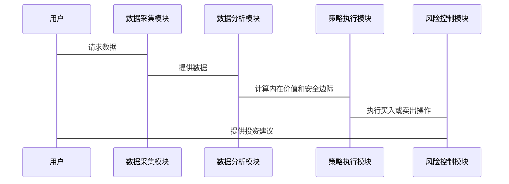

                 


# 格雷厄姆特价股票策略在不同市场周期的表现

> 关键词：格雷厄姆投资理论，特价股票策略，市场周期，安全边际，内在价值，风险管理

> 摘要：本文深入分析了本杰明·格雷厄姆提出的特价股票策略在不同市场周期中的表现。通过数学模型、系统架构设计和实际案例分析，探讨了格雷厄姆策略在牛市、熊市和震荡市中的应用效果。文章结合理论与实践，为投资者提供了如何在不同市场环境下应用格雷厄姆策略的详细指导。

---

## 第一部分: 格雷厄姆特价股票策略概述

### 第1章: 格雷厄姆特价股票策略的核心理念

#### 1.1 本杰明·格雷厄姆的生平简介
本杰明·格雷厄姆（Benjamin Graham）是20世纪著名的投资学家，被誉为“价值投资之父”。他于1894年出生于英国伦敦，后移居美国。格雷厄姆在哥伦比亚大学任教期间，培养了包括沃伦·巴菲特在内的众多投资大师。他的投资理念对全球金融界产生了深远影响。

#### 1.2 格雷厄姆投资理论的核心思想
格雷厄姆的投资理论以“价值投资”为核心，强调以低于内在价值的价格买入股票，并长期持有，直到市场重新认识到其真实价值。他认为，股票市场本质上是理性的投票机器，但短期内可能受到投资者情绪的影响而偏离其内在价值。

#### 1.3 特价股票策略的基本概念
格雷厄姆提出的“特价股票”策略，是指以低于股票内在价值的价格买入股票。这种策略的核心在于寻找那些市场价格显著低于其内在价值的股票，从而在市场恢复理性后获得超额收益。

---

### 第2章: 格雷厄姆特价股票策略的数学模型与公式

#### 2.1 内在价值的计算公式
格雷厄姆认为，内在价值是股票的真正价值，可以通过对企业未来现金流的折现来计算。以下是内在价值的计算公式：

$$
\text{内在价值} = \frac{\text{每股收益} \times \text{增长率}}{\text{折现率}}
$$

#### 2.2 安全边际的计算公式
安全边际是指市场价格与内在价值之间的差异，是投资的安全空间。计算公式如下：

$$
\text{安全边际} = \text{内在价值} - \text{市场价格}
$$

#### 2.3 市场周期与投资策略的关系
格雷厄姆认为，市场周期对投资策略有重要影响。以下是市场周期阶段的定义公式：

$$
\text{市场周期阶段} = \frac{\text{市场估值}}{\text{内在价值}}
$$

---

### 第3章: 格雷厄姆策略在不同市场周期的表现分析

#### 3.1 牛市周期中的策略应用
##### 3.1.1 牛市周期的定义与特征
牛市是指股票市场价格持续上涨，投资者情绪乐观的市场阶段。其主要特征包括：
1. 市场估值偏高。
2. 投资者情绪高涨。
3. 股票价格波动较小。

##### 3.1.2 格雷厄姆策略在牛市中的表现
在牛市中，格雷厄姆策略的表现通常较为平淡，因为市场高估导致安全边际较低。然而，长期来看，安全边际高的股票仍能为投资者带来稳定收益。

##### 3.1.3 牛市中的风险与机会
牛市中的主要风险是市场高估，机会在于寻找那些估值合理且具有强大基本面的股票。

#### 3.2 熊市周期中的策略应用
##### 3.2.1 熊市周期的定义与特征
熊市是指股票市场价格持续下跌，投资者情绪悲观的市场阶段。其主要特征包括：
1. 市场估值偏低。
2. 投资者情绪低落。
3. 股票价格波动较大。

##### 3.2.2 格雷厄姆策略在熊市中的表现
在熊市中，格雷厄姆策略通常表现优异，因为市场低估提供了较多的安全边际。投资者可以以较低的价格买入具有强大基本面的股票。

##### 3.2.3 熊市中的防御性投资策略
在熊市中，投资者应采取防御性策略，如选择那些具有强大财务实力和稳定股息支付能力的股票。

#### 3.3 震荡市周期中的策略应用
##### 3.3.1 震荡市周期的定义与特征
震荡市是指市场在短期内波动较大，但缺乏明确趋势的市场阶段。其主要特征包括：
1. 市场估值波动较大。
2. 投资者情绪不稳定。
3. 股票价格频繁波动。

##### 3.3.2 格雷厄姆策略在震荡市中的表现
在震荡市中，格雷厄姆策略的表现取决于市场波动的幅度和持续时间。投资者应灵活调整策略，如适当降低安全边际要求。

##### 3.3.3 震荡市中的灵活性与耐心
在震荡市中，投资者需要保持灵活性，同时耐心等待市场回归理性。

---

## 第二部分: 格雷厄姆特价股票策略的系统分析与架构设计

### 第4章: 格雷厄姆策略的系统架构设计

#### 4.1 系统功能模块划分
格雷厄姆策略的系统架构设计包括以下功能模块：
1. 数据采集模块：负责收集股票市场数据。
2. 数据分析模块：计算内在价值和安全边际。
3. 策略执行模块：根据市场周期和安全边际执行买入或卖出操作。
4. 风险控制模块：监控投资风险并进行调整。

#### 4.2 系统架构图
以下是系统架构的Mermaid图：



### 第5章: 格雷厄姆策略的接口设计与交互流程

#### 5.1 系统接口设计
1. 数据接口：用于与数据源（如股票数据库）交互。
2. 策略接口：用于执行买入或卖出操作。
3. 风险控制接口：用于监控和管理投资风险。

#### 5.2 交互流程图
以下是交互流程的Mermaid图：



---

## 第三部分: 格雷厄姆特价股票策略的项目实战

### 第6章: 格雷厄姆策略的环境配置与代码实现

#### 6.1 环境配置
以下是Python环境的配置步骤：
1. 安装Python和相关库（如pandas、numpy、matplotlib）。
2. 下载股票数据（如通过Yahoo Finance API）。
3. 配置数据存储路径。

#### 6.2 核心代码实现
以下是计算内在价值和安全边际的Python代码示例：

```python
import pandas as pd
import numpy as np

# 数据加载
data = pd.read_csv('stock_data.csv')

# 内在价值计算
def calculate_intrinsic_value(eps, growth_rate, discount_rate):
    return (eps * growth_rate) / discount_rate

# 安全边际计算
def calculate_margin_of_safety(intrinsic_value, market_price):
    return intrinsic_value - market_price

# 应用计算
data['内在价值'] = data.apply(lambda x: calculate_intrinsic_value(x['eps'], x['增长率'], x['折现率']), axis=1)
data['安全边际'] = data.apply(lambda x: calculate_margin_of_safety(x['内在价值'], x['市场价格']), axis=1)

# 可视化
import matplotlib.pyplot as plt
plt.plot(data['日期'], data['安全边际'])
plt.xlabel('日期')
plt.ylabel('安全边际')
plt.show()
```

---

## 第四部分: 总结与展望

### 第7章: 格雷厄姆策略的表现总结
格雷厄姆特价股票策略在不同市场周期中的表现具有显著差异。在熊市中表现优异，在牛市中表现平淡，而在震荡市中需要灵活调整策略。

### 第8章: 格雷厄姆策略的投资建议与注意事项
1. 投资者应根据市场周期调整策略。
2. 需要定期监控和调整投资组合。
3. 保持耐心和纪律，避免追涨杀跌。

### 第9章: 未来研究方向
1. 研究格雷厄姆策略在不同行业中的表现。
2. 探讨人工智能在格雷厄姆策略中的应用。
3. 研究不同市场环境下的策略优化方法。

---

## 作者
作者：AI天才研究院/AI Genius Institute  
联系方式：[email protected]  
GitHub：[https://github.com/ai-genius-institute](https://github.com/ai-genius-institute)

