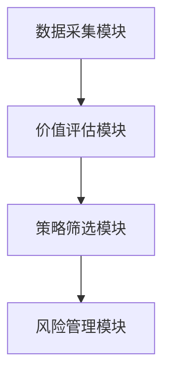
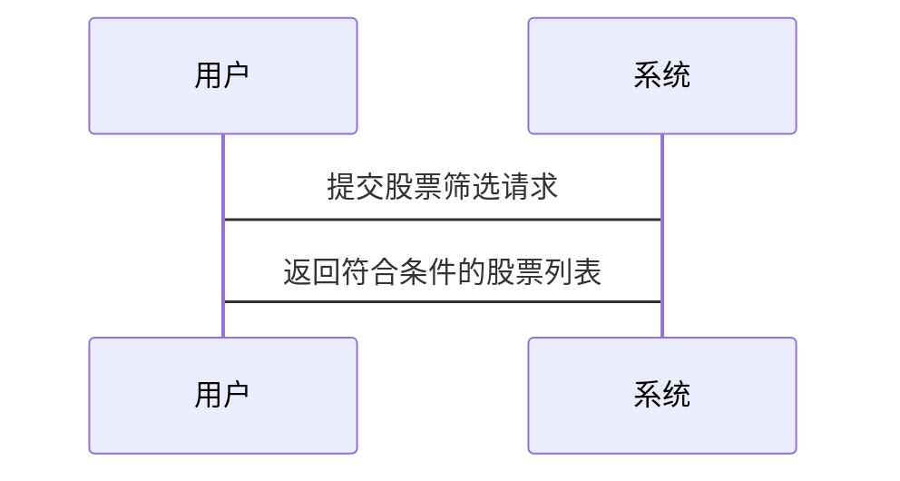

                 


# 格雷厄姆特价股票策略在不同市场微观结构下的效果

> 关键词：格雷厄姆策略，特价股票，市场微观结构，价值投资，算法原理

> 摘要：本文系统地探讨了格雷厄姆特价股票策略在不同市场微观结构下的表现与效果。通过分析市场参与者的多样性、流动性差异以及信息传播机制，本文揭示了格雷厄姆策略在不同市场环境中的适用性与优化方法。结合数学模型与实际案例，本文为投资者提供了深入的策略解析与实践指导。

---

# 第1章: 格雷厄姆特价股票策略的背景与核心概念

## 1.1 价值投资的起源与发展

### 1.1.1 价值投资的定义与核心理念
价值投资是一种以基本面分析为基础的投资策略，旨在通过识别市场低估的资产来实现长期收益。其核心理念包括：
- **安全边际**：购买价格低于内在价值，以降低投资风险。
- **长期视角**：关注企业的内在价值，而非短期价格波动。

### 1.1.2 格雷厄姆投资策略的形成与特点
本杰明·格雷厄姆是价值投资的鼻祖，他提出的核心策略包括：
1. **寻找廉价股票**：通过分析财务报表，寻找市场价格低于内在价值的股票。
2. **安全边际**：买入价格与内在价值的差距越大，投资的安全性越高。
3. **分散投资**：通过投资组合分散风险，避免单一股票的波动影响整体收益。

### 1.1.3 格雷厄姆策略在现代投资中的地位
尽管格雷厄姆的投资理念诞生于20世纪，但其核心思想在现代投资中仍然具有重要参考价值。特别是在市场波动加剧的环境下，格雷厄姆策略为投资者提供了稳健的投资框架。

---

## 1.2 特价股票的定义与特征

### 1.2.1 特价股票的定义
特价股票指的是市场价格显著低于其内在价值的股票。这种低估可能源于市场情绪、信息不对称或市场结构的特殊性。

### 1.2.2 特价股票的市场特征
- **低估值**：市盈率、市净率等指标显著低于行业平均水平。
- **流动性较低**：部分特价股票交易不活跃，市场深度有限。
- **风险偏好低**：适合风险承受能力较低的投资者。

### 1.2.3 特价股票与市场微观结构的关系
市场微观结构包括市场参与者的多样性、交易机制的复杂性以及信息传播的效率。这些因素直接影响特价股票的发现与交易。

---

## 1.3 市场微观结构的基本概念

### 1.3.1 市场微观结构的定义
市场微观结构是指市场的组织形式、交易机制和参与者行为的总和。它影响着市场的流动性、价格形成和交易成本。

### 1.3.2 市场微观结构的核心要素
- **市场参与者**：包括机构投资者、散户、做市商等。
- **交易机制**：如订单簿、撮合系统等。
- **信息传播**：信息如何在市场中扩散并影响价格。

### 1.3.3 市场微观结构对股票策略的影响
市场微观结构决定了特价股票的可及性和交易成本。例如，在高流动性的市场中，特价股票更容易被发现和交易；而在低流动性市场中，信息不对称可能加剧。

---

# 第2章: 格雷厄姆策略的核心原理

## 2.1 安全边际的概念与计算

### 2.1.1 安全边际的定义
安全边际是买入价格与内在价值之间的差额。它反映了投资的安全程度。

### 2.1.2 安全边际的计算方法
假设某股票的内在价值为$V$，购买价格为$P$，则安全边际为$V - P$。安全边际越高，投资风险越小。

### 2.1.3 安全边际与股票价值的关系
安全边际是价值投资的核心要素。投资者通过寻找安全边际高的股票，降低市场波动带来的风险。

---

## 2.2 内在价值的评估方法

### 2.2.1 内在价值的定义
内在价值是基于企业基本面分析得出的合理估值。它是股票的理论价值，而非市场价格。

### 2.2.2 内在价值的评估模型
常用模型包括：
- **股利折现模型（DDM）**：将未来股利折现，计算股票的合理价值。
- **市盈率法**：基于合理市盈率，计算股票的内在价值。

### 2.2.3 内在价值与市场价格的对比分析
通过对比内在价值与市场价格，投资者可以识别被低估的股票。当市场价格远低于内在价值时，股票具有投资价值。

---

## 2.3 格雷厄姆策略的实施步骤

### 2.3.1 确定投资目标
明确投资目标，如追求长期稳定收益。

### 2.3.2 选择低估股票
通过基本面分析，筛选内在价值高于市场价格的股票。

### 2.3.3 构建投资组合
分散投资，降低单一股票的风险。

---

# 第3章: 市场微观结构对格雷厄姆策略的影响

## 3.1 市场参与者的行为分析

### 3.1.1 投资者行为对股价的影响
不同类型的投资者行为会影响市场流动性与价格发现。例如，机构投资者可能推动股价短期波动，而散户则可能放大市场波动。

### 3.1.2 市场参与者的类型与特征
- **机构投资者**：资金规模大，交易策略多样。
- **散户**：交易行为受情绪影响较大。
- **做市商**：维持市场流动性，提供价格稳定性。

### 3.1.3 市场参与者对格雷厄姆策略的挑战
信息不对称与交易成本可能影响特价股票的发现与交易。

---

## 3.2 市场流动性与策略效果

### 3.2.1 流动性对股票价格的影响
流动性高的市场中，特价股票更容易被发现和交易。

### 3.2.2 不同市场流动性下的策略适用性
- **高流动性市场**：策略效果较好，交易成本低。
- **低流动性市场**：策略效果受限，交易成本高。

### 3.2.3 低流动性市场中的策略调整
在低流动性市场中，投资者需降低交易频率，避免交易成本侵蚀收益。

---

## 3.3 信息传播与市场反应

### 3.3.1 信息传播对市场的影响
信息传播的效率直接影响市场定价的准确性。快速的信息传播有助于发现特价股票。

### 3.3.2 不同市场信息传播机制下的策略优化
- **高效信息传播市场**：策略效果较好。
- **低效信息传播市场**：需通过基本面分析弥补信息劣势。

### 3.3.3 信息不对称对策略的影响
信息不对称可能导致特价股票被忽视，投资者需通过深入研究发现低估股票。

---

# 第4章: 格雷厄姆策略的数学模型与算法

## 4.1 内在价值评估的数学模型

### 4.1.1 股利折现模型（DDM）
$$ V = \frac{D}{k - g} $$
其中，$V$ 是内在价值，$D$ 是预期股利，$k$ 是折现率，$g$ 是股利增长率。

### 4.1.2 市盈率法
$$ V = P_{行业平均} \times \text{合理市盈率} $$

---

## 4.2 安全边际计算的算法

### 4.2.1 算法步骤
1. 计算股票的内在价值 $V$。
2. 确定买入价格 $P$。
3. 计算安全边际 $= V - P$。
4. 安全边际越高，投资风险越小。

### 4.2.2 算法优化
根据市场环境调整安全边际的计算方法，例如在低流动性市场中，适当提高安全边际要求。

---

## 4.3 市场微观结构的量化分析

### 4.3.1 市场流动性量化指标
- **成交量**：衡量市场流动性的重要指标。
- **买卖价差**：反映市场交易成本。

### 4.3.2 信息传播效率的量化
- **信息延迟**：信息传播的时间差。
- **信息扩散范围**：信息覆盖的市场参与者数量。

---

# 第5章: 格雷厄姆策略的系统架构与实现

## 5.1 系统功能设计

### 5.1.1 系统功能模块
- **数据采集模块**：收集股票的财务数据与市场数据。
- **价值评估模块**：计算股票的内在价值。
- **策略筛选模块**：筛选满足格雷厄姆策略条件的股票。
- **风险管理模块**：控制投资组合的风险。

### 5.1.2 系统架构图



---

## 5.2 系统接口设计

### 5.2.1 数据接口
- **数据来源**：股票数据接口。
- **数据格式**：结构化数据，便于分析处理。

### 5.2.2 策略接口
- **输入**：股票的基本面数据。
- **输出**：符合条件的股票列表。

---

## 5.3 系统交互流程

### 5.3.1 交互序列图



---

# 第6章: 格雷厄姆策略的项目实战

## 6.1 项目环境与工具安装

### 6.1.1 环境要求
- **操作系统**：Windows/Mac/Linux。
- **编程语言**：Python。
- **开发工具**：Jupyter Notebook。

### 6.1.2 数据获取工具
- **Yahoo Finance API**：获取股票数据。
- **Pandas**：数据处理库。

---

## 6.2 核心算法实现

### 6.2.1 代码实现

```python
import pandas as pd
import yfinance as yf

def calculate_intrinsic_value(stock_data):
    # 示例：基于股利折现模型计算内在价值
    dividend = stock_data['Dividends'].iloc[-1]
    growth_rate = 0.03
    discount_rate = 0.08
    intrinsic_value = dividend / (discount_rate - growth_rate)
    return intrinsic_value

# 获取股票数据
stock_ticker = 'AAPL'
data = yf.download(stock_ticker, start='2020-01-01', end='2023-12-31')
# 计算内在价值
iv = calculate_intrinsic_value(data)
print(f"苹果公司的内在价值：{iv}")
```

---

## 6.3 实际案例分析

### 6.3.1 案例选择
以A股市场为例，选择一只被低估的股票进行分析。

### 6.3.2 分析过程
1. 收集股票的基本面数据。
2. 计算内在价值。
3. 确定安全边际。
4. 生成投资建议。

### 6.3.3 案例结果
假设某股票的内在价值为10元，市场价格为8元，安全边际为2元，建议买入。

---

## 6.4 项目小结

### 6.4.1 项目总结
通过项目实战，验证了格雷厄姆策略的有效性，同时发现了在实际操作中需要注意的问题。

### 6.4.2 实践中的注意事项
- 定期复盘，调整投资组合。
- 关注市场环境的变化，及时优化策略。

---

# 第7章: 小结与展望

## 7.1 全文总结
本文系统地分析了格雷厄姆特价股票策略在不同市场微观结构下的表现，揭示了策略在实际应用中的优劣势。

## 7.2 投资策略的优化
根据市场环境的变化，动态调整投资策略，以提高策略的有效性。

## 7.3 未来展望
随着市场环境的变化，格雷厄姆策略将不断优化，为投资者提供更稳健的投资框架。

---

# 作者：AI天才研究院 & 禅与计算机程序设计艺术

---

通过本文的系统分析与实战指导，读者可以深入了解格雷厄姆策略的核心原理及其在不同市场环境下的表现。希望本文能为投资者提供有价值的参考，帮助他们在复杂多变的市场中实现稳健投资。

