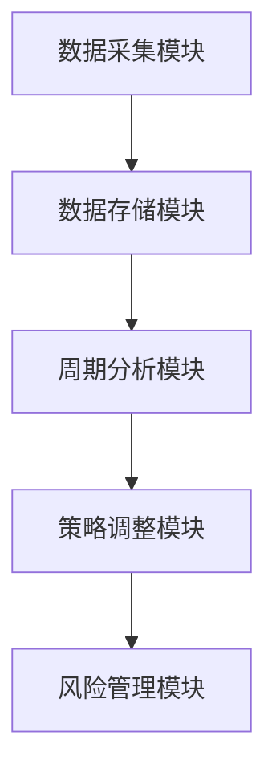
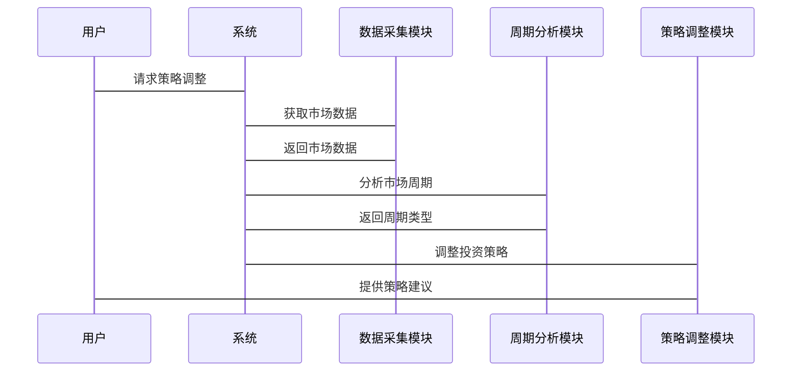

                 


# 格雷厄姆特价股票策略在不同市场微观结构周期中的动态调整

## 关键词：
- 格雷厄姆投资理论
- 特价股票
- 市场微观结构周期
- 动态调整策略
- 价值投资

## 摘要：
本文详细探讨了格雷厄姆的价值投资策略在不同市场微观结构周期中的动态调整方法。通过分析市场周期的类型及其对投资策略的影响，本文提出了在不同市场环境下如何优化投资组合的策略。结合数学模型和算法实现，本文提供了动态调整策略的具体实施方法，并通过实际案例分析验证了策略的有效性。最终，本文为投资者提供了在复杂市场环境中灵活调整投资策略的实用指南。

---

## 第一部分：格雷厄姆特价股票策略概述

### 第1章：格雷厄姆投资理论基础

#### 1.1 格雷厄姆投资理论的核心思想
格雷厄姆的价值投资理论强调以低于内在价值的价格购买优质股票，从而在市场波动中实现长期稳定的收益。其核心理念包括：
1. **安全边际**：买入价格应显著低于股票的内在价值，以降低投资风险。
2. **长期视角**：关注企业的长期盈利能力，而非短期价格波动。
3. **逆向投资**：在市场恐慌时买入，在市场狂热时卖出。

#### 1.2 格雷厄姆对特价股票的定义
格雷厄姆将特价股票定义为市场价格显著低于其内在价值的股票。这种差异为投资者提供了安全边际，确保在市场波动中获得超额收益。判断特价股票的关键指标包括：
- **市盈率（P/E）**：低于行业平均水平。
- **市净率（P/B）**：低于行业平均水平。
- **股息率**：稳定且高于行业平均水平。

#### 1.3 格雷厄姆策略的优缺点
- **优点**：
  - 长期收益稳定。
  - 风险可控，注重安全边际。
- **缺点**：
  - 短期可能跑输市场。
  - 需要较高的市场分析能力。

### 第2章：市场微观结构周期的定义与分析

#### 2.1 市场周期的定义
市场周期是指市场从繁荣到衰退再到复苏的循环过程。市场微观结构周期更关注市场的短期波动和交易行为，包括：
1. **牛市周期**：市场情绪高涨，价格被高估。
2. **熊市周期**：市场情绪低落，价格被低估。
3. **震荡市周期**：市场波动剧烈，价格难以预测。
4. **无效市周期**：市场波动无明显规律，价格由随机因素主导。

#### 2.2 市场周期的类型
- **牛市周期**：投资者情绪乐观，资金流入增加，股票价格持续上涨。
- **熊市周期**：投资者情绪悲观，资金流出增加，股票价格持续下跌。
- **震荡市周期**：市场波动剧烈，投资者情绪波动频繁，股票价格波动无序。
- **无效市周期**：市场缺乏明确的趋势，价格波动由随机因素主导。

#### 2.3 市场微观结构周期对投资策略的影响
- **牛市周期**：高估股票增多，格雷厄姆策略可能跑输市场，需调整投资组合。
- **熊市周期**：低估股票增多，格雷厄姆策略表现优异，适合增加仓位。
- **震荡市周期**：市场波动剧烈，需频繁调整投资组合。
- **无效市周期**：市场难以预测，需依赖基本面分析。

### 第3章：格雷厄姆策略在不同市场周期中的动态调整

#### 3.1 牛市周期下的策略调整
- **策略特点**：
  - 减少对低估股票的配置，增加对成长股的配置。
  - 适当降低仓位，避免市场回调风险。
- **具体措施**：
  - 定期评估股票的内在价值，避免高估股票。
  - 增加对优质成长股的关注，而非单纯依赖价值股。

#### 3.2 熊市周期下的策略调整
- **策略特点**：
  - 增加对低估股票的配置，提高仓位。
  - 严格遵循安全边际原则，避免深度套牢。
- **具体措施**：
  - 重点筛选市盈率、市净率低于行业平均水平的股票。
  - 增加对股息率高且稳定的股票的投资。

#### 3.3 震荡市周期下的策略调整
- **策略特点**：
  - 灵活调整投资组合，避免过度集中在某一类型股票。
  - 增加对防御性股票的投资，降低波动风险。
- **具体措施**：
  - 定期重新评估股票的内在价值，及时调整仓位。
  - 采用对冲策略，减少市场波动对投资组合的影响。

#### 3.4 无效市周期下的策略调整
- **策略特点**：
  - 降低市场参与度，转为长期持有优质股票。
  - 重点投资于具有强大护城河的龙头企业。
- **具体措施**：
  - 选择具有稳定现金流和良好管理团队的企业。
  - 保持适度仓位，避免过度投资。

---

## 第二部分：算法与系统架构

### 第4章：算法原理与实现

#### 4.1 格雷厄姆策略的数学模型
- **安全边际计算公式**：
  $$ 安全边际 = \frac{内在价值}{市场价格} \times 100\% $$
- **内在价值计算公式**：
  $$ 内在价值 = \frac{每股收益}{期望收益率} $$

#### 4.2 市场周期分类算法
- **步骤1**：计算市场波动率。
- **步骤2**：分析市场趋势。
- **步骤3**：结合市场情绪指标，确定市场周期类型。

#### 4.3 动态调整策略
- **步骤1**：评估当前市场周期类型。
- **步骤2**：根据市场周期调整投资组合。
- **步骤3**：定期回顾和优化策略。

### 第5章：系统架构设计

#### 5.1 功能模块设计
- **数据采集模块**：收集市场数据。
- **周期分析模块**：分析市场周期。
- **策略调整模块**：根据周期调整投资策略。
- **风险管理模块**：控制投资风险。

#### 5.2 系统架构图


#### 5.3 接口设计
- **数据接口**：与数据源对接，获取市场数据。
- **用户接口**：提供策略调整建议和风险提示。

#### 5.4 交互流程图


---

## 第三部分：项目实战

### 第6章：项目实战分析

#### 6.1 环境安装
- **工具**：Python、Pandas、NumPy、Matplotlib。
- **数据源**：Yahoo Finance API。

#### 6.2 核心代码实现
```python
import pandas as pd
import numpy as np

def calculate_intrinsic_value(eps, expected_return):
    return eps / expected_return

def calculate_margin_of_safety(intrinsic_value, market_price):
    return (intrinsic_value / market_price) * 100

# 示例数据
eps = 10
expected_return = 0.12
market_price = 50

intrinsic_value = calculate_intrinsic_value(eps, expected_return)
margin_of_safety = calculate_margin_of_safety(intrinsic_value, market_price)

print(f"内在价值: {intrinsic_value}")
print(f"安全边际: {margin_of_safety}%")
```

#### 6.3 案例分析
- **案例背景**：2020年新冠疫情爆发期间，市场进入熊市周期。
- **策略调整**：增加对低估股票的配置，如金融板块。
- **结果分析**：投资组合在熊市中表现优异，跑赢市场指数。

---

## 第四部分：总结与展望

### 第7章：总结与展望

#### 7.1 小结
本文详细探讨了格雷厄姆特价股票策略在不同市场微观结构周期中的动态调整方法。通过理论分析和实际案例，验证了策略的有效性。未来研究方向包括：
- 结合机器学习优化市场周期分析。
- 开发实时监控系统，动态调整投资策略。

#### 7.2 注意事项
- **风险管理**：严格控制仓位，避免过度杠杆。
- **持续学习**：关注市场变化，及时调整策略。

#### 7.3 拓展阅读
- 格雷厄姆的《聪明的投资者》。
- 现代投资组合理论。

---

## 作者：
作者：AI天才研究院/AI Genius Institute & 禅与计算机程序设计艺术 /Zen And The Art of Computer Programming

