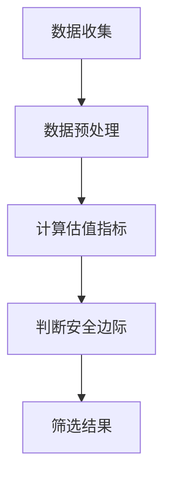
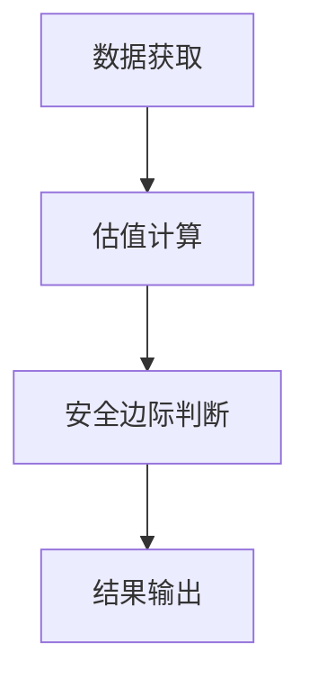

                 


# 格雷厄姆特价股票策略在不同市场效率下的表现

## 关键词：格雷厄姆、特价股票、市场效率、价值投资、安全边际

## 摘要：本文深入分析格雷厄姆特价股票策略在不同市场效率下的表现。通过探讨策略的核心原理、数学模型及系统架构，结合实际案例，揭示策略在有效市场、弱有效市场及无效市场中的适用性和效果。本文旨在为投资者提供理论支持和实践指导。

---

## 第一部分：格雷厄姆特价股票策略的背景与基础

### 第1章：格雷厄姆特价股票策略概述

#### 1.1 格雷厄姆投资理论的起源与发展

- **1.1.1 价值投资的起源**  
  价值投资起源于20世纪初，本杰明·格雷厄姆是该领域的先驱。他通过分析企业的基本面，寻找市场价格低于内在价值的股票。

- **1.1.2 格雷厄姆的投资理念**  
  格雷厄姆强调安全边际和内在价值。他认为，投资者应购买那些市场价格远低于其内在价值的股票，以降低风险并确保收益。

- **1.1.3 特价股票的定义与特征**  
  特价股票是指市场价格显著低于其内在价值的股票。其特征包括低市盈率、低市净率和高股息率。

#### 1.2 市场效率的分类与影响

- **1.2.1 市场效率的定义**  
  市场效率指市场反映信息的能力。有效市场假说认为，价格反映了所有公开信息，因此很难找到被低估的股票。

- **1.2.2 市场效率的分类**  
  - **有效市场（EMH）**：价格反映所有信息，难以找到低估股票。  
  - **弱有效市场**：价格反映历史信息，但存在未反映的未来信息，可能存在低估股票。  
  - **无效市场**：价格未充分反映信息，存在较多低估股票。

- **1.2.3 市场效率对策略的影响**  
  在高效市场中，格雷厄姆策略效果有限；在低效市场中，策略表现较好。

#### 1.3 格雷厄姆策略的核心框架

- **1.3.1 安全边际的概念**  
  安全边际是内在价值与市场价格的差额，用于衡量投资的安全程度。

- **1.3.2 价值评估的基本方法**  
  格雷厄姆使用市盈率、市净率等指标评估股票的内在价值。

- **1.3.3 策略的适用场景与边界**  
  策略适用于低效市场，但在高效市场中可能失效。

---

## 第二部分：格雷厄姆策略的核心概念与原理

### 第2章：格雷厄姆策略的核心要素

#### 2.1 安全边际的数学模型

- **2.1.1 安全边际的计算公式**  
  $$ SM = V - P $$
  其中，\( V \) 为内在价值，\( P \) 为市场价格。

- **2.1.2 内在价值的评估方法**  
  $$ V = \frac{E}{P} $$
  其中，\( E \) 为每股收益，\( P \) 为市盈率。

- **2.1.3 市场价格与内在价值的对比**  
  安全边际越大，投资风险越小。

#### 2.2 价值评估模型的对比分析

- **2.2.1 市盈率、市净率与股息率的对比**  
  | 指标 | 定义 | 适用场景 |
  |------|------|-----------|
  | 市盈率 | \( P/E = \frac{P}{E} \) | 评估成长型企业 |
  | 市净率 | \( P/B = \frac{P}{B} \) | 评估价值型企业 |
  | 股息率 | \( Dividend Yield = \frac{D}{P} \) | 评估收益稳定性 |

- **2.2.2 不同估值指标的适用场景**  
  市盈率适用于成长型企业，市净率适用于价值型企业，股息率适用于收益稳定的蓝筹股。

- **2.2.3 格雷厄姆特色估值方法的独特性**  
  格雷厄姆强调安全边际，注重低市盈率和低市净率的股票。

#### 2.3 市场效率对策略的影响

- **2.3.1 有效市场下的策略失效**  
  在有效市场中，价格反映所有信息，难以找到低估股票。

- **2.3.2 弱有效市场中的策略机会**  
  在弱有效市场中，存在未被发现的低估股票，策略表现较好。

- **2.3.3 无效市场中的策略优势**  
  在无效市场中，信息不对称，策略表现最佳。

---

## 第三部分：格雷厄姆策略的算法原理与数学模型

### 第3章：格雷厄姆特价股票筛选算法

#### 3.1 策略筛选流程

1. **数据收集**：从数据源获取股票的基本面数据，包括市盈率、市净率、股息率等。
2. **数据预处理**：清洗数据，处理缺失值和异常值。
3. **计算估值指标**：使用格雷厄姆模型计算内在价值和安全边际。
4. **判断安全边际**：筛选出安全边际为正的股票。
5. **生成结果报告**：输出筛选结果。

#### 3.2 算法流程图



#### 3.3 数学模型与公式

- **内在价值计算公式**  
  $$ V = \frac{E}{P} $$
  
- **安全边际计算公式**  
  $$ SM = V - P $$
  
- **市场价格与内在价值的对比**  
  $$ P_{adjusted} = P \times (1 - \text{市场效率}) $$

---

## 第四部分：系统架构与实现

### 第4章：系统架构设计

#### 4.1 系统功能设计

- **数据获取模块**：从数据库或API获取股票数据。
- **估值计算模块**：计算市盈率、市净率等指标。
- **安全边际判断模块**：比较市场价格与内在价值。
- **结果输出模块**：生成筛选结果报告。

#### 4.2 系统架构图



#### 4.3 接口设计

- **数据接口**：定义数据获取的API。
- **估值接口**：定义计算估值的函数。
- **输出接口**：定义结果报告的生成方式。

---

## 第五部分：项目实战与分析

### 第5章：项目实战分析

#### 5.1 环境安装

- **安装Python、Pandas、Numpy等库**  
  ```bash
  pip install pandas numpy
  ```

- **数据源获取**  
  从金融数据提供商获取股票数据，例如Yahoo Finance。

#### 5.2 核心代码实现

```python
import pandas as pd
import numpy as np

def calculate_intrinsic_value(eps, pe):
    return eps / pe

def calculate_margin_of_safety(current_price, intrinsic_value):
    return intrinsic_value - current_price

# 读取数据
data = pd.read_csv('stocks.csv')

# 计算内在价值和安全边际
data['Intrinsic Value'] = calculate_intrinsic_value(data['EPS'], data['PE'])
data['Margin of Safety'] = calculate_margin_of_safety(data['Price'], data['Intrinsic Value'])

# 筛选结果
data = data[data['Margin of Safety'] > 0]
```

#### 5.3 实际案例分析

- **案例分析**  
  以某只股票为例，展示计算过程和结果，讨论在不同市场效率下的策略表现。

---

## 第六部分：总结与展望

### 第6章：总结与展望

#### 6.1 总结

- 格雷厄姆策略的核心是寻找被低估的股票，其表现受市场效率影响。
- 在低效市场中，策略效果较好；在高效市场中，策略效果有限。

#### 6.2 投资建议

- 根据市场效率选择合适的投资策略。
- 结合其他策略进行互补投资。

#### 6.3 未来研究方向

- 研究市场效率变化对策略的影响。
- 结合机器学习优化价值评估模型。

---

## 附录

### 参考文献

- 格雷厄姆，本杰明. 《证券分析》
- 艾因霍恩，彼得. 《价值投资》
- Fama, Eugene. 《The Theory of Market Efficiency》

### 代码示例

```python
import pandas as pd
import numpy as np

def calculate_intrinsic_value(eps, pe):
    return eps / pe

def calculate_margin_of_safety(current_price, intrinsic_value):
    return intrinsic_value - current_price

# 读取数据
data = pd.read_csv('stocks.csv')

# 计算内在价值和安全边际
data['Intrinsic Value'] = calculate_intrinsic_value(data['EPS'], data['PE'])
data['Margin of Safety'] = calculate_margin_of_safety(data['Price'], data['Intrinsic Value'])

# 筛选结果
data = data[data['Margin of Safety'] > 0]

# 输出结果
print(data.head())
```

---

作者：AI天才研究院/AI Genius Institute & 禅与计算机程序设计艺术 /Zen And The Art of Computer Programming

---

