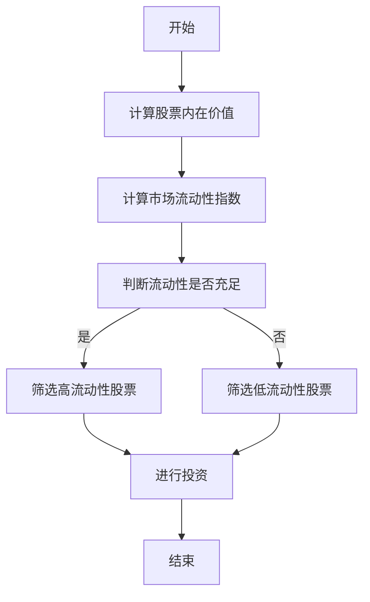

                 


# 格雷厄姆特价股票策略在不同市场流动性条件下的应用

> 关键词：格雷厄姆策略、特价股票、市场流动性、投资策略、价值投资

> 摘要：本文详细探讨了格雷厄姆特价股票策略在不同市场流动性条件下的应用，分析了流动性对策略实施的影响，并提出了优化策略的建议。通过数学模型和算法流程图，展示了如何根据市场流动性调整投资策略，确保在不同市场环境下实现最大收益。

---

# 第一部分: 格雷厄姆特价股票策略概述

## 第1章: 格雷厄姆投资理念的核心思想

### 1.1 价值投资的基本概念

- **价值投资**：寻找市场价格低于其内在价值的股票进行投资。
- **安全边际**：买入价格低于内在价值，确保投资的安全性。
- **特价股票**：市场价格远低于其内在价值的股票，具有较高的投资潜力。

### 1.2 市场流动性对股票价格的影响

- **市场流动性**：指在不显著影响价格的情况下，交易资产的数量。
- **流动性不足**：买卖价差大，交易成本高，价格波动剧烈。
- **流动性过剩**：买卖价差小，交易成本低，价格稳定。

### 1.3 格雷厄姆策略与市场流动性的结合

- **高流动性市场**：交易活跃，价格反映真实价值，适合长期投资。
- **低流动性市场**：价格波动大，存在套利机会，适合短期操作。
- **策略优化**：根据市场流动性调整筛选条件，优化投资组合。

---

## 第2章: 核心概念与联系

### 2.1 核心概念原理

- **格雷厄姆策略公式**：
  - 内在价值 = 股票的未来现金流的现值。
  - 计算公式：$$V = \sum_{t=1}^{n} \frac{CF_t}{(1 + r)^t}$$
    - \( V \)：内在价值。
    - \( CF_t \)：第t年的现金流。
    - \( r \)：折现率。
- **流动性影响因子**：流动性不足时，调整折现率，增加风险溢价。

### 2.2 核心概念属性对比表格

| 特性         | 高流动性市场         | 低流动性市场         |
|--------------|----------------------|----------------------|
| 买卖价差      | 小                   | 大                   |
| 交易成本      | 低                   | 高                   |
| 价格波动      | 稳定                 | 剧烈                 |
| 投资策略      | 长期持有             | 短期套利             |

### 2.3 ER实体关系图架构

```mermaid
erd
actor Investor
actor Market
actor Broker
entity Stock
entity Price
entity Liquidity
entity Transaction
```

---

## 第3章: 格雷厄姆特价股票策略的算法原理

### 3.1 算法原理概述

- **策略筛选条件**：
  - 市净率低于行业平均水平。
  - 市盈率低于行业平均水平。
  - 股东权益高于负债。
- **流动性因子的引入**：
  - 通过买卖价差和交易量计算流动性指数。
  - 根据流动性指数调整股票筛选标准。

### 3.2 算法流程图



---

# 第二部分: 数学模型与公式推导

## 第4章: 数学模型与公式

### 4.1 格雷厄姆策略的数学模型

- **内在价值计算公式**：
  $$V = \frac{E}{1 + g} + \frac{D}{1 + g}$$
  - \( E \)：企业未来现金流。
  - \( g \)：现金流增长率。
  - \( D \)：债务。

### 4.2 流动性影响的数学模型

- **流动性指数公式**：
  $$LI = \frac{V_a - V_b}{V_b} \times 100\%$$
  - \( V_a \)：买价。
  - \( V_b \)：卖价。

---

# 第三部分: 系统分析与架构设计

## 第5章: 系统分析与架构设计

### 5.1 问题场景介绍

- **目标**：优化格雷厄姆策略，使其适应不同流动性条件。
- **关键问题**：如何动态调整策略参数以应对市场变化。

### 5.2 系统功能设计

- **领域模型类图**：
  ```mermaid
  classDiagram
  class Investor
  class Market
  class Broker
  class Stock
  class Price
  class Liquidity
  class Transaction
  ```

---

## 第6章: 项目实战

### 6.1 环境安装

- **工具**：Python、Jupyter Notebook、pandas、numpy。

### 6.2 核心代码实现

```python
import pandas as pd
import numpy as np

def calculate_intrinsic_value(enterprise_value, growth_rate):
    return enterprise_value / (1 + growth_rate)

def calculate_liquidity_index(ask_price, bid_price):
    return (ask_price - bid_price) / bid_price * 100

# 示例数据
data = {
    'enterprise_value': [100, 200, 300],
    'growth_rate': [0.05, 0.03, 0.02],
    'ask_price': [10, 20, 30],
    'bid_price': [9, 18, 27]
}

df = pd.DataFrame(data)

# 计算内在价值
df['intrinsic_value'] = df.apply(lambda x: calculate_intrinsic_value(x['enterprise_value'], x['growth_rate']), axis=1)

# 计算流动性指数
df['liq_index'] = df.apply(lambda x: calculate_liquidity_index(x['ask_price'], x['bid_price']), axis=1)

print(df)
```

### 6.3 案例分析

- **案例1**：高流动性市场中，筛选出内在价值高于市场价格的股票。
- **案例2**：低流动性市场中，寻找买卖价差大的股票进行套利。

---

## 第7章: 最佳实践与总结

### 7.1 最佳实践 tips

- 定期评估市场流动性，动态调整策略。
- 结合技术分析，优化投资决策。

### 7.2 小结

本文详细探讨了格雷厄姆策略在不同流动性条件下的应用，通过数学模型和算法流程图，展示了如何优化策略以适应市场变化。

### 7.3 注意事项

- 风险控制是关键，避免过度杠杆。
- 定期复盘，评估策略的有效性。

### 7.4 拓展阅读

- 《格雷厄姆投资经典》。
- 《流动性风险与投资策略》。

---

# 作者

作者：AI天才研究院/AI Genius Institute & 禅与计算机程序设计艺术 /Zen And The Art of Computer Programming

