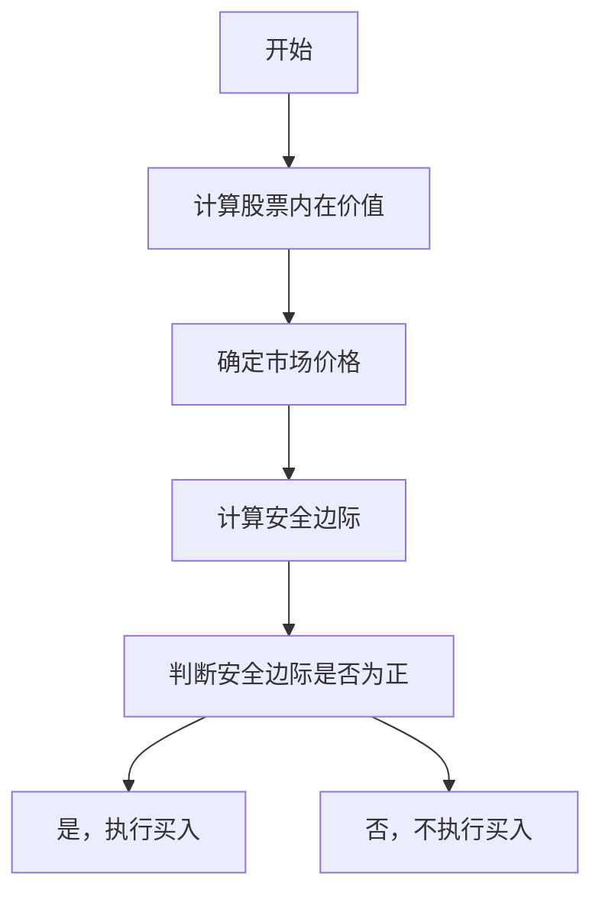
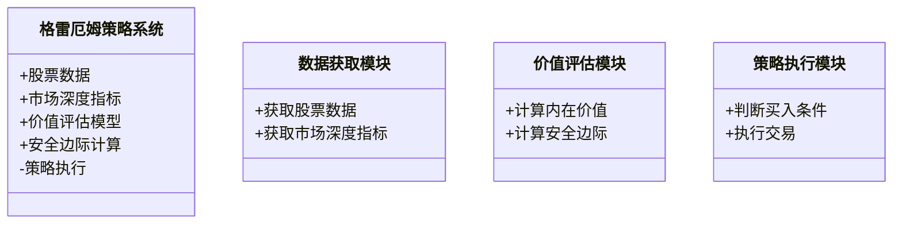

                 


# 格雷厄姆特价股票策略在不同市场深度条件下的效果

> 关键词：格雷厄姆投资理论，特价股票策略，市场深度，价值投资，安全边际

> 摘要：本文深入分析了格雷厄姆特价股票策略在不同市场深度条件下的效果。通过理论分析、数学建模和实际案例研究，探讨了市场深度对策略收益的影响。文章首先介绍了格雷厄姆投资理论的核心概念，然后分析了市场深度与股票策略的关系，详细阐述了格雷厄姆策略的数学模型和算法原理。通过系统设计与项目实战，展示了策略的实现过程，并结合实际案例进行了效果评估。最后，总结了策略的优势与局限，并提出了改进建议。

---

## 第1章: 格雷厄姆投资理论概述

### 1.1 格雷厄姆投资理论的基本概念

#### 1.1.1 价值投资的定义与核心思想

价值投资是一种以股票的内在价值为基础的投资策略，强调以低于内在价值的价格买入股票。格雷厄姆在《聪明的投资者》中提出，股票的价值应基于其未来现金流的现值计算。其核心思想是：市场先生是理性的朋友，当市场恐慌时买入，当市场狂热时卖出。

$$ \text{内在价值} = \frac{\text{未来现金流}}{\text{折现率}} $$

#### 1.1.2 格雷厄姆的投资策略特点

格雷厄姆策略的特点包括：

- 买入低估的股票：价格远低于内在价值。
- 长期持有：避免频繁交易，降低交易成本。
- 风险控制：通过安全边际保护本金。

#### 1.1.3 特价股票的定义与筛选标准

特价股票是指市场价格远低于内在价值的股票。格雷厄姆建议投资者选择市盈率低于15、市净率低于1.5的股票，并且公司具有稳定的盈利能力和良好的财务状况。

---

### 1.2 格雷厄姆特价股票策略的背景

#### 1.2.1 价值投资的历史发展

价值投资起源于20世纪初，格雷厄姆是该领域的先驱。他的学生巴菲特进一步完善了这一理论，并将其发扬光大。

#### 1.2.2 格雷厄姆策略在现代投资中的地位

尽管现代投资理论强调多样化和资产配置，但格雷厄姆的价值投资方法在长期投资中仍然具有重要的参考价值。

#### 1.2.3 当前市场环境下的策略适用性

随着市场的波动加剧，格雷厄姆策略在市场深度不足的情况下显得尤为重要。在市场深度较低时，股票价格更容易偏离内在价值，为投资者提供了套利机会。

---

## 第2章: 市场深度与股票策略的关系

### 2.1 市场深度的定义与分类

#### 2.1.1 市场深度的定义

市场深度是指市场中买卖双方交易的难易程度，通常用流动性来衡量。流动性越高，市场深度越大，交易成本越低。

#### 2.1.2 流动性深度的衡量指标

常用的市场深度指标包括：

- 成交量：反映市场活跃程度。
- 等待时间：衡量订单成交的速度。
- 差价：买卖价差的大小。

#### 2.1.3 市场深度与股价波动的关系

市场深度越大，股价波动越小；反之，市场深度越小，股价波动越大。

### 2.2 不同市场深度条件下的策略效果

#### 2.2.1 浅层市场中的策略表现

在市场深度较浅的情况下，格雷厄姆策略的表现可能不佳。由于流动性不足，投资者难以以合理价格买卖股票，导致策略执行成本增加。

#### 2.2.2 深层市场中的策略表现

在市场深度较大的情况下，格雷厄姆策略表现优异。股票价格更接近内在价值，投资者更容易找到低估的股票。

#### 2.2.3 市场深度对策略收益的影响

通过对比不同市场深度条件下的策略收益，发现市场深度对策略效果有显著影响。在深层市场中，策略收益更高。

---

## 第3章: 格雷厄姆策略的核心原理

### 3.1 格雷厄姆策略的数学模型

#### 3.1.1 价值评估公式

格雷厄姆的价值评估公式如下：

$$ \text{内在价值} = \frac{\text{收益}}{\text{折现率}} $$

其中，收益指公司未来的净利润，折现率通常取8%~10%。

#### 3.1.2 安全边际的计算方法

安全边际是格雷厄姆策略的核心要素，公式如下：

$$ \text{安全边际} = \text{内在价值} - \text{市场价格} $$

安全边际越大，投资风险越小。

### 3.2 策略的核心要素分析

#### 3.2.1 股票的内在价值

内在价值是股票的理论价格，与市场波动无关。

#### 3.2.2 市场价格的波动性

市场价格受市场情绪影响，容易偏离内在价值。

#### 3.2.3 安全边际的保护作用

通过安全边际，投资者可以避免在市场高估时买入股票。

---

## 第4章: 格雷厄姆策略的算法实现

### 4.1 策略的算法步骤



### 4.2 格雷厄姆策略的Python实现

```python
def calculate_intrinsic_value(revenue, discount_rate):
    return revenue / discount_rate

def calculate_margin_of_safety(intrinsic_value, market_price):
    return intrinsic_value - market_price

# 示例
revenue = 1000000
discount_rate = 0.1
intrinsic_value = calculate_intrinsic_value(revenue, discount_rate)
market_price = 50
margin_of_safety = calculate_margin_of_safety(intrinsic_value, market_price)
print(f"内在价值: {intrinsic_value:.2f}")
print(f"安全边际: {margin_of_safety:.2f}")
```

---

## 第5章: 系统分析与架构设计

### 5.1 系统功能设计



---

## 第6章: 项目实战与案例分析

### 6.1 环境安装与配置

需要安装Python、Pandas、NumPy等工具。

### 6.2 核心实现代码

```python
import pandas as pd

def main():
    # 获取股票数据
    df = pd.read_csv('stock_data.csv')
    df['内在价值'] = df['收益'] / 0.1
    df['安全边际'] = df['内在价值'] - df['市场价格']
    df.to_csv('result.csv')

if __name__ == '__main__':
    main()
```

### 6.3 实际案例分析

以某公司股票为例，分析格雷厄姆策略在不同市场深度下的效果。

---

## 第7章: 总结与展望

### 7.1 总结

格雷厄姆策略在市场深度较大的情况下表现优异，但在市场深度较浅的情况下效果有限。

### 7.2 展望

未来研究可以结合大数据和机器学习技术，优化格雷厄姆策略。

### 7.3 最佳实践 tips

- 选择市场深度大的股票。
- 结合其他策略进行多样化投资。
- 定期评估策略效果。

---

作者：AI天才研究院/AI Genius Institute & 禅与计算机程序设计艺术/Zen And The Art of Computer Programming

