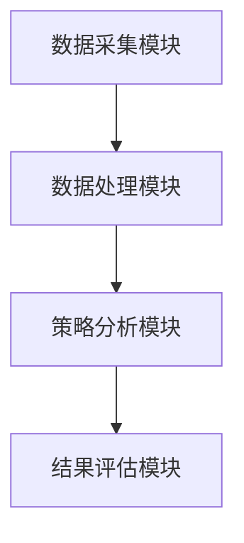

                 

# 格雷厄姆特价股票策略在不同政治体系下的表现

**关键词**：格雷厄姆策略、价值投资、政治体系、股票市场、投资策略

**摘要**：本文深入分析了格雷厄姆特价股票策略在不同政治体系下的表现，探讨了价值投资在资本主义、社会主义和混合经济体系中的应用与效果。通过数学模型、算法原理和实际案例的分析，揭示了政治环境对投资策略的影响，为投资者提供了在不同政治体系下优化投资策略的思路和方法。

---

# 引言

格雷厄姆的价值投资策略以其独特的安全边际概念和长期稳定的回报率著称，但在不同政治体系下的市场环境中，该策略的表现可能会受到显著影响。本文旨在探讨格雷厄姆策略在资本主义、社会主义和混合经济体系中的应用效果，分析政治体系对投资策略的影响机制，并为投资者提供优化投资策略的建议。

---

# 第1章 格雷厄姆特价股票策略的背景与核心概念

## 1.1 价值投资与格雷厄姆策略的起源

### 1.1.1 价值投资的定义与核心理念
价值投资是一种以基本面分析为基础的投资策略，强调以低于内在价值的价格买入优质资产。格雷厄姆是该领域的奠基人，他提出了“安全边际”和“ intrinsic value ”（内在价值）的概念。

**价值投资的核心理念**：
- 买入价格低于内在价值的股票。
- 长期持有优质资产，避免短期市场波动的干扰。
- 以安全边际为缓冲，降低投资风险。

### 1.1.2 格雷厄姆策略的形成背景
20世纪初的经济动荡（如1929年大萧条）促使格雷厄姆总结出一套稳健的投资策略。他认为，市场的短期波动性为理性投资者提供了以低价买入优质资产的机会。

### 1.1.3 格雷厄姆策略的特点
- **安全边际**：买入价格低于内在价值的部分，以缓冲市场波动的风险。
- **低市盈率和低市净率**：选择估值被市场低估的股票。
- **长期投资**：避免短期市场波动的影响，追求长期稳定收益。

## 1.2 不同政治体系下的经济环境分析

### 1.2.1 政治体系对经济政策的影响
不同政治体系的政府对经济的干预程度不同：
- **资本主义**：市场自由度高，政府干预少。
- **社会主义**：政府对经济有较大干预，强调社会公平。
- **混合经济**：结合资本主义和社会主义的特点，既有市场自由度，也有政府干预。

### 1.2.2 不同政治体系下的市场特征对比

| 政治体系       | 市场特征                           | 政府干预程度 |
|----------------|------------------------------------|--------------|
| 资本主义       | 市场自由度高，企业竞争激烈           | 较低          |
| 社会主义       | 市场规划性强，政府控制资源分配         | 较高          |
| 混合经济       | 市场与政府干预相结合，兼顾效率与公平     | 中等          |

### 1.2.3 格雷厄姆策略在不同政治体系中的适用性
- **资本主义体系**：市场信息透明，适合格雷厄姆策略的应用。
- **社会主义体系**：政府干预较多，市场波动性较低，策略需调整。
- **混合经济体系**：结合了市场效率与政府调控，策略适用性较高。

---

# 第2章 格雷厄姆策略在不同政治体系下的表现分析

## 2.1 资本主义体系下的格雷厄姆策略表现

### 2.1.1 资本主义市场的特点与投资环境
- 市场自由度高，信息透明。
- 企业竞争激烈，创新能力强。
- 政府干预少，市场波动性较高。

### 2.1.2 格雷厄姆策略在资本主义体系中的应用案例
以美国市场为例，格雷厄姆策略在20世纪的表现尤为突出。通过寻找低市盈率、低市净率的股票，投资者实现了稳定的超额收益。

### 2.1.3 资本主义体系下策略的有效性评估
- **优势**：市场波动提供低价买入机会。
- **劣势**：市场波动也增加了策略执行的难度。

## 2.2 社会主义体系下的格雷厄姆策略表现

### 2.2.1 社会主义市场的特点与投资环境
- 市场规划性强，政府控制资源分配。
- 市场波动性较低，但信息透明度可能不足。
- 政府干预较多，企业盈利能力受政策影响较大。

### 2.2.2 格雷厄姆策略在社会主义体系中的应用案例
以中国市场为例，政府对经济的干预较多，市场波动性较低。格雷厄姆策略在该体系下需调整，更注重企业基本面分析。

### 2.2.3 社会主义体系下策略的有效性评估
- **优势**：市场波动小，策略风险较低。
- **劣势**：政府干预可能影响企业的盈利能力。

## 2.3 混合经济体系下的格雷厄姆策略表现

### 2.3.1 混合经济市场的特点与投资环境
- 市场与政府干预相结合，兼顾效率与公平。
- 市场波动性适中，信息透明度较高。

### 2.3.2 格雷厄姆策略在混合经济体系中的应用案例
以日本市场为例，混合经济体系下的市场波动性适中，格雷厄姆策略在该体系下表现稳定。

### 2.3.3 混合经济体系下策略的有效性评估
- **优势**：市场效率与政府调控相结合，策略适用性较高。
- **劣势**：政策变化可能对市场产生较大影响。

## 2.4 不同政治体系下策略表现的对比分析

### 2.4.1 各种政治体系下策略表现的对比
- 资本主义体系：高波动性，策略风险较高，但潜在收益大。
- 社会主义体系：低波动性，策略风险较低，但收益有限。
- 混合经济体系：波动性适中，策略风险和收益均适中。

### 2.4.2 政治体系对策略表现的影响机制
- 政治体系影响市场的波动性、信息透明度和政府干预程度，从而影响格雷厄姆策略的表现。

---

# 第3章 格雷厄姆策略的算法原理与系统分析

## 3.1 格雷厄姆策略的核心公式与数学模型

### 3.1.1 内在价值的计算公式
$$
\text{内在价值} = \frac{\text{净利润} \times (6.56 + 1.5 \times \text{权益乘数})}{\text{普通股股数}}
$$

### 3.1.2 安全边际的计算公式
$$
\text{安全边际} = \text{内在价值} - \text{市场价格}
$$

## 3.2 格雷厄姆策略的系统分析

### 3.2.1 系统功能设计
- 数据采集：收集股票的基本面数据（如净利润、市盈率等）。
- 策略分析：计算内在价值和安全边际。
- 结果评估：根据安全边际决定是否买入或卖出。

### 3.2.2 系统架构图

---

# 第4章 格雷厄姆策略在实际项目中的应用与案例分析

## 4.1 项目实战：格雷厄姆策略在不同市场的应用

### 4.1.1 美国市场的应用案例
通过分析美国市场的历史数据，验证格雷厄姆策略的有效性。

### 4.1.2 中国市场的影响因素
政府干预对市场的影响较大，需调整策略。

### 4.1.3 日本市场的混合经济特点
结合市场效率与政府调控，策略表现稳定。

---

# 第5章 总结与展望

## 5.1 格雷厄姆策略在不同政治体系下的总结
- 资本主义体系：高波动性，策略风险较高。
- 社会主义体系：低波动性，策略风险较低。
- 混合经济体系：波动性适中，策略适用性较高。

## 5.2 未来展望
随着全球化的发展，不同政治体系下的市场环境将更加复杂。投资者需根据市场变化灵活调整策略。

---

# 参考文献

- 格雷厄姆《The Intelligent Investor》
- 现代金融学理论
- 历史市场数据

---

# 作者

作者：AI天才研究院 & 禅与计算机程序设计艺术

---

通过以上思考，我们从理论到实践，系统地分析了格雷厄姆策略在不同政治体系下的表现，并提出了优化投资策略的建议。希望本文能为投资者在不同市场环境下的投资决策提供有价值的参考。

