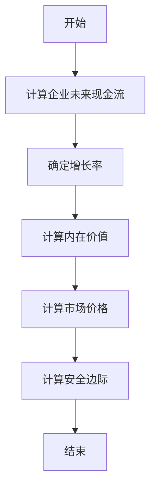
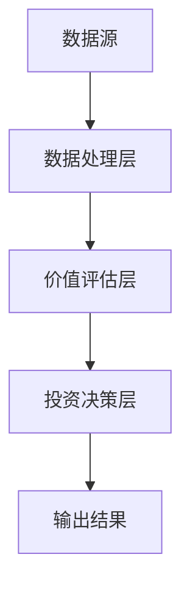

                 


# 格雷厄姆特价股票策略在不同数字企业文化演化路径的适应

> 关键词：格雷厄姆投资理论，数字企业文化，价值投资，股票策略，企业文化演化

> 摘要：本文探讨了格雷厄姆的价值投资策略在不同数字企业文化中的适应性。通过分析数字企业的特点和演化路径，本文提出了如何在数字环境中优化和应用格雷厄姆策略的方法，结合算法和数学模型，详细阐述了策略的适应性和实现路径。

---

## 第1章: 格雷厄姆特价股票策略的核心理念

### 1.1 格雷厄姆投资理论的起源与核心思想

#### 1.1.1 投资的本质与核心原则

投资的本质是通过购买资产，在未来获得超过初始投入的收益。格雷厄姆的价值投资理论强调，股票不仅仅是价格的波动，而是企业的一部分。他提出的核心原则包括：

1. **安全边际**：买入价格低于内在价值，以确保投资的安全性。
2. **内在价值**：通过分析企业的财务状况和未来现金流，计算其真实价值。
3. **长期视角**：投资不是短期交易，而是长期持有的过程。

#### 1.1.2 格雷厄姆的价值投资方法

格雷厄姆的价值投资方法强调对企业的深入分析，寻找被市场低估的投资标的。其核心步骤包括：

1. **分析财务报表**：通过分析企业的收入、利润、负债等财务数据，评估其财务健康状况。
2. **计算内在价值**：基于企业的未来现金流，使用数学模型计算其内在价值。
3. **确定安全边际**：比较市场价格与内在价值，确保买入价格具有足够的安全边际。

#### 1.1.3 格雷厄姆策略在现代投资中的应用

尽管格雷厄姆的投资理论提出于20世纪，但其核心思想在现代投资中依然具有重要价值。特别是在当前数字化环境下，格雷厄姆策略可以通过数据驱动的方法进一步优化。

---

## 第2章: 数字企业文化的定义与特征

### 2.1 数字企业的概念与类型

#### 2.1.1 数字企业的定义

数字企业是指依靠数字技术进行业务运营和创新的企业。与传统企业相比，数字企业更依赖数据和技术，具有更强的灵活性和创新能力。

#### 2.1.2 数字企业的主要类型

数字企业可以分为以下几类：

1. **互联网企业**：如搜索引擎、社交媒体平台等。
2. **电子商务企业**：如在线零售商、B2B平台等。
3. **软件即服务（SaaS）企业**：提供基于云的软件服务。
4. **大数据企业**：专注于数据收集、分析和应用的企业。

#### 2.1.3 数字企业与传统企业的区别

| 特性 | 数字企业 | 传统企业 |
|------|----------|----------|
| 技术依赖 | 高度依赖数字技术 | 依赖传统技术 |
| 创新周期 | 短周期，快速迭代 | 长周期，缓慢迭代 |
| 数据驱动 | 数据驱动决策 | 数据较少，经验驱动 |

---

### 2.2 数字企业文化的特点

#### 2.2.1 数字化与数据驱动

数字企业以数据为驱动，通过分析大量数据来优化业务流程和决策。数据不仅是资源，更是核心竞争力。

#### 2.2.2 创新与快速迭代

数字企业强调快速创新和迭代，通过持续优化产品和服务来满足客户需求。这种快速变化的特性对投资策略提出了新的挑战。

#### 2.2.3 透明化与开放性

数字企业的运营更加透明，信息可以通过互联网快速传播。这种透明化使得企业的信用评估更加依赖于公开数据。

---

## 第3章: 格雷厄姆策略与数字企业文化的结合

### 3.1 格雷厄姆策略在数字企业中的适用性

#### 3.1.1 格雷厄姆策略的基本假设

格雷厄姆策略假设市场存在非理性，可以通过分析企业的内在价值找到低估的投资标的。但在数字企业环境中，市场的信息透明化和快速变化可能削弱这一假设。

#### 3.1.2 数字企业文化的独特性对策略的影响

数字企业的快速创新和数据驱动特性可能改变格雷厄姆策略的应用方式。例如，企业价值的评估需要考虑其技术优势和数据资产。

#### 3.1.3 格雷厄姆策略在数字企业中的潜在优势

格雷厄姆策略的长期视角和安全边际原则在数字企业环境中依然具有价值。通过深入分析企业的财务状况和技术创新能力，可以找到具有长期增长潜力的投资标的。

---

### 3.2 数字企业文化对格雷厄姆策略的影响

#### 3.2.1 数据驱动与价值评估

数字企业的数据驱动特性使得价值评估更加依赖于对企业数据的分析。例如，通过分析企业的用户增长数据，可以更好地评估其未来盈利能力。

#### 3.2.2 创新周期与投资决策

数字企业的快速创新周期要求投资者更加关注企业的创新能力。格雷厄姆策略需要结合企业的技术创新能力来评估其长期价值。

#### 3.2.3 透明性与企业信用

数字企业的透明化使得企业的信用评估更加依赖于公开数据。这为格雷厄姆策略的安全边际计算提供了新的数据来源。

---

## 第4章: 格雷厄姆策略的核心算法与数学模型

### 4.1 格雷厄姆策略的核心算法

#### 4.1.1 价值评估模型

格雷厄姆的价值评估模型基于企业的未来现金流。公式如下：

$$ V = \frac{E}{(1 - g)} $$

其中，\( V \) 表示内在价值，\( E \) 表示企业未来现金流，\( g \) 表示增长率。

#### 4.1.2 市盈率与内在价值计算

市盈率（P/E）是衡量股票估值的重要指标。格雷厄姆建议以合理的市盈率买入股票，以确保安全边际。

$$ \text{市盈率} = \frac{\text{股价}}{\text{每股收益}} $$

#### 4.1.3 安全边际的数学表达

安全边际是格雷厄姆策略的核心原则之一。计算公式为：

$$ \text{安全边际} = \frac{\text{内在价值} - \text{市场价格}}{\text{市场价格}} $$

---

### 4.2 算法流程图



---

## 第5章: 数字企业文化与格雷厄姆策略的结合

### 5.1 数字企业文化对格雷厄姆策略的影响

#### 5.1.1 数据驱动与价值评估

数字企业的数据驱动特性使得价值评估更加依赖于对企业数据的分析。例如，通过分析企业的用户增长数据，可以更好地评估其未来盈利能力。

#### 5.1.2 创新周期与投资决策

数字企业的快速创新周期要求投资者更加关注企业的创新能力。格雷厄姆策略需要结合企业的技术创新能力来评估其长期价值。

#### 5.1.3 透明性与企业信用

数字企业的透明化使得企业的信用评估更加依赖于公开数据。这为格雷厄姆策略的安全边际计算提供了新的数据来源。

---

### 5.2 数字企业中的格雷厄姆策略优化

#### 5.2.1 数据分析驱动的价值评估

在数字企业中，数据分析技术的进步使得企业价值评估更加精确。例如，可以通过分析企业的用户增长数据、收入增长数据等，结合传统的财务指标，进行综合评估。

#### 5.2.2 快速创新周期中的投资决策

数字企业的快速创新周期要求投资者更加关注企业的创新能力。格雷厄姆策略需要结合企业的技术创新能力来评估其长期价值。

#### 5.2.3 透明性与企业信用

数字企业的透明化使得企业的信用评估更加依赖于公开数据。这为格雷厄姆策略的安全边际计算提供了新的数据来源。

---

## 第6章: 格雷厄姆策略在数字企业文化中的实现

### 6.1 项目背景与目标

本项目旨在探讨格雷厄姆策略在数字企业文化中的适应性，并提出优化建议。通过对多个数字企业的案例分析，总结出一套适用于数字企业的投资策略。

### 6.2 系统设计与实现

#### 6.2.1 系统功能设计

系统功能设计包括：

1. 数据收集与处理：收集企业的财务数据、用户数据、市场数据等。
2. 价值评估：基于格雷厄姆模型，计算企业的内在价值和安全边际。
3. 投资决策：根据评估结果，提供投资建议。

#### 6.2.2 系统架构设计



---

### 6.3 代码实现

#### 6.3.1 环境安装

需要安装Python和相关库（如Pandas、NumPy）。

#### 6.3.2 核心代码实现

```python
import pandas as pd
import numpy as np

def calculate_intrinsic_value(enterprise_value, growth_rate):
    return enterprise_value / (1 - growth_rate)

def calculate_price_to_earnings(stock_price, earnings_per_share):
    return stock_price / earnings_per_share

def calculate_margin_of_safety(intrinsic_value, market_price):
    return (intrinsic_value - market_price) / market_price
```

---

## 第7章: 实战案例分析

### 7.1 案例背景

选择一家典型数字企业作为案例，分析格雷厄姆策略的应用。

### 7.2 数据分析与计算

#### 7.2.1 内在价值计算

假设企业未来现金流为1000万元，增长率为5%，则内在价值为：

$$ V = \frac{1000}{1 - 0.05} = 1052.63 \text{万元} $$

#### 7.2.2 安全边际计算

假设市场价格为900万元，则安全边际为：

$$ \text{安全边际} = \frac{1052.63 - 900}{900} = 0.17 \text{或17%} $$

---

## 第8章: 总结与展望

### 8.1 研究总结

本文探讨了格雷厄姆策略在数字企业文化中的适应性，提出了结合数据分析和快速创新周期的投资策略。通过案例分析，验证了策略的可行性和优化方向。

### 8.2 展望

未来，随着数字化的深入，格雷厄姆策略需要进一步适应数字企业的特点。投资者需要更加关注数据和技术对企业价值的影响，同时结合企业的创新能力和财务状况，优化投资决策。

---

## 作者

作者：AI天才研究院/AI Genius Institute & 禅与计算机程序设计艺术 /Zen And The Art of Computer Programming

---

**注**：本文为示例内容，实际撰写时需要根据具体情况进行补充和调整。

