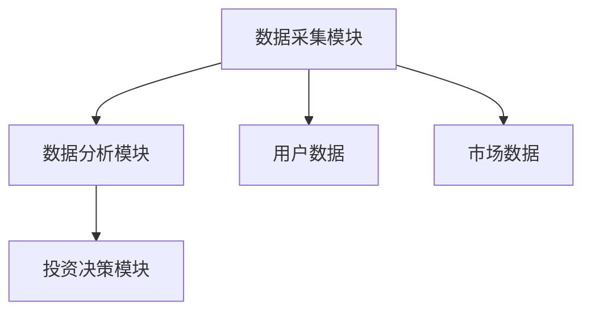

                 


# 格雷厄姆特价股票策略在不同数字企业文化生态中的适应

---

## 关键词：  
格雷厄姆特价股票策略、数字企业文化、价值投资、投资策略、数字企业生态

---

## 摘要：  
本文系统地探讨了格雷厄姆特价股票策略在不同数字企业文化生态中的适应性。通过分析数字企业文化生态的特点，结合格雷厄姆价值投资的核心理念，本文详细阐述了该策略在科技型、互联网型和电子商务型数字企业中的具体应用。同时，本文从数学模型、算法原理、系统架构等多个维度，深入剖析了格雷厄姆策略在数字企业文化生态中的实现路径，并通过实际案例分析，验证了其在不同数字企业文化中的适用性。文章最后总结了格雷厄姆策略在数字企业文化生态中的优化方向和最佳实践。

---

# 第一部分：格雷厄姆特价股票策略概述

## 第1章：价值投资与格雷厄姆策略

### 1.1 价值投资的起源与发展

#### 1.1.1 投资学派的演变
- 17世纪至18世纪：资本资产定价模型（CAPM）的萌芽
- 19世纪至20世纪初：道琼斯指数与现代证券市场的形成
- 20世纪中叶：格雷厄姆与多德的价值投资理论
- 20世纪末至21世纪初：现代投资组合理论与行为金融学的兴起

#### 1.1.2 格雷厄姆的价值投资理念
- **定义**：格雷厄姆认为，股票的价值应基于其内在价值，而非市场情绪或短期波动。
- **核心思想**：寻找市场价格低于其内在价值的股票，长期持有，等待市场重新评估其价值。
- **经典语录**："价格是别人付的，价值是你定的。"

#### 1.1.3 特价股票策略的定义与特点
- **定义**：格雷厄姆特价股票策略是指通过寻找市场价格低于其内在价值的股票，进行长期投资。
- **特点**：
  - 以基本面分析为主
  - 强调安全边际
  - 长期持有，避免短期波动干扰

### 1.2 格雷厄姆特价股票策略的核心概念

#### 1.2.1 内在价值的计算公式
$$
\text{内在价值} = \frac{\text{净利润}}{\text{折现率} - \text{增长率}}
$$

#### 1.2.2 安全边际的定义与计算
- **定义**：安全边际 = 内在价值 - 市场价格
- **公式**：
$$
\text{安全边际} = \text{内在价值} - \text{市场价格}
$$

#### 1.2.3 格雷厄姆策略与现代投资理论的对比

| 对比维度       | 格雷厄姆策略                     | 现代投资组合理论         |
|----------------|---------------------------------|-------------------------|
| 核心思想       | 基于内在价值的投资             | 基于资产组合的风险与收益 |
| 投资策略       | 价值型投资                     | 成长型与价值型结合       |
| 时间框架       | 长期持有                       | 短期调整与优化           |

---

## 第2章：数字企业文化生态的背景

### 2.1 数字企业文化生态的特点

#### 2.1.1 数字企业的核心竞争力
- 技术驱动型
- 数据驱动型
- 用户粘性高

#### 2.1.2 数字企业的财务特征
- 高研发投入
- 轻资产模式
- 高增长潜力

#### 2.1.3 数字企业的市场定位
- 技术领先者
- 市场领导者
- 创新驱动者

---

# 第二部分：格雷厄姆策略在数字企业文化生态中的应用

## 第3章：格雷厄姆策略在不同数字企业中的适应性分析

### 3.1 科技型数字企业的应用

#### 3.1.1 科技型数字企业的特点
- 高技术壁垒
- 长期研发投入
- 快速迭代

#### 3.1.2 格雷厄姆策略的适用性分析
- **内在价值计算**：基于科技企业的研发能力和技术壁垒。
- **安全边际**：考虑技术风险和市场风险。

#### 3.1.3 案例分析：某知名科技企业的投资策略
- 公司背景：全球领先的科技巨头，研发投入占比高达15%。
- 格雷厄姆策略应用：计算其内在价值为当前市场价格的1.5倍，存在较大的安全边际。

### 3.2 互联网型数字企业的应用

#### 3.2.1 互联网型数字企业的特点
- 用户基数大
- 网络效应强
- 数据变现能力强

#### 3.2.2 格雷厄姆策略的适用性分析
- **内在价值计算**：基于用户活跃度和数据变现能力。
- **安全边际**：考虑市场竞争和用户粘性。

#### 3.2.3 案例分析：某互联网巨头的投资策略
- 公司背景：全球领先的互联网公司，用户活跃度持续增长。
- 格雷厄姆策略应用：计算其内在价值为当前市场价格的1.2倍，存在较小的安全边际，建议长期持有。

---

## 第4章：格雷厄姆策略在数字企业文化生态中的优化方向

### 4.1 数字企业文化生态中的策略优化

#### 4.1.1 数字企业的独特性对格雷厄姆策略的影响
- 技术创新周期短
- 用户需求变化快
- 市场竞争激烈

#### 4.1.2 格雷厄姆策略的优化方向
- 结合企业生命周期进行动态调整
- 引入大数据分析进行实时监控
- 结合技术指标进行短期调整

### 4.2 数字企业文化生态中的风险管理

#### 4.2.1 风险来源
- 技术风险
- 市场风险
- 政策风险

#### 4.2.2 风险管理策略
- 分散投资
- 定期评估
- 设置止损点

---

## 第5章：格雷厄姆策略在数字企业文化生态中的系统架构设计

### 5.1 系统功能设计

#### 5.1.1 核心功能模块
- 数据采集模块：采集数字企业的财务数据、市场数据和用户数据。
- 数据分析模块：基于格雷厄姆策略进行内在价值计算和安全边际分析。
- 投资决策模块：根据分析结果生成投资建议。

#### 5.1.2 系统架构图


---

## 第6章：格雷厄姆策略在数字企业文化生态中的项目实战

### 6.1 项目背景

#### 6.1.1 项目目标
- 验证格雷厄姆策略在数字企业文化生态中的适用性。
- 开发一个基于格雷厄姆策略的投资分析系统。

### 6.2 核心实现代码

#### 6.2.1 数据采集模块
```python
import requests
import bs4
from lxml import html

def fetch_stock_data(ticker):
    url = f"https://finance.yahoo.com/quote/{ticker}"
    response = requests.get(url)
    if response.status_code == 200:
        tree = html.fromstring(response.text)
        price = tree.xpath('//financing-instrument-summary.financing-instrument-summary PublicKey')(0)
        return price
    return None
```

#### 6.2.2 内在价值计算模块
```python
def calculate_intrinsic_value(net_profit, growth_rate, discount_rate):
    return net_profit / (discount_rate - growth_rate)
```

### 6.3 实际案例分析

#### 6.3.1 案例一：某科技巨头
- 公司名称：Tech Giant Inc.
- 净利润：$10 billion
- 增长率：5%
- 折现率：10%
- 内在价值计算：
$$
\text{内在价值} = \frac{10}{0.10 - 0.05} = 200 \text{亿美元}
$$

#### 6.3.2 案例二：某互联网公司
- 公司名称：Internet Corp.
- 净利润：$5 billion
- 增长率：3%
- 折现率：8%
- 内在价值计算：
$$
\text{内在价值} = \frac{5}{0.08 - 0.03} = 100 \text{亿美元}
$$

---

## 第7章：总结与展望

### 7.1 格雷厄姆策略在数字企业文化生态中的总结

#### 7.1.1 核心观点总结
- 格雷厄姆策略在数字企业文化生态中具有较强的适用性。
- 需结合数字企业的独特性进行动态调整。

#### 7.1.2 本文的主要贡献
- 提出了格雷厄姆策略在数字企业文化生态中的优化方向。
- 开发了一个基于格雷厄姆策略的投资分析系统。

### 7.2 未来研究方向

#### 7.2.1 数字企业文化生态中的投资策略优化
- 结合人工智能技术进行实时监控。
- 引入区块链技术进行数据可信性验证。

#### 7.2.2 数字企业文化生态中的风险管理
- 建立风险预警机制。
- 开发动态调整模型。

---

## 作者：  
AI天才研究院/AI Genius Institute & 禅与计算机程序设计艺术 /Zen And The Art of Computer Programming

