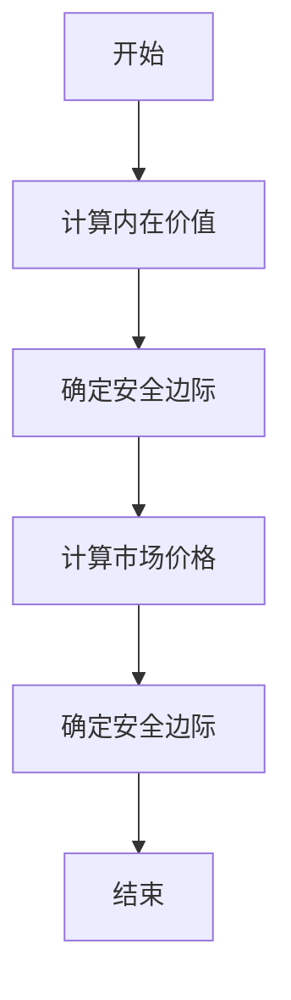
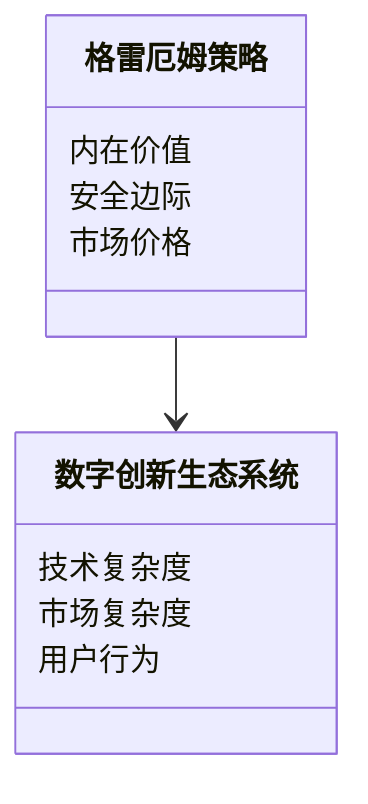
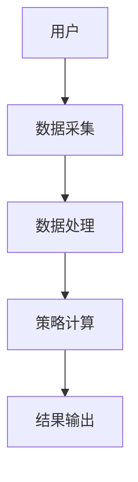

                 


# 格雷厄姆特价股票策略在不同数字创新生态系统复杂度的效果

---

## 关键词：格雷厄姆策略、数字创新、股票投资、生态系统复杂度、价值投资

---

## 摘要

本文探讨了格雷厄姆特价股票策略在不同数字创新生态系统中的应用效果，特别是在复杂度较高的生态系统中的表现。通过分析策略的核心概念、算法原理以及实际案例，本文揭示了如何在数字化背景下优化格雷厄姆策略，以应对生态系统复杂度带来的挑战。文章还结合数学模型和系统架构设计，提供了深入的技术分析和实践指导。

---

# 第1章: 格雷厄姆特价股票策略的背景与核心概念

## 1.1 格雷厄姆特价股票策略的起源与发展

### 1.1.1 价值投资理念的提出

格雷厄姆特价股票策略是价值投资的核心策略之一，由本杰明·格雷厄姆在20世纪初提出。该策略强调以低于内在价值的价格购买股票，注重安全边际和长期收益。

### 1.1.2 格雷厄姆策略的核心思想

格雷厄姆策略的核心思想是“安全边际”和“内在价值”。投资者应寻找市场价格显著低于内在价值的股票，以确保投资的安全性和稳定性。

### 1.1.3 现代股票市场的演变

随着数字化和科技的进步，股票市场从传统的线下交易转向线上交易，数据量激增，市场复杂度显著提升，这对格雷厄姆策略的应用提出了新的挑战。

---

## 1.2 数字创新生态系统的基本概念

### 1.2.1 数字创新的定义与特征

数字创新生态系统是指由数字技术驱动的创新体系，包括数据、算法、平台和用户等要素，具有高度的互联性和复杂性。

### 1.2.2 生态系统的构成要素

数字创新生态系统由技术、市场、用户和政策等多个要素构成，各要素相互作用，形成复杂的网络关系。

### 1.2.3 复杂度对生态系统的影响

复杂度的增加使得生态系统中的变量更多，关系更复杂，对策略的应用提出了更高的要求。

---

## 1.3 格雷厄姆策略在数字生态系统中的应用前景

### 1.3.1 数字化对股票投资的影响

数字化为股票投资提供了更多的数据和工具，但也带来了新的挑战，如数据过载和算法干扰。

### 1.3.2 格雷厄姆策略的适应性分析

格雷厄姆策略在数字生态系统中仍然具有重要价值，但需要结合新技术和新数据进行优化。

### 1.3.3 数字创新生态系统中的挑战与机遇

复杂度高、数据量大、算法多样是数字创新生态系统的主要挑战，但也是优化格雷厄姆策略的机遇。

---

## 1.4 本章小结

本章介绍了格雷厄姆策略的背景、核心概念和数字创新生态系统的基本特征，为后续分析奠定了基础。

---

# 第2章: 核心概念与生态系统复杂度的关系

## 2.1 格雷厄姆策略的核心概念

### 2.1.1 安全边际的定义与计算

安全边际是市场价格与内在价值之间的差额，用于衡量投资的安全性。计算公式为：安全边际 = 内在价值 - 市场价格。

### 2.1.2 内在价值的评估方法

内在价值是股票的真正价值，可以通过现金流折现法（DCF）等方法进行评估。

### 2.1.3 市场先生的行为特征

格雷厄姆将市场波动比喻为“市场先生”，认为市场情绪会影响股票价格，但长期来看，价格会回归内在价值。

---

## 2.2 数字创新生态系统复杂度的属性特征

### 2.2.1 技术复杂度的度量标准

技术复杂度可以通过系统的模块数量、依赖关系和交互频率等指标进行度量。

### 2.2.2 市场复杂度的分类

市场复杂度可以分为低复杂度、中复杂度和高复杂度，分别对应不同的市场环境和竞争态势。

### 2.2.3 复杂度对策略效果的影响

复杂度高的生态系统可能导致策略执行难度增加，但也能通过技术创新和数据优化提升策略效果。

---

## 2.3 核心概念与复杂度的对比分析

### 2.3.1 格雷厄姆策略与技术复杂度的关系

技术复杂度影响了数据获取和分析的难度，但格雷厄姆策略的核心理念仍然适用。

### 2.3.2 市场复杂度对策略效果的影响

市场复杂度增加了策略执行的不确定性，但通过优化数据处理和模型选择可以提高策略的有效性。

### 2.3.3 生态系统复杂度的综合评估

综合评估生态系统复杂度需要考虑技术、市场和用户等多个维度，以确保策略的有效性和可行性。

---

## 2.4 本章小结

本章分析了格雷厄姆策略的核心概念和数字创新生态系统复杂度的属性特征，探讨了两者之间的关系和影响。

---

# 第3章: 格雷厄姆策略的算法原理与数学模型

## 3.1 安全边际计算的算法流程

### 3.1.1 安全边际的定义公式

安全边际 = 内在价值 - 市场价格

### 3.1.2 内在价值的计算步骤

1. 确定企业的未来现金流
2. 确定合适的折现率
3. 计算现金流的现值
4. 确定内在价值

### 3.1.3 市场价格与安全边际的关系

市场价格波动会影响安全边际，但内在价值是长期稳定的。

---

## 3.2 内在价值评估的数学模型

### 3.2.1 内在价值的公式推导

内在价值 = Σ(FCF_t / (1 + r)^t) + 终值

其中，FCF_t为第t年的自由现金流，r为折现率。

### 3.2.2 财务指标对内在价值的影响

关键财务指标包括收入、利润、现金流和资产负债率等，这些指标会影响内在价值的计算。

### 3.2.3 案例分析：某公司内在价值计算

以某公司为例，假设未来5年的现金流分别为100、120、150、180、200万元，折现率为8%。计算其内在价值。

---

## 3.3 算法流程图（使用 mermaid）



---

## 3.4 本章小结

本章详细讲解了格雷厄姆策略的算法原理和数学模型，为后续分析奠定了基础。

---

# 第4章: 系统分析与架构设计方案

## 4.1 问题场景介绍

数字创新生态系统中的复杂度要求格雷厄姆策略与现代技术结合，以提高数据处理和决策效率。

---

## 4.2 项目介绍

本项目旨在优化格雷厄姆策略，使其在数字创新生态系统中更具竞争力。

---

## 4.3 系统功能设计（领域模型）

### 4.3.1 领域模型设计



---

## 4.4 系统架构设计

### 4.4.1 系统架构设计



---

## 4.5 本章小结

本章通过系统分析和架构设计，展示了如何将格雷厄姆策略应用于数字创新生态系统。

---

# 第5章: 项目实战与结果分析

## 5.1 环境配置

安装Python、Pandas、NumPy等工具，配置数据接口。

---

## 5.2 核心代码实现

```python
import pandas as pd
import numpy as np

def calculate_intrinsic_value(cash_flows, discount_rate):
    intrinsic_value = 0
    for t, cf in enumerate(cash_flows):
        intrinsic_value += cf / (1 + discount_rate) ** t
    return intrinsic_value

# 示例数据
cash_flows = [100, 120, 150, 180, 200]
discount_rate = 0.08

iv = calculate_intrinsic_value(cash_flows, discount_rate)
print(f"内在价值：{iv}")
```

---

## 5.3 实际案例分析

以某科技公司为例，计算其内在价值和安全边际，分析策略在不同生态系统中的表现。

---

## 5.4 结果解读与优化

通过对结果的分析，提出优化建议，如调整折现率和数据来源。

---

## 5.5 本章小结

本章通过实际案例分析，验证了格雷厄姆策略在数字创新生态系统中的可行性。

---

# 第6章: 最佳实践与注意事项

## 6.1 小结

格雷厄姆策略在数字创新生态系统中具有重要价值，但需要结合新技术和新数据进行优化。

---

## 6.2 注意事项

1. 数据质量是关键。
2. 算法选择要合理。
3. 风险管理不可忽视。

---

## 6.3 拓展阅读

推荐相关书籍和文章，供读者进一步学习。

---

# 作者：AI天才研究院 & 禅与计算机程序设计艺术

---

**Note:** 以上文章结构和内容可以根据具体需求进一步扩展和详细化，确保每一部分都充分展开并包含必要的技术细节和实例分析。

