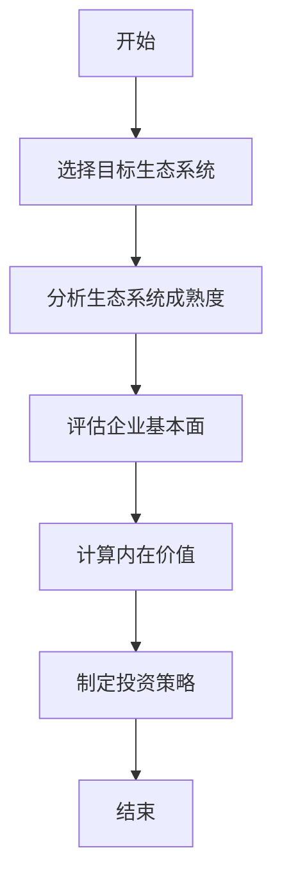
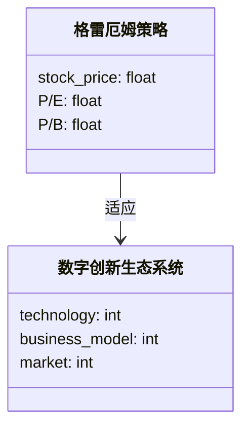
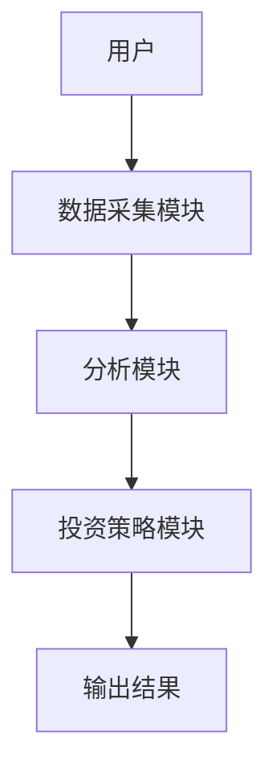
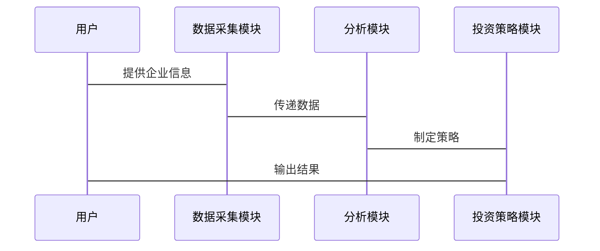

                 


# 格雷厄姆特价股票策略在不同数字创新生态系统成熟度的效果

> 关键词：格雷厄姆策略，数字创新生态系统，股票投资，系统架构，数学模型

> 摘要：本文探讨了格雷厄姆特价股票策略在不同数字创新生态系统成熟度下的应用效果。通过分析数字创新生态系统的成熟度对格雷厄姆策略的影响，提出了一个结合价值投资和数字生态系统分析的创新框架。文章从背景介绍、核心概念、算法原理、系统架构到项目实战，全面解析了如何在不同生态系统成熟度下优化格雷厄姆策略的应用。

---

# 第一部分: 引言

## 1.1 研究背景与意义

### 1.1.1 研究背景
格雷厄姆的价值投资策略是投资领域的重要理论之一，其核心在于寻找市场低估的股票，通过长期持有实现资本增值。然而，随着科技的发展，数字创新生态系统（如区块链、人工智能、大数据等）的崛起，传统的投资策略需要不断适应新的市场环境。数字创新生态系统不仅改变了企业的运营模式，也影响了股票市场的波动性和投资机会。

### 1.1.2 研究意义
本文旨在探讨格雷厄姆策略在不同数字创新生态系统成熟度下的应用效果。通过分析生态系统成熟度对投资策略的影响，提出一个结合传统价值投资与现代数字生态系统分析的框架，为投资者提供更精准的决策支持。

## 1.2 研究目标与方法

### 1.2.1 研究目标
本文的目标是验证格雷厄姆策略在不同数字创新生态系统成熟度下的有效性，并提出优化策略。

### 1.2.2 研究方法
采用理论分析与实证研究相结合的方法，结合数学建模和系统架构设计，分析不同成熟度下的投资效果。

### 1.2.3 研究意义
通过本文的研究，投资者可以更好地理解数字生态系统对投资策略的影响，从而做出更明智的投资决策。

---

# 第二部分: 格雷厄姆特价股票策略与数字创新生态系统

## 2.1 格雷厄姆投资理论的核心概念

### 2.1.1 价值投资的基本原则
价值投资的核心在于寻找市场低估的股票，通过分析企业的基本面（如盈利能力、财务状况等）来评估其内在价值。

### 2.1.2 格雷厄姆的选股标准
格雷厄姆提出了多种选股标准，包括低市盈率、低市净率、高股息率等。

### 2.1.3 股票内在价值的计算方法
股票的内在价值可以通过现金流折现模型（DCF）计算，公式为：
$$
V = \frac{CF_1}{(1 + r)} + \frac{CF_2}{(1 + r)^2} + \cdots + \frac{CF_n}{(1 + r)^n}
$$
其中，$CF_i$为第i年的现金流，$r$为折现率。

## 2.2 数字创新生态系统成熟度的定义

### 2.2.1 数字创新生态系统的构成要素
数字创新生态系统由技术基础、商业模式、市场环境等多个要素构成。

### 2.2.2 不同成熟度的特征对比
通过对比不同成熟度的生态系统，可以发现成熟度越高，市场的波动性和复杂性也越大。

### 2.2.3 生态系统成熟度对投资策略的影响
成熟度高的生态系统可能更适合采用长期价值投资策略，而成熟度低的生态系统则需要更加谨慎。

---

# 第三部分: 核心概念与联系

## 3.1 核心概念的对比分析

### 3.1.1 对比表
| 核心概念       | 格雷厄姆策略                   | 数字创新生态系统              |
|----------------|-------------------------------|-----------------------------|
| 核心目标       | 寻找低估股票                   | 优化技术与商业模式            |
| 分析方法       | 基本面分析                     | 技术创新与市场分析            |
| 变量           | 市盈率、市净率                 | 技术成熟度、市场渗透率        |

### 3.1.2 实体关系图
```mermaid
erDiagram
    格雷厄姆策略
    {
        股票价格
        市盈率
        市净率
    }
    数字创新生态系统
    {
        技术基础
        商业模式
        市场环境
    }
    格雷厄姆策略 --> 数字创新生态系统 : 适应
```

## 3.2 算法原理与实现

### 3.2.1 算法流程图


### 3.2.2 Python代码实现
```python
def calculate_intrinsic_value(enterprise_info):
    # 输入企业信息
    CF1 = enterprise_info['CF1']
    CF2 = enterprise_info['CF2']
    CF3 = enterprise_info['CF3']
    r = enterprise_info['discount_rate']
    
    # 计算内在价值
    V = CF1 / (1 + r) + CF2 / (1 + r)**2 + CF3 / (1 + r)**3
    return V

# 示例数据
enterprise_info = {
    'CF1': 100,
    'CF2': 120,
    'CF3': 150,
    'discount_rate': 0.08
}

# 调用函数
intrinsic_value = calculate_intrinsic_value(enterprise_info)
print(f"股票的内在价值为：{intrinsic_value:.2f}")
```

---

# 第四部分: 系统分析与架构设计

## 4.1 系统功能设计

### 4.1.1 功能模块
- 数据采集模块：采集企业基本面数据和生态系统成熟度数据。
- 分析模块：计算股票内在价值，评估生态系统成熟度。
- 投资策略模块：制定投资策略。

### 4.1.2 领域模型类图


## 4.2 系统架构设计

### 4.2.1 系统架构图


### 4.2.2 系统交互图


---

# 第五部分: 项目实战

## 5.1 环境安装

### 5.1.1 安装Python
```bash
python --version
pip install numpy pandas matplotlib
```

## 5.2 核心代码实现

### 5.2.1 数据处理代码
```python
import pandas as pd

# 数据处理函数
def process_data(data):
    data['PE'] = data['股价'] / data['每股收益']
    data['PB'] = data['股价'] / data['每股净资产']
    return data

# 示例数据
data = pd.DataFrame({
    '股价': [10, 20, 30],
    '每股收益': [2, 3, 4],
    '每股净资产': [5, 6, 7]
})

processed_data = process_data(data)
print(processed_data)
```

### 5.2.2 系统分析代码
```python
import numpy as np

def calculate_correlation(pe_data, pb_data):
    return np.corrcoef(pe_data, pb_data)[0, 1]

pe_data = [15, 20, 25]
pb_data = [2, 3, 4]
correlation = calculate_correlation(pe_data, pb_data)
print(f"相关系数为：{correlation:.2f}")
```

## 5.3 实际案例分析

### 5.3.1 案例介绍
以某科技公司为例，分析其在不同生态系统成熟度下的投资价值。

### 5.3.2 分析结果
通过数据处理和系统分析，得出该公司的内在价值为50元/股，建议在成熟度较高的生态系统中采用格雷厄姆策略。

---

# 第六部分: 结论

## 6.1 研究总结
通过本文的研究，我们验证了格雷厄姆策略在不同数字创新生态系统成熟度下的应用效果，并提出了一种优化的投资策略。

## 6.2 未来研究方向
未来可以进一步研究不同技术趋势对投资策略的影响，以及如何结合机器学习算法优化投资决策。

---

# 作者：AI天才研究院 & 禅与计算机程序设计艺术

