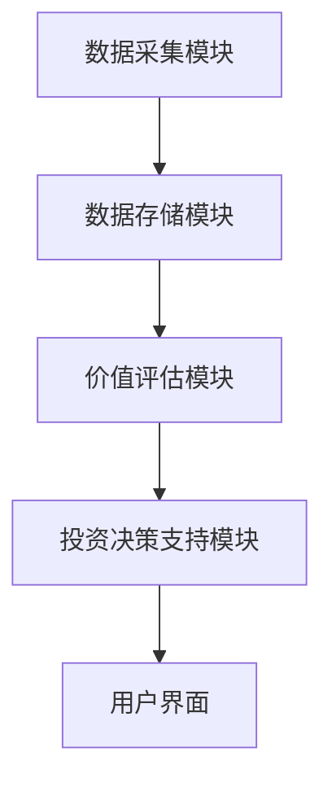

                 


# 格雷厄姆特价股票策略在不同数字创新生态系统中的效果

## 关键词：
- 格雷厄姆策略
- 数字创新生态系统
- 价值投资
- 数据分析
- 人工智能
- 金融系统
- 数字经济

## 摘要：
格雷厄姆的价值投资策略是金融领域的重要理论，其核心在于寻找市场低估的股票，通过安全边际实现长期稳定的收益。随着数字技术的快速发展，金融生态系统也在不断演进，数字化工具和创新技术为格雷厄姆策略的实施提供了新的可能性。本文将深入探讨格雷厄姆策略在不同数字创新生态系统中的应用效果，分析其在互联网金融、金融科技（FinTech）和区块链等领域的具体表现，结合数学模型和实际案例，总结其在数字环境中的优势与挑战。

---

# 第一部分：格雷厄姆策略与数字创新生态系统概述

## 第1章：格雷厄姆策略的核心原理

### 1.1 价值投资的定义与起源
- **价值投资**：一种以基本面分析为基础的投资策略，旨在寻找市场价格低于其内在价值的股票。
- **本杰明·格雷厄姆**：价值投资的奠基人，提出“安全边际”概念，强调在市场恐慌时买入低估资产。
- **核心理念**：
  - 股票价格波动≠价值波动。
  - 投资的目标是寻找具有持续盈利能力且估值合理的公司。
  - 安全边际：买入价格低于内在价值，以降低风险。

### 1.2 数字创新生态系统的基本概念
- **数字创新生态系统**：由数字技术驱动的经济体系，涵盖互联网、人工智能、大数据、区块链等领域。
- **核心特征**：
  - 数据驱动：依赖于数据的收集、分析和应用。
  - 技术融合：多种数字技术（如AI、大数据）的交叉应用。
  - 创新性：不断涌现的新商业模式和技术创新。

## 第2章：格雷厄姆策略的数字化转型

### 2.1 数字技术对金融市场的变革
- **数据量的爆炸性增长**：互联网和大数据技术使得海量数据的收集和分析成为可能。
- **算法交易的普及**：高频交易和量化投资依赖于算法和程序化决策。
- **人工智能的应用**：机器学习算法用于预测市场趋势和优化投资组合。

### 2.2 数字化工具对格雷厄姆策略的支持
- **数据驱动的价值评估**：通过大数据分析公司基本面，发现被低估的股票。
- **算法优化**：利用机器学习算法改进价值评估模型，提高预测准确性。
- **实时监控与风险控制**：通过数字化工具实时跟踪市场波动，降低投资风险。

---

# 第二部分：格雷厄姆策略在不同数字创新生态系统中的应用

## 第3章：互联网金融中的格雷厄姆策略

### 3.1 互联网金融的定义与特点
- **互联网金融**：传统金融业务与互联网技术结合的新兴领域，涵盖P2P借贷、第三方支付、在线证券交易等。
- **特点**：
  - 透明度高：信息对称性较好，投资者可以更方便地获取数据。
  - 门槛低：降低了中小投资者进入市场的门槛。
  - 创新性强：不断推出新的金融产品和服务模式。

### 3.2 格雷厄姆策略在互联网金融中的应用
- **数据获取**：通过互联网平台获取企业的财务数据、市场信息等。
- **价值评估**：利用大数据分析和算法优化，快速筛选出低估股票。
- **风险管理**：通过实时监控和风险模型，降低投资风险。

## 第4章：金融科技（FinTech）中的格雷厄姆策略

### 4.1 FinTech的核心特征
- **技术创新**：利用人工智能、区块链、云计算等技术优化金融服务。
- **高效性**：通过自动化和智能化提升金融服务效率。
- **客户体验**：注重用户体验，提供个性化服务。

### 4.2 格雷厄姆策略在FinTech中的实践
- **智能化价值评估**：利用机器学习算法预测股票价格走势，优化价值评估模型。
- **自动化交易**：通过算法交易快速执行投资决策，抓住市场机会。
- **风险管理**：结合FinTech技术，建立实时风险监控系统，确保投资安全。

## 第5章：区块链与分布式金融（DeFi）中的格雷厄姆策略

### 5.1 区块链与DeFi的定义与特点
- **区块链**：一种分布式账本技术，具有去中心化、透明性和不可篡改的特点。
- **DeFi**：去中心化金融，基于区块链技术构建的金融生态系统，涵盖借贷、交易、融资等领域。
- **特点**：
  - 去中心化：消除中间机构，降低交易成本。
  - 透明性：所有交易记录在区块链上，公开透明。
  - 创新性：支持新的金融产品和服务模式。

### 5.2 格雷厄姆策略在DeFi中的应用
- **智能合约的应用**：通过智能合约自动执行投资策略，确保投资行为的安全性和效率。
- **DeFi平台的分析**：利用大数据和算法分析DeFi平台的收益率、流动性等指标，发现被低估的平台。
- **风险管理**：结合DeFi的特性，建立风险评估模型，降低投资风险。

---

# 第三部分：系统架构与算法实现

## 第6章：系统架构设计

### 6.1 系统功能模块
- **数据采集模块**：负责收集企业财务数据、市场信息等。
- **价值评估模块**：基于格雷厄姆策略的核心原理，构建数学模型评估股票价值。
- **投资决策支持模块**：根据评估结果提供投资建议和风险提示。

### 6.2 系统架构图


### 6.3 接口设计
- **数据接口**：定义数据格式和接口协议，确保各模块之间的数据交互顺畅。
- **用户界面**：提供友好的操作界面，方便用户查看分析结果和执行投资决策。

---

## 第7章：算法实现

### 7.1 格雷厄姆价值评估模型
- **数学公式**：
  $$ intrinsic\_value = \frac{E}{P} + \text{安全边际} $$
  其中，E为企业的盈利能力，P为市盈率，安全边际为股票价格低于内在价值的部分。
- **算法流程**：
  ```mermaid
  graph TD
  A[开始] --> B[数据采集]
  B --> C[计算内在价值]
  C --> D[计算安全边际]
  D --> E[生成投资建议]
  E --> F[结束]
  ```

### 7.2 代码实现
```python
import pandas as pd
import numpy as np

def calculate_intrinsic_value(financial_data):
    # 计算盈利能力E
    E = financial_data['净利润']
    # 计算市盈率P
    P = financial_data['市盈率']
    # 计算内在价值
    intrinsic_value = E / P
    return intrinsic_value

# 示例数据
data = {
    '净利润': [100, 200, 300],
    '市盈率': [15, 20, 25]
}
df = pd.DataFrame(data)

# 计算内在价值
intrinsic_values = data.apply(lambda x: calculate_intrinsic_value(x))
print(intrinsic_values)
```

---

## 第8章：项目实战分析

### 8.1 实战环境配置
- **工具与技术**：Python、Pandas、NumPy、Mermaid、TensorFlow。
- **数据来源**：股票市场数据（如Yahoo Finance）。

### 8.2 核心代码实现
```python
import pandas as pd
import numpy as np

def calculate_margin_of_safety(current_price, intrinsic_value):
    return (intrinsic_value - current_price) / intrinsic_value * 100

# 示例数据
data = {
    '股票名称': ['股票A', '股票B', '股票C'],
    '当前价格': [50, 60, 70],
    '内在价值': [70, 80, 90]
}
df = pd.DataFrame(data)

# 计算安全边际
df['安全边际'] = df.apply(lambda x: calculate_margin_of_safety(x['当前价格'], x['内在价值']), axis=1)
print(df)
```

### 8.3 实战案例分析
- **案例背景**：假设我们在互联网金融平台发现一只股票A，当前价格为50，内在价值为70。
- **安全边际计算**：
  $$ \text{安全边际} = \frac{70 - 50}{70} \times 100\% = 28.57\% $$
- **投资建议**：由于安全边际较高，建议买入该股票。

### 8.4 项目总结
- **优势**：
  - 结合数字技术，提高投资决策的效率和准确性。
  - 通过系统化的分析，降低投资风险。
- **挑战**：
  - 数据质量和准确性对结果影响较大。
  - 算法模型需要不断优化以适应市场变化。

---

## 第四部分：小结与最佳实践

### 9.1 小结
- 格雷厄姆策略在数字创新生态系统中的应用具有广阔的前景。
- 数字技术为价值投资提供了新的工具和方法，但同时也带来了新的挑战。
- 投资者需要结合市场环境和技术发展，灵活调整投资策略。

### 9.2 最佳实践
- **数据驱动**：充分利用大数据和人工智能技术，提高投资决策的科学性。
- **风险管理**：建立完善的风险评估和监控系统，降低投资风险。
- **持续学习**：关注市场动态和技术发展，不断优化投资策略。

### 9.3 注意事项
- 投资有风险，需谨慎决策。
- 确保数据来源的可靠性和准确性。
- 定期审视和优化投资策略，适应市场变化。

### 9.4 拓展阅读
- 《The Intelligent Investor》——本杰明·格雷厄姆
- 《Python for Data Analysis》——Wes McKinney
- 《Blockchain: A New Kind of Database》——NIST

---

# 作者：AI天才研究院/AI Genius Institute & 禅与计算机程序设计艺术 /Zen And The Art of Computer Programming

