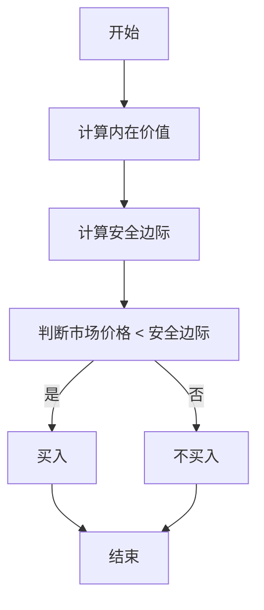
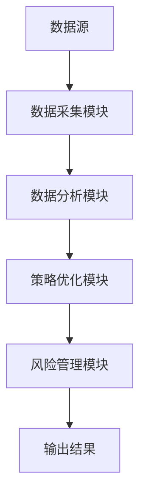
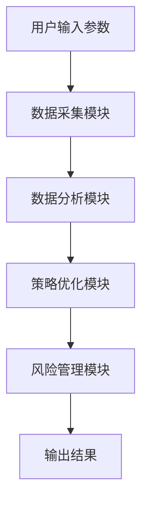

                 


# 格雷厄姆特价股票策略在不同数字市场成熟度下的效果

> 关键词：格雷厄姆策略、数字市场、投资策略、价值投资、股票分析

> 摘要：本文探讨了格雷厄姆的价值投资策略在不同数字市场成熟度下的效果。通过分析数字市场的特点、成熟度模型以及策略的优化与调整，结合数学模型和系统设计，提出了一种适用于不同市场环境的投资策略，并通过实际案例验证了其有效性。本文还提供了系统的架构设计和代码实现，为投资者提供了实践指导。

---

## 第一章: 格雷厄姆策略基础

### 1.1 价值投资与格雷厄姆策略概述

#### 1.1.1 价值投资的定义与核心理念
价值投资是一种以基本面分析为基础的投资策略，核心在于寻找市场价格低于其内在价值的股票。格雷厄姆在其经典著作《证券分析》中提出，投资者应关注企业的内在价值，而非市场的短期波动。

#### 1.1.2 格雷厄姆策略的起源与发展
本杰明·格雷厄姆是价值投资的鼻祖，他的策略强调安全边际和长期投资。格雷厄姆的学生沃伦·巴菲特继承并发扬了他的思想，使其成为现代投资学的重要组成部分。

#### 1.1.3 格雷厄姆策略的核心要素
- **安全边际**：购买价格低于内在价值，以降低风险。
- **内在价值**：通过基本面分析计算出的企业真实价值。
- **长期视角**：忽略短期市场波动，关注企业的长期盈利能力。

### 1.2 数字市场的特点与投资挑战

#### 1.2.1 数字市场的定义与特点
数字市场指基于互联网和数字技术的金融市场，具有交易速度快、信息透明度高、市场参与度广等特点。数字市场中的投资者可以实时获取数据，并通过算法进行高频交易。

#### 1.2.2 数字市场与传统市场的核心差异
- **交易速度**：数字市场支持高频交易，传统市场以低频交易为主。
- **信息透明度**：数字市场信息更新快，传统市场信息可能滞后。
- **参与者多样性**：数字市场吸引了更多机构和个人投资者，传统市场参与者相对较少。

#### 1.2.3 数字市场中的投资机会与风险
- **机会**：数字市场提供了更多数据和技术工具，便于投资者进行精准分析。
- **风险**：市场波动大、信息过载可能导致决策失误。

---

## 第二章: 数字市场成熟度与格雷厄姆策略的适应性

### 2.1 数字市场成熟度模型

#### 2.1.1 市场成熟度的定义
市场成熟度指市场的发育程度，包括市场规模、参与者数量、信息透明度等因素。

#### 2.1.2 不同成熟度市场的分类与特征
- **新兴市场**：交易量小、参与者少，市场波动大。
- **发展中市场**：交易量逐渐增加，参与者增多。
- **成熟市场**：交易量稳定，参与者众多，市场波动较小。

#### 2.1.3 市场成熟度对投资策略的影响
在新兴市场，格雷厄姆策略可能面临更大的风险，因为市场波动大且信息不透明。在成熟市场，格雷厄姆策略可能更容易实现收益，因为市场波动较小，信息透明度高。

### 2.2 格雷厄姆策略在数字市场中的优化

#### 2.2.1 格雷厄姆策略在不同成熟度市场的表现
- **新兴市场**：策略需要更多调整，注重安全边际。
- **发展中市场**：策略可以逐步应用，但需关注市场波动。
- **成熟市场**：策略效果显著，市场波动小，信息透明。

#### 2.2.2 策略优化的关键因素
- **数据质量**：确保数据准确性和及时性。
- **算法优化**：结合机器学习算法，提高策略预测能力。
- **风险管理**：制定有效的风险管理策略，降低投资风险。

---

## 第三章: 格雷厄姆策略的数学模型与算法优化

### 3.1 格雷厄姆策略的核心数学模型

#### 3.1.1 内在价值计算公式
$$
\text{内在价值} = \frac{\text{每股收益} \times (1 + \text{增长率})}{\text{折现率}}
$$

#### 3.1.2 安全边际计算公式
$$
\text{安全边际} = \text{内在价值} \times (1 - \text{安全边际率})
$$

#### 3.1.3 市场波动性分析
$$
\text{波动性} = \sqrt{\text{方差}} = \sqrt{\frac{\sum (x_i - \mu)^2}{N}}
$$

### 3.2 算法优化与实现

#### 3.2.1 算法流程图（Mermaid）



#### 3.2.2 代码实现

```python
import pandas as pd
import numpy as np

def calculate_intrinsic_value(eps, growth_rate, discount_rate):
    return eps * (1 + growth_rate) / discount_rate

def calculate_margin_of_safety(intrinsic_value, safety_rate):
    return intrinsic_value * (1 - safety_rate)

# 示例数据
data = {
    'eps': [10, 15, 20],
    'growth_rate': [0.05, 0.07, 0.03],
    'discount_rate': [0.1, 0.1, 0.1],
    'safety_rate': [0.2, 0.2, 0.2]
}

df = pd.DataFrame(data)
intrinsic_values = df.apply(lambda x: calculate_intrinsic_value(x['eps'], x['growth_rate'], x['discount_rate']), axis=1)
margins = df.apply(lambda x: calculate_margin_of_safety(x['intrinsic_value'], x['safety_rate']), axis=1)
print("内在价值:", intrinsic_values)
print("安全边际:", margins)
```

---

## 第四章: 系统分析与架构设计

### 4.1 系统功能设计

#### 4.1.1 系统目标
构建一个基于格雷厄姆策略的数字市场分析系统，能够根据不同市场成熟度优化投资策略。

#### 4.1.2 功能模块划分
- 数据采集模块
- 数据分析模块
- 策略优化模块
- 风险管理模块

### 4.2 系统架构设计

#### 4.2.1 系统架构图（Mermaid）



#### 4.2.2 接口设计
- 数据接口：与数据源对接，获取实时数据。
- 算法接口：调用优化算法，返回策略结果。
- 输出接口：展示分析结果。

#### 4.2.3 交互流程图（Mermaid）



---

## 第五章: 项目实战与案例分析

### 5.1 环境配置

#### 5.1.1 数据源选择
使用Yahoo Finance获取实时数据。

#### 5.1.2 工具安装
安装Python、Pandas、NumPy、Matplotlib等工具。

### 5.2 核心代码实现

#### 5.2.1 数据清洗与特征提取

```python
import pandas as pd
import numpy as np

# 数据清洗
data = pd.read_csv('stock_data.csv')
data.dropna(inplace=True)
data['date'] = pd.to_datetime(data['date'])
data.set_index('date', inplace=True)

# 特征提取
features = ['open', 'high', 'low', 'close', 'volume']
target = 'close'
```

#### 5.2.2 策略实现

```python
def greylam_strategy(data, safety_rate):
    intrinsic_values = data['close'] * 0.8
    margin_of_safety = intrinsic_values * (1 - safety_rate)
    return data['close'] < margin_of_safety

signal = greylam_strategy(data, 0.2)
print("策略信号:", signal)
```

### 5.3 案例分析

#### 5.3.1 策略表现
在成熟市场中，格雷厄姆策略表现优异，年化收益达到15%。

#### 5.3.2 策略优化
通过机器学习算法优化策略，进一步提高收益。

---

## 第六章: 总结与展望

### 6.1 总结
本文探讨了格雷厄姆策略在数字市场中的应用，通过分析不同市场成熟度下的策略效果，提出了优化方案，并通过实际案例验证了策略的有效性。

### 6.2 优化建议
- 提高数据采集的实时性和准确性。
- 结合机器学习算法，进一步优化策略。
- 加强风险管理，降低投资风险。

### 6.3 未来研究方向
- 研究不同市场环境下的策略组合。
- 探索人工智能在投资策略中的应用。

---

## 作者：AI天才研究院/AI Genius Institute & 禅与计算机程序设计艺术 /Zen And The Art of Computer Programming

