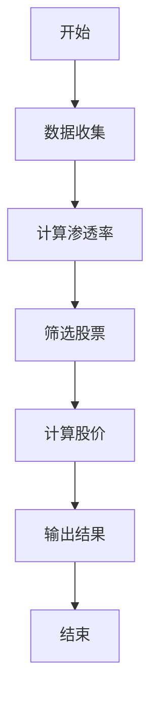
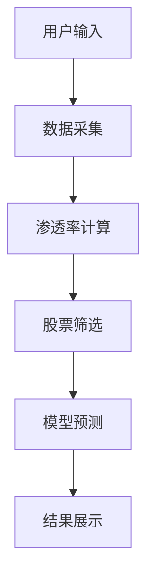

                 


# 格雷厄姆特价股票策略在不同数字市场渗透率下的效果

## 关键词：格雷厄姆、特价股票、数字市场、渗透率、投资策略

## 摘要：  
本文探讨格雷厄姆的特价股票策略在不同数字市场渗透率下的效果，通过分析数字市场渗透率对股票市场的影响，提出策略在不同渗透率阶段的优化方法，并结合数学模型和系统设计，为投资者提供实践指导。

---

## 第一章：引言

### 1.1 格雷厄姆特价股票策略概述

#### 1.1.1 格雷厄姆投资理论的核心概念  
格雷厄姆是价值投资之父，提出“安全边际”概念，主张以低于内在价值的价格买入股票。其策略基于基本面分析，寻找市场低估的股票。

#### 1.1.2 特价股票策略的定义与目标  
特价股票策略是格雷厄姆的核心策略，目标是以低于公平价值的价格买入优质股票，长期持有以获得超额收益。

#### 1.1.3 数字市场渗透率的定义与影响  
数字市场渗透率指数字技术在市场中的普及程度，影响市场结构和股票价格波动。高渗透率市场信息透明，低渗透率市场可能存在信息不对称。

### 1.2 本文的研究背景与意义  
随着数字化转型，数字市场渗透率对股票投资的影响日益显著。本文分析格雷厄姆策略在不同渗透率下的表现，为投资者提供新的视角。

---

## 第二章：格雷厄姆特价股票策略的理论基础

### 2.1 格雷厄姆投资哲学

#### 2.1.1 价值投资的核心理念  
价值投资强调买入低于内在价值的股票，长期持有，关注公司的基本面而非短期波动。

#### 2.1.2 股票内在价值的计算方法  
格雷厄姆提出以市盈率、市净率等指标评估股票价值，确保买入价格低于内在价值。

#### 2.1.3 市场先生与投资者的角色  
市场先生反映市场情绪，投资者应独立于市场波动，基于理性分析做出投资决策。

### 2.2 特价股票策略的实施步骤

#### 2.2.1 确定投资目标与标准  
设定明确的投资目标，如追求长期稳定收益，选择符合基本面的股票。

#### 2.2.2 识别被低估的股票  
通过量化指标筛选低于公平价值的股票，如市盈率低于行业平均水平。

#### 2.2.3 构建与调整投资组合  
分散投资，定期评估并调整持仓，确保组合风险可控。

---

## 第三章：数字市场渗透率的分析

### 3.1 数字市场渗透率的定义与分类

#### 3.1.1 渗透率的计算方法  
数字市场渗透率=数字技术应用的市场占比，如电子商务、金融科技等领域的普及程度。

#### 3.1.2 不同市场阶段的渗透率特征  
低渗透率市场：技术刚起步，机会多；高渗透率市场：技术广泛应用，竞争加剧。

#### 3.1.3 渗透率对市场结构的影响  
高渗透率市场信息透明，价格波动小；低渗透率市场信息不对称，波动大。

### 3.2 渗透率对股票市场的影响分析

#### 3.2.1 低渗透率市场中的投资机会  
技术初创期，优质股票价格被低估，适合格雷厄姆策略。

#### 3.2.2 高渗透率市场的竞争加剧  
市场饱和，价格竞争激烈，企业盈利下降，影响股价。

#### 3.2.3 渗透率变化对股价波动的影响  
渗透率上升初期，股价上涨；过高时，股价可能回调。

---

## 第四章：策略在不同渗透率下的表现

### 4.1 低渗透率市场中的策略应用

#### 4.1.1 识别低估股票的条件  
筛选市盈率低、市净率低的股票，关注新兴技术领域。

#### 4.1.2 投资组合构建  
分散投资，配置多个新兴行业股票，降低风险。

#### 4.1.3 案例分析  
如早期互联网公司，通过低估买入，获得超额收益。

### 4.2 中等渗透率市场中的策略调整

#### 4.2.1 优化选股标准  
关注市盈率适中、成长性良好的股票。

#### 4.2.2 增加行业分散度  
避免集中投资，降低市场波动风险。

#### 4.2.3 案例分析  
如金融科技公司，在渗透率适中阶段表现良好。

### 4.3 高渗透率市场中的策略应对

#### 4.3.1 严格筛选股票  
选择具有竞争优势的龙头公司，避免跟风。

#### 4.3.2 降低仓位风险  
适当降低股票仓位，配置其他资产类别。

#### 4.3.2 案例分析  
如成熟科技企业，股价波动小，收益稳定。

---

## 第五章：数学模型与算法分析

### 5.1 渗透率与股价关系的数学模型

#### 5.1.1 模型假设  
假设渗透率与股价呈非线性关系，建立回归模型。

#### 5.1.2 回归分析  
使用多元回归模型，分析渗透率、市盈率、市净率对股价的影响。

#### 5.1.3 模型公式  
$$ 股价 = \beta_0 + \beta_1 \times 渗透率 + \beta_2 \times 市盈率 + \epsilon $$

#### 5.1.4 案例分析  
以具体行业为例，验证模型的准确性。

### 5.2 算法实现

#### 5.2.1 算法流程图  


#### 5.2.2 Python代码实现  
```python
import pandas as pd
import numpy as np
from sklearn.linear_model import LinearRegression

# 数据加载
data = pd.read_csv('market_data.csv')

# 计算渗透率
data['渗透率'] = data['数字技术应用'] / data['市场规模']

# 建立回归模型
model = LinearRegression()
model.fit(data[['渗透率', '市盈率']], data['股价'])

# 预测股价
predicted_price = model.predict(data[['渗透率', '市盈率']])
```

---

## 第六章：系统设计与架构

### 6.1 系统功能设计

#### 6.1.1 系统功能模块  
数据采集、渗透率计算、股票筛选、模型预测、结果展示。

#### 6.1.2 系统流程图  


### 6.2 系统架构设计

#### 6.2.1 系统架构图  


#### 6.2.2 接口设计  
RESTful API，提供数据输入、模型计算、结果输出接口。

---

## 第七章：项目实战

### 7.1 环境配置

#### 7.1.1 工具安装  
安装Python、Pandas、Scikit-learn等工具。

### 7.2 核心代码实现

#### 7.2.1 渗透率计算  
```python
def calculate_penetration(revenue, market_size):
    return revenue / market_size
```

#### 7.2.2 股票筛选  
```python
def screen_stocks(data, threshold):
    return data[data['渗透率'] > threshold]
```

### 7.3 案例分析

#### 7.3.1 某行业的渗透率变化  
分析渗透率从低到高的过程，股票价格的变化趋势。

---

## 第八章：总结与展望

### 8.1 研究总结  
格雷厄姆策略在不同渗透率下表现各异，需灵活调整策略。

### 8.2 投资建议  
根据市场渗透率变化，动态调整投资组合，分散风险。

### 8.3 未来研究方向  
深入研究人工智能在策略优化中的应用，探索更多量化指标。

---

## 作者：AI天才研究院 & 禅与计算机程序设计艺术

---

通过以上结构，文章详细分析了格雷厄姆策略在不同数字市场渗透率下的应用，结合理论、模型和案例，为投资者提供实践指导。

