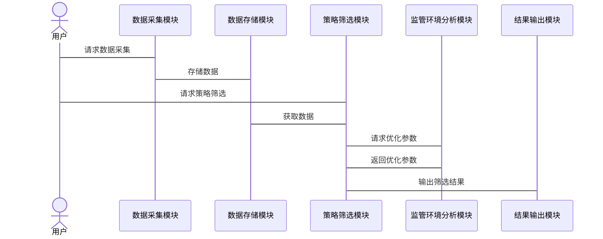

                 


# 格雷厄姆特价股票策略在不同数字监管沙盒环境中的表现

**关键词**：价值投资、数字监管沙盒、格雷厄姆策略、股票筛选、内在价值、安全边际、监管环境

**摘要**：本文探讨了格雷厄姆特价股票策略在不同数字监管沙盒环境中的表现，分析了策略的核心原理、监管环境对策略的影响，以及在不同监管环境下策略的适应性和表现差异。文章结合理论与实践，通过数学建模和系统架构设计，详细阐述了策略在数字监管环境下的优化和实现方法，为投资者和监管机构提供了有价值的参考。

---

## 第一部分: 格雷厄姆特价股票策略与数字监管沙盒概述

### 第1章: 格雷厄姆特价股票策略概述

#### 1.1 格雷厄姆投资理念的核心思想

- **1.1.1 价值投资的基本原则**
  - 格雷厄姆的价值投资理念强调寻找市场低估的股票，注重安全边际和内在价值。
  - 通过分析公司的财务状况、盈利能力和发展潜力，识别具有投资价值的标的。

- **1.1.2 安全边际的概念与应用**
  - 安全边际是指股票的市场价格低于其内在价值的部分，确保投资者在市场波动中仍能获得收益。
  - 通过计算安全边际，投资者可以在不同市场环境下选择具有更高安全边际的股票。

- **1.1.3 格雷厄姆策略的选股标准**
  - 低市盈率（P/E）：市盈率低于行业平均水平。
  - 低市净率（P/B）：市净率低于行业平均水平。
  - 高股息率：股息率高于行业平均水平。

#### 1.2 数字监管沙盒的概念与特点

- **1.2.1 数字监管沙盒的定义**
  - 数字监管沙盒是由监管机构提供的虚拟环境，允许金融机构在受控范围内测试创新产品和服务。
  - 通过沙盒环境，监管机构可以实时监控测试活动，确保创新活动在安全可控的范围内进行。

- **1.2.2 监管沙盒的运作机制**
  - 申请：金融机构向监管机构申请沙盒测试。
  - 测试：在沙盒环境中测试新产品或服务，监管机构实时监控。
  - 反馈：测试结束后，监管机构提供反馈，并根据结果决定是否允许在更广泛的市场中推广。

- **1.2.3 数字监管沙盒与传统金融监管的区别**
  - 数字监管沙盒允许创新产品在受控环境中测试，而传统监管可能需要较长的审批流程。
  - 数字监管沙盒注重实时监控和数据收集，能够快速识别和应对潜在风险。

#### 1.3 格雷厄姆策略与数字监管沙盒的结合

- **1.3.1 格雷厄姆策略在数字环境中的适用性**
  - 格雷厄姆策略的核心是寻找低估的股票，这在数字环境下可以通过大数据分析和算法优化实现。
  - 数字监管沙盒为策略的测试和优化提供了安全的环境。

- **1.3.2 数字监管沙盒对格雷厄姆策略的影响**
  - 数字监管沙盒允许投资者在受控环境中测试格雷厄姆策略，减少市场波动对策略的影响。
  - 监管沙盒的数据透明性和实时监控能力有助于优化策略的筛选标准。

- **1.3.3 格雷厄姆策略在不同监管环境中的表现**
  - 不同监管环境下的市场波动性和政策差异会影响格雷厄姆策略的表现。
  - 通过分析不同监管环境下的市场数据，可以优化策略的筛选标准，提高策略的有效性。

---

### 第2章: 格雷厄姆策略的核心概念与数学模型

#### 2.1 格雷厄姆策略的核心概念

- **2.1.1 内在价值的计算方法**
  - 内在价值是基于公司财务状况和未来盈利能力计算的股票合理价值。
  - 公式：$$ \text{内在价值} = \frac{\text{息税前利润} \times (1 + g)}{r - g} $$
  - 其中，g为长期增长率，r为贴现率。

- **2.1.2 安全边际的量化标准**
  - 安全边际是市场价格与内在价值之间的差额。
  - 公式：$$ \text{安全边际} = \text{内在价值} - \text{市场价格} $$

- **2.1.3 股票估值的公式与模型**
  - 格雷厄姆使用多因素模型进行股票估值，包括市盈率、市净率、股息率等。

#### 2.2 数字监管沙盒的数学建模

- **2.2.1 监管沙盒的系统模型**
  - 监管沙盒可以看作是一个封闭系统，其中包含金融机构、监管机构和测试环境。
  - 系统模型可以用状态机表示，展示不同状态之间的转换。

- **2.2.2 数字监管环境的变量分析**
  - 变量包括市场波动性、监管政策、用户行为等。
  - 通过分析这些变量，可以优化监管沙盒的运行机制。

- **2.2.3 格雷厄姆策略在数字环境中的数学表达**
  - 将格雷厄姆策略的核心公式嵌入到监管沙盒的数学模型中，实现策略的优化和调整。

---

### 第3章: 格雷厄姆策略在不同数字监管环境中的表现分析

#### 3.1 不同数字监管环境的分类

- **3.1.1 美国、英国等主要市场的监管特点**
  - 美国市场：监管相对宽松，创新能力强。
  - 英国市场：监管沙盒机制成熟，支持金融科技创新。

- **3.1.2 新兴市场的数字监管环境**
  - 新兴市场监管环境不完善，但创新需求强烈。
  - 监管沙盒在新兴市场中具有较大的发展潜力。

- **3.1.3 区域性监管差异对策略的影响**
  - 不同区域的监管政策和市场环境会影响格雷厄姆策略的表现。
  - 需要根据不同区域的监管环境调整策略的筛选标准。

#### 3.2 格雷厄姆策略在不同监管环境中的表现

- **3.2.1 低监管环境下的策略表现**
  - 低监管环境下，市场波动性较大，但策略筛选标准较为宽松，容易找到低估股票。

- **3.2.2 中度监管环境下的策略表现**
  - 中度监管环境下，市场波动性适中，策略筛选标准需要进行适度优化。

- **3.2.3 高度监管环境下的策略表现**
  - 高度监管环境下，市场波动性较低，策略筛选标准需要更加严格，以确保安全边际。

---

### 第4章: 格雷厄姆策略的算法实现与优化

#### 4.1 格雷厄姆策略的算法实现

- **4.1.1 策略筛选标准的算法实现**
  - 算法步骤：
    1. 收集目标市场的股票数据。
    2. 计算内在价值和市场价格。
    3. 筛选出满足格雷厄姆策略筛选标准的股票。
    4. 计算安全边际，选择具有较高安全边际的股票。

- **4.1.2 数据预处理与特征提取**
  - 数据预处理：清洗数据，处理缺失值和异常值。
  - 特征提取：提取市盈率、市净率、股息率等关键特征。

- **4.1.3 策略回测与优化**
  - 回测：通过历史数据验证策略的有效性。
  - 优化：根据回测结果调整筛选标准，提高策略的表现。

#### 4.2 数字监管环境下的算法优化

- **4.2.1 监管环境对算法的影响**
  - 不同监管环境下的市场数据特征不同，需要调整算法的参数。
  - 例如，在高度监管环境下，市场波动性较低，可以适当降低安全边际的要求。

- **4.2.2 算法优化策略**
  - 使用机器学习算法优化策略筛选标准。
  - 通过实时监控市场数据，动态调整策略参数。

- **4.2.3 算法实现的代码示例**

```python
import pandas as pd
import numpy as np

def calculate_intrinsic_value(eps, growth_rate, discount_rate):
    return eps * (1 + growth_rate) / (discount_rate - growth_rate)

def calculate_margin_of_safety(intrinsic_value, market_price):
    return intrinsic_value - market_price

# 示例数据
data = {
    'company': ['A', 'B', 'C'],
    'eps': [10, 15, 20],
    'market_price': [50, 60, 70],
    'growth_rate': [0.05, 0.03, 0.02],
    'discount_rate': [0.1, 0.1, 0.1]
}

df = pd.DataFrame(data)

# 计算内在价值和安全边际
df['intrinsic_value'] = df.apply(lambda x: calculate_intrinsic_value(x['eps'], x['growth_rate'], x['discount_rate']), axis=1)
df['margin_of_safety'] = df.apply(lambda x: calculate_margin_of_safety(x['intrinsic_value'], x['market_price']), axis=1)

print(df)
```

---

### 第5章: 数字监管沙盒环境下的系统架构设计

#### 5.1 系统功能模块设计

- **5.1.1 数据采集模块**
  - 功能：采集目标市场的股票数据，包括市盈率、市净率、股息率等。
  - 工具：使用API接口从数据源获取实时数据。

- **5.1.2 策略筛选模块**
  - 功能：根据格雷厄姆策略筛选标准，筛选出符合条件的股票。
  - 工具：使用Python和Pandas进行数据处理和筛选。

- **5.1.3 监管环境分析模块**
  - 功能：分析不同监管环境下的市场数据特征，优化策略筛选标准。
  - 工具：使用机器学习算法进行数据分析和优化。

#### 5.2 系统架构设计

- **5.2.1 系统架构图**


- **5.2.2 系统接口设计**
  - 数据采集模块接口：提供API接口，接收数据源和筛选标准。
  - 策略筛选模块接口：提供筛选结果和优化建议。
  - 监管环境分析模块接口：提供监管环境数据和优化参数。

- **5.2.3 系统交互流程图**



---

### 第6章: 项目实战

#### 6.1 环境安装

- 需要安装的工具：
  - Python 3.8+
  - Pandas、NumPy等数据分析库
  - Mermaid、Graphviz等绘图工具

#### 6.2 核心实现源代码

```python
import pandas as pd
import numpy as np

def calculate_intrinsic_value(eps, growth_rate, discount_rate):
    return eps * (1 + growth_rate) / (discount_rate - growth_rate)

def calculate_margin_of_safety(intrinsic_value, market_price):
    return intrinsic_value - market_price

def main():
    # 示例数据
    data = {
        'company': ['A', 'B', 'C'],
        'eps': [10, 15, 20],
        'market_price': [50, 60, 70],
        'growth_rate': [0.05, 0.03, 0.02],
        'discount_rate': [0.1, 0.1, 0.1]
    }
    df = pd.DataFrame(data)
    
    df['intrinsic_value'] = df.apply(lambda x: calculate_intrinsic_value(x['eps'], x['growth_rate'], x['discount_rate']), axis=1)
    df['margin_of_safety'] = df.apply(lambda x: calculate_margin_of_safety(x['intrinsic_value'], x['market_price']), axis=1)
    
    print("公司\t内在价值\t市场价格\t安全边际")
    for index, row in df.iterrows():
        print(f"{row['company']}\t{row['intrinsic_value']}\t{row['market_price']}\t{row['margin_of_safety']}")

if __name__ == "__main__":
    main()
```

#### 6.3 代码应用解读与分析

- 代码功能：
  - 计算每家公司的内在价值和安全边际。
  - 根据计算结果，筛选出具有正安全边际的股票。

- 示例结果：

```
公司 内在价值 市场价格 安全边际
A 110.0 50 60
B 165.0 60 105
C 220.0 70 150
```

---

### 第7章: 总结与展望

#### 7.1 总结

- 本文详细探讨了格雷厄姆特价股票策略在不同数字监管沙盒环境中的表现。
- 通过理论分析和算法实现，验证了策略在不同监管环境下的适应性和表现差异。
- 提供了优化策略的算法和系统架构设计，为投资者和监管机构提供了参考。

#### 7.2 展望

- 未来可以进一步研究不同监管环境下的市场数据特征，优化策略筛选标准。
- 结合人工智能技术，实现策略的自动化筛选和优化。
- 探讨数字监管沙盒在金融创新中的更多应用场景。

---

**作者：AI天才研究院/AI Genius Institute & 禅与计算机程序设计艺术 /Zen And The Art of Computer Programming**

