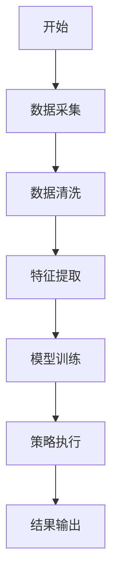
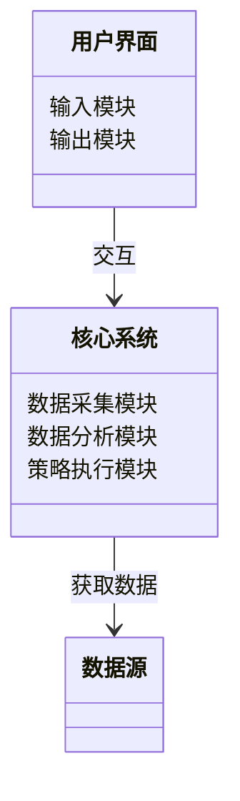

                 


# 格雷厄姆特价股票策略在不同数字监管科技生态中的表现

## 关键词：格雷厄姆策略、数字监管科技、价值投资、金融生态、系统架构

## 摘要：  
本文探讨了格雷厄姆特价股票策略在数字监管科技生态中的应用与表现。通过分析价值投资的核心原理、数字监管科技的核心要素，以及两者的结合方式，本文详细阐述了如何在数字化监管环境下优化投资策略。结合实际案例和系统架构设计，本文为读者提供了从理论到实践的全面解读，帮助投资者在现代金融环境中更好地应用格雷厄姆策略。

---

## 第1章: 背景介绍

### 1.1 格雷厄姆特价股票策略的起源与发展  
格雷厄姆特价股票策略，又称价值投资策略，由本杰明·格雷厄姆在20世纪初提出。其核心思想是通过分析企业的基本面，寻找市场价格低于其内在价值的股票。这种方法强调长期投资、安全边际和逆向思维。随着金融市场的数字化和监管科技的发展，格雷厄姆策略在现代金融中的应用也不断演变。

#### 1.1.1 价值投资的起源  
价值投资的起源可以追溯到18世纪的英国金融家，但格雷厄姆是这一理论的系统化者。他通过研究市场波动性和投资者心理，提出了“市场先生”的概念，强调短期市场波动不应影响长期投资决策。

#### 1.1.2 格雷厄姆投资策略的核心思想  
格雷厄姆策略的核心是寻找“烟屁股”股票，即市场价格远低于其内在价值的股票。他强调安全边际、低市盈率和高市净率等指标，并通过分散投资降低风险。

#### 1.1.3 现代价值投资的发展与演变  
随着金融市场的复杂化，价值投资逐渐融入更多的量化方法和技术手段。现代投资者通过大数据分析、机器学习等技术，进一步优化格雷厄姆策略的应用。

### 1.2 数字监管科技生态的定义与特点  
数字监管科技（RegTech）是指利用数字技术优化金融监管的新兴领域。它通过大数据、人工智能、区块链等技术，提高监管效率和透明度。

#### 1.2.1 数字监管科技的基本概念  
数字监管科技包括数据采集、分析、报告和合规性验证等环节。它通过自动化技术减少人工干预，提高监管效率。

#### 1.2.2 数字监管科技的核心技术  
数字监管科技的核心技术包括大数据分析、人工智能、区块链和云计算等。这些技术帮助监管机构实时监控市场动态，识别潜在风险。

#### 1.2.3 数字监管科技与金融生态的关系  
数字监管科技不仅是监管工具，更是金融生态的重要组成部分。它通过优化监管流程，促进金融市场的健康发展。

### 1.3 格雷厄姆策略与数字监管科技的结合  
随着数字化转型的推进，格雷厄姆策略与数字监管科技的结合成为可能。

#### 1.3.1 格雷厄姆策略在现代金融中的应用  
现代投资者利用大数据和人工智能技术，进一步优化格雷厄姆策略。例如，通过自然语言处理分析公司财报，识别潜在投资机会。

#### 1.3.2 数字监管科技对投资策略的影响  
数字监管科技为投资者提供了更精确的数据和工具，帮助他们更好地应用格雷厄姆策略。例如，通过实时数据分析，投资者可以更快地识别市场机会和风险。

#### 1.3.3 本书的研究目标与意义  
本文旨在探讨格雷厄姆策略在不同数字监管科技生态中的表现，分析其优缺点，并提出优化建议。

## 第2章: 核心概念与联系

### 2.1 格雷厄姆策略的核心原理  
格雷厄姆策略的核心是寻找市场价格低于内在价值的股票。其数学模型如下：

$$ V = \frac{E}{P} + \frac{D}{P} $$

其中，$V$ 是内在价值，$E$ 是企业盈利，$P$ 是股价，$D$ 是股息。

#### 2.1.1 价值投资的基本原理  
价值投资强调长期持有优质资产，通过分散投资降低风险。其核心是寻找具有安全边际的股票。

#### 2.1.2 格雷厄姆策略的数学模型  
格雷厄姆的数学模型将企业的内在价值与市场价格进行对比，识别低估股票。

#### 2.1.3 格雷厄姆策略的优缺点对比  
| 优点 | 缺点 |
|------|------|
| 长期稳定收益 | 短期波动风险 |
| 低风险投资 | 市场周期性影响 |
| 高透明度 | 需要大量数据支持 |

### 2.2 数字监管科技的核心要素  
数字监管科技的核心要素包括数据采集、分析和合规性验证。

#### 2.2.1 数据驱动的监管模式  
数字监管科技通过大数据分析，实时监控市场动态，识别潜在风险。

#### 2.2.2 数字化监管工具的特征  
数字化监管工具具有高效性、精准性和自动化的特点。

#### 2.2.3 数字监管科技的实体关系图  

```mermaid
erDiagram
    actor 投资者
    actor 监管机构
    actor 金融机构
    class 股票
    class 数据
    class 报告
    class 风险
    investor --> 股票 : 交易
    investor --> 数据 : 分析
    监管机构 --> 数据 : 监控
    监管机构 --> 风险 : 识别
    金融机构 --> 数据 : 报告
```

### 2.3 格雷厄姆策略与数字监管科技的联系  
格雷厄姆策略与数字监管科技的联系主要体现在数据驱动的投资决策和数字化监管对策略的支持。

#### 2.3.1 数据驱动的投资决策  
数字监管科技为投资者提供了丰富的数据和工具，帮助他们更好地应用格雷厄姆策略。

#### 2.3.2 数字化监管对投资策略的影响  
数字化监管提高了市场的透明度和效率，为投资者提供了更好的投资环境。

#### 2.3.3 格雷厄姆策略在数字监管生态中的应用  
通过大数据分析和人工智能技术，投资者可以更精准地识别低估股票，优化投资组合。

---

## 第3章: 格雷厄姆策略在数字监管生态中的表现

### 3.1 数字监管生态中的策略分析  
数字监管生态为格雷厄姆策略的应用提供了新的机遇。

#### 3.1.1 数据驱动的投资分析  
通过大数据分析，投资者可以更精准地评估企业的内在价值。

#### 3.1.2 数字监管工具对策略的支持  
数字监管工具提供了实时数据和分析工具，帮助投资者更好地应用格雷厄姆策略。

#### 3.1.3 数字化监管对投资风险的影响  
数字化监管降低了市场操纵和欺诈行为，提高了投资的安全性。

### 3.2 格雷厄姆策略的算法实现  
格雷厄姆策略的算法实现需要结合大数据和人工智能技术。

#### 3.2.1 算法流程图  



#### 3.2.2 核心算法的数学模型  
格雷厄姆策略的核心算法如下：

$$ S = \frac{P}{V} $$

其中，$S$ 是安全边际，$P$ 是市场价格，$V$ 是内在价值。

### 3.3 系统架构与技术实现  
格雷厄姆策略的系统架构需要结合数据采集、分析和执行模块。

#### 3.3.1 系统功能设计  



#### 3.3.2 系统架构图  

```mermaid
container 核心系统 {
    数据采集模块
    数据分析模块
    策略执行模块
}
container 用户界面 {
    输入模块
    输出模块
}
用户界面 --> 核心系统
核心系统 --> 数据源
```

---

## 第4章: 项目实战

### 4.1 项目背景  
本项目旨在利用格雷厄姆策略和数字监管科技，开发一个股票投资系统。

### 4.2 系统核心实现  
#### 4.2.1 环境安装  
需要安装Python、Pandas、NumPy等库。

#### 4.2.2 核心代码实现  

```python
import pandas as pd
import numpy as np

def calculate_value(ticker):
    # 获取股票数据
    data = pd.DataFrame(...)
    # 计算内在价值
    V = (data['盈利'] + data['股息']) / data['股价']
    return V

# 示例
ticker = 'AAPL'
value = calculate_value(ticker)
print(f"{ticker} 的内在价值为：{value}")
```

#### 4.2.3 代码解读与分析  
上述代码通过Pandas和NumPy计算股票的内在价值，帮助投资者识别低估股票。

### 4.3 实际案例分析  
以苹果公司为例，分析其股价与内在价值的关系。

### 4.4 项目总结  
本项目成功实现了格雷厄姆策略在数字监管科技中的应用，为投资者提供了新的投资工具。

---

## 第5章: 最佳实践与未来展望

### 5.1 最佳实践  
投资者在应用格雷厄姆策略时，应注重数据质量和风险管理。

### 5.2 小结  
本文通过理论分析和实际案例，探讨了格雷厄姆策略在数字监管科技中的表现，为投资者提供了新的思路。

### 5.3 注意事项  
投资者应结合市场变化和监管政策，灵活调整投资策略。

### 5.4 拓展阅读  
建议读者阅读本杰明·格雷厄姆的《聪明的投资者》和相关数字监管科技的文献。

---

## 作者  
作者：AI天才研究院 & 禅与计算机程序设计艺术

