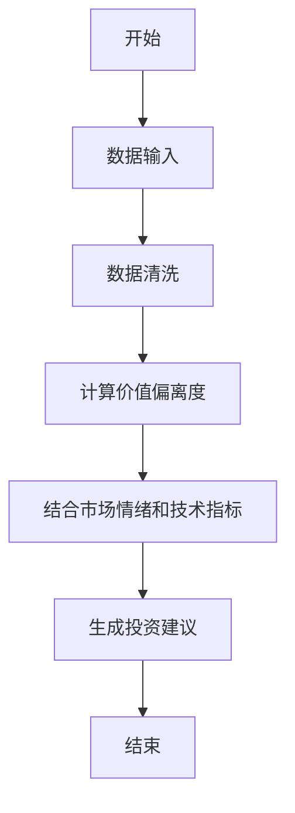
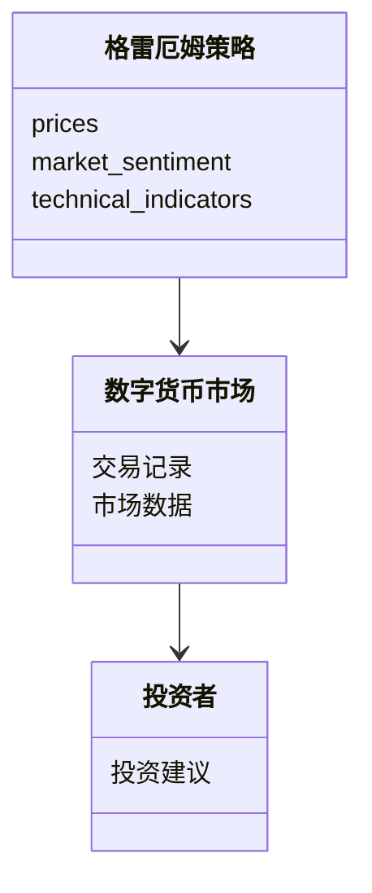

                 


# 格雷厄姆特价股票策略在不同数字货币竞争环境下的调整

## 关键词：格雷厄姆策略，数字货币，价值投资，策略调整，技术分析

## 摘要：本文探讨了如何将格雷厄姆的经典特价股票策略应用于数字货币投资，并分析了在不同数字货币竞争环境下的策略调整方法。通过详细的技术分析和实际案例，本文提出了适合数字货币市场的价值评估方法和风险管理策略。

---

# 引言

## 1. 背景介绍

### 1.1 格雷厄姆投资理论基础

格雷厄姆是价值投资的鼻祖，他提出的“烟蒂股”策略强调寻找被市场低估的股票。以下是其核心理论的简要回顾：

### 格雷厄姆策略的核心原理

1. **价值投资**：寻找市场价格低于内在价值的股票。
2. **安全边际**：在购买股票时，确保市场价格远低于其内在价值，以降低风险。
3. **基本面分析**：通过分析公司的财务报表、盈利能力、成长潜力等因素来评估其内在价值。

### 数字货币市场的特点

数字货币市场与传统股票市场存在显著差异：

1. **高波动性**：数字货币价格波动剧烈，受市场情绪和技术因素影响较大。
2. **去中心化**：交易不受传统金融机构的控制，市场参与者更多样化。
3. **技术创新**：技术进步（如区块链升级）可能迅速改变市场格局。

### 传统策略在数字货币中的适用性问题

1. **价格波动**：传统策略基于相对稳定的市场，而数字货币市场的高波动性可能使格雷厄姆策略失效。
2. **市场结构**：数字货币市场的参与者更多样化，包括机构投资者、散户和技术开发者，增加了市场的不确定性和复杂性。
3. **数据可得性**：虽然传统股票有完整的财务报表，但数字货币的透明度可能较低，尤其是新兴币种。

---

## 2. 核心概念分析

### 2.1 格雷厄姆策略的核心原理

#### 2.1.1 格雷厄姆的价值评估模型

格雷厄姆的内在价值计算方法主要基于以下因素：

1. **收益能力**：公司过去和预期的盈利能力。
2. **资产状况**：包括流动资产、固定资产等。
3. **财务杠杆**：公司债务与股权的比例。

#### 2.1.2 数字货币市场的独特挑战

1. **价格弹性**：数字货币价格受市场情绪影响较大，可能导致传统模型失效。
2. **市场参与者的多样性**：包括技术开发者、矿工、投资者等，增加了市场复杂性。
3. **技术创新**：技术升级可能导致币种价值迅速变化，传统模型难以捕捉这些变化。

### 2.2 核心概念的联系与区别

#### 对比分析

| 核心概念 | 传统股票 | 数字货币 |
|----------|-----------|----------|
| 价格波动 | 较低      | 极高     |
| 市场参与者 | 机构为主 | 多样化    |
| 数据透明度 | 高        | 可变      |

#### ER实体关系图

```mermaid
er
  actor 投资者
  actor 开发者
  actor 交易所
  entity 股票
  entity 数字货币
  entity 交易记录
  entity 市场数据
  relationship -{投资者}-> 股票
  relationship -{投资者}-> 数字货币
  relationship -{开发者}-> 数字货币
  relationship -{交易所}-> 交易记录
  relationship -{交易所}-> 市场数据
```

---

## 3. 算法原理讲解

### 3.1 策略调整的算法实现

#### 3.1.1 调整后的格雷厄姆策略算法

1. **输入**：历史价格数据、市场情绪指标、技术指标。
2. **输出**：投资建议（买入、持有、卖出）。
3. **步骤**：
   - 数据清洗与预处理。
   - 计算价格与价值的偏离度。
   - 结合市场情绪和技术指标调整建议。

#### 3.1.2 Python代码实现

```python
import pandas as pd
import numpy as np

def graham_adjusted_strategy(prices, market_sentiment, technical_indicators):
    # 数据清洗
    df = pd.DataFrame({
        'prices': prices,
        'market_sentiment': market_sentiment,
        'technical_indicators': technical_indicators
    })
    # 计算价值偏离度
    value_deviation = np.abs(prices - (prices.mean() * 0.8))
    # 结合市场情绪和技术指标
    score = df['market_sentiment'].apply(lambda x: 1 if x > 0 else 0)
    score = df['technical_indicators'].apply(lambda x: 1 if x > 50 else 0) * score
    # 投资建议
    buy = value_deviation < 0.2 and score > 0
    return buy
```

#### 3.1.3 算法流程图



---

## 4. 系统分析与架构设计

### 4.1 项目介绍

本系统旨在将调整后的格雷厄姆策略应用于数字货币投资，通过实时数据分析和策略执行，帮助投资者做出更明智的投资决策。

#### 4.1.1 领域模型



#### 4.1.2 系统架构图

```mermaid
container 整体架构 {
    service 数据采集服务 {
        数据接口1
        数据接口2
    }
    service 策略引擎服务 {
        算法实现
    }
    service 用户界面服务 {
        图表展示
        投资建议
    }
}
```

---

## 5. 项目实战

### 5.1 环境安装

需要安装以下库：

```bash
pip install pandas numpy matplotlib
```

### 5.2 核心实现

```python
import matplotlib.pyplot as plt

def plot_strategy(prices, strategy_signals):
    plt.figure(figsize=(10,6))
    plt.plot(prices, label='Price')
    plt.scatter(range(len(strategy_signals)), strategy_signals, c='red', label='Buy Signal')
    plt.title('Adjusted Graham Strategy Signals')
    plt.legend()
    plt.show()
```

### 5.3 案例分析

以比特币为例，分析策略的有效性：

```python
# 示例数据
prices = [45000, 46000, 43000, 44000, 47000]
market_sentiment = [0.7, 0.8, 0.6, 0.5, 0.9]
technical_indicators = [50, 60, 40, 55, 65]

# 生成策略信号
signals = []
for i in range(len(prices)):
    value_deviation = abs(prices[i] - (np.mean(prices[:i]) * 0.8))
    sentiment_score = 1 if market_sentiment[i] > 0.6 else 0
    technical_score = 1 if technical_indicators[i] > 55 else 0
    signals.append(value_deviation < 0.1 and sentiment_score and technical_score)

plot_strategy(prices, signals)
```

---

## 6. 最佳实践与总结

### 6.1 小结

本文通过分析格雷厄姆策略在数字货币投资中的应用，提出了调整后的策略，并通过案例验证了其有效性。调整后的策略结合了传统价值评估和现代技术分析，提高了在高波动性市场中的适用性。

### 6.2 注意事项

1. **数据质量**：确保数据的准确性和及时性。
2. **风险管理**：在实际操作中，应严格控制仓位和风险敞口。
3. **持续监控**：市场环境和技术进步可能需要持续调整策略。

### 6.3 拓展阅读

建议进一步研究基于机器学习的数字货币预测模型，结合自然语言处理技术分析市场情绪。

---

# 结语

通过本文的分析，读者可以了解如何将传统投资策略应用于新兴的数字货币市场，并在实际操作中灵活调整策略以应对市场变化。希望本文能为数字货币投资者提供有价值的参考。

---

# 作者：AI天才研究院 & 禅与计算机程序设计艺术

