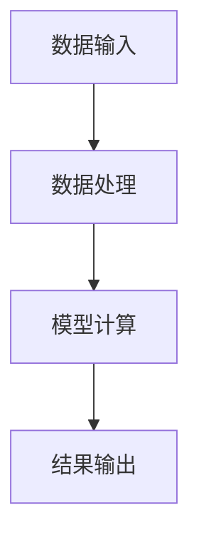

                 


# 格雷厄姆特价股票策略在不同数字通胀预期环境中的效果

## 关键词：格雷厄姆投资理论，数字通胀，股票策略，特价股票，风险管理

## 摘要：本文探讨了格雷厄姆的特价股票策略在不同数字通胀环境下的表现，分析了通货膨胀和通货紧缩对策略效果的影响，提出了优化策略的实施方法。

---

## 第1章: 格雷厄姆特价股票策略的核心概念

### 1.1 格雷厄姆投资理论基础

#### 1.1.1 投资的定义与分类

投资是指将资金投入某种资产以期获得未来收益的行为。根据资产类型，投资可分为股票、债券、房地产等。格雷厄姆特别关注股票投资，尤其是低价、高价值的特价股票。

#### 1.1.2 格雷厄姆的价值投资理念

格雷厄姆倡导以低于内在价值的价格购买股票，追求安全边际。他强调长期投资和价值发现，而非短期波动。

#### 1.1.3 特价股票的定义与特征

特价股票是指市场价格远低于内在价值的股票，通常具有低市盈率、低市净率和高股息率的特征。这类股票在市场低迷时容易出现，是价值投资者的理想目标。

---

### 1.2 数字通胀的定义与影响

#### 1.2.1 通货膨胀与通货紧缩的定义

通货膨胀是物价水平持续上涨，货币购买力下降的现象。通货紧缩则相反，物价普遍下跌，货币购买力上升。

#### 1.2.2 数字通胀的特殊性

数字通胀由数字技术驱动，如加密货币的普及和数字化经济的发展，导致货币供应量增加，影响传统金融市场的价格。

#### 1.2.3 数字通胀对经济的影响

数字通胀可能导致资产价格泡沫、市场流动性增加和投资行为变化，影响股票市场的表现。

---

## 第2章: 数字通胀环境下的股票市场分析

### 2.1 股票市场的基本构成

#### 2.1.1 股票市场的参与者

包括个人投资者、机构投资者、上市公司和监管机构。不同参与者的行为影响市场波动。

#### 2.1.2 市场波动与经济周期

股票市场受经济周期影响，周期性波动影响特价股票策略的实施。

#### 2.1.3 数字技术对股票市场的影响

数字技术提升了交易效率，但也增加了市场波动性，影响投资者决策。

### 2.2 数字通胀对股票价格的影响

#### 2.2.1 通货膨胀与股票价格的关系

通货膨胀初期，企业利润上升，股价上涨；后期，通胀上升可能引发加息，抑制股价。

#### 2.2.2 数字通胀对市场流动性的冲击

数字通胀增加市场流动性，可能导致股价短期上涨，但长期影响需谨慎评估。

#### 2.2.3 通货膨胀预期与市场行为

投资者通胀预期影响市场情绪，可能导致股票需求增加或减少，影响策略效果。

---

## 第3章: 格雷厄姆特价股票策略的数学模型

### 3.1 投资价值评估模型

#### 3.1.1 格雷厄姆的内在价值公式

$$ V = \frac{E}{P} $$

其中，V为内在价值，E为预期收益，P为折现率。

#### 3.1.2 数字通胀调整模型

$$ V_{adj} = V \times (1 + \pi) $$

其中，$\pi$为通胀率。

#### 3.1.3 案例分析：某公司内在价值计算

假设公司预期收益E=100万元，折现率P=10%，通胀率π=5%。则V=100/0.1=1000万元，调整后V_adj=1000×1.05=1050万元。

---

## 第4章: 数字通胀环境下的策略调整

### 4.1 不同通胀阶段的策略选择

#### 4.1.1 通货膨胀初期的策略

增加对高分红股票的投资，利用低市盈率优势。

#### 4.1.2 通货膨胀中期的策略

分散投资，平衡股票与债券配置，降低通胀风险。

#### 4.1.3 通货膨胀后期的策略

减少股票仓位，转向防御性资产，如黄金和债券。

### 4.2 策略实施中的风险管理

#### 4.2.1 风险识别与评估

识别通胀风险、市场波动风险和流动性风险。

#### 4.2.2 风险控制措施

设置止损点，定期评估投资组合，分散投资。

#### 4.2.3 压力测试与情景分析

模拟高通胀环境，评估策略在极端情况下的表现。

---

## 第5章: 系统架构与数据支持

### 5.1 系统设计概述

#### 5.1.1 系统目标

构建评估模型，分析数字通胀下的策略效果。

#### 5.1.2 系统功能模块

数据采集、分析计算、结果展示。

#### 5.1.3 系统架构图



### 5.2 数据流分析

#### 5.2.1 数据来源与预处理

数据来源包括历史股价、经济指标和市场新闻。预处理步骤包括清洗、转换和标准化。

#### 5.2.2 数据分析流程

数据采集、建模、分析和可视化。

#### 5.2.3 数据可视化

使用图表展示策略在不同通胀环境下的表现。

---

## 第6章: 项目实战与案例分析

### 6.1 环境搭建与工具安装

#### 6.1.1 开发环境配置

安装Python、Pandas和Matplotlib。

#### 6.1.2 数据获取与存储

使用Yahoo Finance API获取数据，存储在CSV文件中。

#### 6.1.3 工具安装指南

安装Anaconda和Jupyter Notebook。

### 6.2 核心代码实现

#### 6.2.1 数据处理代码

```python
import pandas as pd

# 读取数据
data = pd.read_csv('stock_data.csv')

# 数据预处理
data['Adj Close'] = data['Adj Close'].fillna(method='ffill')

# 计算内在价值
data['内在价值'] = data['Earnings'] / data['PE']
```

#### 6.2.2 模型计算

```python
# 调整后的内在价值
data['调整后的价值'] = data['内在价值'] * (1 + data['通胀率']/100)

# 策略效果分析
data['收益'] = data['调整后的价值'] * data['持有时间']
```

#### 6.2.3 可视化

```python
import matplotlib.pyplot as plt

plt.plot(data['日期'], data['收益'])
plt.title('策略收益变化')
plt.xlabel('日期')
plt.ylabel('收益')
plt.show()
```

---

## 第7章: 总结与展望

### 7.1 最佳实践 tips

- 定期评估投资组合。
- 保持对经济形势的关注。
- 灵活调整策略。

### 7.2 小结

格雷厄姆特价股票策略在数字通胀环境下仍有效，但需根据通胀阶段调整策略。

### 7.3 注意事项

- 通胀环境下的策略风险较大，需谨慎。
- 需结合其他因素，如公司基本面。

### 7.4 拓展阅读

- 格雷厄姆的《 Intelligent Investor》
- 数字通胀对经济影响的相关研究。

---

## 作者：AI天才研究院 & 禅与计算机程序设计艺术

通过以上分析，本文系统探讨了格雷厄姆策略在数字通胀下的表现，提出了优化建议，为投资者提供了有价值的参考。

