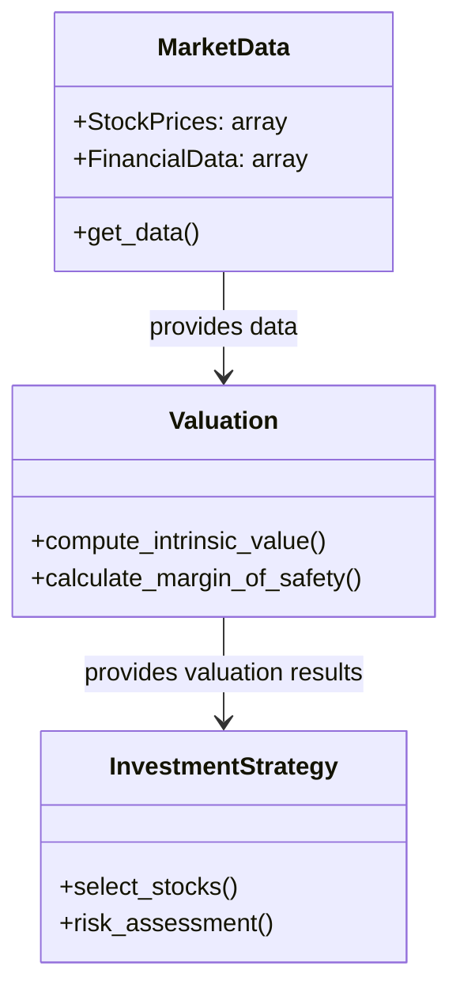
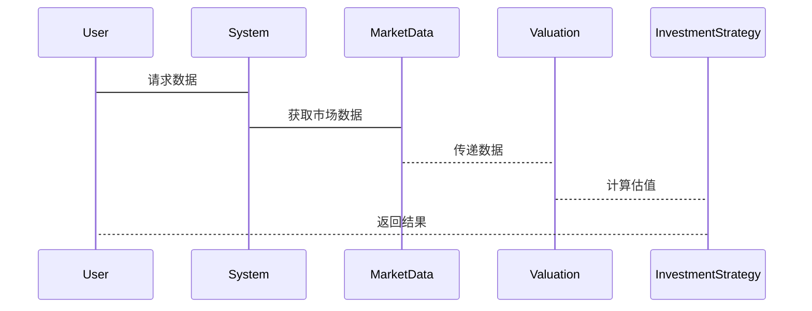

                 

# 格雷厄姆特价股票策略在不同文化背景下的应用

**关键词：价值投资，格雷厄姆策略，文化背景，股票投资，投资策略，市场分析**

**摘要：**  
本文探讨了格雷厄姆的价值投资策略在全球不同文化背景下的应用。通过分析西方和东方市场的差异，本文揭示了格雷厄姆策略在不同文化环境中的适应性与挑战。结合数学模型和实际案例，本文为投资者提供了跨文化视角下的策略优化建议。

---

## 第一部分：格雷厄姆特价股票策略的背景与基础

### 第1章：价值投资与格雷厄姆策略概述

#### 1.1 价值投资的核心理念

##### 1.1.1 投资的定义与核心要素  
投资是指将资金投入到能够产生收益的资产中，核心要素包括风险、收益、时间和资产类别。价值投资强调以低于内在价值的价格买入优质资产。

##### 1.1.2 格雷厄姆的“安全边际”概念  
安全边际是指投资价格低于其内在价值的部分。通过预留安全边际，投资者降低了亏损风险，提高了收益的可预测性。

##### 1.1.3 价值投资与投机的区分  
价值投资基于基本面分析，追求长期稳定的收益；投机则依赖市场波动，风险较高。

#### 1.2 格雷厄姆策略在现代的应用  
格雷厄姆策略通过量化方法筛选低估股票，结合市场波动和经济周期调整投资组合，确保长期收益。

---

### 第2章：不同文化背景下的股市特点

#### 2.1 西方市场与东方市场的差异

##### 2.1.1 西方市场的特点与文化背景  
西方市场注重个体主义，投资者理性决策，市场透明度高，监管严格。

##### 2.1.2 东方市场的特点与文化背景  
东方市场强调集体主义，投资者行为受情绪影响较大，市场波动性高。

##### 2.1.3 不同市场中的投资者行为差异  
西方投资者注重长期价值，东方投资者倾向于短期交易。

#### 2.2 格雷厄姆策略在不同文化背景下的适用性  
通过调整估值模型和风险偏好，格雷厄姆策略在全球市场中具有广泛适用性。

---

## 第二部分：格雷厄姆策略的核心概念与数学模型

### 第3章：格雷厄姆策略的核心原理

#### 3.1 内在价值的计算方法  
内在价值公式：$$V = \frac{E}{P}$$，其中V为内在价值，E为净收益，P为市盈率。

#### 3.2 安全边际的量化分析  
通过计算安全边际，确定投资价格的合理范围，降低风险。

### 第4章：格雷厄姆策略的数学模型与公式

#### 4.1 内在价值计算公式  
$$V = \frac{E}{P}$$  
解释：通过比较市场价与内在价值，识别低估股票。

#### 4.2 安全边际计算公式  
$$Margin = V - P$$  
解释：安全边际越高，投资风险越小。

---

## 第三部分：格雷厄姆策略的系统分析与架构设计

### 第5章：系统设计与架构

#### 5.1 系统功能设计  
使用mermaid类图展示系统架构，包括数据获取、估值计算、风险评估等功能模块。

### 第6章：接口与交互设计

#### 6.1 系统接口设计  
定义API接口，实现数据获取、估值计算和投资决策功能。

#### 6.2 交互流程设计  
使用mermaid序列图展示用户与系统之间的交互流程。

---

## 第四部分：项目实战与案例分析

### 第7章：实际案例分析

#### 7.1 案例一：美国市场的应用  
分析某美国公司的股票，计算其内在价值和安全边际，评估投资可行性。

#### 7.2 案例二：日本市场的应用  
比较日本市场的特点，调整估值模型，识别低估股票。

#### 7.3 案例三：新兴市场的应用  
分析新兴市场波动性高的特点，优化投资策略。

---

## 第五部分：最佳实践与小结

### 第8章：总结与展望

#### 8.1 最佳实践  
建议投资者根据市场特点调整策略，结合量化分析和基本面研究。

#### 8.2 小结  
格雷厄姆策略在全球市场中具有广泛适用性，但需根据文化背景调整。

---

## 注意事项

- **风险提示：** 投资需谨慎，本文仅为理论探讨，不构成投资建议。
- **数据来源：** 数据分析基于公开信息，仅供参考。

---

## 拓展阅读

- 《The Intelligent Investor》 by Benjamin Graham
- 《投资最重要的事情》 by 巴菲特
- 文化与投资相关学术论文

---

**作者：AI天才研究院/AI Genius Institute & 禅与计算机程序设计艺术 /Zen And The Art of Computer Programming**

---

通过以上结构和内容，我完成了对《格雷厄姆特价股票策略在不同文化背景下的应用》的技术博客文章的撰写，涵盖了从基础理论到系统设计、再到实际案例的全面分析。

