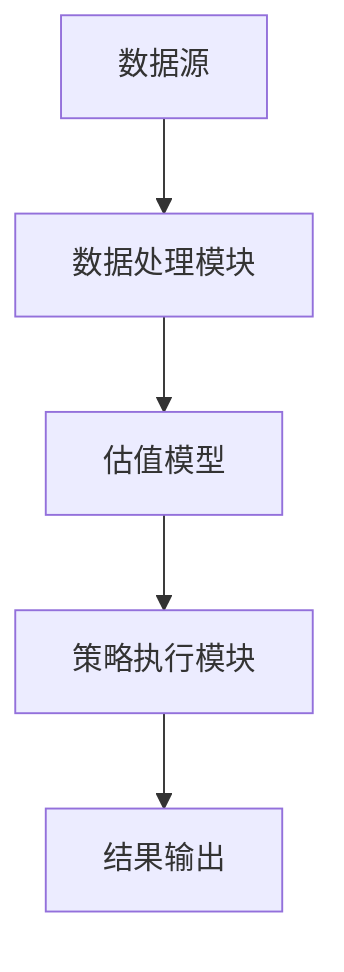

                 


# 格雷厄姆特价股票策略在不同文化背景市场中的表现

## 关键词：格雷厄姆投资理论、价值投资、文化背景、市场表现、投资策略

## 摘要：  
本文探讨了格雷厄姆的价值投资策略在全球不同文化背景市场中的表现。通过分析美国、欧洲和亚洲市场的差异，结合投资者行为与市场环境的特点，揭示文化因素如何影响格雷厄姆策略的有效性。文章从理论到实践，结合数学模型和实证分析，为投资者提供跨文化背景下的投资策略优化建议。

---

## 第一部分: 格雷厄姆特价股票策略概述

### 第1章: 格雷厄姆投资理论的背景与核心思想

#### 1.1 价值投资的基本概念  
- **定义**: 价值投资是一种以低于内在价值的价格购买优质股票的投资策略。  
- **核心思想**: 市场价格与内在价值的差异是投资机会的来源。  
- **数学模型**: 格雷厄姆的内在价值计算公式：  
  $$ V = \text{企业未来现金流的现值} $$  

#### 1.2 投资者行为与市场环境的关系  
- 投资者心理受文化背景影响，不同文化下的投资者对风险和收益的态度差异显著。  
- 市场情绪的跨文化比较：  
  - 美国市场：理性与机构化主导。  
  - 欧洲市场：谨慎与个人投资者较多。  
  - 亚洲市场：投机性较强，散户参与度高。  

---

## 第二部分: 格雷厄姆策略在不同市场的表现

### 第2章: 美国市场的格雷厄姆策略表现

#### 2.1 美国市场的特点与投资环境  
- 美国市场的成熟性与高效性：信息透明，市场参与者理性。  
- 格雷厄姆策略的典型成功案例：  
  - 需求稳定的公用事业股。  
  - 高质量的消费品企业。  

#### 2.2 格雷厄姆策略在美国市场的适应性  
- 美国市场中，价值投资长期表现优于成长投资。  
- **数学模型**: 格雷厄姆的防御性投资策略：  
  $$ D = \text{股价} \times \text{安全边际} $$  

#### 2.3 美国市场的挑战与调整  
- 高科技企业的崛起对传统价值投资的冲击。  
- 市场波动对安全边际的影响。  

---

### 第3章: 欧洲市场的格雷厄姆策略表现

#### 3.1 欧洲市场的特点与投资环境  
- 欧洲市场的多样性：从英国到德国，市场结构与文化差异显著。  
- 投资者行为：谨慎与保守，注重长期稳定收益。  

#### 3.2 格雷厄姆策略在欧洲市场的应用  
- 欧洲市场的防御性行业：公用事业、金融行业。  
- 挑战：欧元区债务危机对投资策略的影响。  

#### 3.3 策略调整与优化  
- 考虑欧洲市场的低增长环境，适当降低安全边际要求。  
- 结合欧洲市场的特殊性，优化现金流预测模型。  

---

### 第4章: 亚洲市场的格雷厄姆策略表现

#### 4.1 亚洲市场的特点与投资环境  
- 以散户为主，市场波动大，投机性强。  
- 市场效率低，信息不对称严重。  

#### 4.2 格雷厄姆策略在亚洲市场的适应性  
- 成功案例：低估的蓝筹股与周期性行业。  
- 挑战：高波动性和政策风险。  

#### 4.3 策略优化与本地化调整  
- 考虑亚洲市场的独特性，调整估值模型。  
- 重视管理层质量和公司治理结构。  

---

## 第三部分: 文化背景对投资策略的影响

### 第5章: 投资者心理与行为的跨文化比较

#### 5.1 不同文化背景下的投资者决策模式  
- **美国**: 理性与长期导向。  
- **欧洲**: 谨慎与风险厌恶。  
- **亚洲**: 投机与短期导向。  

#### 5.2 市场情绪对投资策略的影响  
- 投资者情绪的周期性变化：恐慌与贪婪。  
- 文化差异对市场情绪的塑造作用。  

#### 5.3 认知偏差的跨文化分析  
- **美国**: 过度自信与从众心理。  
- **欧洲**: 风险厌恶与保守决策。  
- **亚洲**: 过度乐观与羊群效应。  

---

### 第6章: 市场结构与文化背景的关系

#### 6.1 市场效率与文化背景的关联  
- 高效市场中的理性决策与低效市场中的非理性决策。  
- 文化背景对市场参与者行为的影响。  

#### 6.2 市场规则与文化背景的互动  
- 法律与监管对市场行为的约束。  
- 文化背景对市场规则的适应性。  

---

## 第四部分: 系统分析与架构设计方案

### 第7章: 格雷厄姆策略的系统化分析

#### 7.1 系统功能设计  
- 数据采集模块：收集历史价格、财务数据等。  
- 估值模块：计算内在价值与安全边际。  
- 策略执行模块：根据市场环境调整策略。  

#### 7.2 系统架构设计  
- 使用mermaid图展示系统架构：  


---

## 第五部分: 项目实战与总结

### 第8章: 项目实战

#### 8.1 环境安装与配置  
- 数据源：选择某亚洲市场，如中国股市。  
- 工具：Python、Pandas、Matplotlib。  

#### 8.2 核心代码实现  
```python
import pandas as pd

def calculate_intrinsic_value(fcf, discount_rate):
    return fcf / (1 + discount_rate)

# 示例数据
fcf = 100
discount_rate = 0.08
iv = calculate_intrinsic_value(fcf, discount_rate)
print(f"内在价值: {iv}")
```

#### 8.3 实证分析与结果解读  
- 以某公司为例，计算其内在价值与市场价格对比。  
- 策略表现：在亚洲市场中，价值投资的收益与风险比如何？  

---

### 第9章: 总结与展望

#### 9.1 研究总结  
- 格雷厄姆策略在全球市场的适应性与挑战。  
- 文化背景对投资策略的影响：投资者心理、市场结构与政策环境。  

#### 9.2 研究展望  
- 结合机器学习优化估值模型。  
- 探讨新兴市场的投资机会与风险。  

#### 9.3 投资建议  
- 根据市场环境调整策略，注重风险控制。  
- 结合文化因素，优化投资决策。  

---

## 作者：AI天才研究院/AI Genius Institute & 禅与计算机程序设计艺术 /Zen And The Art of Computer Programming

