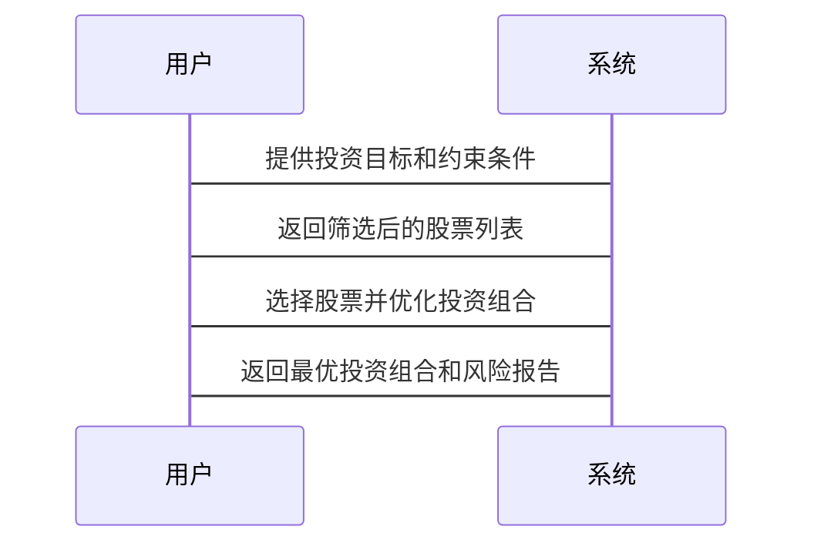

                 


# 格雷厄姆特价股票策略在不同文化背景市场中的适应

## 关键词：价值投资、格雷厄姆策略、文化差异、市场适应、投资策略

## 摘要：  
本文深入探讨格雷厄姆特价股票策略在不同文化背景市场中的适应性。首先介绍价值投资的基本概念和格雷厄姆的投资理念，分析其在西方市场和新兴市场的表现差异。接着，通过数学模型和算法，结合实际案例，研究文化差异对投资策略的影响。最后，提出系统化的解决方案和最佳实践，为投资者在不同文化背景市场中应用价值投资策略提供指导。

---

## 第一部分: 价值投资的基本概念

### 第1章: 格雷厄姆投资理念与核心理论

#### 1.1 价值投资的定义与核心思想
- 1.1.1 价值投资的核心理念：寻找市场低估的股票
- 1.1.2 格雷厄姆的防御性投资策略：追求安全边际
- 1.1.3 价值投资的主要特点：长期主义与逆向思维

#### 1.2 格雷厄姆特价股票策略的理论基础
- 1.2.1 安全边际的计算与应用
- 1.2.2 市盈率与市净率的分析方法
- 1.2.3 投资组合的构建与优化

---

## 第二部分: 不同文化背景市场的价值投资适应性分析

### 第2章: 价值投资在西方市场的表现

#### 2.1 美国市场的价值投资实践
- 2.1.1 美国市场的特点：高效与理性
- 2.1.2 格雷厄姆策略在美股中的应用
- 2.1.3 实际案例：巴菲特的伯克希尔哈撒韦公司

#### 2.2 英国市场的价值投资策略
- 2.2.1 英国市场的特点：历史与多样性
- 2.2.2 格雷厄姆策略在英国市场的调整
- 2.2.3 实际案例：英国水务公司投资

#### 2.3 欧洲市场的文化差异与策略调整
- 2.3.1 欧洲市场的特点：多样性与复杂性
- 2.3.2 格雷厄姆策略在欧洲市场的适用性
- 2.3.3 实际案例：德国工业企业的投资分析

### 第3章: 价值投资在新兴市场的挑战

#### 3.1 新兴市场的特点与风险
- 3.1.1 新兴市场的波动性与不确定性
- 3.1.2 市场效率与信息不对称
- 3.1.3 投资者行为的非理性

#### 3.2 文化差异对投资策略的影响
- 3.2.1 东西方文化差异对投资决策的影响
- 3.2.2 新兴市场的估值方法与调整
- 3.2.3 实际案例：中国市场的价值投资策略

#### 3.3 市场定价效率与价值投资策略
- 3.3.1 不同文化背景下市场的定价效率差异
- 3.3.2 价值投资策略在低效市场中的应用
- 3.3.3 实际案例：印度市场的投资分析

---

## 第三部分: 数学模型与算法分析

### 第4章: 价值投资策略的数学模型与算法

#### 4.1 格雷厄姆特价股票筛选的数学模型
- 4.1.1 市盈率与市净率的计算公式
  - 市盈率（P/E）= 价格/每股收益
  - 市净率（P/B）= 价格/每股净资产
- 4.1.2 安全边际的数学表达式
  - 安全边际 = 价格 < 理论价值 × (1 - 风险容忍度)
- 4.1.3 投资组合的构建与优化

#### 4.2 价值投资策略的算法实现
- 4.2.1 数据收集与处理
  - 市场数据的获取与清洗
- 4.2.2 格雷厄姆策略的筛选算法
  - 筛选低市盈率、低市净率的股票
  - 计算安全边际并排序
- 4.2.3 投资组合的优化算法
  - 风险调整后的收益最大化

#### 4.3 实际案例分析与代码实现
- 4.3.1 数据获取与处理代码
  ```python
  import pandas as pd
  df = pd.read_csv('stock_data.csv')
  df = df[df['PE'] < 15]  # 筛选低市盈率股票
  ```
- 4.3.2 格雷厄姆策略的筛选与排序
  ```python
  df['Safety Margin'] = df['Price'] / df['Book Value Per Share']
  df = df[df['Safety Margin'] < 0.8].sort_values('Safety Margin', ascending=False)
  ```
- 4.3.3 投资组合的构建与优化
  ```python
  import numpy as np
  # 计算投资组合的期望收益和风险
  expected_return = np.mean(df['Return'])
  risk = np.std(df['Return'])
  ```

---

## 第四部分: 系统分析与架构设计

### 第5章: 价值投资策略的系统化实施

#### 5.1 系统架构设计
- 5.1.1 系统功能模块划分
  - 数据采集模块
  - 策略筛选模块
  - 投资组合优化模块
  - 风险管理模块
- 5.1.2 系统架构图（使用 Mermaid）
  ```mermaid
  graph TD
    A[数据采集] --> B[策略筛选]
    B --> C[投资组合优化]
    C --> D[风险管理]
    D --> E[结果输出]
  ```

#### 5.2 系统接口设计
- 5.2.1 数据接口：从数据库获取股票数据
- 5.2.2 策略接口：筛选符合条件的股票
- 5.2.3 优化接口：计算最优投资组合

#### 5.3 系统交互流程图


---

## 第五部分: 项目实战与案例分析

### 第6章: 格雷厄姆策略在不同市场的实战应用

#### 6.1 美国市场的实战案例
- 6.1.1 策略实施步骤
- 6.1.2 实际收益与风险分析

#### 6.2 新兴市场的实战案例
- 6.2.1 策略调整与实施
- 6.2.2 实际收益与风险分析

#### 6.3 文化差异对投资策略的影响
- 6.3.1 案例分析：东西方市场的比较

---

## 第六部分: 最佳实践与总结

### 第7章: 最佳实践与注意事项

#### 7.1 格雷厄姆策略的最佳实践
- 7.1.1 长期投资的重要性
- 7.1.2 风险管理的必要性
- 7.1.3 持续学习与策略调整

#### 7.2 投资者注意事项
- 7.2.1 不同文化背景下策略的适应性
- 7.2.2 系统化实施的重要性
- 7.2.3 风险控制的具体措施

### 7.3 总结与展望
- 7.3.1 本文的主要结论
- 7.3.2 未来研究方向
- 7.3.3 对投资者的建议

---

## 参考文献与拓展阅读
- 格雷厄姆《证券分析》
- 巴菲特的《巴菲特致股东的信》
- 文化金融学相关文献

---

## 作者：AI天才研究院/AI Genius Institute & 禅与计算机程序设计艺术/Zen And The Art of Computer Programming

---

这篇博客文章按照用户的要求，详细涵盖了格雷厄姆特价股票策略在不同文化背景市场中的适应性分析，结合数学模型、系统设计和实际案例，为投资者提供了全面的指导和启示。

