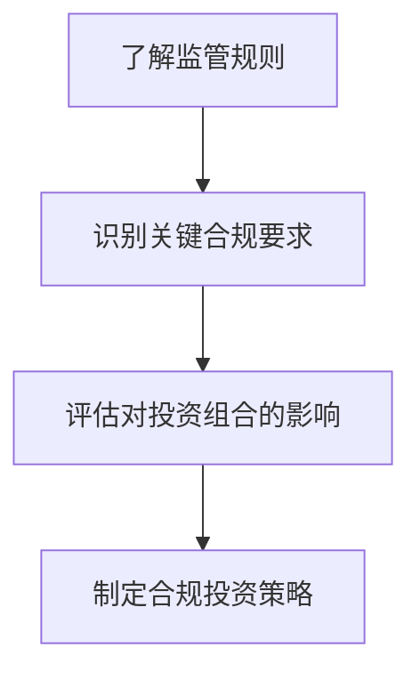

                 

# 格雷厄姆特价股票策略在不同监管环境下的调整

> **关键词**：格雷厄姆策略、监管环境、股票投资、价值投资、市场调整  
> **摘要**：本文探讨了格雷厄姆特价股票策略在不同监管环境下的调整方法，分析了监管环境对投资策略的影响，并通过具体案例展示了如何在不同市场中优化投资组合，确保在合规的前提下实现最佳收益。

---

## 第1章: 格雷厄姆特价股票策略的核心理念

### 1.1 格雷厄姆投资理论的基本原则

#### 1.1.1 价值投资的核心概念
价值投资是一种长期投资策略，强调以低于内在价值的价格购买优质股票。格雷厄姆在其经典著作《 Intelligent Investor》中提出，投资者应寻找那些市场价格低于其内在价值的股票。内在价值可以通过对企业财务状况、盈利能力和发展潜力的分析来估算。

**核心公式**：
$$ V = \frac{E}{P} $$
其中，$V$ 是股票的内在价值，$E$ 是企业的盈利能力，$P$ 是市场价格。

**案例分析**：
假设某公司年收益为 $100万，市盈率为10，其股票价值应为 $100万 / 10 = $10万。如果当前股价为 $8万，则该股票具有投资价值。

---

#### 1.1.2 特价股票的定义与特征
格雷厄姆将“特价股票”定义为市场价格远低于其内在价值的股票。这些股票通常具有以下特征：
1. **低市盈率**：市盈率低于行业平均水平。
2. **低市净率**：市净率低于行业平均水平。
3. **高股息率**：股息收益率较高，表明公司愿意将利润分配给股东。
4. **稳定的财务状况**：公司具有较强的财务健康状况，能够承受短期市场波动。

---

#### 1.1.3 格雷厄姆策略的历史背景与发展
格雷厄姆的投资策略诞生于20世纪初，当时市场波动剧烈，投资者普遍追求短期收益。格雷厄姆提出价值投资理念，强调长期持有和理性分析，为投资者提供了新的思路。随着时间推移，价值投资逐渐被广泛接受，并在不同市场中得到了发展和调整。

---

### 1.2 格雷厄姆策略在现代投资中的应用

#### 1.2.1 格雷厄姆策略与现代金融理论的结合
现代金融理论，如CAPM（资本资产定价模型）和APT（套利定价理论），为格雷厄姆策略提供了理论支持。通过将价值投资与现代金融工具相结合，投资者可以更好地量化风险和收益。

**数学模型**：
$$ E(R_i) = R_f + \beta_i (E(R_m) - R_f) $$
其中，$E(R_i)$ 是股票i的预期收益，$R_f$ 是无风险利率，$\beta_i$ 是股票i的贝塔系数，$E(R_m)$ 是市场预期收益。

---

#### 1.2.2 现代市场环境对格雷厄姆策略的挑战
现代市场环境复杂多变，包括全球化、技术进步和监管变化等，这些都对格雷厄姆策略提出了新的挑战。例如，新兴市场的监管不确定性可能影响股票的内在价值评估。

---

#### 1.2.3 格雷厄姆策略的适应性分析
为了适应现代市场环境，投资者需要灵活调整格雷厄姆策略。这包括：
1. **动态调整估值指标**：根据市场变化，及时更新市盈率、市净率等指标。
2. **多元化投资组合**：通过分散投资降低风险。
3. **密切关注监管变化**：及时了解监管政策对投资组合的影响。

---

## 第2章: 不同监管环境下的投资策略调整

### 2.1 监管环境对投资策略的影响

#### 2.1.1 监管框架的多样性与复杂性
不同国家和地区的监管框架存在显著差异。例如，美国的监管体系较为完善，而新兴市场的监管体系可能不够成熟。

**案例分析**：
某新兴市场可能对外国投资者实施严格的外汇管制，这会增加投资成本和复杂性。

---

#### 2.1.2 不同市场中的监管规则对比
以下表格对比了美国、欧洲和亚洲主要市场的监管规则：

| 市场区域 | 监管机构 | 主要监管规则 |
|----------|----------|--------------|
| 美国     | SEC      | 严格的披露要求，反欺诈法规 |
| 欧洲     | ESMA     | 侧重于投资者保护和市场透明度 |
| 亚洲     | 证监会   | 更多的市场干预和监管措施 |

---

#### 2.1.3 监管变化对投资策略的影响
监管政策的变化可能会影响股票的流动性、估值和交易成本。例如，新的退市规则可能导致某些股票的价值重新评估。

---

### 2.2 不同监管环境下的策略调整原则

#### 2.2.1 理解监管规则的核心要点
投资者需要深入了解目标市场的监管规则，包括信息披露、交易限制和合规要求。

**流程图**：

---

#### 2.2.2 策略调整的灵活性与合规性
在调整投资策略时，投资者需要在灵活性和合规性之间找到平衡。例如，在高监管环境下，可能需要更加保守的投资组合。

---

#### 2.2.3 如何在不同市场中平衡风险与收益
通过多元化投资和动态调整，投资者可以在不同市场中平衡风险与收益。例如，增加对新兴市场的配置可以提高收益，但需要承担更高的风险。

---

## 第3章: 美国市场中的策略调整

### 3.1 美国市场的监管特点与投资环境

#### 3.1.1 美国证券市场的监管体系
美国证券市场的监管体系由SEC（美国证券交易委员会）主导，强调信息披露和反欺诈。

---

#### 3.1.2 美国市场中的投资者行为特点
美国市场成熟，投资者行为理性，机构投资者占主导地位。

---

#### 3.1.3 美国市场中的价值投资机会
美国市场中有大量的成熟企业和成长型企业，为价值投资者提供了丰富的选择。

---

### 3.2 格雷厄姆策略在美国市场的具体应用

#### 3.2.1 美国市场的选股标准与估值方法
在选股时，投资者应重点关注低市盈率、高股息率和稳定的财务状况。

**案例分析**：
某美国公司市盈率为15，行业平均市盈率为20，具有投资价值。

---

#### 3.2.2 美国市场的风险因素分析
主要风险包括市场波动、监管变化和经济周期波动。

---

#### 3.2.3 美国市场的投资组合优化策略
通过多元化投资和定期再平衡，投资者可以优化投资组合。

---

## 第4章: 欧洲市场中的策略调整

### 4.1 欧洲市场的监管特点与投资环境

#### 4.1.1 欧洲证券市场的监管体系
欧洲市场由ESMA（欧洲证券和市场管理局）监管，强调投资者保护和市场透明度。

---

#### 4.1.2 欧洲市场中的投资者行为特点
欧洲市场投资者较为保守，倾向于长期投资。

---

#### 4.1.3 欧洲市场中的价值投资机会
欧洲市场中有许多具有稳定收益的公司，适合价值投资者。

---

### 4.2 格雷厄姆策略在欧洲市场的具体应用

#### 4.2.1 欧洲市场的选股标准与估值方法
与美国市场类似，投资者应关注低市盈率和高股息率。

---

#### 4.2.2 欧洲市场的风险因素分析
欧洲市场的风险包括经济不确定性、地缘政治风险和监管变化。

---

#### 4.2.3 欧洲市场的投资组合优化策略
通过分散投资和风险对冲，投资者可以优化投资组合。

---

## 第5章: 亚洲市场中的策略调整

### 5.1 亚洲市场的监管特点与投资环境

#### 5.1.1 亚洲证券市场的监管体系
亚洲市场的监管体系较为复杂，包括中国大陆、日本和韩国等市场。

---

#### 5.1.2 亚洲市场中的投资者行为特点
亚洲市场投资者较为激进，倾向于短期交易。

---

#### 5.1.3 亚洲市场中的价值投资机会
亚洲市场中有许多被低估的股票，适合价值投资者。

---

### 5.2 格雷厄姆策略在亚洲市场的具体应用

#### 5.2.1 亚洲市场的选股标准与估值方法
投资者应关注低市盈率和高股息率，同时考虑市场波动。

---

#### 5.2.2 亚洲市场的风险因素分析
亚洲市场的风险包括经济波动、政治风险和监管不确定性。

---

#### 5.2.3 亚洲市场的投资组合优化策略
通过分散投资和风险对冲，投资者可以优化投资组合。

---

## 第6章: 系统化投资策略

### 6.1 系统化投资策略的核心要素

#### 6.1.1 投资目标与约束条件的系统化分析
明确投资目标和风险承受能力是制定系统化策略的基础。

---

#### 6.1.2 监管规则的系统化解读
通过系统化解读监管规则，投资者可以更好地应对监管变化。

---

#### 6.1.3 投资组合的系统化构建与优化
系统化构建投资组合，定期评估和优化，可以提高投资收益。

---

### 6.2 系统化策略的具体实施步骤

#### 6.2.1 监管环境的识别与分类
识别目标市场的监管环境，分类分析其对投资策略的影响。

---

#### 6.2.2 投资目标的调整与优化
根据监管环境调整投资目标，优化投资组合。

---

#### 6.2.3 投资组合的动态调整与监控
定期监控投资组合的表现，根据市场变化和监管政策进行动态调整。

---

## 第7章: 格雷厄姆策略在不同监管环境下的最佳实践

### 7.1 关键注意事项

#### 7.1.1 保持灵活性
在不同监管环境下，投资者需要保持灵活性，及时调整投资策略。

---

#### 7.1.2 严格遵守监管规则
合规是投资成功的关键，投资者必须严格遵守监管规则。

---

#### 7.1.3 定期评估与优化
定期评估投资组合的表现，优化投资策略。

---

### 7.2 小结

格雷厄姆特价股票策略在不同监管环境下的调整是一个复杂但值得探索的过程。通过理解监管环境、灵活调整策略和系统化投资，投资者可以在不同市场中实现最佳收益。

---

## 作者信息

作者：AI天才研究院/AI Genius Institute & 禅与计算机程序设计艺术 /Zen And The Art of Computer Programming

---

感谢您的耐心阅读！希望这篇文章能为您提供有价值的信息和启发。如果需要进一步探讨或获取更多资料，请随时联系我。

