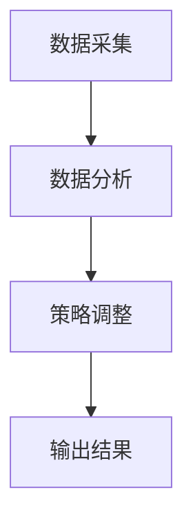

                 


# 格雷厄姆特价股票策略在不同监管环境下的调整

## 关键词：监管环境、股票策略、价值投资、市场分析、投资策略

## 摘要：格雷厄姆特价股票策略是一种经典的价值投资方法，旨在通过购买价格低于其内在价值的股票来实现长期收益。然而，不同国家和地区的监管环境差异显著，这对策略的实施提出了新的挑战。本文详细分析了格雷厄姆策略在不同监管环境下的调整方法，探讨了监管变化对策略的影响，并提出了适应不同市场环境的优化策略。

---

# 第一部分: 格雷厄姆特价股票策略概述

## 第1章: 格雷厄姆特价股票策略的核心概念

### 1.1 格雷厄姆特价股票策略的背景与定义

#### 1.1.1 投资学中的价值投资理念
价值投资是一种以低于市场价买入优质资产的投资策略，核心在于寻找市场价格与内在价值存在显著差距的投资标的。格雷厄姆是价值投资的鼻祖，他提出的“安全边际”概念强调在买入股票时，价格应显著低于其内在价值。

#### 1.1.2 格雷厄姆投资理论的核心原则
- **安全边际**：买入价格低于内在价值，以降低投资风险。
- **margin of safety**：通过安全边际来确保投资的内在价值高于市场价格。
- **内在价值**：通过基本面分析（如市盈率、市净率等指标）估算的股票真实价值。

#### 1.1.3 特价股票的定义与特征
- 特价股票：市场价格显著低于内在价值的股票。
- 特征：低市盈率、低市净率、高股息率、行业龙头等。

### 1.2 监管环境对股票策略的影响

#### 1.2.1 不同国家与地区的监管框架概述
- 美国：严格的市场监管（如SEC监管）和完善的法律体系。
- 中国：监管政策较为灵活，强调合规性和市场稳定性。
- 欧洲：严格的金融监管和信息披露要求。
- 新兴市场：监管不完善，市场波动较大。

#### 1.2.2 监管政策对股票市场的影响
- 市场监管力度：影响股票市场的流动性和价格发现。
- 法律法规变化：直接影响股票的投资价值和交易策略。
- 政策导向：影响市场参与者的投资行为和市场结构。

#### 1.2.3 特价股票策略在不同监管环境下的适应性
- 在严格的监管环境下（如美国），投资者更倾向于基本面分析。
- 在监管较为宽松的环境下（如新兴市场），投资者需要更加谨慎，注重风险控制。

---

## 第2章: 格雷厄姆特价股票策略的数学模型与算法

### 2.1 格雷厄姆策略的数学基础

#### 2.1.1 市净率与内在价值的计算公式
市净率（P/B）= 股价 / 每股净资产。
内在价值计算公式：内在价值 = 净资产 × 安全边际系数。

#### 2.1.2 市盈率与股票估值的关系
市盈率（P/E）= 股价 / 每股收益。
估值公式：合理股价 = 市盈率 × 每股收益。

#### 2.1.3 股票安全边际的数学模型
安全边际 = 内在价值 - 市场价格。

### 2.2 监管环境对策略调整的算法影响

#### 2.2.1 监管变化的量化指标
- 监管强度指数：衡量监管环境的严格程度。
- 法律法规变化频率：影响策略调整的周期性。

#### 2.2.2 策略调整系数的计算公式
调整系数 = 1 + （监管强度指数 × 调整因子）。

#### 2.2.3 调整后的股票筛选算法流程
1. 计算股票的市盈率、市净率等指标。
2. 根据监管环境调整筛选指标。
3. 重新计算股票的内在价值。
4. 筛选出符合安全边际条件的股票。

---

# 第二部分: 不同监管环境下的策略调整

## 第3章: 美国监管环境下的策略调整

### 3.1 美国监管框架对策略的影响

#### 3.1.1 美国证券交易委员会(SEC)的监管原则
- 强调信息披露的准确性和及时性。
- 严格监管市场操纵和欺诈行为。

#### 3.1.2 美国市场中的机构投资者行为
- 机构投资者主导市场，注重基本面分析。
- 投资策略趋于保守和长期。

#### 3.1.3 美国市场中的价值投资机会
- 市场成熟，价值投资策略有效。
- 机构投资者的理性行为降低了市场波动。

### 3.2 美国环境下的策略调整方法

#### 3.2.1 美国市场中的市盈率调整策略
- 参考历史市盈率中枢，调整当前市盈率的合理范围。

#### 3.2.2 美国市场中的市净率调整策略
- 根据行业特点，调整市净率的安全边际。

#### 3.2.3 美国市场中的股息率调整策略
- 侧重于高股息率的蓝筹股，注重分红稳定性。

---

## 第4章: 中国监管环境下的策略调整

### 4.1 中国监管框架对策略的影响

#### 4.1.1 中国证监会的监管原则
- 强调市场秩序维护和风险防控。
- 侧重于打击市场操纵和内幕交易。

#### 4.1.2 中国市场的特点与投资机会
- 市场波动较大，政策影响显著。
- 新兴行业和成长型企业较多。

#### 4.1.3 中国市场的价值投资挑战
- 监管政策变化快，增加了策略调整的难度。
- 市场流动性高，投机性较强。

### 4.2 中国环境下的策略调整方法

#### 4.2.1 中国市场的市盈率调整策略
- 考虑行业政策影响，适当降低市盈率的安全边际。

#### 4.2.2 中国市场的市净率调整策略
- 侧重于国有企业的市净率分析，关注资产质量。

#### 4.2.3 中国市场的股息率调整策略
- 侧重于高分红的蓝筹股，注重企业盈利能力和分红稳定性。

---

## 第5章: 其他主要市场的监管环境与策略调整

### 5.1 欧洲市场

#### 5.1.1 欧洲监管框架对策略的影响
- 严格的金融监管和信息披露要求。
- 偏好稳健型投资，注重风险管理。

#### 5.1.2 欧洲市场的策略调整方法
- 侧重于低市盈率和高分红的欧洲蓝筹股。
- 考虑欧元区经济政策对市场的影响。

### 5.2 日本市场

#### 5.2.1 日本监管框架对策略的影响
- 市场流动性低，监管相对宽松。
- 投资者行为趋于保守，偏好低市盈率股票。

#### 5.2.2 日本市场的策略调整方法
- 侧重于低市盈率和高股息率的日本蓝筹股。
- 考虑日元汇率变化对股票价值的影响。

### 5.3 其他新兴市场

#### 5.3.1 新兴市场监管环境的特点
- 监管政策不完善，市场波动较大。
- 投资者行为较为投机，风险较高。

#### 5.3.2 新兴市场的策略调整方法
- 侧重于基本面良好的成长型企业。
- 考虑政策变化对行业的影响，适当降低安全边际。

---

# 第三部分: 系统架构设计与实现

## 第6章: 系统架构设计

### 6.1 系统功能设计

#### 6.1.1 数据采集模块
- 采集股票价格、财务数据、监管政策等信息。

#### 6.1.2 数据分析模块
- 计算市盈率、市净率等指标。
- 评估股票内在价值。

#### 6.1.3 策略调整模块
- 根据监管环境调整筛选指标。
- 输出符合安全边际条件的股票列表。

### 6.2 系统架构设计

#### 6.2.1 系统架构图


---

## 第7章: 项目实战

### 7.1 美国市场实战

#### 7.1.1 环境安装
- 数据源：美国市场股票数据（如Yahoo Finance）。
- 工具：Python、Pandas、NumPy。

#### 7.1.2 核心实现
```python
import pandas as pd
import numpy as np

# 数据采集与处理
data = pd.read_csv('stock_data.csv')
data['price_to_book'] = data['price'] / data['book_value']
data['price_to_earnings'] = data['price'] / data['net_income']

# 策略调整
data['adjusted_value'] = data['intrinsic_value'] * (1 + (regulatory_strength * 0.2))
data['safety_margin'] = data['adjusted_value'] - data['price']

# 筛选股票
selected_stocks = data[data['safety_margin'] > 0]
```

---

## 第8章: 最佳实践与注意事项

### 8.1 最佳实践

#### 8.1.1 监管环境变化的敏感性分析
- 定期更新监管政策评估。
- 动态调整策略参数。

#### 8.1.2 数据质量的把控
- 确保数据的准确性和完整性。
- 定期更新数据源。

### 8.2 注意事项

#### 8.2.1 风险管理
- 设置止损点，控制投资风险。
- 分散投资，避免过度集中。

#### 8.2.2 税务规划
- 考虑税收政策对投资收益的影响。
- 合理规划税务负担。

### 8.3 未来展望

#### 8.3.1 技术进步对策略的影响
- 人工智能和大数据技术的应用将提升策略优化能力。
- 自动化交易系统的发展将改变投资方式。

#### 8.3.2 全球化背景下的策略调整
- 全球市场一体化趋势增强，需要更加灵活的策略调整。
- 跨国投资机会增加，需要综合考虑不同国家的监管环境。

---

## 作者：AI天才研究院/AI Genius Institute & 禅与计算机程序设计艺术 /Zen And The Art of Computer Programming

