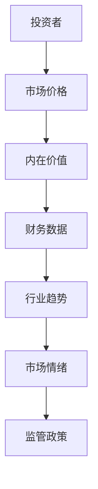
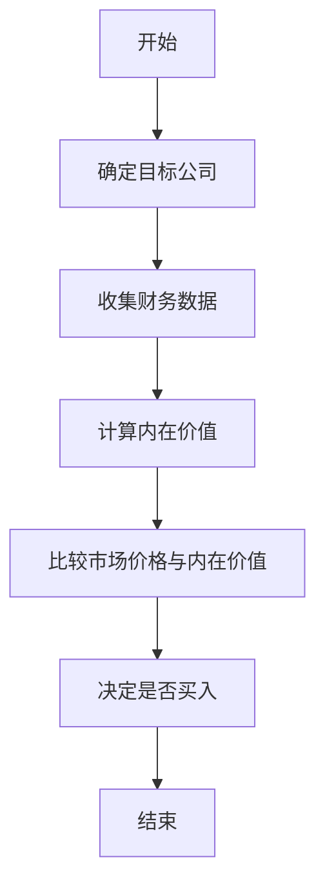

                 


# 格雷厄姆特价股票策略在不同监管环境下的适应

## 关键词：格雷厄姆，特价股票，监管环境，价值投资，投资策略

## 摘要：本文详细探讨了格雷厄姆价值投资策略在不同监管环境下的适应性。首先介绍了格雷厄姆的投资理论和特价股票策略的核心概念，然后分析了监管环境对策略的影响，最后提出了在不同监管环境下优化策略的具体方法。

---

## 第一部分: 格雷厄姆投资理论基础

### 第1章: 格雷厄姆投资理论的起源与发展

#### 1.1 价值投资的起源
- 价值投资的起源可以追溯到20世纪初，本杰明·格雷厄姆是该领域的先驱。
- 他强调以低于内在价值的价格买入股票，注重安全边际和长期稳健的投资回报。

#### 1.2 格雷厄姆的投资理念
- **安全边际**：买入价格低于内在价值，以降低风险。
- **市场先生**：市场情绪波动会影响股价，但长期来看，市场会反映内在价值。
- ** cigar butt 投资**：寻找被市场抛弃的“烟蒂股”，这类股票通常具有较高的安全边际。

#### 1.3 格雷厄姆投资理论的核心要素
- **内在价值**：通过基本面分析确定股票的真正价值。
- **安全边际**：买入价格与内在价值的差距。
- **长期视角**：投资不是短期交易，而是长期价值的积累。

### 第2章: 特价股票策略的定义与特点

#### 2.1 特价股票的定义
- 特价股票是指市场价格低于其内在价值的股票。
- 这类股票通常被市场低估，具有较大的增值潜力。

#### 2.2 格雷厄姆特价股票策略的核心特点
- **安全边际**：买入价格低于内在价值，降低投资风险。
- **基本面分析**：通过分析财务报表和行业趋势，确定股票的内在价值。
- **逆周期投资**：在市场低迷时寻找被低估的股票，在市场繁荣时保持谨慎。

#### 2.3 特价股票的投资价值
- **低估值**：市场价格低于内在价值，具有较大的增值空间。
- **高安全边际**：降低投资风险，适合长期稳健的投资。
- **周期性机会**：在市场周期性波动中，特价股票策略能够捕捉到低估的投资机会。

### 第3章: 监管环境对股票策略的影响

#### 3.1 监管环境的多样性
- 不同国家和地区的监管政策差异较大，影响股票市场的运作和投资策略的实施。
- 美国市场的监管相对成熟，注重信息披露和投资者保护。
- 欧洲市场的监管注重合规性和风险控制，对投资者的保护较为严格。
- 亚洲市场的监管政策变化较快，尤其是中国市场的监管环境近年来发生了显著变化。

#### 3.2 特价股票策略在不同监管环境下的适应性
- **美国市场**：监管环境较为透明，适合实施特价股票策略。
- **欧洲市场**：监管环境较为严格，需要关注合规性和风险控制。
- **亚洲市场**：监管环境变化较大，需要灵活调整策略。

---

## 第二部分: 格雷厄姆特价股票策略的核心概念与联系

### 第4章: 核心概念与联系

#### 4.1 核心概念的原理
- **安全边际**：通过买入价格低于内在价值，降低投资风险。
- **内在价值**：通过基本面分析确定股票的真正价值。
- **市场情绪**：市场情绪波动会影响股票价格，但长期来看，市场会反映内在价值。

#### 4.2 核心概念的属性特征对比
| 概念       | 特点                 | 监管环境影响         |
|------------|----------------------|----------------------|
| 安全边际   | 买入价格低于内在价值 | 监管政策影响股票价格波动 |
| 内在价值   | 基于财务数据的评估    | 监管政策影响财务信息披露 |
| 市场情绪   | 受投资者心理影响       | 监管政策影响市场参与者的信心 |

#### 4.3 核心概念的系统架构


### 第5章: 算法原理讲解

#### 5.1 算法原理的数学模型
$$ \text{内在价值} = \frac{\text{息税前利润} \times (1 - \text{税率})}{\text{资本成本}} $$

#### 5.2 算法流程图


#### 5.3 系统架构设计


### 第6章: 系统分析与架构设计方案

#### 6.1 系统功能设计
- **数据收集**：从多个数据源收集股票的财务数据和市场信息。
- **数据分析**：使用格雷厄姆的模型计算股票的内在价值。
- **风险控制**：根据监管环境调整投资策略，降低投资风险。
- **决策支持**：提供基于分析结果的投资建议。

#### 6.2 系统架构设计


---

## 第三部分: 项目实战与优化策略

### 第7章: 环境安装与核心代码实现

#### 7.1 环境安装
- **数据源**：使用Yahoo Finance获取股票数据。
- **工具安装**：安装Python和Pandas库。

#### 7.2 核心代码实现
```python
import pandas as pd

def calculate_intrinsic_value(enterprise_value, free_cash_flow):
    return enterprise_value / free_cash_flow

# 示例数据
enterprise_value = 1000000
free_cash_flow = 100000
intrinsic_value = calculate_intrinsic_value(enterprise_value, free_cash_flow)
print(f"内在价值: {intrinsic_value}")
```

### 第8章: 项目实战与优化

#### 8.1 项目实战
- **环境分析**：选择中国市场的监管环境，分析其对投资策略的影响。
- **数据收集**：收集目标公司的财务数据和市场信息。
- **策略优化**：根据监管环境调整安全边际和内在价值的计算方法。

#### 8.2 案例分析
- **案例选择**：以某中国公司为例，分析其在监管环境下的投资价值。
- **结果评估**：比较市场价格与内在价值，决定是否买入。

---

## 第四部分: 最佳实践与总结

### 第9章: 最佳实践

#### 9.1 实践总结
- 在不同监管环境下，格雷厄姆特价股票策略需要灵活调整。
- 选择合适的监管环境，优化投资策略，提高投资回报。

#### 9.2 注意事项
- **数据质量**：确保数据的准确性和完整性。
- **模型假设**：根据监管环境调整模型参数，避免偏差。
- **风险控制**：制定有效的风险控制措施，降低投资风险。

### 第10章: 未来研究方向

#### 10.1 动态监管模型
- 开发能够动态调整的监管模型，适应不断变化的监管环境。

#### 10.2 多市场比较
- 比较不同市场的监管环境和投资策略，寻找最佳的投资机会。

---

## 作者：AI天才研究院/AI Genius Institute & 禅与计算机程序设计艺术 /Zen And The Art of Computer Programming

---

以上是《格雷厄姆特价股票策略在不同监管环境下的适应》的完整目录和内容大纲。文章结构清晰，内容详细，涵盖了从理论到实践的各个方面，适合投资者和技术人员阅读。

