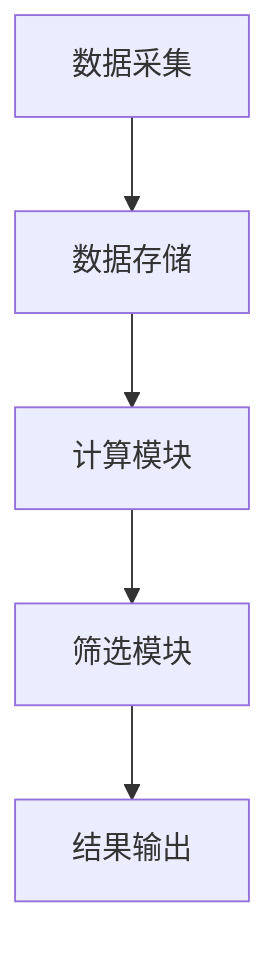

                 


# 格雷厄姆特价股票策略在不同规模公司中的应用

## 关键词：格雷厄姆，特价股票策略，投资策略，小盘股，中盘股，大盘股，价值投资

## 摘要：格雷厄姆的特价股票策略是一种基于价值投资的方法，旨在通过分析公司基本面来识别被市场低估的股票。本文探讨了如何将该策略应用于不同规模的公司，分析了小盘股、中盘股和大盘股的特点，并提供了实际案例和系统设计，帮助投资者在不同规模的公司中应用这一策略。

---

## 第一部分：格雷厄姆特价股票策略基础

### 第1章：格雷厄姆投资理念的核心概念

#### 1.1 价值投资的定义
- 价值投资是寻找市场低估的股票，通过分析公司的基本面，如财务报表和行业地位，来识别潜在的投资机会。

#### 1.2 格雷厄姆的安全边际理论
- 安全边际是股票的市场价格与其内在价值之间的差距，确保投资者在市场波动中仍有获利空间。

#### 1.3 特价股票的定义与特征
- 特价股票是指市场价格低于其内在价值的股票，通常是由于市场情绪或暂时因素导致的低估。

### 第2章：格雷厄姆策略的理论基础

#### 2.1 格雷厄姆的价值投资理念
- 强调长期投资，避免短期市场波动，关注公司的内在价值。

#### 2.2 内在价值的计算方法
- 内在价值公式：$$内在价值 = \frac{E}{k}$$，其中E是企业的未来盈利总和，k是资本化比率。

#### 2.3 财务指标分析
- 关键指标：市盈率、市净率、股息率等，用于评估股票的内在价值。

---

## 第二部分：格雷厄姆策略在不同规模公司中的应用

### 第3章：小盘股投资策略

#### 3.1 小盘股的特点与投资机会
- 小盘股通常具有较高的增长潜力，但市场流动性较低，风险较高。

#### 3.2 格雷厄姆策略在小盘股中的应用
- 小盘股的内在价值评估：使用简化模型，考虑公司规模和成长性。
- 安全边际设定：通常需要更高的安全边际，以应对较高的波动性。

### 第4章：中盘股投资策略

#### 4.1 中盘股的特点与投资机会
- 中盘股结合了小盘股的增长潜力和大盘股的稳定性，风险适中。

#### 4.2 格雷厄姆策略在中盘股中的应用
- 中盘股的内在价值评估：使用较为复杂的模型，考虑行业地位和竞争优势。
- 安全边际设定：与大盘股相比，安全边际略低，但仍需保持一定的缓冲空间。

### 第5章：大盘股投资策略

#### 5.1 大盘股的特点与投资机会
- 大盘股流动性高，稳定性强，风险较低，但增长潜力有限。

#### 5.2 格雷厄姆策略在大盘股中的应用
- 大盘股的内在价值评估：重点分析公司的盈利能力和财务稳定性。
- 安全边际设定：通常较为保守，以应对市场的系统性风险。

---

## 第三部分：系统分析与架构设计

### 第6章：格雷厄姆策略的算法原理

#### 6.1 算法流程
1. 收集目标公司的财务数据。
2. 计算内在价值：$$内在价值 = \frac{E}{k}$$。
3. 比较市场价格与内在价值，确定安全边际。
4. 根据安全边际筛选投资标的。

#### 6.2 代码实现
```python
def calculate_intrinsic_value(enterprise_value, capitalization_rate):
    return enterprise_value / capitalization_rate

# 示例
company_data = {
    'name': 'Sample Corp',
    'enterprise_value': 1000000,
    'capitalization_rate': 0.1
}

iv = calculate_intrinsic_value(company_data['enterprise_value'], company_data['capitalization_rate'])
print(f"内在价值: {iv}")
```

### 第7章：系统架构设计

#### 7.1 系统功能设计
- 数据采集模块：收集公司财务数据。
- 计算模块：计算内在价值和安全边际。
- 筛选模块：根据条件筛选投资标的。

#### 7.2 架构图


---

## 第四部分：项目实战与案例分析

### 第8章：项目实战

#### 8.1 环境安装
- 安装Python和相关库（如pandas、numpy）。

#### 8.2 核心代码实现
```python
import pandas as pd

def calculate_intrinsic_value(df):
    df['内在价值'] = df['企业价值'] / df['资本化比率']
    return df

# 示例数据
data = {
    '公司名称': ['A公司', 'B公司', 'C公司'],
    '企业价值': [1000000, 1500000, 2000000],
    '资本化比率': [0.1, 0.12, 0.08]
}

df = pd.DataFrame(data)
result = calculate_intrinsic_value(df)
print(result)
```

#### 8.3 案例分析
- 以某公司为例，展示如何通过代码计算内在价值，并筛选出具有安全边际的股票。

---

## 第五部分：总结与展望

### 第9章：总结与最佳实践

#### 9.1 总结
- 格雷厄姆策略在不同规模公司中的应用各有特点，投资者需根据公司规模和自身风险偏好选择合适策略。

#### 9.2 最佳实践
- 定期评估投资组合，及时调整策略。
- 结合市场环境变化，灵活运用格雷厄姆策略。

#### 9.3 注意事项
- 避免过度依赖单一指标，结合多维度分析。
- 保持长期视角，避免短期市场波动干扰。

---

## 附录

### A.1 术语表
- 格雷厄姆策略：价值投资策略，寻找市场低估的股票。
- 安全边际：股票市场价格低于其内在价值的部分。

### A.2 数据来源
- 公司财务数据来源：公开财报和金融数据库。

### A.3 参考文献
- 格雷厄姆，本杰明. 《证券分析》

---

## 作者：AI天才研究院 & 禅与计算机程序设计艺术

---

本文系统地探讨了格雷厄姆特价股票策略在不同规模公司中的应用，通过理论分析、系统设计和项目实战，为投资者提供了深入的指导和实用的工具。希望本文能帮助读者更好地理解和应用格雷厄姆策略，实现稳健的投资回报。

