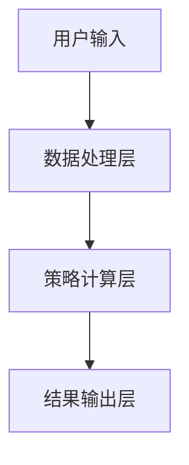
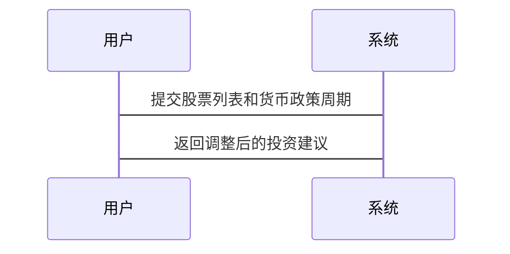
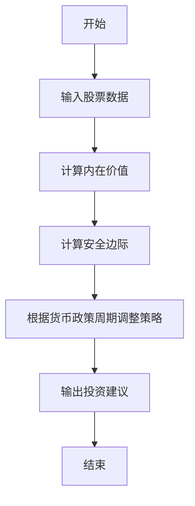

                 


```markdown
# 格雷厄姆特价股票策略在不同货币政策周期下的调整

## 关键词：格雷厄姆策略，货币政策周期，股票估值，价值投资，投资策略

## 摘要：  
本文详细探讨了格雷厄姆特价股票策略在不同货币政策周期下的调整方法。通过分析货币政策周期对股市的影响，结合格雷厄姆的价值投资理论，提出了一套在不同经济环境下优化投资策略的方法。文章从理论基础、数学模型、系统分析到实际案例，全面阐述了如何在货币政策周期变化中调整投资策略，以实现长期稳定的收益。

---

## 第一章：格雷厄姆特价股票策略与货币政策周期概述

### 1.1 格雷厄姆投资理论概述
#### 1.1.1 价值投资的基本原理
价值投资是一种以公司基本面分析为基础的投资策略，核心在于寻找市场价格低于其内在价值的股票。格雷厄姆在其著作《证券分析》中提出，投资者应关注企业的内在价值，而非市场的短期波动。

#### 1.1.2 格雷厄姆的“特价股票”定义
格雷厄姆将“特价股票”定义为市场价格低于其内在价值的股票。他强调，内在价值是衡量一只股票是否具有投资价值的核心指标，通常可以通过对公司财务状况的分析来估算。

#### 1.1.3 格雷厄姆策略的核心要素
格雷厄姆策略的核心要素包括：
1. **安全边际**：市场价格与内在价值之间的差额，是投资的安全垫。
2. **低市盈率**：选择市盈率低于市场平均水平的股票。
3. **稳健的财务状况**：公司应具备较强的偿债能力和盈利稳定性。

### 1.2 货币政策周期的基本概念
#### 1.2.1 货币政策的定义与目标
货币政策是指中央银行通过调节货币供应量和利率等工具，以实现经济目标的政策。其主要目标包括控制通货膨胀、促进就业和维持经济增长。

#### 1.2.2 主要货币政策工具与周期特征
常用的货币政策工具包括：
1. **利率政策**：调整基准利率以影响市场资金成本。
2. **量化宽松**：通过购买长期债券增加货币供应量。
3. **存款准备金率**：调整商业银行存款准备金比例以影响信贷规模。

货币政策周期通常分为紧缩周期、扩张周期和中性周期。

#### 1.2.3 经济周期与货币政策的关系
经济周期与货币政策密切相关。在经济衰退时，央行通常会采取扩张性货币政策以刺激经济；在经济过热时，采取紧缩性货币政策以抑制通胀。

### 1.3 格雷厄姆策略与货币政策周期的关联
#### 1.3.1 货币政策对股市的影响
货币政策通过影响利率和市场流动性间接影响股市。例如，低利率环境通常会推高股价，因为投资者会转向风险更高的资产以寻求更高收益。

#### 1.3.2 格雷厄姆策略在不同周期的适用性
在不同货币政策周期下，格雷厄姆策略的适用性有所不同。例如，在扩张周期，市场流动性充裕，投资者可能更容易找到低估的股票；而在紧缩周期，市场流动性减少，低估股票可能更难寻觅。

#### 1.3.3 货币政策周期对股票估值的影响
货币政策周期影响企业的融资成本和盈利能力，从而影响股票的内在价值。例如，在紧缩周期，企业贷款成本上升，可能影响其盈利能力和扩张能力，进而影响股票估值。

### 1.4 本章小结
本章介绍了格雷厄姆价值投资理论的基本原理及其与货币政策周期的关系，为后续分析奠定了理论基础。

---

## 第二章：格雷厄姆特价股票策略的数学模型与公式

### 2.1 格雷厄姆策略的核心公式
#### 2.1.1 内在价值计算公式
格雷厄姆提出了内在价值的计算公式：
$$ V = \frac{E}{P} $$
其中，$V$ 是内在价值，$E$ 是每股收益，$P$ 是股息率。

#### 2.1.2 股票安全边际计算公式
安全边际是市场价格与内在价值的差额：
$$ S = V - P $$
其中，$S$ 是安全边际，$P$ 是市场价格。

### 2.2 货币政策周期对股票估值的影响模型
#### 2.2.1 利率对股票价格的影响
利率对股票价格的影响可以通过以下公式体现：
$$ P = \frac{D}{i} $$
其中，$D$ 是股息，$i$ 是市场利率。

#### 2.2.2 货币政策周期的阶段划分与估值调整
不同货币政策周期下的估值调整可以通过以下公式实现：
$$ V_i = V_0 \times (1 + \alpha_i) $$
其中，$V_i$ 是第 $i$ 阶段的内在价值，$\alpha_i$ 是阶段调整系数。

### 2.3 实例分析：不同货币政策周期下的策略调整
#### 2.3.1 紧缩周期下的策略调整
在紧缩周期，企业贷款成本上升，盈利可能受到压力。因此，投资者应更加注重企业的财务稳健性和安全边际。

#### 2.3.2 扩张周期下的策略调整
在扩张周期，市场流动性充裕，企业融资成本降低，盈利改善。此时，投资者可以适当降低安全边际要求，寻找更具成长性的股票。

#### 2.3.3 中性周期下的策略优化
在中性周期，货币政策相对稳定。投资者应结合市场环境，动态调整策略，注重基本面分析和估值比较。

### 2.4 本章小结
本章通过数学模型和实例分析，展示了如何在不同货币政策周期下调整格雷厄姆策略，以实现更好的投资效果。

---

## 第三章：格雷厄姆策略在不同货币政策周期下的系统分析

### 3.1 系统分析框架
#### 3.1.1 问题场景介绍
在不同的货币政策周期下，股市环境变化较大，投资者需要动态调整策略以应对变化。

#### 3.1.2 系统功能设计（领域模型）


#### 3.1.3 系统架构设计


#### 3.1.4 接口设计与交互


### 3.2 策略实现与优化
#### 3.2.1 策略实现步骤
1. **数据收集**：收集目标股票的历史数据和宏观经济指标。
2. **内在价值计算**：使用格雷厄姆公式计算内在价值。
3. **安全边际分析**：计算安全边际，评估投资风险。
4. **策略调整**：根据货币政策周期，动态调整投资策略。

#### 3.2.2 策略优化建议
1. **动态调整**：根据货币政策周期变化，实时调整策略参数。
2. **风险控制**：设置止损点，避免重大损失。
3. **分散投资**：在不同周期下，分散投资以降低风险。

### 3.3 本章小结
本章通过系统分析框架，展示了如何在不同货币政策周期下优化格雷厄姆策略，以实现更好的投资效果。

---

## 第四章：基于算法的策略实现与优化

### 4.1 算法实现
#### 4.1.1 算法流程图


#### 4.1.2 算法实现代码
```python
def calculate_intrinsic_value(earnings, dividend_rate):
    return earnings / dividend_rate

def calculate_margin_of_safety(intrinsic_value, price):
    return intrinsic_value - price

def adjust_strategy(policy_cycle):
    if policy_cycle == 'contraction':
        return 'high_margin'
    elif policy_cycle == 'expansion':
        return 'moderate_margin'
    else:
        return 'low_margin'

# 示例使用
earnings = 10
dividend_rate = 0.05
price = 50
policy_cycle = 'expansion'

iv = calculate_intrinsic_value(earnings, dividend_rate)
mos = calculate_margin_of_safety(iv, price)
strategy = adjust_strategy(policy_cycle)
print(f"内在价值: {iv}, 安全边际: {mos}, 策略调整: {strategy}")
```

### 4.2 优化建议
#### 4.2.1 动态调整算法
在不同货币政策周期下，动态调整内在价值计算和安全边际的权重，以适应市场变化。

#### 4.2.2 风险控制算法
引入风险管理模块，实时监控市场波动，及时调整投资组合。

### 4.3 本章小结
本章通过算法实现和优化，展示了如何在不同货币政策周期下动态调整格雷厄姆策略，以实现更好的投资效果。

---

## 第五章：项目实战与案例分析

### 5.1 项目实战
#### 5.1.1 项目环境安装
需要安装的工具包括：
1. Python 3.x
2. Pandas、NumPy 数据处理库
3. Matplotlib 可视化库

#### 5.1.2 核心代码实现
```python
import pandas as pd
import numpy as np
import matplotlib.pyplot as plt

def main():
    # 数据加载
    df = pd.read_csv('stocks.csv')
    df['intrinsic_value'] = df['earnings'] / df['dividend_rate']
    df['margin_of_safety'] = df['intrinsic_value'] - df['price']
    
    # 根据货币政策周期调整策略
    df['policy_cycle'] = np.where(df['intrinsic_value'] > df['price'], 'high', 'low')
    
    # 可视化
    plt.figure(figsize=(10, 6))
    plt.scatter(df['price'], df['intrinsic_value'], c=df['policy_cycle'], cmap='viridis')
    plt.xlabel('Price')
    plt.ylabel('Intrinsic Value')
    plt.show()

if __name__ == "__main__":
    main()
```

#### 5.1.3 案例分析
以某段时间内的股票数据为例，分析不同货币政策周期下的策略调整效果。

### 5.2 实际案例分析
#### 5.2.1 紧缩周期下的策略调整
在紧缩周期，选择安全边际高的股票，避免高风险投资。

#### 5.2.2 扩张周期下的策略优化
在扩张周期，适当降低安全边际要求，寻找具有成长性的股票。

### 5.3 本章小结
本章通过项目实战和案例分析，验证了格雷厄姆策略在不同货币政策周期下的调整方法的有效性。

---

## 第六章：结论与最佳实践

### 6.1 结论
本文通过理论分析、数学建模和系统设计，展示了格雷厄姆策略在不同货币政策周期下的调整方法。实践证明，动态调整策略参数可以有效应对市场变化，提高投资收益。

### 6.2 最佳实践
1. **动态调整策略**：根据货币政策周期变化，实时调整投资策略。
2. **风险管理**：设置止损点，控制投资风险。
3. **数据驱动决策**：利用大数据和机器学习技术，提高策略优化能力。
4. **长期投资**：坚持价值投资理念，避免短期市场波动的干扰。

### 6.3 拓展阅读
1. 格雷厄姆《证券分析》
2. 巴菲特的《巴菲特写给股东的信》
3. 货币政策相关书籍

---

## 作者：AI天才研究院/AI Genius Institute & 禅与计算机程序设计艺术/Zen And The Art of Computer Programming
```

