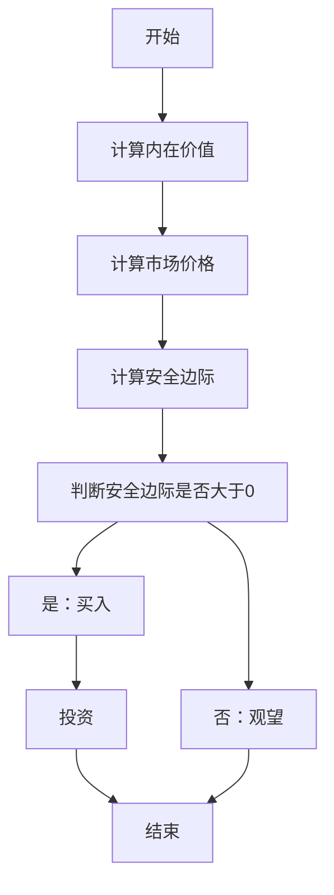
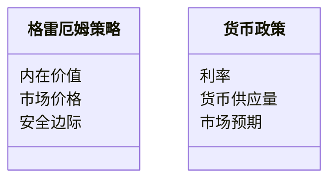
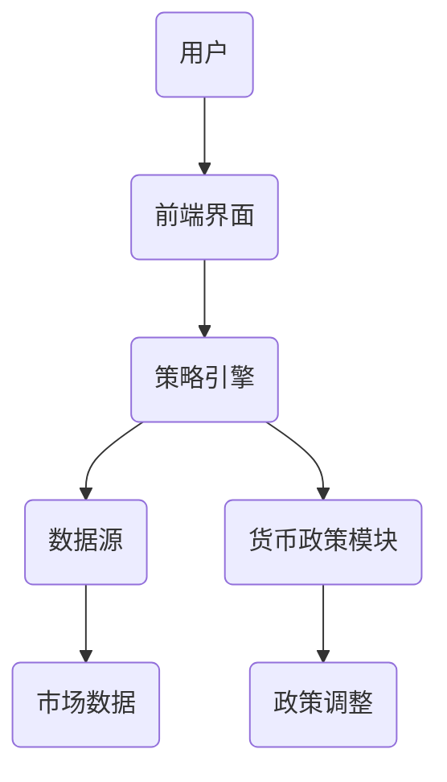

                 


# 格雷厄姆特价股票策略在不同货币政策环境下的调整

---

## 关键词：
- 格雷厄姆投资策略
- 货币政策
- 股票估值
- 安全边际
- 量化宽松
- 利率政策

---

## 摘要：
本文系统地探讨了格雷厄姆特价股票策略在不同货币政策环境下的调整策略。首先，文章详细介绍了格雷厄姆价值投资理论的核心概念，包括安全边际和内在价值的计算方法。接着，分析了货币政策对股市的多维度影响，包括利率政策、货币供应量变化和市场预期等。通过对比分析和数学模型推导，文章提出了在不同货币政策环境下调整格雷厄姆策略的具体方法，包括调整安全边际系数、重新评估内在价值和优化投资组合等。最后，文章结合实际案例，展示了如何在量化宽松和加息周期中灵活运用这些策略，以实现稳健的投资收益。

---

## 第1章：格雷厄姆特价股票策略概述

### 1.1 格雷厄姆投资理论的核心概念

#### 1.1.1 价值投资的定义与核心原则
价值投资是一种以基本面分析为基础的投资策略，强调购买价格低于内在价值的资产。格雷厄姆在其经典著作《证券分析》中提出，投资者应关注企业的基本面数据，如盈利能力、财务状况和市场地位等。核心原则包括：
- **安全边际**：购买价格远低于内在价值，以降低投资风险。
- **长期视角**：关注企业的长期盈利能力，而非短期市场波动。
- **逆向投资**：在市场恐慌时寻找被低估的投资机会。

#### 1.1.2 格雷厄姆的安全边际理论
安全边际是价值投资的核心概念，指股票市场价格与内在价值之间的差距。格雷厄姆建议投资者以低于内在价值的价格买入股票，并保持足够的安全边际以应对市场波动。公式为：
$$ \text{安全边际} = \text{内在价值} - \text{市场价格} $$

#### 1.1.3 特价股票的定义与筛选标准
格雷厄姆将特价股票定义为市场价格远低于内在价值的股票。筛选标准包括：
- 市盈率（P/E）低于行业平均水平。
- 市净率（P/B）低于1。
- 股息率高于行业平均水平。
- 财务状况稳健，无重大负债。

### 1.2 货币政策对股市的影响

#### 1.2.1 货币政策的定义与工具
货币政策是政府或中央银行通过调整货币供应量和利率等工具，影响经济活动和价格水平的政策。主要工具包括：
- 利率政策：调整基准利率和贷款利率。
- 货币供应量：通过公开市场操作调节货币供给。
- 货币政策预期：通过政策声明影响市场预期。

#### 1.2.2 货币政策对股市的短期与长期影响
- 短期影响：利率下降会导致资金成本降低，刺激企业投资和消费，推动股市上涨。
- 长期影响：过度宽松的货币政策可能导致资产泡沫，增加市场波动性。

#### 1.2.3 不同货币政策环境下的市场表现
- **量化宽松（QE）**：通过大量购买资产增加货币供应，推高资产价格。
- **加息周期**：提高利率抑制通胀，可能导致股市下跌。
- **中性货币政策**：保持经济稳定，股市表现平稳。

### 1.3 格雷厄姆策略与货币政策的关联性

#### 1.3.1 格雷厄姆策略在不同货币政策下的适用性
- 在量化宽松环境下，市场流动性充裕，股票估值可能被高估，需调整安全边际。
- 在加息周期，债券收益率上升，股票相对吸引力下降，需重新评估内在价值。

#### 1.3.2 货币政策变化对股票估值的影响
货币政策通过影响利率、资金成本和市场情绪，间接影响股票估值。例如：
$$ \text{股票估值} = \frac{\text{未来现金流}}{\text{折现率}} $$
折现率受利率政策影响，利率上升会降低股票估值。

#### 1.3.3 策略调整的必要性与目标
目标是通过调整格雷厄姆策略，适应不同货币政策环境下的市场变化，优化投资组合，降低风险。

---

## 第2章：格雷厄姆策略与货币政策的联系

### 2.1 格雷厄姆策略的核心原理

#### 2.1.1 价值投资的核心公式
$$ \text{内在价值} = \sum_{t=1}^{n} \frac{CF_t}{(1 + r)^t} $$
其中，$CF_t$为第$t$年的现金流，$r$为折现率。

#### 2.1.2 安全边际的数学模型
$$ \text{安全边际} = \text{内在价值} - \text{市场价格} $$
在不同货币政策环境下，需动态调整内在价值和市场价格的计算。

#### 2.1.3 特价股票的筛选标准
- 市盈率低于行业平均水平。
- 市净率低于1。
- 股息率高于行业平均水平。
- 财务状况稳健，无重大负债。

### 2.2 货币政策工具对股市的影响机制

#### 2.2.1 利率政策对股市的影响
- 利率下降：降低企业融资成本，推动股市上涨。
- 利率上升：增加企业融资成本，可能导致股市下跌。

#### 2.2.2 货币供应量对股市的影响
- 货币供应增加：推高资产价格，可能导致股市泡沫。
- 货币供应减少：可能导致股市下跌。

#### 2.2.3 货币政策预期对市场情绪的影响
市场预期是影响股市的重要因素。例如，预期中的降息可能导致股市上涨。

### 2.3 格雷厄姆策略与货币政策的对比分析

#### 2.3.1 格雷厄姆策略的核心属性特征
- 重视安全边际。
- 长期视角。
- 逆向投资。

#### 2.3.2 货币政策工具的属性特征
- 影响经济活动。
- 影响市场预期。
- 影响资产价格。

#### 2.3.3 格雷厄姆策略与货币政策的ER实体关系图
```mermaid
erDiagram
    格雷厄姆策略 <|-- 安全边际
    货币政策 <|-- 利率政策
    安全边际 --> 市场价格
    利率政策 --> 股票估值
```

---

## 第3章：格雷厄姆策略的数学模型与算法

### 3.1 格雷厄姆策略的数学模型

#### 3.1.1 内在价值计算
$$ \text{内在价值} = \sum_{t=1}^{n} \frac{CF_t}{(1 + r)^t} $$
其中，$r$为折现率，$CF_t$为第$t$年的现金流。

#### 3.1.2 安全边际计算
$$ \text{安全边际} = \text{内在价值} - \text{市场价格} $$
在不同货币政策环境下，需动态调整折现率$r$。

#### 3.1.3 折现率调整
在量化宽松环境下，折现率可能下降，导致内在价值上升。公式为：
$$ r = r_{\text{基准}} \times (1 - \alpha) $$
其中，$\alpha$为货币政策宽松程度的影响系数。

### 3.2 格雷厄姆策略的算法流程



### 3.3 格雷厄姆策略的Python实现

```python
def calculate_intrinsic_value(cash_flows, discount_rate):
    return sum(cf / (1 + discount_rate)**t for t, cf in enumerate(cash_flows))

def calculate_market_price(stock ticker):
    # 获取股票当前价格
    pass

def graham_strategy(ticker, cash_flows, discount_rate):
    iv = calculate_intrinsic_value(cash_flows, discount_rate)
    mp = calculate_market_price(ticker)
    margin = iv - mp
    if margin > 0:
        return "买入"
    else:
        return "观望"
```

---

## 第4章：数学模型

### 4.1 内在价值公式
$$ \text{内在价值} = \sum_{t=1}^{n} \frac{CF_t}{(1 + r)^t} $$
其中，$CF_t$为第$t$年的现金流，$r$为折现率。

### 4.2 折现率调整公式
$$ r = r_{\text{基准}} \times (1 - \alpha) $$
其中，$\alpha$为货币政策宽松程度的影响系数。

### 4.3 安全边际公式
$$ \text{安全边际} = \text{内在价值} - \text{市场价格} $$

---

## 第5章：系统分析与架构设计

### 5.1 问题场景介绍

#### 5.1.1 核心问题
如何在不同货币政策环境下调整格雷厄姆策略，以优化投资组合。

#### 5.1.2 项目介绍
开发一个基于格雷厄姆策略的投资管理系统，能够根据货币政策变化动态调整投资策略。

### 5.2 系统功能设计

#### 5.2.1 领域模型


#### 5.2.2 系统架构


---

## 第6章：项目实战

### 6.1 环境安装

#### 6.1.1 安装Python和相关库
```bash
pip install numpy pandas matplotlib
```

### 6.2 核心代码实现

```python
import numpy as np
import pandas as pd

def calculate_intrinsic_value(cash_flows, discount_rate):
    return np.npv(discount_rate, cash_flows)

def calculate_market_price(ticker):
    # 获取股票当前价格
    pass

def graham_strategy(ticker, cash_flows, discount_rate):
    iv = calculate_intrinsic_value(cash_flows, discount_rate)
    mp = calculate_market_price(ticker)
    margin = iv - mp
    return "买入" if margin > 0 else "观望"
```

### 6.3 案例分析

#### 6.3.1 案例背景
假设在量化宽松环境下，某股票的内在价值为100元，市场价格为80元，安全边际为20元。

#### 6.3.2 调整策略
在量化宽松环境下，折现率可能下降，导致内在价值上升。因此，需重新计算内在价值和安全边际。

---

## 第7章：最佳实践

### 7.1 小结
本文系统地探讨了格雷厄姆特价股票策略在不同货币政策环境下的调整策略，提出了动态调整安全边际和内在价值的数学模型，并通过实际案例展示了策略的应用。

### 7.2 注意事项
- 定期重新评估内在价值和市场价格。
- 关注货币政策变化对市场的影响。
- 结合其他投资策略进行多元化投资。

### 7.3 拓展阅读
- 格雷厄姆的《证券分析》。
- 现代货币政策对股市的影响。

---

## 作者：
AI天才研究院/AI Genius Institute  
禅与计算机程序设计艺术/Zen And The Art of Computer Programming

