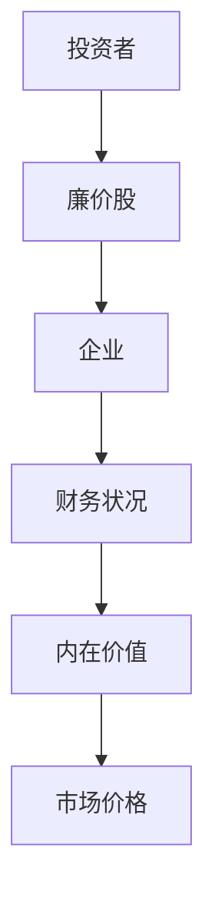
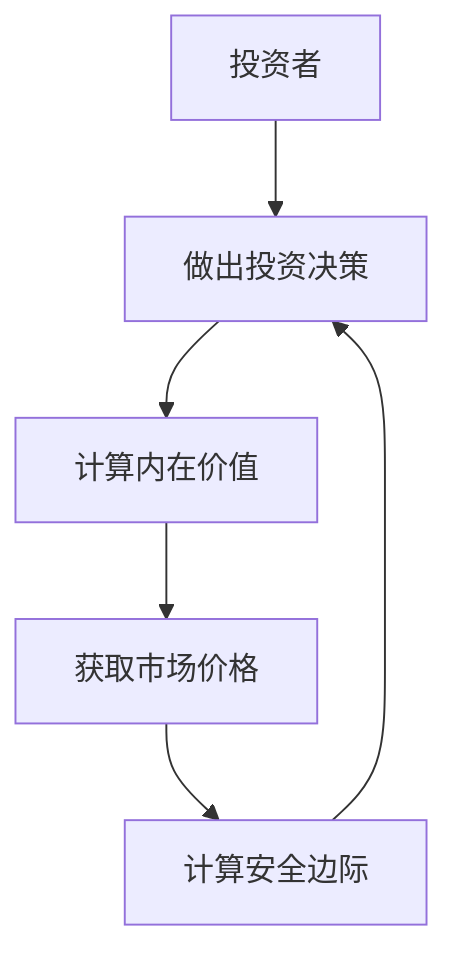
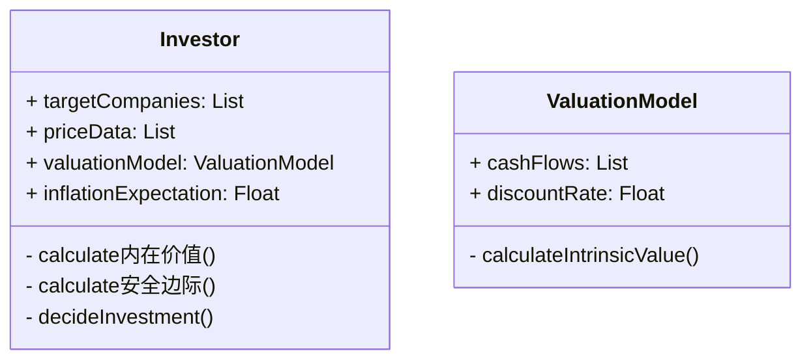
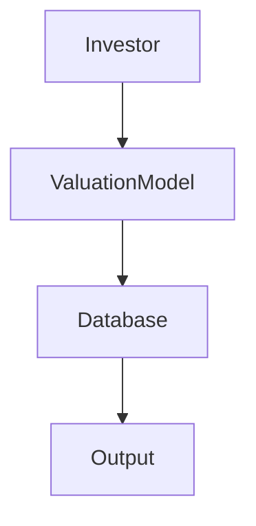

                 


# 格雷厄姆特价股票策略在不同通胀预期环境中的效果

---

## 关键词：
格雷厄姆投资策略，安全边际，通胀预期，股票估值，防御性投资，价值投资

---

## 摘要：
本文深入分析了格雷厄姆的特价股票策略在不同通胀预期环境中的表现和效果。通过结合宏观经济环境和股票估值理论，探讨了通胀预期对格雷厄姆策略的影响，以及在不同经济周期中如何调整策略以实现稳健投资。文章从背景介绍、核心概念、算法原理、系统分析到项目实战，全面解析了格雷厄姆策略的适用性和优化方法。

---

## 第一部分：背景介绍

### 第1章：格雷厄姆特价股票策略概述

#### 1.1 格雷厄姆投资理论的核心概念
格雷厄姆是价值投资的鼻祖，其核心思想是寻找市场价格低于其内在价值的股票。以下是其策略的核心概念：

- **安全边际**：安全边际是指股票的市场价格与其内在价值之间的差距。格雷厄姆建议投资者购买市场价格低于内在价值的股票，以降低风险并确保收益。

- **防御性投资**：格雷厄姆倡导防御性投资策略，即通过投资那些具有稳定历史和良好财务状况的公司，避免过度波动和风险。

- **廉价股**：格雷厄姆关注的是那些市场价格被市场低估的股票，这些股票通常具有较高的安全边际。

#### 1.2 通胀预期的定义与影响
通胀预期是指市场对未来通货膨胀率的预期，它直接影响股票市场的表现。以下是通胀预期对股票市场的主要影响：

- **利率变化**：通胀预期上升通常会导致央行加息，从而提高债券收益率，对高估值股票产生压力。

- **企业盈利**：通胀上升可能导致企业成本上升，压缩利润空间，影响股票的内在价值。

- **市场情绪**：通胀预期上升可能会引发市场波动，投资者需要更加谨慎地选择股票。

---

### 第2章：格雷厄姆策略与通胀环境的关联

#### 2.1 格雷厄姆策略在通缩环境中的表现
在通缩环境中，格雷厄姆策略通常表现较好，原因如下：

- **低通胀压力**：通缩环境下，企业成本下降，利润增加，股票内在价值上升。

- **安全边际扩大**：通缩环境下，市场价格可能进一步下降，安全边际增大，为投资者提供了更多廉价股的机会。

#### 2.2 格雷厄姆策略在通胀环境中的表现
在高通胀环境下，格雷厄姆策略面临一些挑战：

- **安全边际缩小**：高通胀可能导致市场价格快速上涨，安全边际减少，难以找到廉价股。

- **防御性投资的挑战**：高通胀环境下，企业盈利可能受到挤压，防御性投资的稳定性下降。

---

## 第二部分：核心概念与联系

### 第3章：格雷厄姆策略的核心原理

#### 3.1 安全边际的数学模型
安全边际可以通过以下公式计算：

$$ \text{安全边际} = \text{市场价格} - \text{内在价值} $$

在通缩环境下，内在价值上升，安全边际增大；在高通胀环境下，内在价值可能被高估，安全边际减小。

#### 3.2 防御性投资策略的实体关系图
以下是防御性投资策略的实体关系图：



在通缩环境下，E（企业）的财务状况改善，内在价值上升，安全边际增大；在高通胀环境下，E的财务状况可能恶化，内在价值下降，安全边际减小。

---

### 第4章：通胀预期与股票估值的对比分析

#### 4.1 不同通胀环境下的股票估值对比
以下是不同通胀环境下股票估值的对比分析：

| 环境      | 通缩环境                | 高通胀环境              |
|-----------|-------------------------|--------------------------|
| 利率      | 低                      | 高                      |
| 企业盈利  | 稳定增长                | 可能下降                |
| 股票估值  | 低估，安全边际大        | 高估，安全边际小        |

#### 4.2 格雷厄姆策略在不同通胀环境中的对比
以下是格雷厄姆策略在不同通胀环境中的表现对比：

| 环境      | 通缩环境                | 高通胀环境              |
|-----------|-------------------------|--------------------------|
| 策略表现   | 优异，安全边际大        | 较差，安全边际小        |
| 调整建议   | 继续寻找廉价股          | 调整估值模型，降低安全边际要求 |

---

## 第三部分：算法原理讲解

### 第5章：格雷厄姆策略的量化分析

#### 5.1 格雷厄姆策略的量化模型
以下是格雷厄姆策略的量化模型：

$$ \text{内在价值} = \sum_{t=1}^{n} \frac{\text{现金流}_t}{(1 + r)^t} $$

其中，\( r \) 是折现率，通常与通胀预期相关。在高通胀环境下，\( r \) 增大，内在价值下降。

#### 5.2 安全边际的计算流程
以下是安全边际的计算流程：



---

## 第四部分：系统分析与架构设计方案

### 第6章：系统分析与架构设计方案

#### 6.1 问题场景介绍
在不同通胀环境下，投资者需要动态调整格雷厄姆策略，以应对市场变化。

#### 6.2 系统功能设计
以下是系统功能设计的类图：



#### 6.3 系统架构设计
以下是系统架构设计的架构图：



---

## 第五部分：项目实战

### 第7章：项目实战

#### 7.1 环境安装
以下是项目实战所需的环境和工具：

- Python 3.9+
- Jupyter Notebook
- pandas, numpy, matplotlib

#### 7.2 系统核心实现源代码
以下是核心实现源代码：

```python
import pandas as pd
import numpy as np

class ValuationModel:
    def __init__(self, cash_flows, discount_rate):
        self.cash_flows = cash_flows
        self.discount_rate = discount_rate

    def calculate_intrinsic_value(self):
        return sum([cf / (1 + self.discount_rate) ** t for t, cf in enumerate(self.cash_flows)])

# 示例数据
cash_flows = [100, 120, 150, 200]
discount_rate = 0.05

valuation_model = ValuationModel(cash_flows, discount_rate)
intrinsic_value = valuation_model.calculate_intrinsic_value()

print(f"内在价值：{intrinsic_value:.2f}")
```

#### 7.3 代码应用解读与分析
上述代码计算了目标公司的内在价值，考虑了通胀预期对折现率的影响。

---

## 第六部分：最佳实践

### 第8章：总结与小结

#### 8.1 总结
格雷厄姆特价股票策略在不同通胀环境下表现各异。在通缩环境下，策略表现优异；在高通胀环境下，策略需要调整。

#### 8.2 注意事项
- 定期监控市场变化
- 动态调整安全边际
- 综合考虑宏观经济因素

#### 8.3 拓展阅读
- 格雷厄姆《 Intelligent Investor》
- 现代投资组合理论

---

## 作者：AI天才研究院/AI Genius Institute & 禅与计算机程序设计艺术/Zen And The Art of Computer Programming

