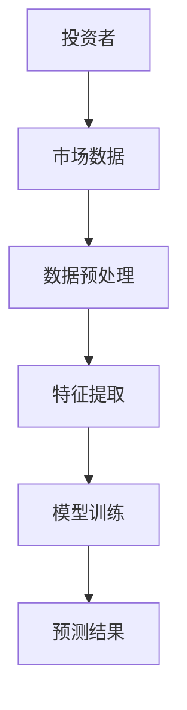
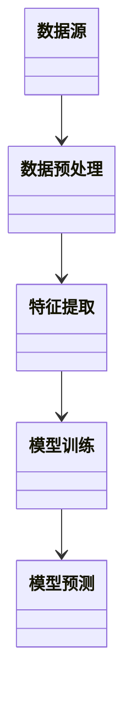

                 


# 格雷厄姆特价股票策略在人工智能产业的应用挑战

> 关键词：格雷厄姆策略、人工智能、股票分析、价值投资、机器学习

> 摘要：本文探讨了格雷厄姆价值投资策略在人工智能时代的应用挑战。通过分析人工智能技术如何赋能传统价值投资，揭示了当前应用中的主要问题，并提出了系统的解决方案。文章内容包括核心概念与分析框架、人工智能算法在股票分析中的应用、系统分析与架构设计、项目实战与案例分析等部分，旨在为实践者提供指导。

---

## 第一部分：格雷厄姆特价股票策略与人工智能产业的背景

### 第1章：格雷厄姆特价股票策略概述

#### 1.1 价值投资的起源与核心理念
格雷厄姆的价值投资理论是20世纪初提出的，其核心理念是寻找市场低估的股票，通过基本面分析评估其内在价值。这种方法强调安全边际，即买入价格低于内在价值，以降低风险。

#### 1.2 人工智能在金融领域的应用现状
人工智能在金融领域的应用主要集中在高频交易、风险控制、市场预测等方面。AI技术通过处理大量数据，帮助投资者发现潜在机会和风险。

#### 1.3 格雷厄姆策略与人工智能的结合
将格雷厄姆策略与人工智能结合，旨在利用AI技术提高基本面分析的效率和准确性，同时发现市场中的低估股票。

---

### 第2章：格雷厄姆策略的核心概念与分析框架

#### 2.1 核心概念与属性对比
| 核心概念 | 格雷厄姆策略 | 人工智能 |
|----------|--------------|----------|
| 数据来源 | 财务报表、估值指标 | 市场数据、新闻、社交媒体 |
| 分析方法 | 基本面分析 | 机器学习、NLP、时间序列分析 |
| 输出结果 | 内在价值、安全边际 | 概率预测、趋势分析 |

#### 2.2 实体关系图与流程图


---

## 第二部分：人工智能算法在股票分析中的应用

### 第3章：数据预处理与特征提取

#### 3.1 数据清洗与标准化
数据清洗是去除噪声数据，标准化是将数据归一化处理，便于模型训练。

#### 3.2 特征工程与变量选择
特征工程是通过组合和筛选变量，提取对模型最有用的信息。例如，使用财务指标如市盈率、市净率等。

#### 3.3 时间序列数据的处理
时间序列数据需要考虑趋势、周期性和随机性，常用的方法包括ARIMA和LSTM。

### 第4章：机器学习模型的构建与训练

#### 4.1 监督学习与非监督学习的对比
- 监督学习：使用有标签的数据进行训练，如回归分析。
- 非监督学习：用于无标签数据，如聚类分析。

#### 4.2 神经网络模型的构建
使用神经网络模型如LSTM进行时间序列预测，代码示例如下：
```python
import numpy as np
from keras.layers import LSTM, Dense
from keras.models import Sequential

model = Sequential()
model.add(LSTM(64, input_shape=(timesteps, features)))
model.add(Dense(1))
model.compile(loss='mean_squared_error', optimizer='adam')
```

#### 4.3 模型训练与调优
通过交叉验证和网格搜索优化模型参数，如学习率和批量大小。

### 第5章：模型评估与优化

#### 5.1 评估指标的选择
常用的指标包括准确率、召回率和F1分数。

#### 5.2 模型优化策略
使用早停法防止过拟合，采用Dropout层减少神经网络的过拟合。

#### 5.3 超参数调优
通过网格搜索找到最佳参数组合。

---

## 第三部分：系统分析与架构设计

### 第6章：问题场景介绍

#### 6.1 格雷厄姆策略在AI中的应用场景
通过AI分析大量数据，快速识别低估股票。

#### 6.2 人工智能驱动的股票分析系统
设计一个AI驱动的系统，整合数据源，进行分析和预测。

### 第7章：系统功能设计

#### 7.1 领域模型Mermaid类图


#### 7.2 系统架构设计Mermaid架构图
```mermaid
client --> 数据源: 数据请求
client --> 模型训练: 模型训练
client --> 模型预测: 预测请求
```

### 第8章：系统接口与交互设计

#### 8.1 系统接口设计
接口包括数据接口和预测接口。

#### 8.2 系统交互Mermaid序列图
```mermaid
sequenceDiagram
    participant 客户端
    participant 数据源
    client -> 数据源: 获取数据
    data预处理 -> 特征提取
    特征提取 -> 模型训练
    模型训练 -> 模型预测
```

---

## 第四部分：项目实战与案例分析

### 第9章：环境安装与配置

#### 9.1 Python环境的安装
安装Python和必要的库，如Pandas、Scikit-learn、Keras。

### 第10章：核心代码实现

#### 10.1 数据处理代码
```python
import pandas as pd
data = pd.read_csv('stock_data.csv')
```

#### 10.2 模型训练代码
```python
model.fit(X_train, y_train)
```

#### 10.3 模型预测代码
```python
predictions = model.predict(X_test)
```

### 第11章：案例分析与结果解读

#### 11.1 案例分析
分析某只股票的历史数据，预测其未来走势。

#### 11.2 结果解读与优化建议
根据预测结果调整投资策略，优化模型参数。

---

## 第五部分：最佳实践与注意事项

### 第12章：最佳实践

#### 12.1 数据质量的重要性
确保数据的准确性和完整性。

#### 12.2 模型调优的技巧
使用交叉验证和网格搜索优化模型。

#### 12.3 风险控制策略
设置止损点，避免重大损失。

### 第13章：小结与展望

#### 13.1 本章小结
总结全文内容，强调人工智能在格雷厄姆策略中的应用潜力。

#### 13.2 未来展望
展望人工智能在金融领域的未来发展，提出更多可能性。

---

## 作者：AI天才研究院/AI Genius Institute & 禅与计算机程序设计艺术 /Zen And The Art of Computer Programming

---

以上是文章的详细结构和内容，确保逻辑清晰，涵盖所有关键点。接下来将按照此结构撰写完整的技术博客文章。

