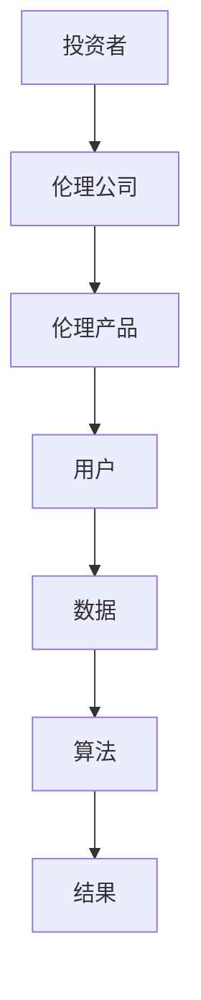
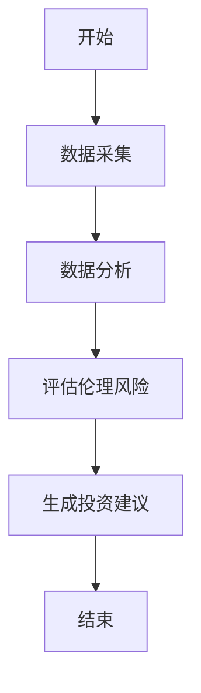
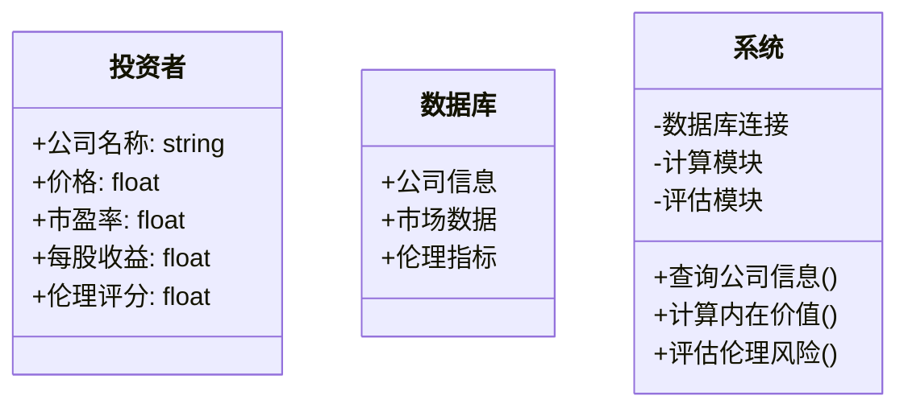
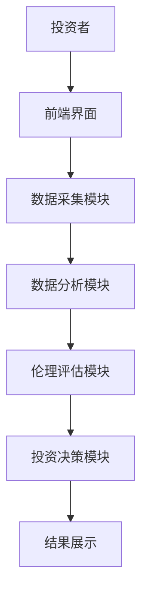

                 


# 格雷厄姆特价股票策略在人工智能伦理产业的应用挑战

> **关键词**：格雷厄姆策略，人工智能，伦理产业，投资策略，股票分析  
> **摘要**：本文探讨格雷厄姆特价股票策略在人工智能伦理产业中的应用挑战，分析其在伦理评估、风险控制和投资决策中的潜力与局限性，提出解决方案和未来研究方向。

---

## 第1章：问题背景与研究意义

### 1.1 格雷厄姆特价股票策略概述

#### 1.1.1 格雷厄姆投资理论的核心思想
格雷厄姆是价值投资之父，其策略强调寻找市场价格低于内在价值的股票，尤其是那些被市场低估的特价股票。他认为，长期来看，投资于这种股票能够带来稳定的收益。

#### 1.1.2 特价股票的定义与特点
特价股票是指市场价格低于其内在价值的股票，通常具有低市盈率、低市净率等特征。这类股票往往被市场忽视或低估，但具有较高的潜在增值空间。

#### 1.1.3 格雷厄姆策略在现代投资中的应用
格雷厄姆策略在现代投资中依然广泛应用，尤其是在价值投资领域。然而，随着市场的变化，其应用也面临新的挑战和机遇。

### 1.2 人工智能伦理产业的背景

#### 1.2.1 人工智能的快速发展与伦理问题
人工智能的快速发展带来了许多伦理问题，如数据隐私、算法偏见、失业问题等。这些问题的出现，使得伦理产业成为一个重要领域。

#### 1.2.2 伦理产业的核心领域与挑战
伦理产业涵盖数据隐私保护、算法治理、伦理审计等多个领域。这些领域需要技术与伦理的结合，以解决人工智能应用中的伦理问题。

#### 1.2.3 人工智能伦理产业的现状与未来趋势
当前，人工智能伦理产业处于快速发展阶段，但同时也面临技术与伦理协调的挑战。未来，随着技术进步，伦理产业将更加重要。

### 1.3 格雷厄姆策略与人工智能伦理产业的结合

#### 1.3.1 格雷厄姆策略在伦理产业中的潜在应用
格雷厄姆策略可以用于评估和选择在伦理产业中有潜力的公司，寻找那些被市场低估的公司，投资于具有长期价值的企业。

#### 1.3.2 人工智能伦理产业中特价股票策略的可行性
在人工智能伦理产业中，许多公司可能因为市场对伦理问题的忽视而被低估，这为格雷厄姆策略的应用提供了空间。

#### 1.3.3 研究的意义与价值
研究格雷厄姆策略在人工智能伦理产业中的应用，有助于发现具有长期价值的企业，推动伦理产业的发展。

---

## 第2章：核心概念与联系

### 2.1 核心概念原理

#### 2.1.1 格雷厄姆策略的数学模型
格雷厄姆策略的核心在于计算股票的内在价值，公式为：
$$
\text{内在价值} = \frac{\text{盈利能力} \times \text{合理市盈率}}{\text{市盈率}}
$$
通过比较市场价格与内在价值，寻找被低估的股票。

#### 2.1.2 人工智能伦理产业的实体关系图

该图展示了投资者如何通过伦理公司提供产品，满足用户的伦理需求，涉及数据和算法的处理。

### 2.2 核心概念属性对比

#### 2.2.1 格雷厄姆策略与传统投资策略的对比
| 特性         | 格雷厄姆策略                | 传统投资策略               |
|--------------|-----------------------------|-----------------------------|
| 核心思想     | 寻找被低估的股票             | 多样化投资，追求收益         |
| 风险控制     | 低风险，注重安全边际         | 风险分散，追求高收益         |
| 适用场景     | 稳定增长的市场               | 波动较大的市场               |

#### 2.2.2 人工智能伦理产业与传统伦理产业的对比
| 特性         | 人工智能伦理产业           | 传统伦理产业               |
|--------------|-----------------------------|-----------------------------|
| 核心技术     | 依赖AI技术，自动化处理       | 依赖人工审查和监管           |
| 发展速度     | 发展迅速，技术驱动          | 发展较慢，政策驱动           |
| 应用领域     | 数据隐私、算法治理          | 企业治理、法律合规          |

---

## 第3章：算法原理讲解

### 3.1 算法流程


#### 3.1.1 数据采集
从市场上收集相关数据，包括公司财务数据、市场表现、伦理评估指标等。

#### 3.1.2 数据分析
使用数据分析工具对数据进行处理，计算股票的内在价值和市场价格。

#### 3.1.3 评估伦理风险
基于伦理指标评估公司的伦理风险，如数据隐私、算法偏见等。

#### 3.1.4 生成投资建议
根据分析结果，生成投资建议，寻找被低估的公司进行投资。

### 3.2 Python代码实现

```python
import pandas as pd
import numpy as np

def calculate_intrinsic_value(eps, pe_ratio):
    return eps * pe_ratio

def graham_strategy(data):
    data['intrinsic_value'] = data.apply(lambda x: calculate_intrinsic_value(x['eps'], x['pe_ratio']), axis=1)
    data['undervalued'] = data['price'] < data['intrinsic_value']
    return data

# 示例数据
data = {
    'company': ['A', 'B', 'C'],
    'price': [10, 15, 20],
    'eps': [5, 7, 9],
    'pe_ratio': [2, 3, 4]
}

df = pd.DataFrame(data)
result = graham_strategy(df)
print(result)
```

---

## 第4章：系统分析与架构设计

### 4.1 问题场景介绍
人工智能伦理产业中的投资决策需要考虑伦理风险和市场表现，传统格雷厄姆策略需要结合这些因素。

### 4.2 系统功能设计


### 4.3 系统架构设计


### 4.4 系统接口设计
- 数据采集模块：从数据库获取公司信息和市场数据。
- 数据分析模块：计算内在价值，判断是否低估。
- 伦理评估模块：评估公司的伦理风险。
- 投资决策模块：生成投资建议。

---

## 第5章：项目实战

### 5.1 环境安装
安装Python、Pandas、Mermaid等工具，配置开发环境。

### 5.2 系统核心实现

```python
import pandas as pd
import numpy as np

def calculate_intrinsic_value(eps, pe_ratio):
    return eps * pe_ratio

def assess_ethical_risk(ethical_score):
    if ethical_score < 3:
        return "高风险"
    elif ethical_score < 6:
        return "中风险"
    else:
        return "低风险"

def graham_strategy(data):
    data['intrinsic_value'] = data.apply(lambda x: calculate_intrinsic_value(x['eps'], x['pe_ratio']), axis=1)
    data['ethic_risk'] = data['ethical_score'].apply(assess_ethical_risk)
    data['undervalued'] = data['price'] < data['intrinsic_value']
    return data

# 示例数据
data = {
    'company': ['A', 'B', 'C'],
    'price': [10, 15, 20],
    'eps': [5, 7, 9],
    'pe_ratio': [2, 3, 4],
    'ethical_score': [7, 5, 8]
}

df = pd.DataFrame(data)
result = graham_strategy(df)
print(result)
```

---

## 第6章：挑战与解决方案

### 6.1 当前应用的挑战
- 数据隐私问题：如何在分析中保护数据隐私。
- 算法偏见：如何避免算法在伦理评估中的偏见。

### 6.2 解决方案
- 数据加密和匿名化处理。
- 使用多维度评估模型，减少偏见。

### 6.3 未来研究方向
- 结合区块链技术，实现数据的安全共享。
- 研究更复杂的评估模型，提升评估精度。

---

## 结论

格雷厄姆特价股票策略在人工智能伦理产业中的应用具有重要意义，但也面临诸多挑战。通过技术创新和伦理考量，可以克服这些挑战，推动伦理产业的健康发展。

---

**作者：AI天才研究院 & 禅与计算机程序设计艺术**

