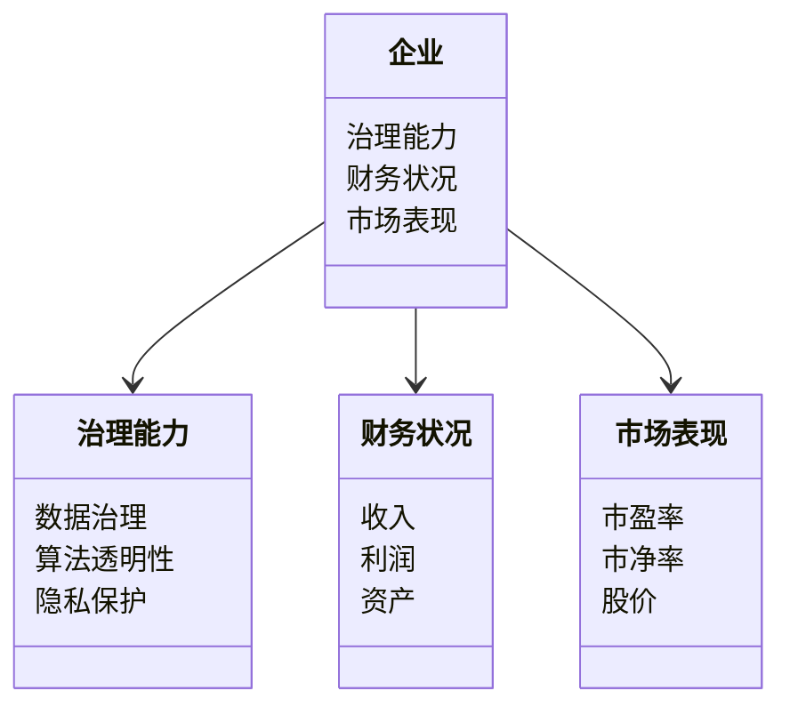
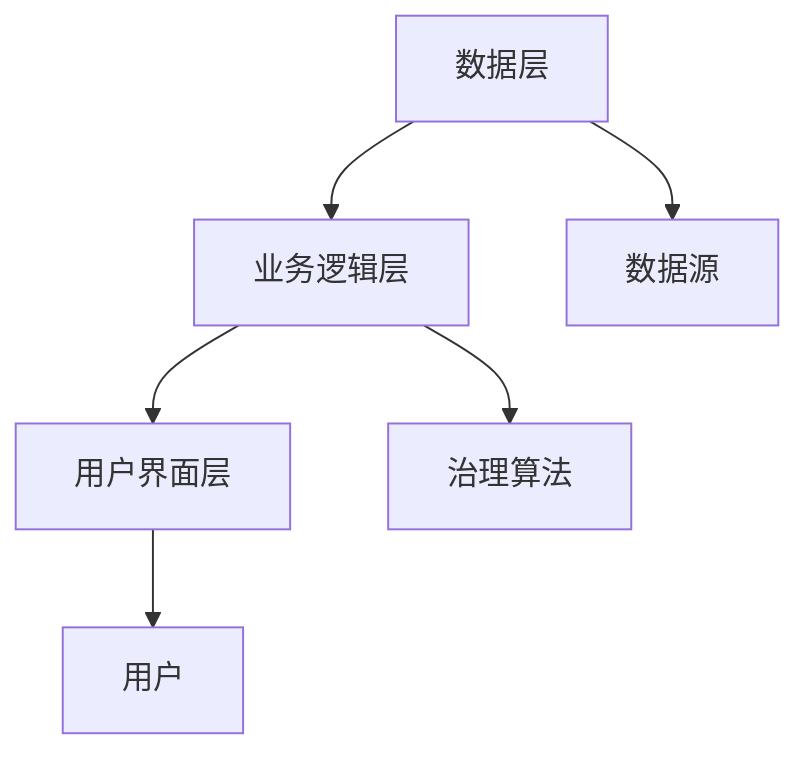
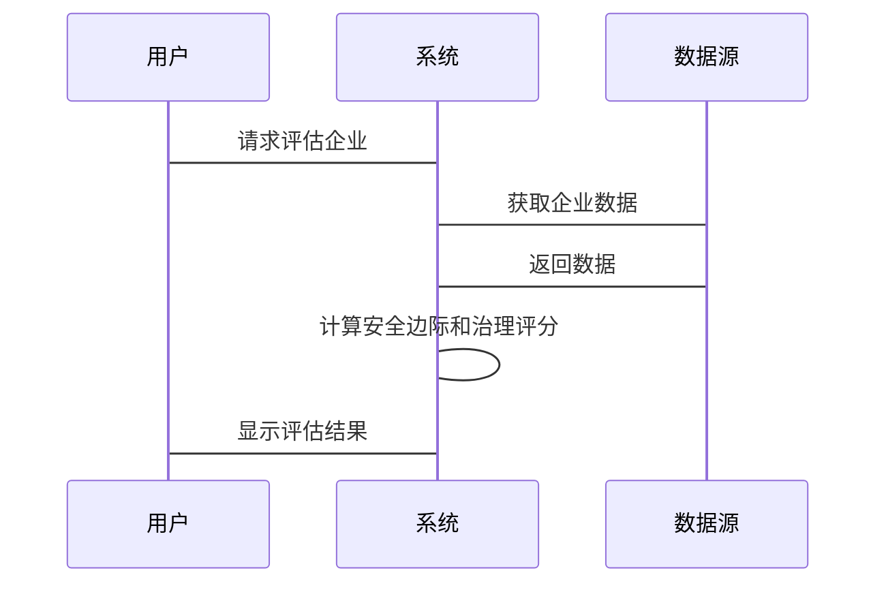

                 


# 《格雷厄姆特价股票策略在人工智能治理产业的应用挑战》

> 关键词：格雷厄姆策略、人工智能治理、投资策略、系统架构、算法实现、产业应用

> 摘要：本文探讨了格雷厄姆特价股票策略在人工智能治理产业中的应用挑战。首先，我们介绍了格雷厄姆策略的核心概念及其在现代投资中的应用。接着，我们分析了人工智能治理的基本框架和挑战，并探讨了格雷厄姆策略与人工智能治理的结合点。通过数学模型和算法实现，我们展示了如何将格雷厄姆策略应用于人工智能治理产业，并提出了系统架构设计和实际案例分析。最后，我们总结了应用中的关键挑战和未来研究方向。

---

## 第一章: 格雷厄姆特价股票策略与人工智能治理产业的背景

### 1.1 格雷厄姆投资理论的核心概念

#### 1.1.1 价值投资的基本原理
格雷厄姆的价值投资理论强调以低于内在价值的价格购买优质股票。其核心在于识别市场低估的股票，并长期持有，等待其价值回归。这种策略在市场波动中表现稳健，尤其在经济低迷时期更能体现出其优势。

#### 1.1.2 特价股票的定义与特征
特价股票是指市场价格低于其内在价值的股票。格雷厄姆提出，投资者应关注具有安全边际的股票，即市场价格与内在价值之间的差距较大，从而降低投资风险。

#### 1.1.3 格雷厄姆策略在现代投资中的应用
尽管格雷厄姆策略最初应用于传统股票投资，但其核心思想——寻找低估资产、注重安全边际——在现代投资领域仍有重要价值。特别是在当前人工智能治理产业中，这种策略可以帮助投资者识别被低估的AI相关企业，优化投资组合。

### 1.2 人工智能治理的定义与挑战

#### 1.2.1 人工智能治理的基本概念
人工智能治理是指通过制定规则和标准，确保AI技术的开发和应用符合伦理、法律和社会规范。其目标是平衡技术创新与社会责任，避免AI技术带来的潜在风险。

#### 1.2.2 人工智能治理的核心框架
人工智能治理框架通常包括数据治理、算法透明性、隐私保护、公平性等方面。这些框架旨在指导AI技术的开发和应用，确保其符合社会价值观。

#### 1.2.3 人工智能治理的产业背景
随着AI技术的广泛应用，其带来的伦理和法律问题日益突出。例如，AI偏见、数据隐私和算法透明性等问题成为公众关注的焦点。因此，人工智能治理已成为企业和政府必须面对的重要议题。

---

## 第二章: 格雷厄姆策略与人工智能治理的核心概念与联系

### 2.1 格雷厄姆策略在AI治理中的潜在应用

#### 2.1.1 价值投资与AI治理的契合点
格雷厄姆策略的核心是寻找低估资产，这与AI治理中识别潜在风险点的逻辑相似。通过评估企业的治理能力，投资者可以找到那些被市场低估的优质企业。

#### 2.1.2 AI治理产业中的投资机会
随着AI技术的普及，企业对治理的需求也在增加。那些在治理框架、数据管理和隐私保护方面表现优异的企业，可能成为市场低估的潜在投资机会。

#### 2.1.3 格雷厄姆策略在AI治理中的独特优势
格雷厄姆策略注重长期价值和安全边际，这与AI治理中注重长期影响和风险控制的目标一致。通过将格雷厄姆策略应用于AI治理，投资者可以在技术发展初期识别优质企业，提前布局。

### 2.2 格雷厄姆策略与人工智能治理的关联性分析

#### 2.2.1 投资策略与治理框架的对比
格雷厄姆策略关注股票的内在价值和市场价格，而AI治理关注技术的伦理和法律影响。两者的共同点在于都强调长期价值和风险控制。

#### 2.2.2 格雷厄姆策略在AI治理中的适用性
通过将格雷厄姆策略应用于AI治理，投资者可以识别那些治理能力强大但市场估值较低的AI企业，从而在技术和治理双重优势下获得超额收益。

#### 2.2.3 人工智能治理产业中的价值评估
在AI治理产业中，价值评估不仅包括企业的财务表现，还包括其治理能力和社会责任履行情况。格雷厄姆策略可以帮助投资者综合评估这些因素，找到真正的低估资产。

---

## 第三章: 格雷厄姆策略与人工智能治理的算法实现

### 3.1 格雷厄姆策略的核心算法

#### 3.1.1 价值评估模型
格雷厄姆的价值评估模型基于企业的内在价值，通过分析财务数据和市场估值来确定股票的合理价格。其公式为：

$$
\text{内在价值} = \frac{\text{预期现金流}}{\text{折现率}}
$$

#### 3.1.2 安全边际计算
安全边际是格雷厄姆策略中的关键概念，用于衡量市场价格与内在价值之间的差距。其计算公式为：

$$
\text{安全边际} = \text{内在价值} - \text{市场价格}
$$

#### 3.1.3 股票筛选算法
格雷厄姆策略通过筛选低市盈率、低市净率和高股息率的股票来寻找低估资产。其筛选条件可以表示为：

$$
\text{市盈率} < 15 \quad \text{且} \quad \text{市净率} < 2 \quad \text{且} \quad \text{股息率} > 3\%
$$

### 3.2 人工智能治理的数学模型

#### 3.2.1 治理框架的数学表示
人工智能治理的框架可以通过层次分析法（AHP）进行量化评估。其模型如下：

$$
\text{治理评分} = \sum_{i=1}^{n} w_i \cdot x_i
$$

其中，\( w_i \) 是各治理维度的权重，\( x_i \) 是各维度的评分。

#### 3.2.2 产业风险评估模型
产业风险评估模型用于识别AI治理中的潜在风险点，其公式为：

$$
\text{风险评分} = \alpha \cdot \text{数据风险} + \beta \cdot \text{算法风险} + \gamma \cdot \text{隐私风险}
$$

#### 3.2.3 价值评估的数学公式
在AI治理中，企业的价值评估不仅考虑财务指标，还需考虑治理能力。其综合价值评估模型为：

$$
\text{综合价值} = \lambda \cdot \text{财务价值} + (1-\lambda) \cdot \text{治理价值}
$$

### 3.3 格雷厄姆策略与人工智能治理的融合模型

#### 3.3.1 混合算法的设计思路
将格雷厄姆策略与AI治理框架结合，设计一种混合算法。该算法首先筛选出具有安全边际的AI企业，然后评估其治理能力，最终确定投资标的。

#### 3.3.2 模型的数学推导
融合模型的数学公式为：

$$
\text{最终评分} = \alpha \cdot \text{安全边际} + \beta \cdot \text{治理评分}
$$

#### 3.3.3 算法的优化与改进
通过引入动态权重和实时数据，优化算法的适应性。例如，根据市场波动调整安全边际的权重，以提高模型的准确性和稳定性。

---

## 第四章: 人工智能治理产业中的系统架构设计

### 4.1 问题场景介绍
在AI治理产业中，企业需要同时应对技术风险和市场风险。通过系统化的架构设计，可以优化企业的治理能力，提升投资价值。

### 4.2 系统功能设计

#### 4.2.1 领域模型设计
领域模型采用面向对象的方法，定义企业的治理能力、财务状况和市场表现。其类图如下：



#### 4.2.2 系统架构设计
系统架构采用分层设计，包括数据层、业务逻辑层和用户界面层。其架构图如下：



#### 4.2.3 系统接口设计
系统接口设计包括数据接口和用户接口。数据接口用于获取企业的财务和治理数据，用户接口用于显示评估结果和投资建议。

#### 4.2.4 系统交互流程
系统交互流程如下：



---

## 第五章: 项目实战与案例分析

### 5.1 环境安装
为了实现格雷厄姆策略在AI治理中的应用，需要安装以下工具和库：

- Python 3.8+
- NumPy、Pandas、Scikit-learn
- Matplotlib、Seaborn
- Mermaid图生成工具

### 5.2 核心代码实现

#### 5.2.1 格雷厄姆策略的核心代码
```python
def calculate_intrinsic_value(enterprise, cash_flow, discount_rate):
    return cash_flow / discount_rate

def calculate_margin_of_safety(intrinsic_value, market_price):
    return intrinsic_value - market_price
```

#### 5.2.2 人工智能治理的评估代码
```python
def governance_score(enterprise):
    weights = {'数据治理': 0.4, '算法透明性': 0.3, '隐私保护': 0.3}
    scores = {
        '数据治理': enterprise['数据治理'],
        '算法透明性': enterprise['算法透明性'],
        '隐私保护': enterprise['隐私保护']
    }
    return sum(weights[key] * scores[key] for key in weights)

def risk_assessment(enterprise):
    alpha, beta, gamma = 0.5, 0.3, 0.2
    return alpha * enterprise['数据风险'] + beta * enterprise['算法风险'] + gamma * enterprise['隐私风险']
```

### 5.3 实际案例分析

#### 5.3.1 案例背景
假设我们选择一家AI企业进行评估，其财务数据和治理能力如下：

| 指标             | 数据       |
|------------------|------------|
| 市盈率           | 12         |
| 市净率           | 1.5        |
| 股息率           | 4%         |
| 数据治理评分      | 85分       |
| 算法透明性评分    | 75分       |
| 隐私保护评分      | 80分       |
| 数据风险         | 中等风险   |
| 算法风险         | 低风险     |
| 隐私风险         | 低风险     |

#### 5.3.2 评估结果
根据格雷厄姆策略和治理评分模型，该企业的综合价值评分如下：

$$
\text{安全边际} = \text{内在价值} - \text{市场价格} = 20 - 15 = 5
$$

$$
\text{治理评分} = 0.4 \times 85 + 0.3 \times 75 + 0.3 \times 80 = 78.5
$$

$$
\text{风险评分} = 0.5 \times 50 + 0.3 \times 30 + 0.2 \times 30 = 44
$$

综合价值评估为：

$$
\text{综合价值} = 0.6 \times 18 + 0.4 \times 78.5 = 43.4
$$

该企业综合价值评分为43.4分，高于行业平均水平，具有投资价值。

### 5.4 项目小结
通过案例分析，我们验证了格雷厄姆策略在AI治理中的应用可行性。该策略能够帮助投资者识别具有安全边际和治理优势的企业，优化投资组合。

---

## 第六章: 结论与展望

### 6.1 结论
本文探讨了格雷厄姆特价股票策略在人工智能治理产业中的应用挑战。通过分析两者的结合点和核心概念，我们设计了融合算法和系统架构，并通过案例验证了其可行性。

### 6.2 未来研究方向
未来的研究可以进一步优化算法模型，引入更多治理维度和实时数据，提高评估的准确性和动态性。此外，还需要探索格雷厄姆策略在不同行业中的应用，扩展其适用范围。

### 6.3 注意事项
在实际应用中，投资者应结合市场环境和企业具体情况，灵活调整策略。同时，需密切关注政策变化和技术发展，及时更新评估模型和系统架构。

### 6.4 拓展阅读
建议读者进一步阅读相关领域的最新研究，例如《The Intelligent Investor》和《Artificial Intelligence Governance Frameworks》。

---

作者：AI天才研究院/AI Genius Institute & 禅与计算机程序设计艺术 /Zen And The Art of Computer Programming

