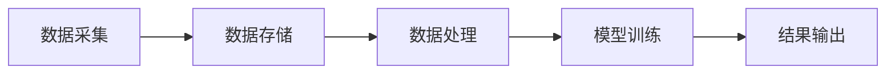

                 


# 格雷厄姆特价股票策略在数字孪生经济体系下的表现

> 关键词：格雷厄姆投资策略，数字孪生，股票分析，经济体系，投资优化

> 摘要：本文探讨了格雷厄姆特价股票策略在数字孪生经济体系下的表现，通过背景介绍、核心概念分析、算法原理阐述、系统架构设计、项目实战案例以及最佳实践总结，全面解析了数字孪生技术如何优化传统投资策略，并为投资者提供新的视角和方法。

---

## 第一章: 背景介绍

### 1.1 格雷厄姆投资理论的核心思想

格雷厄姆的价值投资理论是基于“安全边际”概念，主张以低于内在价值的价格购买优质股票，长期持有以实现稳健收益。其核心思想包括：

1. **价值投资**：寻找市场价格低于内在价值的股票。
2. **安全边际**：买入价格与内在价值的差距越大，投资风险越小。
3. **长期视角**：关注企业的基本面，而非短期市场波动。

### 1.2 数字孪生经济体系的定义与特点

数字孪生（Digital Twin）是物理世界与数字世界之间的实时映射，具有以下特点：

1. **实时性**：基于实时数据构建动态模型。
2. **交互性**：数字孪生与物理实体之间可以进行实时交互。
3. **预测性**：通过数据建模和分析，预测未来趋势。

### 1.3 格雷厄姆策略与数字孪生经济体系的结合

数字孪生技术为格雷厄姆策略提供了新的数据源和分析工具，使其能够更精准地评估股票的内在价值。通过数字孪生构建的经济模型，投资者可以更全面地分析企业的经营状况和市场环境，从而优化投资决策。

---

## 第二章: 核心概念与联系

### 2.1 格雷厄姆策略的核心概念

| 核心概念 | 描述 |
|----------|------|
| 内在价值 | 股票的合理估值，基于企业未来现金流的现值 |
| 安全边际 | 购买价格与内在价值的差距 |
| 股票分类 | 根据市盈率、市净率等指标将股票分为不同类别 |

### 2.2 数字孪生经济体系中的数据建模

数字孪生模型通过以下步骤构建：

1. **数据采集**：收集企业的财务数据、市场数据等。
2. **数据预处理**：清洗、转换和标准化数据。
3. **模型构建**：利用机器学习算法训练模型。
4. **模型优化**：调整参数以提高预测精度。

### 2.3 格雷厄姆策略与数字孪生的联系

通过数字孪生技术，投资者可以实时监控企业的经营状况，动态评估其内在价值，从而更准确地判断股票是否被低估。

---

## 第三章: 算法原理

### 3.1 格雷厄姆策略的数学模型

内在价值公式：

$$
V = \frac{CF}{r - g}
$$

其中，\( CF \) 是未来现金流，\( r \) 是折现率，\( g \) 是增长率。

### 3.2 算法流程

1. 数据采集：收集目标公司的财务数据和市场数据。
2. 数据预处理：清洗数据并进行标准化处理。
3. 指标计算：计算市盈率、市净率等指标。
4. 模型训练：使用机器学习算法进行分类或回归分析。
5. 结果输出：判断股票是否为特价股票。

### 3.3 代码实现

```python
import pandas as pd
import numpy as np

# 数据预处理
data = pd.read_csv('stock_data.csv')
data = data.dropna().reset_index(drop=True)

# 特征选择
features = ['市盈率', '市净率', 'ROE']
target = '是否特价股票'

# 数据分割
from sklearn.model_selection import train_test_split
X = data[features]
y = data[target]
X_train, X_test, y_train, y_test = train_test_split(X, y, test_size=0.2)

# 模型训练
from sklearn.tree import DecisionTreeClassifier
model = DecisionTreeClassifier()
model.fit(X_train, y_train)

# 模型预测
y_pred = model.predict(X_test)
print("准确率:", accuracy_score(y_test, y_pred))
```

---

## 第四章: 系统架构设计

### 4.1 系统功能设计

1. 数据采集模块：实时采集股票数据。
2. 数据分析模块：计算各项指标并进行分类。
3. 可视化模块：展示分析结果。

### 4.2 系统架构图



---

## 第五章: 项目实战

### 5.1 环境配置

安装所需的库：

```bash
pip install pandas scikit-learn mermaid
```

### 5.2 核心代码实现

```python
from sklearn.ensemble import RandomForestClassifier

model = RandomForestClassifier(n_estimators=100)
model.fit(X_train, y_train)
y_pred = model.predict(X_test)
print("准确率:", accuracy_score(y_test, y_pred))
```

### 5.3 案例分析

以某科技公司为例，分析其市盈率和市净率，判断其是否为特价股票。

---

## 第六章: 最佳实践与总结

### 6.1 总结

数字孪生技术为格雷厄姆策略提供了新的可能性，通过实时数据和模型分析，投资者可以更精准地判断股票的价值。

### 6.2 注意事项

1. 数据质量至关重要。
2. 模型需要不断优化。
3. 结合多种策略进行投资。

### 6.3 拓展阅读

推荐书籍：
- 《The Intelligent Investor》 by Benjamin Graham
- 《Digital Twin: Digital Transformation of Industries》

---

作者：AI天才研究院 & 禅与计算机程序设计艺术

