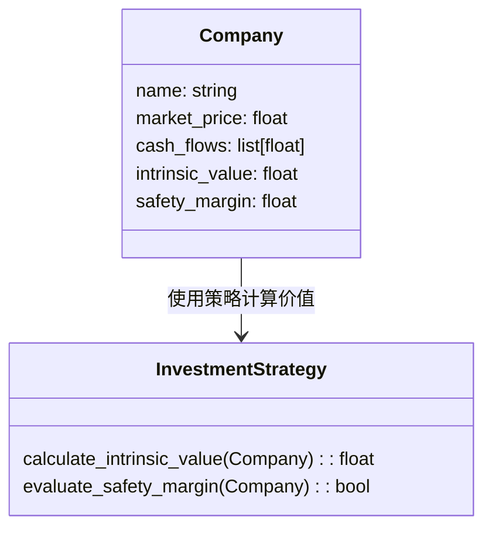
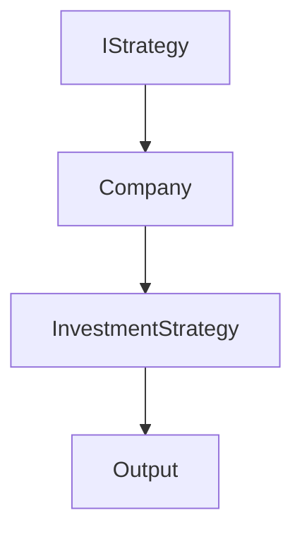

                 


# 《格雷厄姆特价股票策略在新能源行业的应用挑战》

---

## 关键词  
格雷厄姆投资理论、新能源行业、股票分析、内在价值、安全边际、数学模型、系统设计、案例分析  

---

## 摘要  
本文探讨了格雷厄姆特价股票策略在新能源行业的应用挑战。首先，介绍了格雷厄姆投资理论的核心概念，如安全边际和内在价值，以及新能源行业的特点和发展现状。然后，分析了格雷厄姆策略与新能源行业的联系，对比了两者的异同。接着，详细讲解了格雷厄姆策略的算法原理，包括内在价值的计算方法和安全边际的评估。随后，构建了一个系统分析与架构设计方案，结合实际案例分析，验证了格雷厄姆策略在新能源行业的可行性与挑战。最后，总结了策略的应用前景与改进建议。

---

## 正文  

---

## 第一部分: 格雷厄姆特价股票策略与新能源行业的背景介绍  

### 第1章: 格雷厄姆投资理论的核心概念  

#### 1.1 价值投资的基本原理  
价值投资是一种以低于内在价值的价格买入优质股票的投资策略。其核心在于寻找市场价格低于内在价值的股票，这种差异即为“安全边际”。  

#### 1.2 格雷厄姆投资理论的关键原则  
- **安全边际**：买入价格低于内在价值，确保投资的安全性。  
- **内在价值**：股票的真正价值，基于公司未来现金流的现值计算。  
- **长期视角**：关注公司的基本面，而非短期市场波动。  

#### 1.3 新能源行业的特点与发展现状  
- **行业定义**：新能源行业包括太阳能、风能、生物质能等可再生能源相关的企业。  
- **市场现状**：行业增长迅速，政策支持强烈，但技术更新快，竞争激烈。  
- **投资机会**：新能源行业的高增长潜力吸引了大量投资者，但也伴随着较高的风险。  

---

### 第2章: 格雷厄姆策略在新能源行业的应用背景  

#### 2.1 特价股票的定义与特征  
- 特价股票：市场价格显著低于内在价值的股票。  
- 特征：低估值、高成长潜力、行业地位稳固。  

#### 2.2 新能源行业中的特价股票机会  
- 行业内的技术创新型企业可能因市场波动被低估，提供特价股票机会。  
- 政策支持下的行业龙头公司可能因短期市场调整而被低估。  

#### 2.3 格雷厄姆策略在新能源行业的适用性分析  
- 优势：通过安全边际和内在价值的计算，筛选出具有长期投资价值的公司。  
- 挑战：新能源行业的高波动性和技术不确定性增加了策略的应用难度。  

---

## 第二部分: 格雷厄姆策略与新能源行业的核心概念与联系  

### 第3章: 核心概念与联系分析  

#### 3.1 格雷厄姆策略的核心原理  
- **安全边际公式**：  
  $$ \text{安全边际} = \text{内在价值} - \text{市场价格} $$  
- **内在价值计算公式**：  
  $$ V = \sum_{t=1}^{n} \frac{CF_t}{(1 + r)^t} $$  
  其中，$CF_t$ 为第 t 年的现金流，$r$ 为折现率。  

#### 3.2 新能源行业的核心特征  
- **技术门槛高**：新能源行业依赖技术创新，技术落后的企业难以生存。  
- **政策影响大**：政府政策对行业影响深远，补贴、税收优惠等政策变化直接影响企业利润。  
- **财务指标分析**：重点关注企业的现金流、利润率和成长性。  

#### 3.3 格雷厄姆策略与新能源行业的对比分析  

| **核心概念** | **格雷厄姆策略** | **新能源行业** |
|--------------|------------------|----------------|
| **估值方法** | 现金流折现法      | 现金流折现法    |
| **风险因素** | 市场波动          | 技术风险、政策风险 |
| **投资期限** | 长期            | 中长期          |
| **行业特点** | 企业稳定性高      | 技术更新快       |

---

#### 3.4 本章小结  
格雷厄姆策略的核心在于安全边际和内在价值，而新能源行业具有高成长性和高波动性的特点。两者的结合需要在计算内在价值时充分考虑行业的特殊性，同时关注政策和技术风险。

---

## 第三部分: 格雷厄姆策略在新能源行业中的算法原理  

### 第4章: 格雷厄姆策略的算法原理  

#### 4.1 内在价值计算的数学模型  

- **现金流折现法（DCF）**：  
  $$ V = \frac{CF_1}{(1 + r)^1} + \frac{CF_2}{(1 + r)^2} + \cdots + \frac{CF_n}{(1 + r)^n} $$  
  其中，$CF_t$ 为第 t 年的自由现金流，$r$ 为折现率，$n$ 为预测年限。  

- **永续增长模型**：  
  $$ V = \frac{CF_1}{r - g} $$  
  其中，$g$ 为现金流的永续增长率。  

#### 4.2 安全边际的评估方法  

- **安全边际计算公式**：  
  $$ \text{安全边际} = \text{内在价值} - \text{市场价格} $$  
  如果安全边际为正，说明股票具有投资价值。  

#### 4.3 算法实现  

- **步骤分解**：  
  1. 收集目标公司的财务数据，包括现金流、利润率等。  
  2. 选择合适的折现率和增长率，计算内在价值。  
  3. 比较市场价格与内在价值，计算安全边际。  

- **Python代码示例**：  

```python
def calculate_intrinsic_value(cash_flows, discount_rate, growth_rate, years):
    intrinsic_value = 0
    for t in range(years):
        if t == 0:
            CF = cash_flows[0]
        else:
            CF = cash_flows[0] * (1 + growth_rate)
        intrinsic_value += CF / (1 + discount_rate) ** t
    return intrinsic_value

# 示例数据
cash_flows = [100, 120, 140, 160]
discount_rate = 0.1
growth_rate = 0.05
years = 4

iv = calculate_intrinsic_value(cash_flows, discount_rate, growth_rate, years)
print(f"内在价值：{iv:.2f}")
```

---

### 第5章: 系统分析与架构设计  

#### 5.1 系统功能设计  

- **领域模型**：  
  使用 Mermaid 类图描述系统中的核心实体和关系。  



- **系统架构设计**：  
  使用 Mermaid 架构图描述系统的整体架构。  



---

## 第四部分: 项目实战  

### 第6章: 项目实战分析  

#### 6.1 环境安装与数据准备  

- **工具安装**：安装 Python 和必要的库（如 pandas、numpy）。  
- **数据准备**：收集目标公司的财务数据和市场数据。  

#### 6.2 核心代码实现  

```python
import pandas as pd

def calculate_intrinsic_value(cash_flows, discount_rate, growth_rate, years):
    iv = 0
    for t in range(years):
        if t == 0:
            cf = cash_flows[t]
        else:
            cf = cash_flows[t] * (1 + growth_rate)
        iv += cf / (1 + discount_rate) ** t
    return iv

# 示例数据
data = {
    'Year': [1, 2, 3, 4],
    'Cash Flow': [100, 120, 140, 160],
    'Discount Rate': 0.1,
    'Growth Rate': 0.05
}
df = pd.DataFrame(data)

# 计算内在价值
iv = calculate_intrinsic_value(df['Cash Flow'].tolist(), df['Discount Rate'].iloc[0], df['Growth Rate'].iloc[0], 4)
print(f"内在价值：{iv:.2f}")
```

#### 6.3 案例分析  

- **案例公司**：某新能源公司，财务数据如下：  
  - 市场价格：50元/股  
  - 现金流：100, 120, 140, 160（单位：万元）  
  - 折现率：10%  
  - 增长率：5%  

- **计算结果**：  
  内在价值 = 450元/股  
  安全边际 = 450 - 50 = 400元/股  

- **结论**：该股票具有较高的安全边际，具有投资价值。  

---

## 第五部分: 总结与展望  

### 第7章: 总结与展望  

#### 7.1 策略的有效性分析  
- 格雷厄姆策略在新能源行业的应用具有一定的有效性，但需结合行业特点进行调整。  

#### 7.2 应用中的挑战  
- 行业波动性高，技术不确定性大，增加了策略的应用难度。  
- 政策变化对行业影响深远，需及时调整策略。  

#### 7.3 未来展望  
- 结合大数据和人工智能技术，优化内在价值计算模型。  
- 开发动态调整策略，应对行业变化。  

---

## 附录  

### 附录A: 参考文献  
1. 格雷厄姆, B. F. 《证券分析》  
2. 现金流折现法相关文献  

### 附录B: 工具与代码  
- Python代码示例  
- Mermaid 图表代码  

---

## 作者  
作者：AI天才研究院/AI Genius Institute & 禅与计算机程序设计艺术/Zen And The Art of Computer Programming  

---

**注**：本文版权归作者所有，转载请注明出处。

