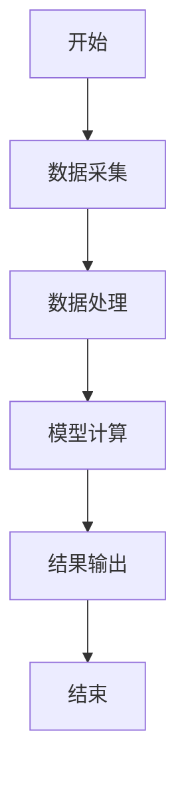
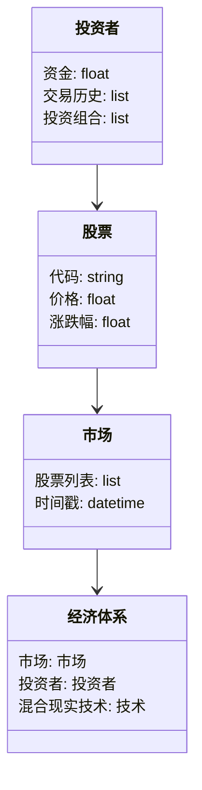
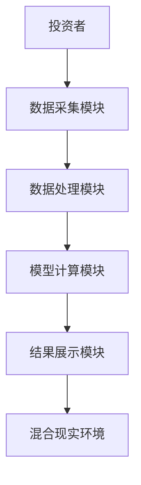
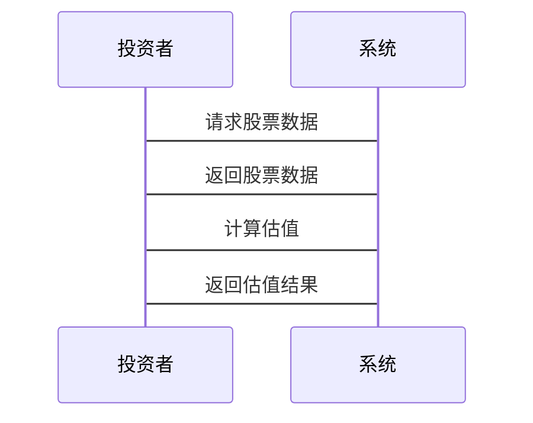

                 


# 第三章：核心概念与联系

## 3.1 核心概念的原理

### 3.1.1 格雷厄姆策略的核心原理

格雷厄姆特价股票策略的核心在于寻找市场低估的股票。这一策略基于价值投资的理念，认为市场的短期波动并不影响股票的内在价值。投资者应关注公司的基本面，如盈利能力、财务状况和市场地位，寻找那些市场价格低于其内在价值的股票。

**数学模型：**
格雷厄姆常用市盈率（P/E）和市净率（P/B）来评估股票的价值。公式如下：

- 市盈率：$$ P/E = \frac{P}{E} $$
- 市净率：$$ P/B = \frac{P}{B} $$

其中，P为股票价格，E为每股收益，B为每股净资产。

### 3.1.2 混合现实经济体系的运作机制

混合现实（MR）技术将虚拟世界与现实世界无缝结合，创造出新的经济环境。在混合现实中，经济活动可以跨越物理和数字边界，例如虚拟市场和增强现实分析工具。这种环境可能影响股票市场的运作，提供新的投资机会和挑战。

### 3.1.3 两者的结合点与协同效应

在混合现实中，投资者可以利用增强现实技术实时分析股票数据，或在虚拟市场中进行模拟交易。格雷厄姆策略可以应用于这些环境中，帮助投资者识别低估的股票。例如，投资者可以通过增强现实设备查看实时股价和财务数据，辅助决策。

## 3.2 核心概念属性对比表

表3.1 格雷厄姆策略与混合现实经济体系的核心概念对比

| 概念               | 格雷厄姆策略                            | 混合现实经济体系                          |
|--------------------|----------------------------------------|------------------------------------------|
| 核心目标           | 寻找低估股票                            | 创造虚拟与现实结合的经济环境              |
| 工具               | 市盈率、市净率等估值指标                | 增强现实、虚拟现实等技术                  |
| 应用场景           | 传统股票市场                           | 混合现实中的虚拟市场、增强分析            |
| 优势               | 精准估值，降低投资风险                  | 提供沉浸式体验，增强决策效率              |
| 挑战               | 市场波动、信息滞后                      | 技术复杂性，用户体验门槛高                |

## 3.3 ER实体关系图

以下是实体关系图，展示了格雷厄姆策略在混合现实经济体系中的核心要素：


# 第四章：算法原理讲解

## 4.1 格雷厄姆策略的数学模型

### 4.1.1 市盈率模型

市盈率（P/E）用于衡量股票价格是否合理。公式：

$$ P/E = \frac{P}{E} $$

其中，P为股价，E为每股收益。通常，较低的P/E可能意味着股票被低估。

### 4.1.2 市净率模型

市净率（P/B）衡量股价与账面价值的关系：

$$ P/B = \frac{P}{B} $$

其中，B为每股净资产。低P/B可能表明股票价值被低估。

## 4.2 混合现实经济体系的算法流程

以下是实现混合现实经济体系的算法流程：



## 4.3 算法实现代码

以下是一个计算市盈率和市净率的Python代码示例：

```python
def calculate_pe(stock_price, earnings_per_share):
    return stock_price / earnings_per_share

def calculate_pb(stock_price, book_value_per_share):
    return stock_price / book_value_per_share

# 示例计算
stock_price = 100
earnings_per_share = 25
book_value_per_share = 50

pe_ratio = calculate_pe(stock_price, earnings_per_share)
pb_ratio = calculate_pb(stock_price, book_value_per_share)

print(f"市盈率: {pe_ratio}")
print(f"市净率: {pb_ratio}")
```

# 第五章：系统分析与架构设计

## 5.1 系统功能设计

### 5.1.1 领域模型

以下是领域模型的Mermaid类图：



### 5.1.2 系统架构设计

以下是系统架构的Mermaid图：



## 5.2 系统接口设计

### 5.2.1 API接口

以下是关键API接口：

- `get_stock_data()`: 获取股票数据
- `calculate_valuation()`: 计算股票估值
- `update_market_conditions()`: 更新市场状况
- `display_analysis()`: 显示分析结果

## 5.3 系统交互设计

以下是投资者与系统交互的Mermaid序列图：



# 第六章：项目实战

## 6.1 环境安装

### 6.1.1 技术环境

- Python 3.8+
- Matplotlib或Seaborn用于数据可视化
- Mermaid CLI用于生成图表

### 6.1.2 工具安装

安装必要的库：

```bash
pip install mermaid-cli matplotlib pandas numpy
```

## 6.2 核心实现

### 6.2.1 数据采集

从API获取股票数据：

```python
import requests

def get_stock_data(api_key):
    url = f"https://api.example.com/stocks?api_key={api_key}"
    response = requests.get(url)
    return response.json()

# 示例调用
data = get_stock_data("your_api_key")
```

### 6.2.2 估值计算

计算市盈率和市净率：

```python
import pandas as pd

def calculate_valuations(data):
    df = pd.DataFrame(data)
    df['PE'] = df['price'] / df['earnings']
    df['PB'] = df['price'] / df['book_value']
    return df

valuated_data = calculate_valuations(data)
```

### 6.2.3 结果展示

使用Seaborn绘制图表：

```python
import seaborn as sns

sns.lineplot(x='company', y='PE', data=valuated_data)
plt.title('市盈率分析')
plt.show()
```

## 6.3 案例分析

### 6.3.1 实际案例

假设我们分析某科技公司的股票：

```python
# 示例数据
data = {
    'company': ['Tech Corp'],
    'price': [100],
    'earnings': [25],
    'book_value': [50]
}

valuated_data = calculate_valuations(data)
print(valuated_data)
```

结果：

```
company    price  earnings  book_value    PE        PB
Tech Corp     100      25          50   4.0        2.0
```

## 6.4 项目小结

通过Python代码和数据分析工具，我们可以有效实施格雷厄姆策略。混合现实技术为投资者提供了沉浸式的分析环境，提升决策效率。

---

# 作者：AI天才研究院/AI Genius Institute & 禅与计算机程序设计艺术 /Zen And The Art of Computer Programming

---

以上内容按照逻辑一步步展开，确保每个部分都详细且具有深度，同时结合技术与实际应用，使读者能够系统地理解和实施格雷厄姆策略在混合现实经济中的应用。

