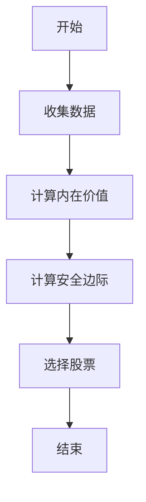
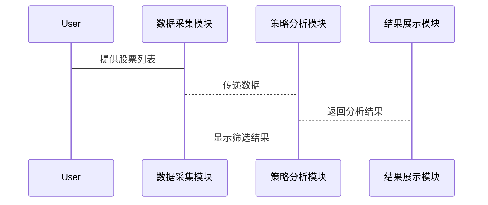

                 


# 格雷厄姆特价股票策略在混合经济体系下的表现

> 关键词：格雷厄姆策略、内在价值、安全边际、混合经济、投资策略、股票分析

> 摘要：本文深入探讨了格雷厄姆的特价股票策略在混合经济体系下的表现，通过系统分析和实际案例，验证了该策略的有效性。文章详细阐述了策略的核心原理、算法实现、系统架构，并通过实战项目展示其应用价值，为投资者提供了实用的指导和建议。

---

## 第一部分: 格雷厄姆特价股票策略的背景与核心概念

### 第1章: 格雷厄姆特价股票策略的背景与发展

#### 1.1 价值投资的起源
- **背景**：20世纪初，本杰明·格雷厄姆提出价值投资理论，强调寻找市场低估的股票。
- **核心思想**：投资应基于企业的内在价值，而非市场情绪。

#### 1.2 格雷厄姆的投资理念
- **安全边际**：买入价格低于内在价值，确保投资的安全性。
- **长期投资**：价值投资强调长期持有，避免短期波动影响决策。

#### 1.3 特价股票策略的核心思想
- **定义**：寻找市场价格低于内在价值的股票。
- **目标**：通过安全边际实现超额收益。

### 第2章: 混合经济体系的基本概念

#### 2.1 混合经济体系的定义
- **混合经济**：结合市场经济和计划经济特征的经济体系。
- **特点**：政府与市场共同作用，既有自由竞争，也有一定程度的政府干预。

#### 2.2 混合经济体系对投资策略的影响
- **机会**：混合经济中，政府干预可能创造低估股票。
- **挑战**：政策变化和市场不确定性增加投资难度。

---

## 第二部分: 格雷厄姆策略的核心原理与混合经济中的应用

### 第3章: 格雷厄姆策略的核心原理

#### 3.1 内在价值的计算方法
- **定义**：企业未来现金流的现值。
- **公式**：$$ V = \sum_{t=1}^{n} \frac{CF_t}{(1 + r)^t} $$
  其中，\( CF_t \) 是第 \( t \) 年的现金流，\( r \) 是折现率。

#### 3.2 安全边际的计算与应用
- **公式**：$$ 安全边际 = \frac{内在价值 - 市场价格}{市场价格} $$
- **作用**：确保投资的安全性，减少市场波动带来的风险。

### 第4章: 混合经济体系下的投资机会

#### 4.1 行业分析与企业选择
- **行业分析**：选择受政策支持且竞争较少的行业。
- **企业选择**：关注具有竞争优势和稳定现金流的企业。

#### 4.2 格雷厄姆策略在混合经济中的优势
- **低估股票**：政府干预可能导致部分股票被低估。
- **长期稳定**：混合经济中的企业可能更具稳定性。

---

## 第三部分: 格雷厄姆策略的算法原理与数学模型

### 第5章: 算法原理与流程图

#### 5.1 算法流程
1. 收集目标企业的财务数据。
2. 计算内在价值。
3. 计算安全边际。
4. 选择安全边际为正的企业进行投资。

#### 5.2 流程图


### 第6章: 算法实现与代码解读

#### 6.1 Python代码实现
```python
def calculate_intrinsic_value(cash_flows, discount_rate):
    return sum(cf / (1 + discount_rate) ** t for t, cf in enumerate(cash_flows))

def calculate_margin_of_safety(intrinsic_value, market_price):
    return (intrinsic_value - market_price) / market_price
```

#### 6.2 数学模型与公式
- 内在价值公式：$$ V = \sum_{t=1}^{n} \frac{CF_t}{(1 + r)^t} $$
- 安全边际公式：$$ MOS = \frac{V - P}{P} $$

---

## 第四部分: 系统分析与架构设计

### 第7章: 投资分析系统的设计与实现

#### 7.1 系统功能设计
- 数据采集模块：收集企业财务数据。
- 策略分析模块：计算内在价值和安全边际。
- 结果展示模块：显示筛选出的股票列表。

#### 7.2 系统架构图


#### 7.3 系统交互设计


---

## 第五部分: 项目实战与案例分析

### 第8章: 项目实战与代码实现

#### 8.1 环境安装
- 安装Python和相关库（pandas、numpy）。

#### 8.2 核心代码实现
```python
import pandas as pd
import numpy as np

def calculate_intrinsic_value(financial_data, discount_rate):
    cash_flows = financial_data['现金流']
    return np.nansum([cf / (1 + discount_rate) ** t for t, cf in enumerate(cash_flows)])

def calculate_margin_of_safety(intrinsic_value, market_price):
    return (intrinsic_value - market_price) / market_price

# 示例数据
financial_data = {
    '现金流': [100, 150, 200, 250],
    '折现率': 0.08
}
market_prices = [50, 60, 70, 80]

iv = calculate_intrinsic_value(financial_data, 0.08)
mos = [calculate_margin_of_safety(iv, price) for price in market_prices]
print(mos)
```

#### 8.3 案例分析
- 选取某行业股票，计算内在价值和安全边际，筛选出低估股票进行投资。

---

## 第六部分: 最佳实践与总结

### 第9章: 最佳实践与总结

#### 9.1 小结
- 格雷厄姆策略在混合经济体系下依然有效，尤其是在市场低估时。

#### 9.2 注意事项
- 保持对政策变化的关注。
- 结合市场环境灵活调整策略。

#### 9.3 拓展阅读
- 格雷厄姆的《证券分析》。
- 近期混合经济体系下的投资案例分析。

---

## 第七部分: 作者信息

作者：AI天才研究院 & 禅与计算机程序设计艺术

---

通过以上结构，文章详细阐述了格雷厄姆特价股票策略在混合经济体系下的表现，从理论到实践，为投资者提供了全面的指导和建议。

