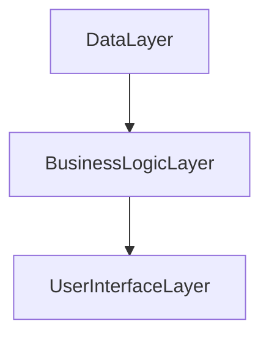
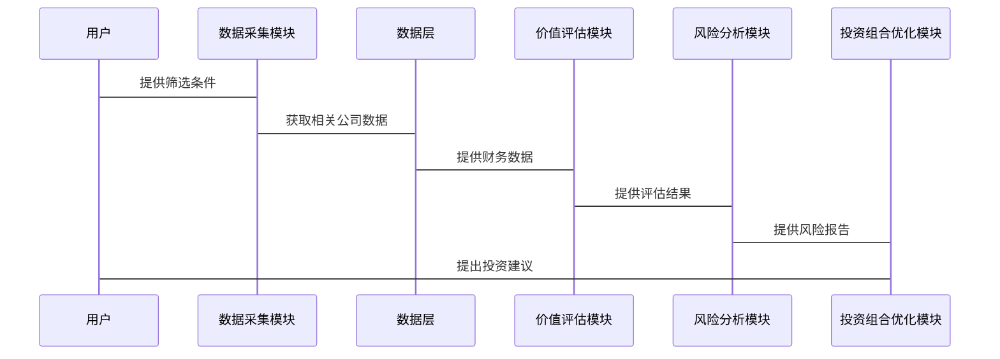

                 


# 格雷厄姆特价股票策略在生物科技行业的应用挑战

> **关键词**：格雷厄姆策略，价值投资，生物科技，股票分析，投资挑战，科技创新

> **摘要**：格雷厄姆的价值投资策略在传统金融领域已被证明是有效的，但在生物科技行业中面临诸多挑战。本文将深入探讨格雷厄姆策略在生物科技行业的应用，分析其核心概念、算法原理、系统架构设计及项目实战，并提出相应的优化建议。

---

# 第1章: 格雷厄姆特价股票策略概述

## 1.1 格雷厄姆投资理论的核心思想

### 1.1.1 价值投资的定义与核心原则
价值投资是一种长期投资策略，强调以低于内在价值的价格购买优质资产。格雷厄姆的价值投资理论强调安全边际、基本面分析和长期持有的原则。

### 1.1.2 格雷厄姆的选股标准
格雷厄姆选股标准包括低市盈率（P/E比率）、低市净率（P/B比率）、高股息率等指标，以及对公司财务健康状况的严格审查。

### 1.1.3 格雷厄姆策略在传统金融中的应用
在传统金融中，格雷厄姆策略通过分析公司财务数据，寻找市场价格低于内在价值的股票，从而实现长期稳定的收益。

## 1.2 生物科技行业的特点与挑战

### 1.2.1 生物科技行业的定义与范围
生物科技行业涉及基因技术、药物研发、医疗设备等多个领域，具有高技术门槛、高研发投入和长周期等特点。

### 1.2.2 生物科技行业的投资特点
生物科技行业具有高风险高回报的特性，股票价格波动较大，且受政策法规、技术突破和市场竞争的影响显著。

### 1.2.3 生物科技行业的风险与机遇
行业风险包括技术失败、政策变化和市场竞争；机遇则在于科技创新和市场潜力巨大。

## 1.3 格雷厄姆策略在生物科技行业的适用性

### 1.3.1 传统格雷厄姆策略的局限性
传统格雷厄姆策略主要适用于盈利稳定、财务数据透明的传统行业，而生物科技行业的特殊性可能导致其失效。

### 1.3.2 生物科技行业的特殊性对策略的影响
生物科技行业的高研发投入、长周期和高不确定性，使得传统的财务指标（如P/E、P/B）在评估公司价值时意义不大。

### 1.3.3 格雷厄姆策略在生物科技行业的潜在价值
尽管存在挑战，但格雷厄姆策略的核心思想（如安全边际、基本面分析）仍可为生物科技行业投资提供指导。

---

# 第2章: 格雷厄姆策略与生物科技行业结合的核心概念

## 2.1 核心概念与定义

### 2.1.1 价值投资在生物科技行业的核心要素
在生物科技行业，价值投资需要考虑公司的技术领先性、研发管线的潜力、管理团队的能力和市场前景。

### 2.1.2 生物科技行业的关键财务指标
生物科技行业的关键指标包括研发投入占比、研发管线价值、现金流状况和债务水平等。

### 2.1.3 格雷厄姆策略在生物科技行业的调整与优化
在生物科技行业，需要调整传统格雷厄姆策略的选股标准，引入更具行业特色的评估指标。

## 2.2 核心概念的联系与对比

### 2.2.1 生物科技行业与传统金融的核心差异
生物科技行业的高不确定性和高研发投入与传统行业存在显著差异，这使得传统的价值评估方法难以直接应用。

### 2.2.2 格雷厄姆策略在不同行业中的应用对比
在传统行业，格雷厄姆策略依赖于稳定的财务数据和可预测的收益；而在生物科技行业，需更多关注技术和市场的不确定性。

### 2.2.3 生物科技行业的特殊性对格雷厄姆策略的挑战
生物科技行业的特殊性使得传统的财务指标无法全面反映公司价值，需要引入新的评估维度。

---

# 第3章: 格雷厄姆策略在生物科技行业的算法原理

## 3.1 格雷厄姆策略的核心算法

### 3.1.1 价值投资的数学模型
格雷厄姆的价值投资模型主要基于对公司内在价值的计算，公式如下：
$$ \text{内在价值} = \text{未来现金流的现值} $$

### 3.1.2 格雷厄姆策略的计算公式
格雷厄姆常用市盈率（P/E）和市净率（P/B）作为估值指标，公式分别为：
$$ P/E = \frac{\text{股价}}{\text{每股收益}} $$
$$ P/B = \frac{\text{股价}}{\text{每股净资产}} $$

### 3.1.3 生物科技行业的特殊算法调整
在生物科技行业，需引入新的评估指标，如研发支出占比和研发管线价值：
$$ \text{研发支出占比} = \frac{\text{研发投入}}{\text{营业收入}} $$
$$ \text{研发管线价值} = \sum \text{各管线的潜在价值} $$

## 3.2 生物科技行业特有的算法优化

### 3.2.1 生物科技行业的财务指标权重分配
在评估生物科技公司时，应给予研发支出和管理团队更大的权重，权重分配如下：
- 研发支出占比：40%
- 管理团队能力：30%
- 市场前景：20%
- 财务健康状况：10%

### 3.2.2 生物科技行业风险评估的算法优化
构建一个综合风险评估模型，公式如下：
$$ \text{综合风险指数} = \alpha \cdot \text{技术风险} + \beta \cdot \text{市场风险} + \gamma \cdot \text{政策风险} $$
其中，$\alpha + \beta + \gamma = 1$。

### 3.2.3 生物科技行业投资组合的动态调整
根据市场变化和公司进展，动态调整投资组合，优化权重分配：
- 定期评估公司研发进展
- 调整持仓比例以反映新信息

## 3.3 算法实现与代码示例

### 3.3.1 格雷厄姆策略的Python实现
```python
import pandas as pd
import numpy as np

def calculate_intrinsic_value(fcf, discount_rate):
    # 计算未来现金流的现值
    return fcf / (1 + discount_rate)

def graham_strategy(stock_data, threshold=0.8):
    # 筛选股价低于内在价值的股票
    stock_data['intrinsic_value'] = stock_data.apply(lambda x: calculate_intrinsic_value(x['fcf'], x['discount_rate']), axis=1)
    selected_stocks = stock_data[stock_data['price'] < stock_data['intrinsic_value']]
    return selected_stocks
```

### 3.3.2 生物科技行业数据的获取与处理
```python
# 示例代码：从数据库获取生物科技公司数据
import sqlite3

conn = sqlite3.connect('biotech.db')
cursor = conn.cursor()
cursor.execute("SELECT * FROM companies WHERE industry='Biotech';")
biotech_data = cursor.fetchall()
conn.close()
```

### 3.3.3 投资组合优化的代码实现
```python
import numpy as np

def optimize_portfolio(weights, returns, risk_free_rate=0.05):
    # 使用均值-方差优化模型
    n = len(weights)
    return np.linalg.solve(np.dot(returns, returns.T), weights) * (1 - risk_free_rate)
```

---

# 第4章: 格雷厄姆策略在生物科技行业的系统架构设计

## 4.1 系统分析与设计

### 4.1.1 系统功能需求分析
系统需实现数据采集、价值评估、风险分析和投资组合优化四大功能模块。

### 4.1.2 系统模块划分与功能设计
- 数据采集模块：负责获取公司财务数据和行业信息。
- 价值评估模块：基于格雷厄姆策略和调整后的算法进行价值评估。
- 风险分析模块：评估投资风险并生成风险报告。
- 投资组合优化模块：动态调整投资组合，优化收益与风险比。

### 4.1.3 系统架构设计与实现
系统采用分层架构：数据层、业务逻辑层和用户界面层，各层之间通过接口进行交互。

## 4.2 系统架构图



## 4.3 系统接口设计

### 4.3.1 数据接口设计
- 数据输入接口：接收公司财务数据和市场数据。
- 数据输出接口：生成评估报告和投资建议。

### 4.3.2 用户接口设计
- 用户输入界面：供用户输入筛选条件。
- 用户输出界面：显示评估结果和投资组合建议。

### 4.3.3 系统扩展性设计
- 支持新增评估指标和算法优化。
- 支持多数据源的接入和处理。

## 4.4 系统交互图



---

# 第5章: 格雷厄姆策略在生物科技行业的项目实战

## 5.1 项目背景与目标

### 5.1.1 项目背景介绍
本项目旨在验证和优化格雷厄姆策略在生物科技行业的应用，通过实际案例分析，提出可行的投资策略。

### 5.1.2 项目目标设定
目标包括：构建价值评估模型、优化投资组合、验证策略的有效性。

## 5.2 项目实施步骤

### 5.2.1 数据收集与处理
从多个数据源（如数据库、API）收集生物科技公司的财务数据和市场数据，清洗和预处理后用于评估。

### 5.2.2 格雷厄姆策略的优化与调整
根据生物科技行业的特点，调整评估指标和权重，构建适合的模型。

### 5.2.3 投资组合的构建与测试
基于优化后的模型，构建投资组合，并通过回测验证策略的有效性。

## 5.3 项目成果与分析

### 5.3.1 实验结果展示
通过回测和实际投资结果，验证优化后的策略在生物科技行业中的有效性。

### 5.3.2 成果分析与总结
分析策略的优缺点，总结经验教训，为未来研究提供参考。

### 5.3.3 项目经验与教训
项目中遇到的主要挑战包括数据获取困难和模型优化复杂性，需在后续研究中进一步解决。

---

# 第6章: 格雷厄姆策略在生物科技行业的最佳实践与小结

## 6.1 最佳实践与注意事项

### 6.1.1 格雷厄姆策略在生物科技行业的应用建议
在应用格雷厄姆策略时，需结合生物科技行业的特殊性，灵活调整评估指标和权重。

### 6.1.2 生物科技行业投资的注意事项
投资者需关注公司的研发进展、政策变化和市场动态，做好风险控制。

### 6.1.3 风险控制与策略优化
通过动态调整投资组合和引入新的评估指标，降低投资风险，提高策略的有效性。

## 6.2 项目总结与未来展望

### 6.2.1 项目总结
本项目通过理论分析和实际案例，验证了格雷厄姆策略在生物科技行业的适用性，并提出了优化建议。

### 6.2.2 未来展望
未来的研究可以进一步探索人工智能在生物科技投资中的应用，结合大数据分析和机器学习技术，提升投资策略的精准度。

---

作者：AI天才研究院/AI Genius Institute & 禅与计算机程序设计艺术 /Zen And The Art of Computer Programming

