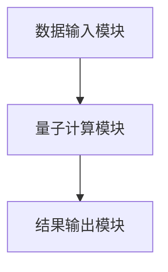

                 


# 格雷厄姆特价股票策略在量子计算时代的潜在应用

## 关键词：格雷厄姆策略、量子计算、股票筛选、投资优化、量子算法

## 摘要：格雷厄姆特价股票策略是一种基于价值投资的经典方法，而量子计算则是一种新兴的计算技术，能够显著提高复杂问题的计算效率。本文探讨了量子计算如何增强格雷厄姆策略的选股能力，分析了其潜在的应用场景，并详细阐述了量子算法在股票筛选中的实现方式。

---

# 第一部分: 格雷厄姆特价股票策略与量子计算的背景介绍

## 第1章: 投资学基础与量子计算概述

### 1.1 投资学基础

#### 1.1.1 价值投资的基本概念
价值投资是一种长期投资策略，强调以低于内在价值的价格买入优质股票。格雷厄姆是该策略的创始人，他提出了“安全边际”和“内在价值”等核心概念。

#### 1.1.2 格雷厄姆投资策略的核心思想
格雷厄姆策略强调通过分析企业的财务状况，寻找市场价格低于内在价值的股票。其核心思想包括：
- **安全边际**：买入价格远低于内在价值的股票，以降低风险。
- **内在价值计算**：通过市盈率、市净率等指标评估股票的合理价值。

#### 1.1.3 特价股票的定义与筛选标准
特价股票是指市场价格远低于其内在价值的股票。格雷厄姆策略通常筛选低市盈率、低市净率、高股息率的股票。

### 1.2 量子计算的基本概念

#### 1.2.1 量子计算的定义与原理
量子计算利用量子位（qubit）的叠加和纠缠特性，能够在某些情况下比经典计算机更高效地处理复杂问题。

#### 1.2.2 量子计算与经典计算的主要区别
- **经典计算**：基于二进制位，每个位只能是0或1。
- **量子计算**：利用量子叠加和纠缠，能够同时处理多种状态。

#### 1.2.3 量子计算在金融领域的潜在应用
量子计算在金融领域的应用包括：
- 优化投资组合。
- 风险评估。
- 市场预测。

### 1.3 格雷厄姆策略与量子计算的结合

#### 1.3.1 格雷厄姆策略在现代金融中的局限性
- 数据量大，筛选效率低。
- 传统方法难以捕捉复杂市场动态。

#### 1.3.2 量子计算如何解决传统金融分析的痛点
- 提高数据分析效率。
- 处理非线性关系，捕捉市场隐性模式。

#### 1.3.3 量子计算在股票筛选中的潜在优势
- 加速大数据处理。
- 深度挖掘数据关联性。

## 1.4 本章小结
本章介绍了格雷厄姆策略和量子计算的基本概念，分析了它们在金融投资中的应用潜力，并为后续章节奠定了基础。

---

## 第2章: 格雷厄姆策略的核心原理

### 2.1 格雷厄姆策略的数学模型

#### 2.1.1 格雷厄姆的内在价值计算公式
内在价值的计算公式为：
$$ V = \frac{E}{PE} + \frac{P}{x} $$
其中，\( E \) 是企业收益，\( PE \) 是市盈率，\( P \) 是股价，\( x \) 是安全边际系数。

#### 2.1.2 市盈率与市净率的比较分析
| 指标 | 计算公式 | 适用场景 |
|------|-----------|-----------|
| 市盈率（PE） | \( PE = \frac{P}{E} \) | 适用于收益稳定的公司 |
| 市净率（PB） | \( PB = \frac{P}{B} \) | 适用于资产密集型公司 |

#### 2.1.3 投资组合优化的数学模型
投资组合优化的目标是最大化收益并最小化风险，通常使用均值-方差模型：
$$ \text{Minimize } \sigma^2 \text{ subject to } \mu \geq \text{目标收益} $$

### 2.2 量子计算的核心原理

#### 2.2.1 量子叠加
量子叠加允许量子计算机在多个状态间并行计算：
$$ |q\rangle = \alpha|0\rangle + \beta|1\rangle $$

#### 2.2.2 量子纠缠
量子纠缠使量子位之间形成强关联，能够提高计算效率。

#### 2.2.3 量子算法的基本类型
- **量子傅里叶变换**：用于周期性问题。
- **量子搜索算法**：用于无序数据库搜索。

### 2.3 格雷厄姆策略的量子优化模型

#### 2.3.1 格雷厄姆策略的量子化分析框架
通过量子计算优化股票筛选过程，将筛选标准转化为量子态，利用量子并行性加速计算。

#### 2.3.2 量子计算在股票筛选中的应用模型
利用量子搜索算法快速找到满足筛选条件的股票。

### 2.4 核心概念对比分析

#### 2.4.1 格雷厄姆策略与传统价值投资的对比
| 指标 | 格雷厄姆策略 | 传统价值投资 |
|------|--------------|---------------|
| 核心 | 低市盈率、低市净率 | 综合评估 |

#### 2.4.2 量子计算与传统计算的对比
| 指标 | 量子计算 | 传统计算 |
|------|-----------|------------|
| 效率 | 高 | 低 |
| 并行性 | 强 | 弱 |

#### 2.4.3 格雷厄姆策略的量子化优势
- 加速筛选过程。
- 提高筛选精度。

## 2.5 本章小结
本章详细解释了格雷厄姆策略和量子计算的核心原理，并分析了它们的结合方式。

---

## 第3章: 量子计算算法的基础

### 3.1 量子傅里叶变换

#### 3.1.1 量子傅里叶变换的定义
量子傅里叶变换用于将量子态从时间域转换到频率域。

#### 3.1.2 量子傅里叶变换的数学公式
$$ QFT|x\rangle = \sum_{k=0}^{N-1} \omega^{xk} |k\rangle $$
其中，\( \omega \) 是单位根。

#### 3.1.3 量子傅里叶变换的应用场景
应用于周期性问题，如信号处理。

### 3.2 量子搜索算法

#### 3.2.1 量子搜索算法的原理
利用量子叠加和干涉，以 \( O(\sqrt{N}) \) 复杂度搜索无序数据库。

#### 3.2.2 量子搜索算法的数学模型
通过量子叠加状态：
$$ |s\rangle = \frac{1}{\sqrt{N}} \sum_{x=0}^{N-1} |x\rangle $$
经过变换后找到目标状态。

#### 3.2.3 量子搜索算法在股票筛选中的应用
用于在大量股票中快速找到满足筛选条件的股票。

### 3.3 格雷厄姆策略的量子优化算法

#### 3.3.1 量子化股票筛选流程
- 将筛选条件转化为量子态。
- 利用量子搜索算法加速筛选。

### 3.4 本章小结
本章介绍了量子计算中的关键算法，并分析了它们在股票筛选中的应用。

---

## 第4章: 格雷厄姆策略的量子计算算法实现

### 4.1 量子化筛选标准

#### 4.1.1 格雷厄姆筛选标准的量子化表示
将市盈率、市净率等指标转化为量子条件。

#### 4.1.2 量子条件的逻辑表达
利用量子逻辑门构建筛选条件。

### 4.2 量子搜索算法的实现步骤

#### 4.2.1 初始化量子态
构造初始量子态：
$$ |s\rangle = \frac{1}{\sqrt{N}} \sum_{x=0}^{N-1} |x\rangle $$

#### 4.2.2 应用量子搜索变换
通过量子变换将目标状态编码到量子态中。

#### 4.2.3 测量量子态
通过测量找到满足条件的股票。

### 4.3 量子算法的数学模型

#### 4.3.1 量子搜索算法的数学公式
$$ QFT|x\rangle = \sum_{k=0}^{N-1} \omega^{xk} |k\rangle $$

#### 4.3.2 量子化筛选模型
$$ V = \frac{E}{PE} + \frac{P}{x} $$

### 4.4 本章小结
本章详细讲解了量子计算算法在格雷厄姆策略中的实现。

---

## 第5章: 量子计算在股票筛选中的系统架构

### 5.1 系统功能设计

#### 5.1.1 系统目标
构建一个基于量子计算的股票筛选系统。

#### 5.1.2 功能模块
- 数据输入模块：接收股票数据。
- 量子计算模块：执行筛选算法。
- 结果输出模块：显示筛选结果。

### 5.2 系统架构设计

#### 5.2.1 系统架构图


#### 5.2.2 接口设计
- 数据输入接口：接收股票数据。
- 算法接口：执行量子搜索算法。

### 5.3 本章小结
本章设计了一个基于量子计算的股票筛选系统架构。

---

## 第6章: 项目实战与案例分析

### 6.1 环境安装

#### 6.1.1 安装量子计算模拟器
安装Qiskit等量子计算开发工具。

#### 6.1.2 安装数据分析工具
安装Python和Pandas库。

### 6.2 核心代码实现

#### 6.2.1 量子搜索算法代码
```python
from qiskit import QuantumCircuit, Aer, execute

def quantum_search(N):
    qc = QuantumCircuit(N+1)
    # 初始化
    qc.h(range(N))
    qc.x(N)
    qc.h(N)
    # 变换
    qc.mct(range(N), N, mct_mode='spread')
    qc.mct(range(N), N, mct_mode='spread')
    # 测量
    qc.measure(range(N), 0)
    return qc
```

#### 6.2.2 格雷厄姆筛选标准代码
```python
import pandas as pd

def calculate_intrinsic_value(df):
    df['PE'] = df['Price'] / df['Earnings']
    df['SafetyMargin'] = df['Price'] / (df['PE'] * 1.5)
    return df
```

### 6.3 案例分析

#### 6.3.1 数据来源
使用历史股价数据进行分析。

#### 6.3.2 筛选结果
筛选出符合格雷厄姆标准的股票列表。

### 6.4 本章小结
本章通过实际案例展示了量子计算在股票筛选中的应用。

---

## 第7章: 总结与展望

### 7.1 本章总结
量子计算能够显著提升格雷厄姆策略的选股效率和精度。

### 7.2 未来展望
随着量子计算技术的发展，其在金融领域的应用将更加广泛。

### 7.3 最佳实践 Tips
- 结合传统方法与量子计算。
- 定期更新筛选模型。

### 7.4 本章小结
量子计算为格雷厄姆策略带来了新的可能性，未来将有更多应用。

---

## 作者：AI天才研究院 & 禅与计算机程序设计艺术

---

通过以上结构，文章系统地介绍了格雷厄姆策略与量子计算的结合，详细分析了其潜在应用，并通过实际案例展示了量子计算在股票筛选中的优势。

