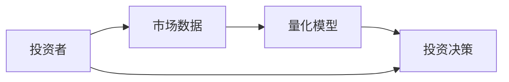
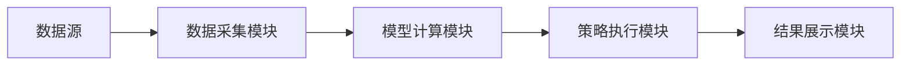

                 


# 《格雷厄姆特价股票策略在量子金融时代的演变》

## 关键词：格雷厄姆策略，量子金融，股票分析，价值投资，人工智能，大数据

## 摘要：  
本文探讨了格雷厄姆特价股票策略在量子金融时代的演变，分析了传统价值投资理念与现代科技的结合。通过介绍量子计算、大数据和人工智能在金融分析中的应用，本文详细阐述了如何利用新技术优化和扩展格雷厄姆策略，为投资者提供了新的视角和工具。

---

# 第一部分: 格雷厄姆特价股票策略的背景与核心概念

## 第1章: 格雷厄姆特价股票策略概述

### 1.1 格雷厄姆投资理论的起源
#### 1.1.1 价值投资的起源与发展
本节介绍了价值投资的起源，特别是本杰明·格雷厄姆（Benjamin Graham）的贡献。格雷厄姆是价值投资的鼻祖，他的理论强调寻找市场价格低于其内在价值的股票。

#### 1.1.2 格雷厄姆的学术背景与贡献
格雷厄姆是哥伦比亚大学的教授，他的学生包括沃伦·巴菲特（Warren Buffett）等著名投资者。他提出了“安全边际”和“内在价值”等核心概念。

#### 1.1.3 特价股票策略的核心理念
格雷厄姆的策略是寻找那些市场价格远低于其内在价值的股票，尤其是那些被市场忽视或低估的股票。这种策略强调长期投资和价值发现。

### 1.2 格雷厄姆特价股票策略的核心概念
#### 1.2.1 安全边际的定义与计算
安全边际是市场价格与内在价值之间的差额，确保投资者在市场波动中能够获得超额收益。

#### 1.2.2 内在价值的评估方法
内在价值是基于公司基本面（如盈利能力、资产状况等）计算出的股票真实价值。格雷厄姆常用的方法包括市盈率、市净率等指标。

#### 1.2.3 市场先生与投资者心理
格雷厄姆提出了“市场先生”的概念，认为市场的波动性反映了投资者情绪的变化，而这种情绪变化为理性投资者提供了机会。

### 1.3 格雷厄姆策略在金融史上的地位
#### 1.3.1 格雷厄姆策略的历史演变
从20世纪初到现在，格雷厄姆策略经过了多次演变，从最初的防御性投资策略发展到现代的量化投资策略。

#### 1.3.2 现代金融市场的挑战与机遇
现代金融市场更加复杂，数据量急剧增加，技术进步为格雷厄姆策略的优化提供了新的可能性。

#### 1.3.3 格雷厄姆策略的边界与外延
虽然格雷厄姆策略在传统市场中表现优异，但在面对新兴技术和复杂市场环境时，仍需不断调整和优化。

---

## 第2章: 量子金融时代的技术背景

### 2.1 量子计算与金融分析
#### 2.1.1 量子计算的基本原理
量子计算利用量子位（qubit）的叠加态和纠缠态，能够在某些情况下比经典计算机更高效地处理复杂问题。

#### 2.1.2 量子计算在金融建模中的应用
量子计算可以用于优化投资组合、风险管理、复杂金融衍生品定价等问题。

#### 2.1.3 量子算法对金融数据分析的影响
量子算法在处理大数据和复杂模式识别方面具有潜力，能够显著提高金融分析的效率和精度。

### 2.2 大数据与人工智能在金融中的应用
#### 2.2.1 大数据在股票分析中的作用
大数据技术能够从海量数据中提取有价值的信息，帮助投资者发现市场趋势和潜在机会。

#### 2.2.2 人工智能在量化交易中的应用
人工智能技术（如机器学习）可以用于预测市场走势、识别投资机会和优化交易策略。

#### 2.2.3 机器学习对传统投资策略的补充
机器学习模型可以通过分析历史数据和市场行为，辅助人类投资者做出更明智的决策。

### 2.3 量子金融时代的技术挑战与机遇
#### 2.3.1 技术进步对传统投资策略的影响
技术进步不仅改变了数据的处理方式，还影响了投资者的决策过程和策略执行方式。

#### 2.3.2 量子金融时代的投资机会
量子计算和人工智能等新技术为投资者提供了新的工具和方法，能够帮助他们在复杂市场中找到超额收益的机会。

#### 2.3.3 技术与策略的结合对投资者的影响
技术与策略的结合不仅提高了投资效率，还降低了投资风险。投资者需要不断学习新技术，以适应快速变化的金融环境。

---

## 第3章: 格雷厄姆特价股票策略的核心概念与联系

### 3.1 格雷厄姆策略的核心原理
#### 3.1.1 安全边际的数学模型
安全边际可以通过以下公式计算：

$$
\text{安全边际} = \text{内在价值} - \text{市场价格}
$$

#### 3.1.2 内在价值的评估公式
内在价值的计算通常基于公司财务数据，例如：

$$
\text{内在价值} = \frac{\text{净利润} \times (1 + g)}{r - g}
$$

其中，\( g \) 是增长率，\( r \) 是折现率。

#### 3.1.3 市场波动与投资者行为的关联
市场波动与投资者情绪密切相关。当市场恐慌时，许多股票的价格可能会低于其内在价值，为投资者提供了买入机会。

### 3.2 核心概念的对比分析
#### 3.2.1 格雷厄姆策略与现代量化模型的对比
| 对比维度 | 格雷厄姆策略 | 现代量化模型 |
|----------|--------------|--------------|
| 数据需求 | 基于有限的财务数据 | 基于海量数据 |
| 计算方式 | 主要依赖人工计算 | 依赖计算机计算 |
| 决策速度 | 较慢 | 较快 |

#### 3.2.2 传统价值投资与现代技术驱动投资的对比
| 对比维度 | 传统价值投资 | 现代技术驱动投资 |
|----------|--------------|----------------|
| 投资理念 | 以价值为导向 | 以数据和技术为导向 |
| 投资工具 | 主要依赖财务报表分析 | 依赖大数据、人工智能等技术 |
| 投资风险 | 较低 | 较高 |

#### 3.2.3 不同市场环境下的策略适用性分析
在传统市场中，格雷厄姆策略表现优异；但在复杂和快速变化的市场环境中，结合新技术的策略更具竞争力。

### 3.3 实体关系图与流程图



---

## 第4章: 格雷厄姆特价股票策略在量子金融时代的算法演变

### 4.1 算法原理
格雷厄姆策略的传统算法可以表示为：

$$
\text{投资建议} = f(\text{市场价格}, \text{内在价值}, \text{安全边际})
$$

其中，\( f \) 是一个判断函数，如果市场价格 < 内在价值，且安全边际 > 零，则建议买入。

#### 4.1.1 基于量子计算的安全边际优化
量子计算可以用于优化安全边际的计算，提高计算效率和精度。

#### 4.1.2 基于机器学习的内在价值预测
机器学习模型可以用于预测内在价值，结合市场数据和公司基本面信息。

---

## 第5章: 量子金融时代下格雷厄姆策略的系统架构设计

### 5.1 系统功能设计
#### 5.1.1 数据采集模块
负责收集市场数据、公司财务数据等。

#### 5.1.2 模型计算模块
基于量子算法和机器学习模型，计算内在价值和安全边际。

#### 5.1.3 策略执行模块
根据计算结果，生成投资建议。

#### 5.1.4 结果展示模块
以可视化方式展示投资建议和市场趋势。

### 5.2 系统架构图



---

## 第6章: 格雷厄姆特价股票策略在量子金融时代的项目实战

### 6.1 项目环境与工具
- **环境**：Python 3.8+
- **工具**：NumPy, Pandas, TensorFlow, Qiskit

### 6.2 核心代码实现

```python
import numpy as np

def calculate_intrinsic_value(net_profit, growth_rate, discount_rate):
    return net_profit * (1 + growth_rate) / (discount_rate - growth_rate)

def calculate_margin_of_safety(intrinsic_value, market_price):
    return intrinsic_value - market_price

# 示例数据
net_profit = 100
growth_rate = 0.05
discount_rate = 0.10
market_price = 50

intrinsic_value = calculate_intrinsic_value(net_profit, growth_rate, discount_rate)
margin_of_safety = calculate_margin_of_safety(intrinsic_value, market_price)

print(f"内在价值: {intrinsic_value}")
print(f"安全边际: {margin_of_safety}")
```

### 6.3 案例分析与结果解读
通过具体案例分析，展示如何利用量子计算和机器学习优化格雷厄姆策略。

### 6.4 项目小结
总结项目的实现过程，分析可能的优化方向。

---

## 第7章: 总结与展望

### 7.1 格雷厄姆策略的演变总结
从传统价值投资到现代技术驱动投资，格雷厄姆策略经历了从理论到实践的演变。

### 7.2 量子金融时代的投资机会
新技术的应用为投资者提供了新的工具和方法，未来投资策略将更加依赖技术驱动。

### 7.3 对投资者的建议
投资者需要不断学习新技术，灵活调整策略，以适应快速变化的金融环境。

---

## 作者：AI天才研究院/AI Genius Institute & 禅与计算机程序设计艺术 /Zen And The Art of Computer Programming

