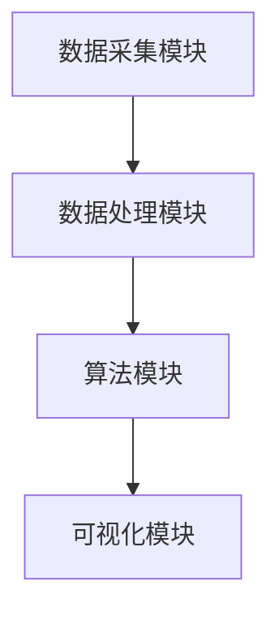

                 


# 格雷厄姆特价股票策略在高科技行业的应用挑战

## 关键词
格雷厄姆策略, 高科技行业, 价值投资, 股票估值, 投资挑战, 算法优化, 系统设计

## 摘要
格雷厄姆的价值投资策略以其科学性和系统性著称，但将其应用于波动剧烈的高科技行业面临诸多挑战。本文通过分析格雷厄姆策略的核心概念、在高科技行业的适用性、实际案例、算法优化、系统架构设计以及项目实战，深入探讨如何克服这些挑战。文章不仅详细阐述了理论基础，还提供了具体的Python代码实现和系统架构图，为投资者和研究者提供了实用的参考。

---

## 第1章: 格雷厄姆特价股票策略概述

### 1.1 格雷厄姆投资策略的基本概念

#### 1.1.1 格雷厄姆投资策略的历史与发展
本杰明·格雷厄姆是价值投资的鼻祖，他在20世纪30年代提出了“捡烟蒂”投资策略，主张通过分析公司的基本面，寻找市场价格低于其内在价值的股票。他的理论在《 Intelligent Investor》一书中得到了详细阐述，影响了沃伦·巴菲特等一代投资者。

#### 1.1.2 格雷厄姆策略的核心原则
格雷厄姆的价值投资策略基于以下几个核心原则：
1. **安全边际**：购买价格低于内在价值，确保有足够的安全空间。
2. **低市盈率和市净率**：选择市盈率和市净率低于行业平均水平的公司。
3. **长期投资**：避免短期市场波动，关注公司的长期价值。

#### 1.1.3 格雷厄姆策略在现代投资中的地位
尽管格雷厄姆策略诞生于20世纪初，但其核心思想在现代投资中依然具有重要地位。尤其是在当前量化投资兴起的背景下，格雷厄姆策略为算法交易提供了基础。

### 1.2 高科技行业的特点与挑战

#### 1.2.1 高科技行业的定义与范围
高科技行业通常指那些依赖于科学技术进步，具有较高技术含量和创新能力的行业，包括信息技术、半导体、人工智能、生物技术等领域。

#### 1.2.2 高科技行业的高增长性与高波动性
高科技行业的公司通常增长速度快，但市场波动性大。技术更新换代快，商业模式容易变化，导致股价波动剧烈。

#### 1.2.3 高科技行业投资的独特性
高科技行业的投资需要关注技术壁垒、研发能力、市场前景等因素，传统估值指标如市盈率和市净率可能不够准确。

---

## 第2章: 格雷厄姆策略与高科技行业的匹配性

### 2.1 格雷厄姆策略在高科技行业的适用性

#### 2.1.1 格雷厄姆策略的核心指标在高科技行业的应用
格雷厄姆策略的核心指标包括：
- **市盈率（P/E）**：股价除以每股收益。
- **市净率（P/B）**：股价除以每股净资产。
- **股息率**：每股股息与股价的比率。

#### 2.1.2 高科技行业与传统行业的估值差异
高科技行业的公司可能尚未盈利，或盈利波动大，导致市盈率和市净率不稳定。

#### 2.1.3 格雷厄姆策略在高科技行业中的潜在优势
通过识别那些市场价格低于其技术价值的公司，格雷厄姆策略可能帮助投资者发现被低估的高科技公司。

### 2.2 格雷厄姆策略在高科技行业中的独特挑战

#### 2.2.1 高科技行业的技术更新风险
技术过时可能导致公司价值急剧下降，影响格雷厄姆策略的有效性。

#### 2.2.2 高科技行业的市场波动性
高科技股票的波动性远高于传统行业，可能导致格雷厄姆策略的短期失效。

#### 2.2.3 高科技行业的竞争格局变化
行业竞争激烈，公司地位可能迅速变化，影响其长期价值。

---

## 第3章: 格雷厄姆策略在高科技行业的实际应用案例

### 3.1 格雷厄姆策略在高科技行业的成功案例分析

#### 3.1.1 苹果公司的案例分析
苹果公司曾因高市盈率被视为高估，但其长期表现证明了其技术领导地位和盈利能力。

#### 3.1.2 微软公司的案例分析
微软在转型云计算后，市盈率上升，但其技术创新和市场地位使其符合格雷厄姆策略的长期价值。

### 3.2 格雷厄姆策略在高科技行业中的失败案例分析

#### 3.2.1 某高科技公司失败的案例分析
某生物技术公司在技术上取得突破，但因市场推广不力，导致股价大幅下跌。

#### 3.2.2 失败案例的原因总结
技术领先但市场执行不佳，导致公司长期价值未能实现。

---

## 第4章: 格雷厄姆策略的算法与数学模型

### 4.1 格雷厄姆策略的数学模型

#### 4.1.1 格雷厄姆策略的核心公式
- 市盈率（P/E）= 股价 / 每股收益
- 市净率（P/B）= 股价 / 每股净资产

#### 4.1.2 格雷厄姆策略的数学推导
通过比较P/E和P/B与行业平均水平的比值，确定是否低估。

#### 4.1.3 格雷厄姆策略的优化与改进
引入其他指标，如市销率（P/S），以更好地评估高科技公司。

### 4.2 格雷厄姆策略在高科技行业的算法实现

#### 4.2.1 格雷厄姆策略的算法流程
1. 收集目标公司的财务数据。
2. 计算P/E、P/B等指标。
3. 比较指标与行业平均水平，筛选低估公司。

#### 4.2.2 格雷厄姆策略的代码实现
```python
import pandas as pd
import numpy as np

def graham_strategy(df, industry_avg_pe, industry_avg_pb):
    # 计算P/E和P/B
    df['pe'] = df['price'] / df['eps']
    df['pb'] = df['price'] / df['book_value']
    
    # 筛选低估公司
    df['is_undervalued'] = (df['pe'] < industry_avg_pe) & (df['pb'] < industry_avg_pb)
    return df

# 示例数据
data = {
    'company': ['A', 'B', 'C'],
    'price': [100, 80, 90],
    'eps': [10, 15, 12],
    'book_value': [50, 40, 60]
}
df = pd.DataFrame(data)
industry_avg_pe = 15
industry_avg_pb = 2

result = graham_strategy(df, industry_avg_pe, industry_avg_pb)
print(result)
```

---

## 第5章: 格雷厄姆策略在高科技行业的系统分析与架构设计

### 5.1 系统功能设计

#### 5.1.1 领域模型（ER图）
- **公司表（Company）**：公司ID、名称、行业。
- **财务数据表（Financials）**：公司ID、收入、利润、股价等。

#### 5.1.2 系统架构设计
- 数据采集模块：从多个数据源获取财务数据。
- 数据处理模块：清洗和转换数据。
- 算法模块：应用格雷厄姆策略筛选低估公司。
- 可视化模块：生成图表和报告。

#### 5.1.3 系统架构图


---

## 第6章: 格雷厄姆策略在高科技行业的项目实战

### 6.1 环境配置

#### 6.1.1 数据来源
使用Yahoo Finance API获取股票数据。

#### 6.1.2 工具安装
安装Python、Pandas、Matplotlib等工具。

### 6.2 核心实现

#### 6.2.1 数据获取与清洗
```python
import yfinance as yf

# 获取苹果公司数据
apple = yf.download('AAPL', start='2020-01-01', end='2023-01-01')
```

#### 6.2.2 算法实现
```python
def calculate_pe_ticker(ticker):
    # 获取股价和每股收益
    df = yf.download(ticker, start='2020-01-01', end='2023-01-01')
    pe = df['Close'] / df['EPS']
    return pe.mean()

# 计算苹果的平均市盈率
pe_apple = calculate_pe_ticker('AAPL')
print(f"苹果的平均市盈率为：{pe_apple}")
```

#### 6.2.3 结果分析
通过分析市盈率和市净率，确定苹果是否低估。

### 6.3 项目小结

---

## 第7章: 总结与展望

### 7.1 总结
格雷厄姆策略在高科技行业的应用具有挑战性，但也存在潜在机会。通过调整策略和利用现代技术，投资者可以更好地识别低估公司。

### 7.2 展望
未来，随着人工智能和大数据技术的发展，格雷厄姆策略在高科技行业的应用将更加精准和高效。

---

## 作者
作者：AI天才研究院 & 禅与计算机程序设计艺术

---

以上是《格雷厄姆特价股票策略在高科技行业的应用挑战》的技术博客文章。文章详细分析了格雷厄姆策略的核心概念、在高科技行业的应用挑战，并提供了算法优化和系统设计的详细步骤。通过实际案例和代码示例，读者可以深入了解如何在高科技行业中应用格雷厄姆策略，并克服相关挑战。

